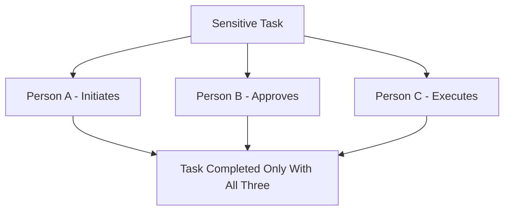
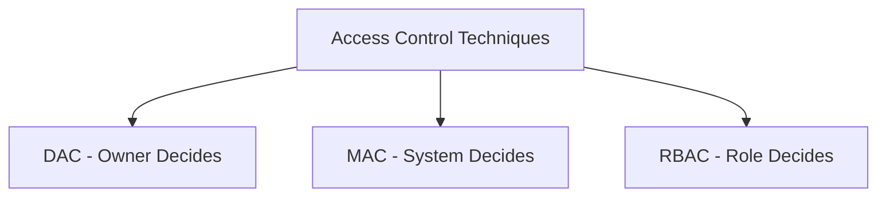
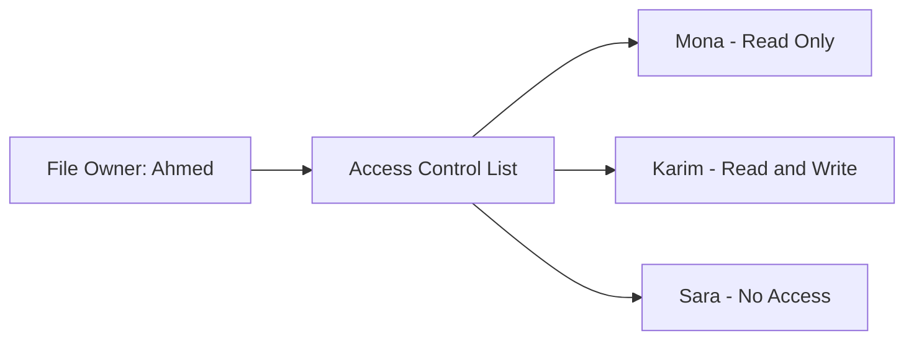
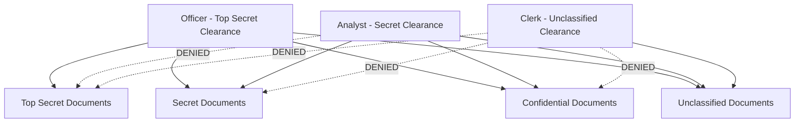
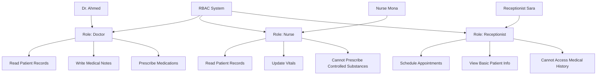
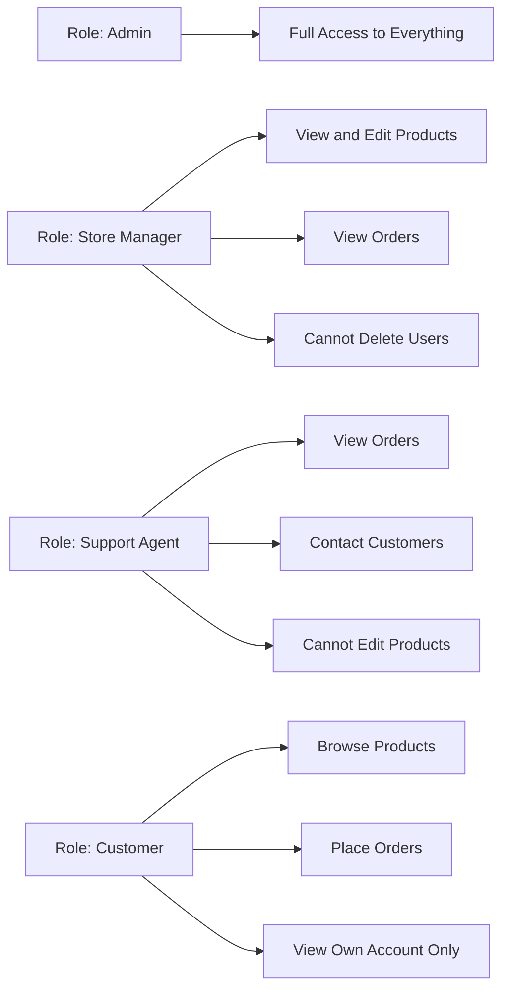

> **الهدف من الـ Section ده:**  
> هتفهم إزاي الـ Access Control بيشتغل، وإيه الفرق بين الـ DAC و MAC و RBAC، وإزاي كل نوع منهم بيحمي الـ Resources بطريقة مختلفة — وإمتى كل واحد منهم يتستخدم.

---

## Table of Contents

- [Least Privilege \& Separation of Duties](#least-privilege--separation-of-duties)
- [Access Control Techniques Overview](#access-control-techniques-overview)
- [Discretionary Access Control (DAC)](#discretionary-access-control-dac)
- [Mandatory Access Control (MAC)](#mandatory-access-control-mac)
- [Role-Based Access Control (RBAC)](#role-based-access-control-rbac)
- [Comparison Table](#comparison-table)
- [Summary](#summary)

---

## Least Privilege & Separation of Duties

### Least Privilege — المبدأ الأساسي

الـ **Principle of Least Privilege** معناه إننا بنديله بس اللي محتاجه بالظبط، لا أكتر ولا أقل. يعني لو موظف بيشتغل في الـ Accounting، هو محتاجش access على الـ HR files أو الـ Source Code.

الفكرة بسيطة: كل ما قللت الـ Access، كل ما قللت الـ Attack Surface.

> [!IMPORTANT]
> الـ Least Privilege مش بس عن حماية الـ System من Attackers — هو كمان بيحمي من الأخطاء العرضية. لو حد عنده Access محدود، حتى لو غلط، الضرر هيبقى محدود.

---

### Separation of Duties — لما الـ Least Privilege مش كفاية

في بعض الحالات، حتى لو ديت حد أقل access ممكن، الـ Access دي لوحدها ممكن تكون خطرة. هنا بييجي دور الـ **Separation of Duties**.

الفكرة: بنقسم الـ Task الحساسة على أكتر من شخص، عشان محدش يقدر يكملها لوحده — سواء عن قصد أو بالغلط.

**مثال عملي:** في أي شركة، عملية صرف فلوس كبيرة محتاجة:
- موظف يطلب الصرف
- مدير يوافق
- محاسب ينفذ التحويل

لو نفس الشخص عمل الـ 3 خطوات دول، ده خطر — ممكن يسرق من غير ما حد يعرف.

> [!WARNING]
> لو بعت كل الـ Critical Duties لشخص واحد — حتى لو هو الأكفأ — ومتت الـ Credentials بتاعته أو اتسرقت، الـ System كله هيبقى في خطر. ده اللي بيتسمى **Single Point of Failure**.

---

## Access Control Techniques Overview

فيه 3 تقنيات رئيسية للـ Access Control، وكل واحدة بتجاوب على سؤال: **مين اللي بيقرر مين يدخل؟**

---

## Discretionary Access Control (DAC)

### إيه هو الـ DAC؟

في الـ **Discretionary Access Control**، صاحب الـ Resource هو اللي بيقرر مين يقدر يوصله. الكلمة "Discretionary" نفسها معناها "حسب تقدير الشخص" — يعني الـ Owner هو اللي عنده الـ Discretion (السلطة التقديرية).

### مثال من حياتنا اليومية

تخيل إنك عامل File على الـ Google Drive. انت اللي قررت:
- مين يقدر يشوفه (View)
- مين يقدر يعدل فيه (Edit)
- مين ملهوش access خالص

ده بالظبط هو الـ DAC — انت الـ Owner، انت بتقرر.

### إزاي بيشتغل؟

كل Resource (ملف، فولدر، Database) بيبقى ليه **Access Control List (ACL)** — قايمة فيها كل الـ Users أو الـ Groups واللي مسموحلهم يعملوه.

### الـ Real-World Examples

- **Windows NTFS Permissions**: انت بتكليك كليك تمين على الملف وبتحدد مين يعمل إيه
- **Linux File Permissions**: الـ `chmod` و `chown` commands
- **Google Drive**: Share بـ "Anyone with the link" أو "Specific people"

### نقطة ضعف الـ DAC

الـ DAC مرن جداً — وده في نفس الوقت نقطة ضعفه. لو ديت لحد Full Control، هو ممكن يديه لحد تاني انت متوثقش فيه، وانت مش عارف.

> [!WARNING]
> الـ DAC بيعاني من مشكلة اسمها **"Uncontrolled Access Propagation"** — يعني الـ Access ممكن تنتشر بطريقة مش متحكم فيها. Ahmed ديها لـ Mona، Mona ديتها لـ Youssef، وانت مش عارف إن Youssef بقى عنده access على ملفاتك.

---

## Mandatory Access Control (MAC)

### إيه هو الـ MAC؟

في الـ **Mandatory Access Control**، الـ System نفسه هو اللي بيقرر مين يوصل لإيه — مش الـ User ومش الـ Owner. حتى لو انت عامل الملف، انت ملكش صلاحية إنك تقرر مين يشوفه.

كلمة "Mandatory" معناها "إجباري" — يعني القواعد إجبارية وما فيش استثناء.

### مثال من العالم الحقيقي — الجيش والحكومة

الـ MAC بيُستخدم في الأنظمة العسكرية والحكومية. الوثائق بيبقى ليها تصنيف أمني:

| Security Level | الوصف |
|---|---|
| **Top Secret** | أسرار دفاعية حساسة جداً |
| **Secret** | معلومات سرية |
| **Confidential** | معلومات محدودة التداول |
| **Unclassified** | معلومات عامة |

وكل شخص بيبقى ليه **Clearance Level** — وهو بس يقدر يوصل للوثائق اللي على نفس مستواه أو أقل.

### الفرق الجوهري عن الـ DAC

في الـ DAC، انت لو عامل Document وديته تصنيف معين — تقدر تغير رأيك وتشاركه مع أي حد. في الـ MAC، حتى لو انت عامل الـ Top Secret Document، **الـ System مش هيسمحلك** إنك تشاركه مع حد عنده Secret Clearance بس.

> [!IMPORTANT]
> الـ MAC بيحمي من الـ **Insider Threats** — يعني حتى الموظفين من جوه الشركة أو الجيش ما يقدروش يوصلوا لحاجة أكبر من مستواهم، حتى لو حاولوا.

### متى نستخدم الـ MAC؟

- الأنظمة العسكرية
- وكالات الاستخبارات
- الأنظمة الحكومية الحساسة
- أي نظام فيه بيانات بالغة الحساسية

---

## Role-Based Access Control (RBAC)

### إيه هو الـ RBAC؟

في الـ **Role-Based Access Control**، مش بنديش الـ Permissions للأشخاص مباشرةً — بنديها للـ **Roles** (الأدوار الوظيفية). وبعدين الأشخاص بييجوا يتحطوا في الـ Roles دي.

يعني بدل ما تقول "Ahmed يقدر يعمل كذا، ومنى تقدر تعمل كذا" — بتقول "الـ Doctor يقدر يعمل كذا، والـ Nurse يقدر تعمل كذا" — وبعدين Ahmed بيبقى Doctor ومنى بتبقى Nurse.

### مثال — نظام المستشفى

### ليه الـ RBAC أحسن من إدارة كل حد لوحده؟

تخيل إن عندك شركة فيها 500 موظف. لو مشيت على الـ DAC، هتحتاج تعمل Access Control لكل واحد فيهم لوحده — ده nightmare في الإدارة.

بالـ RBAC، بتعمل 10 Roles مثلاً (Manager, Developer, HR, Finance...) وبعدين بس تحط كل حد في الـ Role المناسب. لو حد اتوظف، بتحطه في الـ Role وخلاص. لو حد إجاله ترقية، بتنقله من Role لـ Role.

> [!TIP]
> الـ RBAC هو الأكتر استخداماً في الشركات والمؤسسات لأنه بيوفر الـ **Scalability** (قابلية التوسع) والـ **Ease of Management** (سهولة الإدارة). معظم الـ Enterprise Systems زي الـ Active Directory و AWS IAM بيشتغلوا على مبدأ الـ RBAC.

### مثال تاني — نظام الـ E-commerce

---

## Comparison Table

| Feature | DAC | MAC | RBAC |
|---|---|---|---|
| **من بيقرر الـ Access؟** | الـ Owner | الـ System / Policy | الـ Role |
| **المرونة** | عالية جداً | منخفضة جداً | متوسطة |
| **الأمان** | متوسط | عالي جداً | عالي |
| **سهولة الإدارة** | صعب مع Scale | صعب | سهل مع Scale |
| **الاستخدام الشائع** | أنظمة ملفات عادية | أنظمة عسكرية / حكومية | شركات وتطبيقات |
| **Risk of Misuse** | عالي (Propagation) | منخفض جداً | منخفض |
| **مثال** | Google Drive, NTFS | Military Systems | Active Directory, AWS IAM |

---

## Summary

- الـ **Least Privilege** معناه: ادي الشخص بس الـ Access اللي محتاجه بالظبط — لا أكتر.
- الـ **Separation of Duties** معناه: قسّم الـ Tasks الحساسة على أكتر من شخص عشان محدش يعمل حاجة خطيرة لوحده.
- الـ **DAC** (Discretionary): صاحب الـ Resource هو اللي بيتحكم — مرن لكن ممكن يبقى خطر لو الـ Access اتنشر من غير رقابة.
- الـ **MAC** (Mandatory): الـ System هو اللي بيتحكم بناءً على Classifications وClearance Levels — أصعب في الإدارة لكن الأأمن.
- الـ **RBAC** (Role-Based): بنديش الـ Permissions للأشخاص، بنديها للـ Roles — ده الأنسب للشركات لأنه سهل في الإدارة ومتوسع.
- اختيار النوع المناسب بيعتمد على: حجم الـ Organization، درجة الحساسية، ومدى الحاجة للـ Flexibility.

> [!NOTE]
> في الواقع العملي، كتير من الأنظمة بتجمع أكتر من نوع مع بعض — مثلاً نظام بيستخدم الـ RBAC للإدارة اليومية، مع عناصر من الـ MAC للبيانات الحساسة جداً.
