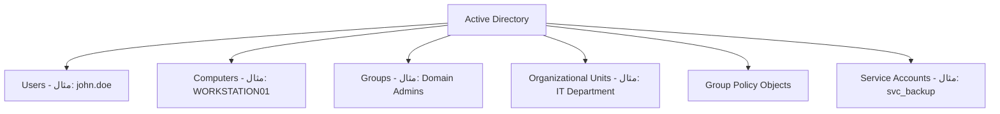
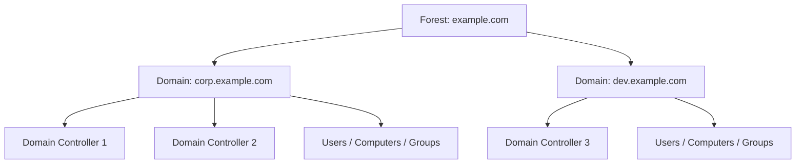
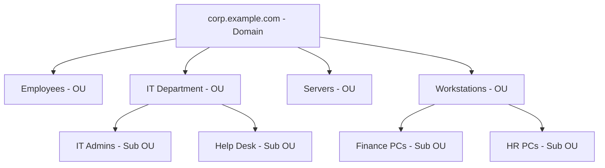
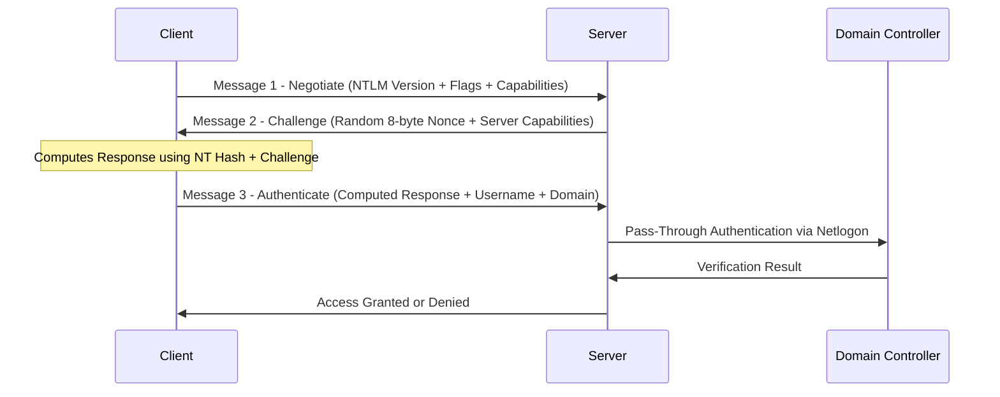
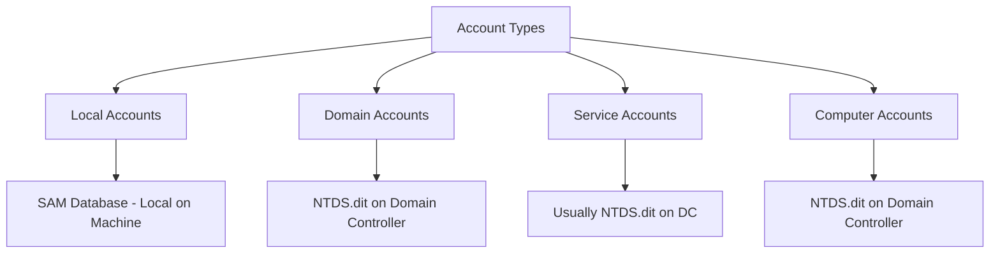
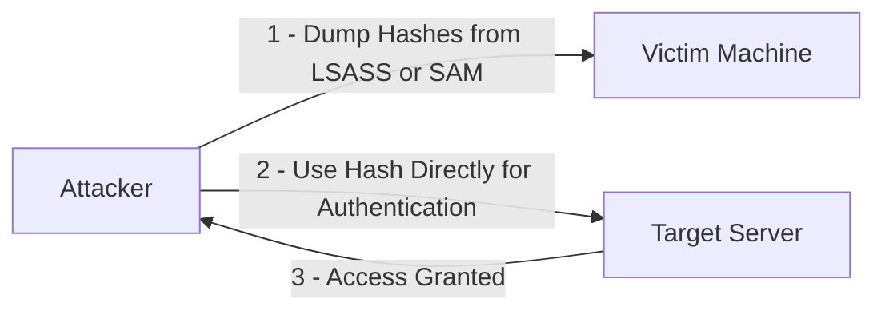
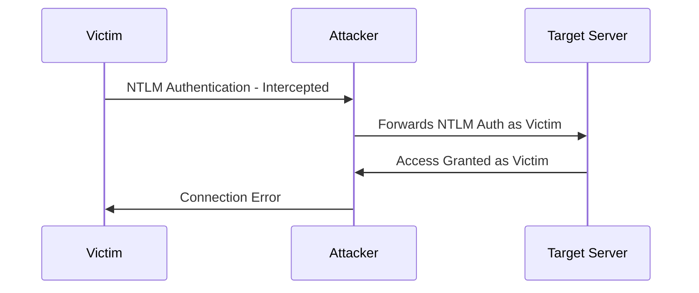
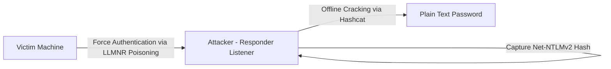

> **الهدف من الـ Section ده:**  
> هتفهم إيه هو الـ Active Directory وليه هو أهم هدف للـ Attackers في أي شركة، وهتعرف إزاي بيتبنى من الـ Components المختلفة، وهتفهم الـ NTLM Protocol خطوة بخطوة مع الـ Attacks الشهيرة عليه — وده كله مهم جداً ليك كـ SOC Analyst

---

## Table of Contents

- [What is Active Directory?](#what-is-active-directory)
- [Why Active Directory Matters in Cyber Security](#why-active-directory-matters-in-cyber-security)
- [Components of Active Directory](#components-of-active-directory)
  - [Domain Controller](#domain-controller)
  - [Active Directory Domain Services - AD DS](#active-directory-domain-services---ad-ds)
  - [Active Directory Objects](#active-directory-objects)
  - [Security Identifiers - SIDs and RIDs](#security-identifiers---sids-and-rids)
- [Active Directory Logical Structure](#active-directory-logical-structure)
  - [Domain](#domain)
  - [Organizational Units - OUs](#organizational-units---ous)
- [NTLM Authentication Protocol](#ntlm-authentication-protocol)
  - [Credential Types - LM Hash and NT Hash](#credential-types---lm-hash-and-nt-hash)
  - [NTLM Authentication Flow](#ntlm-authentication-flow)
  - [Account Types and Credential Storage](#account-types-and-credential-storage)
- [NTLMv1 vs NTLMv2](#ntlmv1-vs-ntlmv2)
- [NTLM Attacks](#ntlm-attacks)
- [Summary](#summary)

---

## What is Active Directory?

الـ **Active Directory (AD)** هو directory service بتقدمه Microsoft وبيشتغل على الـ Windows Server. تقدر تفكر فيه كـ **قاعدة بيانات مركزية** بتخزن وبتنظم كل المعلومات عن الـ resources الموجودة على الشبكة — من Users وComputers وPrinters وShared Folders وغيرها.

**التشبيه الكلاسيكي:**
فكر في الـ AD كـ **دليل تليفونات للشبكة** — زي ما دليل التليفونات بيخزن الأسماء والأرقام والعناوين، الـ AD بيخزن معلومات كل user وكل جهاز وكل مورد على الشبكة.

**التشبيه الأعمق:**
تخيل مبنى إداري كبير عنده بوابة أمن. لما بتيجي، الحارس بيشوف بطاقتك (Authentication)، وبعدين بيقولك انت مسموحلك تدخل أنهي أدوار وأنهي غرف (Authorization). الـ Active Directory هو الحارس ده — بس لكل الـ Corporate Network.

### Key Functions of Active Directory

| الوظيفة | الشرح |
|---|---|
| **Centralized Management** | الـ Admin يقدر يتحكم في آلاف الـ Users والـ Computers من مكان واحد |
| **Authentication** | الـ AD بيتحقق من هويتك لما بتعمل Login |
| **Authorization** | الـ AD بيتحكم في الـ Resources اللي مسموحلك توصلها |
| **Directory Services** | بيخزن وينظم معلومات الـ Network Resources عشان تقدر تلاقيها بسهولة |

---

## Why Active Directory Matters in Cyber Security

> [!IMPORTANT]
> الـ Active Directory موجود في أكتر من **90% من الشركات حول العالم**. ده معناه إنه **أهم هدف للـ Attackers** في أي Enterprise Environment. لو Attacker قدر يـ Compromise الـ AD، هو بقى يتحكم في **كل حاجة في الشركة**.

### SOC Analyst Perspective — Event Logs

الـ Active Directory بيشتغل على الـ **Domain Controllers**، والـ Servers دي بتولد **Windows Security Event Logs** كتير ومهمة جداً للـ Detection:

| Event ID | الحدث |
|---|---|
| **4624** | Successful Logon |
| **4625** | Failed Logon |
| Kerberos Events | TGT Requests, Service Tickets |
| Account Changes | User Created, Password Reset |
| Privilege Escalation | Added to Domain Admins |

> [!TIP]
> الـ Logs دي هي سلاحك كـ SOC Analyst. من خلالها تقدر تكتشف هجمات زي الـ **Kerberoasting** والـ **Lateral Movement** في وقت مبكر.

### Why Attackers Target AD

- **Central Authority:** الـ AD عنده صلاحية الوصول لكل Resource — لو اتـ Compromise، كل حاجة اتـ Compromise.
- **Credential Storage:** الـ AD بيخزن الـ Password Hashes والـ Kerberos Tickets — الـ Attacker يسرقها ويستخدمها.
- **Privilege Escalation Paths:** الـ Misconfigurations في الـ AD ممكن تعمل طرق مخفية من Account عادي لـ Domain Admin.
- **Persistence:** لما الـ Attacker يدخل الـ AD، يقدر يعمل Backdoors بتفضل حتى بعد الـ Password Reset والـ System Rebuild.
- **Lateral Movement:** الـ Trusts بين الـ Domains والـ Forests بتخلي الـ Attacker يتنقل في كل الشركة.

> [!IMPORTANT]
> فهم الـ AD مش اختياري لأي Cybersecurity Professional. كل Penetration Test وكل Red Team Exercise وكل Incident Response بيتعامل مع الـ Active Directory بشكل أو بآخر.

---

## Components of Active Directory

### Domain Controller

الـ **Domain Controller (DC)** هو الـ Windows Server اللي بيشغّل الـ **Active Directory Domain Services (AD DS)**. هو **قلب** أي AD Environment وبيعمل الوظائف دي:

```
Domain Controller
├── Stores NTDS.dit (Complete AD Database)
├── Handles All Authentication Requests
├── Enforces Security Policies
└── Replicates Changes to Other DCs
```

> [!WARNING]
> الـ **NTDS.dit** — الـ File ده موجود على الـ Domain Controller وبيحتوي على **Password Hashes لكل User في الـ Domain**. لو Attacker وصل للـ File ده، قدر يـ Crack أو يـ Reuse كل كلمة سر في الشركة. حماية الـ Domain Controllers هي **أعلى أولوية أمنية**.

---

### Active Directory Domain Services - AD DS

الـ **AD DS** هو الـ Core Server Role اللي بيقدم الـ Directory والـ Authentication Services. لما حد بيقول "Active Directory" عادةً بيقصد الـ AD DS. بيقدم:

| Component | الوظيفة |
|---|---|
| **LDAP** (Lightweight Directory Access Protocol) | البروتوكول المستخدم لـ Query وتعديل الـ Directory |
| **Kerberos Authentication** | البروتوكول الأساسي للـ Authentication في بيئات الـ AD |
| **DNS Integration** | الـ AD بيعتمد على الـ DNS لتحديد مواقع الـ Domain Controllers |
| **Replication Services** | بيحافظ على تزامن كل الـ Domain Controllers |

---

### Active Directory Objects

كل حاجة متخزنة في الـ Active Directory هي **Object**، وكل Object عنده **Attributes (Properties)** بتوصفه.



> [!NOTE]
> كل نوع من الـ Objects ده عنده خصائص مختلفة. مثلاً، الـ User Object عنده attributes زي `sAMAccountName`, `mail`, `memberOf`, `lastLogon` وغيرها.

---

### Security Identifiers - SIDs and RIDs

كل Object في الـ AD بيتعين له **Security Identifier (SID)** — هو رقم فريد بيستخدمه Windows داخلياً لتعريف الـ Objects بدل الأسماء (اللي ممكن تتغير).

**مثال على SID:**
```
S-1-5-21-3623811015-3361044348-30300820-1013
                                          ^^^
                                    Relative Identifier (RID)
```

الجزء الأخير من الـ SID اسمه **Relative Identifier (RID)** وهو الـ Unique داخل الـ Domain.

### Well-Known RIDs

| RID | الحساب |
|---|---|
| **500** | Built-in Administrator Account |
| **501** | Guest Account |
| **502** | KRBTGT Account (Kerberos Ticket Signing) |
| **512** | Domain Admins Group |
| **519** | Enterprise Admins Group |

> [!WARNING]
> الـ **KRBTGT Account (RID 502)** هو الأخطر على الإطلاق. لو الـ Attacker حصل على الـ Password Hash بتاعه، يقدر يـ Forge أي Kerberos Ticket في الـ Domain — وده اسمه **Golden Ticket Attack** وهنتكلم عنه في Sessions جاية.

> [!NOTE]
> الـ Attackers بيعملوا **SID Enumeration** لاكتشاف الـ Privileged Accounts. لو لقيت سلوك زي ده على الشبكة، ده علامة تحذير مهمة.

---

## Active Directory Logical Structure

### Domain

الـ **Domain** هو الوحدة المنطقية الأساسية في الـ AD. بيعرّف **حدود أمنية وإدارية** بتشترك فيها كل الـ Objects (Users, Computers, Groups) في نفس الـ AD Database والـ Security Policies.

- كل Domain عنده **DNS Name فريد** (مثال: `corp.example.com`)
- كل Domain عنده **Domain Controller واحد على الأقل**
- كل Objects في الـ Domain بتشترك في نفس الـ Namespace



---

### Organizational Units - OUs

الـ **Organizational Units (OUs)** هي Containers جوه الـ Domain بتستخدمها لتنظيم الـ Objects في Groups منطقية. بتخدم غرضين أساسيين:

1. **Administrative Delegation:** تقدر تدي صلاحيات Admin معينة على OU معين من غير ما تدي Full Domain Control.
2. **Policy Application:** تقدر تربط **Group Policy Objects (GPOs)** بالـ OU عشان تطبق Settings على كل الـ Objects جواه.

**مثال على OU Structure:**



> [!TIP]
> الـ OU Structure المنظمة بتسهل عليك كـ SOC Analyst تحديد أي Group من المستخدمين أو الأجهزة بيحصل معاهم نشاط مشبوه، وبتخلي الـ GPO Enforcement أكتر دقة وأمان.

---

## NTLM Authentication Protocol

### ما هو NTLM؟

الـ **NT LAN Manager (NTLM)** هو Microsoft Challenge-Response Authentication Protocol. كان الـ Default قبل ما الـ Kerberos ياخد دوره في الـ Windows 2000، بس لسه بيتستخدم كـ **Fallback Mechanism** — وده بالظبط السبب اللي خلى الـ Attackers بيحبوه.

### متى بيتستخدم NTLM؟

على الرغم من إن الـ Kerberos هو البروتوكول الأساسي، الـ NTLM بيتستخدم في الحالات دي:

| الحالة | الشرح |
|---|---|
| Authentication بالـ IP Address | الـ Kerberos محتاج SPNs، مش IP Addresses |
| الجهاز مش Domain-Joined | الـ Kerberos Domain-Only |
| Kerberos Failure | بيتعمل Fallback للـ NTLM |
| Legacy Applications | Apps قديمة Hardcoded على NTLM |
| Local Account Authentication | الـ Kerberos للـ Domain فقط |
| بعض SMB Connections | في Configurations معينة |
| HTTP/NTLM Web Auth | بعض الـ Web Applications |

---

### Credential Types - LM Hash and NT Hash

قبل ما نفهم الـ NTLM Flow، لازم نعرف الـ Credentials اللي بتتستخدم:

| النوع | الوصف | الحالة |
|---|---|---|
| **LM Hash** | Legacy وضعيف جداً — بيقسم الـ Password لـ 7 حروف وبيعمله DES Encryption | ميت عملياً بس لسه موجود في Configs القديمة |
| **NT Hash** | MD4 Hash من الـ Unicode Password. الصيغة: `MD4(UTF-16-LE(password))` | هو اللي NTLM بيستخدمه فعلاً |

> [!IMPORTANT]
> الـ **NT Hash هو نفسه الـ Password** — الـ Attacker مش محتاج يـ Crack الـ Hash عشان يستخدمه. يقدر ياخده ويستخدمه مباشرة للـ Authentication وده اسمه **Pass-the-Hash Attack**.

---

### NTLM Authentication Flow

الـ NTLM بيشتغل في **3 Messages**:



**شرح كل Message:**

- **Message 1 — Negotiate:** الـ Client بيبعت الـ NTLM Version المدعومة والـ Flags والـ Capabilities بتاعته للـ Server.
- **Message 2 — Challenge:** الـ Server بيرد بـ **Random 8-byte Challenge (Nonce)** والـ Capabilities بتاعته.
- **Message 3 — Authenticate:** الـ Client بياخد الـ NT Hash ويحسب الـ Response:
  - **NTLMv1:** HMAC باستخدام NT Hash + Server Challenge
  - **NTLMv2:** `HMAC-MD5(NT Hash, Username, Domain, Server Challenge, Client Challenge, Timestamp)`

> [!NOTE]
> الـ Pass-Through Authentication مهم جداً. الـ Member Server مش بيشوف الـ Actual Hash — هو بس بيعدي الـ Challenge/Response للـ Domain Controller عن طريق الـ **Netlogon Service** عشان يتحقق منها.

---

### Account Types and Credential Storage

كـ SOC Analyst، لازم تعرف: إيه نوع الـ Account، الـ Credentials بتاعته متخزنة فين، وإزاي بيتتحقق من الـ Authentication.

| نوع الـ Account | مثال | مكان التحقق |
|---|---|---|
| **Local Account** | `Administrator` على Workstation | SAM Database (محلية على الجهاز) |
| **Domain Account** | `corp\john.doe` | NTDS.dit على Domain Controller |
| **Service Account** | `svc_backup` | عادةً NTDS.dit (أو محلية لو Misconfigured) |
| **Computer Account** | `PC01$` | NTDS.dit على Domain Controller |
| **Domain Account on Member Server** | أي Domain User على Server | Pass-Through للـ DC عن طريق Netlogon |



---

## NTLMv1 vs NTLMv2

| الخاصية | NTLMv1 | NTLMv2 |
|---|---|---|
| **الظهور** | Windows NT 4.0 وقبله | Windows NT 4.0 SP4+ |
| **الـ Hash Algorithm** | DES-based + LM Hash | HMAC-MD5 |
| **الـ Challenge** | Server Challenge فقط (8 bytes) | Server + Client Challenge + Timestamp |
| **الأمان** | ضعيف جداً — قابل للـ Crack بسهولة | أقوى بكتير — صعب يتـ Crack |
| **الـ Replay Attack** | سهل جداً | صعب بسبب الـ Timestamp |
| **الاستخدام الحالي** | Deprecated — خطر أمني | المستخدم الافتراضي |

> [!WARNING]
> لو لقيت الـ NTLMv1 لسه شغال في بيئة Enterprise، ده **Red Flag أمني** كبير. الـ NTLMv1 بيتـ Crack في ثواني على Hardware عادي. لازم يتعطل فوراً عن طريق الـ GPO.

> [!NOTE]
> حتى الـ NTLMv2 رغم كونه أقوى، لسه عرضة للـ Pass-the-Hash وRelay Attacks. الحل الحقيقي هو التحول الكامل لـ Kerberos مع تعطيل الـ NTLM قدر الإمكان.

---

## NTLM Attacks

### 1. Pass-the-Hash (PtH)

الفكرة: الـ Attacker مش محتاج يعرف الـ Plaintext Password — يكفيه الـ NT Hash.



**الخطوات:**
1. الـ Attacker يـ **Dump الـ Hashes** من الـ **LSASS Process** أو الـ **SAM Database**.
2. بياخد الـ NT Hash ويستخدمه في الـ Authentication على جهاز تاني.
3. بيدخل من غير ما يعرف الـ Password الفعلي.

> [!NOTE]
> **الفرق بين LSASS وSAM:**
> - **LSASS (Local Security Authority Subsystem Service):** Process بيشتغل في الـ Memory وبيحتفظ بالـ Credentials للـ Sessions الشغالة حالياً (Domain + Local Accounts).
> - **SAM (Security Account Manager):** Database ملف على الـ Disk بيخزن الـ Hashes للـ Local Accounts فقط.

---

### 2. NTLM Relay Attack

الفكرة: الـ Attacker مش بيسرق الـ Hash — هو بيـ Relay الـ Authentication نفسها.



**الخطوات:**
1. الـ Victim بيحاول يـ Authenticate على Service معين.
2. الـ Attacker بيعمل Intercept للـ NTLM Authentication.
3. بيعمل Forward لها على Server تاني.
4. بيدخل بصلاحيات الـ Victim.

> [!IMPORTANT]
> الـ NTLM Relay هو من أخطر الـ Attacks في بيئات الـ AD لأنه مش محتاج حتى يعرف الـ Hash. أكتر Tool مستخدمة في ده هي **Responder** و**ntlmrelayx** من الـ Impacket Suite.

---

### 3. Net-NTLMv2 Capture

الفكرة: إجبار جهاز على الـ Authentication لـ Listener وتـ Capture الـ Hash وكسره Offline.



**الخطوات:**
1. الـ Attacker يشغل **Responder** على الشبكة.
2. بيـ Force الـ Victim على الـ Authentication (عن طريق تقنيات زي LLMNR/NBT-NS Poisoning).
3. بيـ Capture الـ Net-NTLMv2 Hash.
4. بيعمل Crack Offline باستخدام أدوات زي **Hashcat**.

---

### SOC Detection — Key Event IDs for NTLM

| Event ID | الحدث | ليه مهم |
|---|---|---|
| **4624** | Successful Logon | تابع الـ Logon Type — Type 3 يعني Network Logon |
| **4625** | Failed Logon | كتير منهم = Brute Force أو Password Spray محتمل |
| **4648** | Logon using Explicit Credentials | ممكن يكون Pass-the-Hash |
| **4672** | Special Privileges Assigned | حساب بصلاحيات عالية اتعمل له Logon |
| **4776** | NTLM Authentication Attempt | بيحصل لما DC يتحقق من NTLM Credentials |

> [!TIP]
> لو شايف **Event 4625 بكميات كبيرة** من IP واحد أو على حسابات كتير في وقت قصير، ده علامة على Brute Force أو Password Spray. ولو شايف **4648 بعد Dump على نفس الـ Hostname**، ده يستاهل تحقيق فوري.

---

## Summary

- **Active Directory** هو قاعدة البيانات المركزية لأي Enterprise Network — بيتحكم في الـ Authentication والـ Authorization وكل الـ Resources. موجود في 90%+ من الشركات.

- **Domain Controller (DC)** هو قلب الـ AD ويحتوي على الـ **NTDS.dit** اللي فيه كل الـ Password Hashes — حمايته هي الأولوية الأعلى في أي بيئة Enterprise.

- **Active Directory Objects** — كل حاجة في الـ AD (Users, Computers, Groups) هي Object عنده **SID** فريد. الـ SID بيتكون من جزء الـ Domain + الـ RID.

- **Well-Known RIDs** — RID 500 هو الـ Built-in Admin، RID 502 هو KRBTGT. Compromise الـ KRBTGT = **Golden Ticket Attack**.

- **NTLM** — بروتوكول Authentication قديم لسه شغال كـ Fallback. بيشتغل في 3 Messages: Negotiate, Challenge, Authenticate.

- **NT Hash = Password** عملياً — الـ Attacker مش محتاج يـ Crack الـ Hash عشان يستخدمه في الـ Authentication (Pass-the-Hash).

- **NTLMv1** خطير جداً ولازم يتعطل عن طريق GPO. **NTLMv2** أقوى بس لسه عرضة للـ Attacks.

- أخطر الـ NTLM Attacks الثلاثة:
  - **Pass-the-Hash:** استخدام الـ NT Hash مباشرة بدون معرفة الـ Password.
  - **NTLM Relay:** تمرير الـ Authentication للـ Target تاني والدخول بصلاحيات الـ Victim.
  - **Net-NTLMv2 Capture:** تصيد الـ Hash عن طريق Responder وكسره Offline.

- كـ SOC Analyst، الـ Event IDs الأهم للـ Detection هي: **4624, 4625, 4648, 4672, 4776**.
