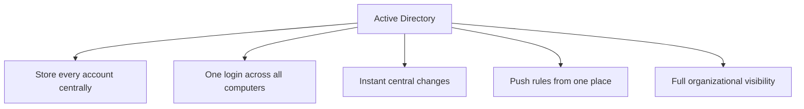
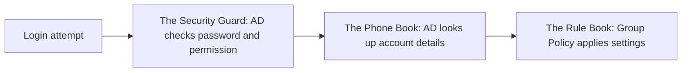
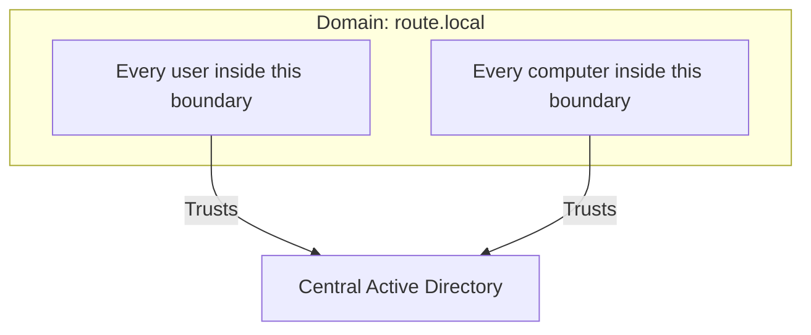
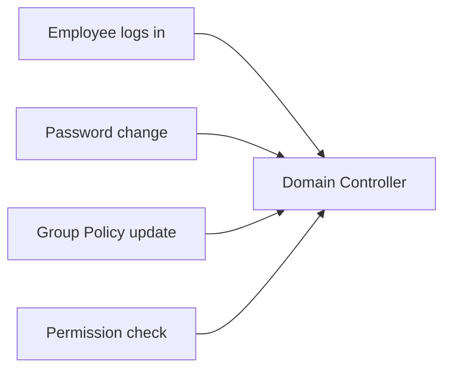
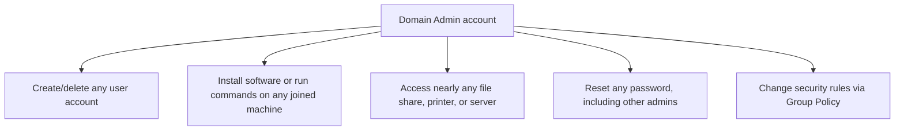
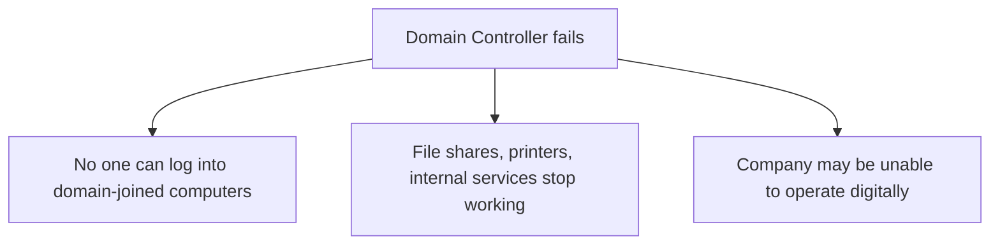
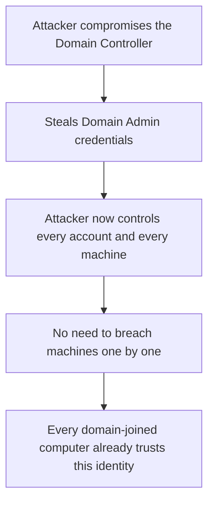

| Topic | Level | Reading Time | Prerequisites |
|---|---|---|---|
| Active Directory Core Concepts | Intermediate | ~20 min | Local Identity and the Scaling Problem |

> **الهدف من الـ Section ده:**  
>  هتفهم إيه هو الـ Active Directory بالظبط، وإيه الفرق بين الـ Domain والـ Domain Controller والـ Domain Admin، وليه اختراق سيرفر واحد بس ممكن يبقى معناه اختراق الشركة كلها.

## Learning Objectives

By the end of this section, you will be able to:

- Explain why organizations need **Active Directory (AD)**, and how it solves the four scaling problems from local identity management.
- Describe AD using the three-part model: the phone book, the security guard, and the rule book.
- Define a **Domain** and explain how joining one changes a computer's trust relationship.
- Define a **Domain Controller (DC)** and explain why it is the single most sensitive machine in the network.
- Define a **Domain Admin** account and list the scope of control it holds.
- Explain why the Domain Controller is a **single point of failure**, and how organizations mitigate that risk with redundancy and a disaster recovery site.
- Explain, step by step, why compromising a Domain Controller can mean compromising an entire organization.

## Table of Contents

- [Learning Objectives](#learning-objectives)
- [Why We Need Active Directory](#why-we-need-active-directory)
  - [Five Things Active Directory Provides](#five-things-active-directory-provides)
- [What Is Active Directory](#what-is-active-directory)
  - [The Three-Part Model](#the-three-part-model)
  - [The Key Shift](#the-key-shift)
- [What Is a Domain](#what-is-a-domain)
  - [The Organization's Territory](#the-organizations-territory)
  - [Joining a Domain](#joining-a-domain)
- [What Is a Domain Controller (DC)](#what-is-a-domain-controller-dc)
  - [Concept Versus Machine](#concept-versus-machine)
  - [Why Every Request Goes Through It](#why-every-request-goes-through-it)
- [What Is a Domain Admin](#what-is-a-domain-admin)
  - [The Scope of Control](#the-scope-of-control)
  - [The Master Key, Scaled Up](#the-master-key-scaled-up)
- [Why the Domain Controller Is a Single Point of Failure](#why-the-domain-controller-is-a-single-point-of-failure)
  - [If the DC Goes Down](#if-the-dc-goes-down)
  - [The Fix: Redundancy](#the-fix-redundancy)
  - [Disaster Recovery (DR) Site](#disaster-recovery-dr-site)
- [What If an Attacker Reaches the Domain Controller](#what-if-an-attacker-reaches-the-domain-controller)
  - [The Attack Path](#the-attack-path)
  - [Game Over](#game-over)
- [Career Path Connections](#career-path-connections)
- [Key Terms Glossary](#key-terms-glossary)
- [Summary](#summary)

## Why We Need Active Directory

فاكر الأربع مشاكل من الملف اللي فات: no single login, no central control, no consistent rules, no visibility؟ الـ **Active Directory (AD)** هو الحل المباشر ليهم.

### Five Things Active Directory Provides

| # | Capability | What It Solves |
|---|---|---|
| 1 | Store every account in one place | بدل ما تدير حسابات منفصلة على كل جهاز |
| 2 | One login, everywhere | أي موظف يقدر يدخل على أي جهاز في الشركة بنفس الحساب |
| 3 | Instant, central changes | إنشاء أو تعطيل أو حذف حساب مرة واحدة، وبيتطبق فوراً في كل مكان |
| 4 | Push rules from one place | متطلبات الـ password، الـ wallpaper، التطبيقات المحظورة، كلها بتتظبط مركزياً |
| 5 | Full organizational visibility | تتبع كل جهاز ومستخدم وطابعة في هيكل واحد منظم |

**Active Directory (AD)** هو إجابة **Microsoft** من سنة **2000**، وبيتستخدم في **تقريباً كل شركة متوسطة أو كبيرة** لإدارة أجهزة Windows والحسابات بتاعتها.

## What Is Active Directory

### The Three-Part Model

أسهل طريقة تفهم AD هي إنك تشوفه كتلات مفاهيم مرتبطة:

| Model | What It Represents |
|---|---|
| **The Phone Book** | بيخزن كل user account وcomputer وprinter وgroup، بتفاصيل زي الاسم، القسم، password hash، وأنهي جهاز الحساب ده بيتبعله |
| **The Security Guard** | كل login على أي جهاز في الشركة بيسأل AD: هل الـ password صح، وهل الحساب ده مسموحله يدخل هنا؟ |
| **The Rule Book** | بيدفع الإعدادات والقيود أوتوماتيك لكل جهاز ومستخدم، ده اللي اسمه **Group Policy** |

### The Key Shift

التحول الأساسي هنا: **الحسابات ماعادتش تخص جهاز واحد بس**، هي بقت تخص **المؤسسة كلها**، وكل جهاز ببساطة **بيثق في Active Directory** إنه يقول مين هو مين.

> [!IMPORTANT]
> Active Directory (AD) is a centralized database and management system for a company's users, computers, and resources. This single sentence is the definition worth memorizing; everything else in this file explains how that definition is implemented.

## What Is a Domain

### The Organization's Territory

الـ **Domain** هو **الأرض (territory) اللي بيديرها Active Directory**، وهو الاسم للمجموعة المنظمة الكاملة من المستخدمين والأجهزة اللي كلهم **بيثقوا في نفس الـ Active Directory**.

هو بيحل محل مفهوم الـ **workgroup** من الملف السابق، لكن بدل ما يكون مجرد label فضفاض، **الانضمام لـ domain** معناه إن الجهاز **بقى فعلياً بيثق في النظام المركزي** للتسجيل والقواعد.

الـ Domain ليه اسم، عادةً شكله زي عنوان موقع، مثلاً: `company.corp`.

### Joining a Domain

الانضمام لـ domain بيقول: **من دلوقتي، مش هتفحص بس قايمتك المحلية الصغيرة من الحسابات، كمان هتثق في أي حاجة Active Directory بيقولها**.

> [!NOTE]
> Every user and computer inside this boundary trusts one central Active Directory. This is the practical meaning of "joining a domain": a shift from local self-management to central trust.

## What Is a Domain Controller (DC)

### Concept Versus Machine

الفرق ده مهم جداً تتذكره:

| Term | What It Is |
|---|---|
| Active Directory | **المفهوم**: الـ phone book، القواعد، التصميم |
| Domain Controller (DC) | **السيرفر الفعلي** (فيزيائي أو virtual) اللي النظام ده بيعيش ويشتغل عليه فعلياً |

الـ **Domain Controller** هو السيرفر اللي بيشغّل Active Directory. هو **الجهاز** اللي بيحمل قاعدة البيانات الحقيقية لكل مستخدم، وpassword، وجهاز، وقاعدة.

### Why Every Request Goes Through It

لما أي موظف محتاج يدخل أو يفحص صلاحية، الطلب ده **بيروح للـ Domain Controller**. كل جهاز متصل بالـ domain **بيكلم DC باستمرار**: كل login، كل تغيير password، كل تحديث Group Policy، كله بيعدي عن طريقه.

ده اللي بيخلي الـ Domain Controller **أهم وأخطر جهاز في شبكة الشركة كلها**.

## What Is a Domain Admin

### The Scope of Control

الـ **Domain Admin** هو حساب خاص عنده **تحكم إداري كامل على الـ domain كله**، مش على جهاز واحد بس، على **كل جهاز، كل حساب مستخدم، والـ Domain Controller نفسه**.

الـ Domain Admin يقدر:

- ينشئ أو يحذف أي حساب مستخدم في الشركة.
- يثبت software أو يشغّل أوامر على أي جهاز منضم للـ domain.
- يوصل تقريباً لأي file share أو printer أو server في البيئة.
- يعمل reset لأي password، **حتى بتاعة administrators تانيين**.
- يغيّر قواعد الأمان للمؤسسة كلها عن طريق **Group Policy**.

### The Master Key, Scaled Up

نفس فكرة Administrator مقابل Standard User اللي شرحناها في الملف السابق، لكن **متضخمة عشان تتحكم في كل جهاز وحساب في الشركة مرة واحدة**، وهو **أثمن وأكتر حساب محتاج حماية** في أي مؤسسة.

> [!WARNING]
> A Domain Admin account is not "an administrator with a bigger scope" in a casual sense. It is the single most valuable target in the entire organization. Losing control of one Domain Admin credential is functionally equivalent to losing control of every computer, every account, and every file share in the company.

## Why the Domain Controller Is a Single Point of Failure

### If the DC Goes Down

بما إن الـ Domain Controller بيحمل **كل حساب، وكل فحص password، وكل قاعدة**، لو هو وقع أو اتكسر أو اتدمر، العواقب **خطيرة**:

- محدش يقدر يدخل على أي جهاز منضم للـ domain (لو ده الـ DC الوحيد ومفيش cached login).
- الـ file shares والـ printers والخدمات الداخلية المرتبطة بـ AD ممكن تتوقف عن الشغل.
- الشركة ممكن تبقى **عاجزة تماماً عن العمل رقمياً** لحد ما النظام يترجع.

### The Fix: Redundancy

الشركات بتشغّل **اتنين أو أكتر من Domain Controllers**، غالباً في **مواقع فيزيائية مختلفة**، ومتزامنين أوتوماتيك مع بعض (عملية اسمها **replication**).

### Disaster Recovery (DR) Site

**موقع فيزيائي منفصل**، أحياناً في مدينة أو دولة مختلفة، فيه نسخ احتياطية من الأنظمة الحرجة، بما فيها AD، جاهزة تاخد المسؤولية لو الموقع الرئيسي اتدمر بحريقة أو فيضان أو ransomware أو أي حدث كارثي.

| Risk | Mitigation |
|---|---|
| DC واحد بس، ووقع | تشغيل أكتر من DC مع replication تلقائي |
| الموقع الرئيسي بالكامل اتدمر | Disaster Recovery (DR) site في موقع منفصل جغرافياً |

> [!TIP]
> Redundancy answers "what if one server fails?" A DR site answers a bigger question: "what if the entire building or region is unavailable?" Mature organizations plan for both, not just the first.

## What If an Attacker Reaches the Domain Controller

### The Attack Path

- الـ Domain Controller بيحمل **كل حساب وكل سر متعلق بالـ passwords** في الشركة.
- حساب Domain Admin يقدر **يتحكم في كل حاجة، في كل مكان**.
- لو مهاجم اخترق الـ DC، وسرق **credentials بتاعة Domain Admin**، هو بقى **أقوى مستخدم في الشركة كلها**، بنفس صلاحيات الـ god-mode، عبر كل جهاز وحساب.
- المهاجم **مابقاش محتاج يخترق الأجهزة واحد واحد**؛ هو أصلاً بيتحكم في النظام اللي **كل الأجهزة دي بتثق فيه بالكامل**.

### Game Over

الوصف الشائع في مجال الـ cybersecurity للحظة دي: **"Game Over"**. سيرفر واحد اتخترق، والمؤسسة كلها اتخترقت.

> [!IMPORTANT]
> This single fact, that compromising one server can compromise an entire organization, is exactly why Domain Controllers and Domain Admin accounts receive the highest level of protection in any serious security program. This is not an exaggeration; it is a direct structural consequence of how trust is centralized in Active Directory.

## Career Path Connections

| Career Path | How This Topic Applies |
|---|---|
| SOC Analyst | Treats any alert touching the Domain Controller or a Domain Admin account as Tier 0, the highest priority, connecting directly to asset criticality tiering |
| Penetration Tester | Domain Admin compromise is often the explicit end goal of an internal penetration test or red team engagement |
| GRC | Domain Controller redundancy and DR planning are standard requirements in business continuity and disaster recovery audits |
| Cloud Security | Cloud identity providers (such as Microsoft Entra ID) replace the physical DC model but face the same "one identity system, total trust" risk |

## Key Terms Glossary

| Term | Definition |
|---|---|
| Active Directory (AD) | A centralized database and management system for a company's users, computers, and resources |
| Domain | The organized group of users and computers that all trust the same Active Directory |
| Domain Controller (DC) | The physical or virtual server that runs Active Directory and holds its database |
| Domain Admin | A user account with full administrative control over the entire domain |
| Group Policy | The rule-book feature of Active Directory that pushes settings automatically to computers and users |
| Replication | The automatic synchronization of data between multiple Domain Controllers |
| Disaster Recovery (DR) Site | A separate physical location with backup copies of critical systems, ready to take over after a catastrophic event |
| Single Point of Failure | A component whose failure disrupts the entire system depending on it |

## Summary

- **Active Directory solves the local identity scaling problem:** حساب واحد، مكان واحد، قواعد واحدة، ورؤية كاملة على كل المؤسسة.
- **AD works as three connected ideas:** phone book (تخزين)، security guard (التحقق)، rule book (فرض القواعد عبر Group Policy).
- **A Domain is the trust boundary:** كل مستخدم وجهاز جواه بيثق في نفس الـ Active Directory المركزي.
- **The Domain Controller is the concept made physical:** هو السيرفر اللي AD فعلياً بيشتغل عليه، وكل طلب login أو صلاحية بيعدي عليه.
- **Domain Admin is the master key, scaled to the whole company:** تحكم كامل في كل جهاز وحساب، مش جهاز واحد بس.
- **The DC is a single point of failure by design:** الحل هو redundancy عبر عدة DCs، بالإضافة لـ DR site في حالة كارثة أكبر.
- **Compromising the DC means compromising everything:** لأن كل جهاز في الـ domain بيثق فيه بالكامل، مفيش حاجة يفصل بينهم بعد كده.

