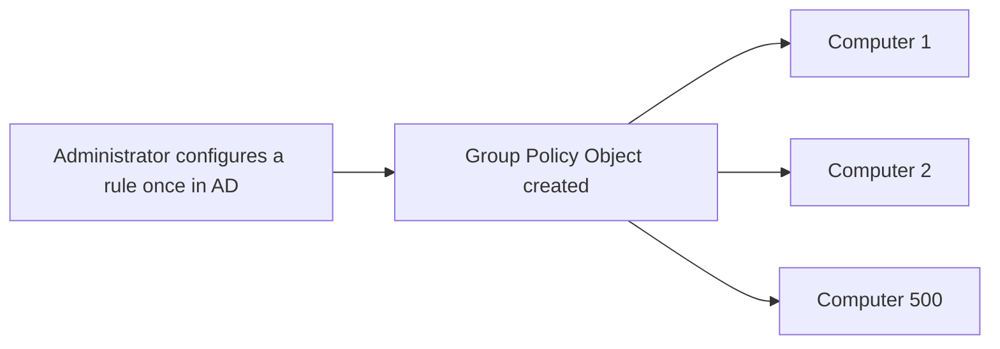
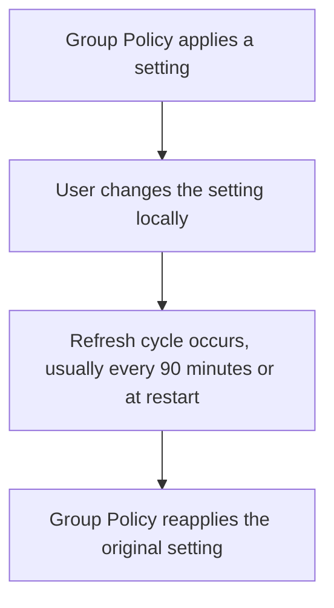
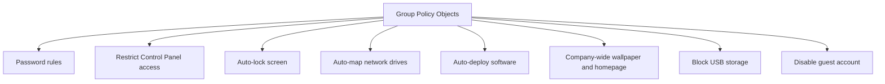
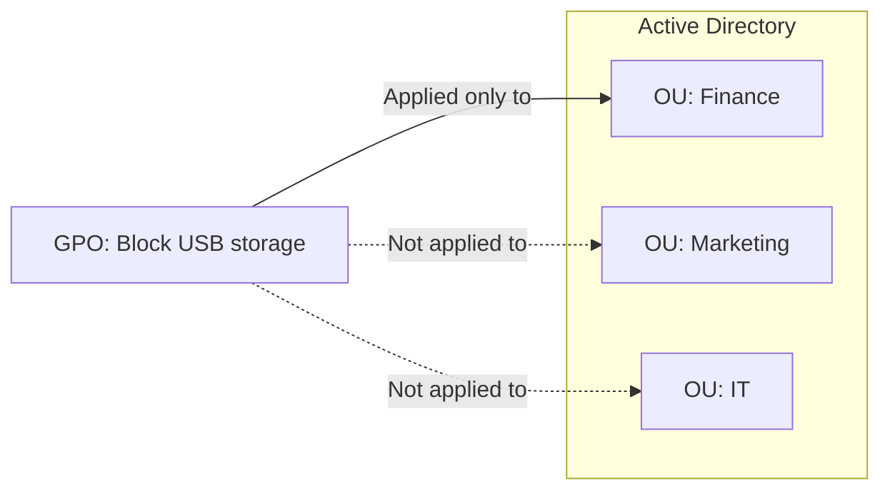
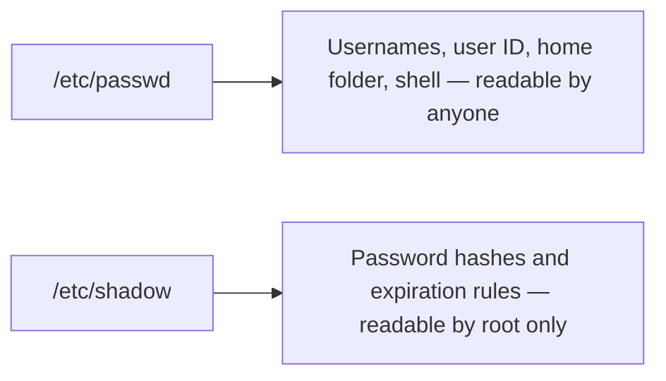
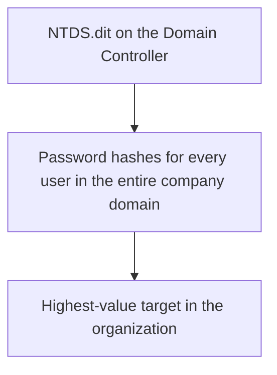
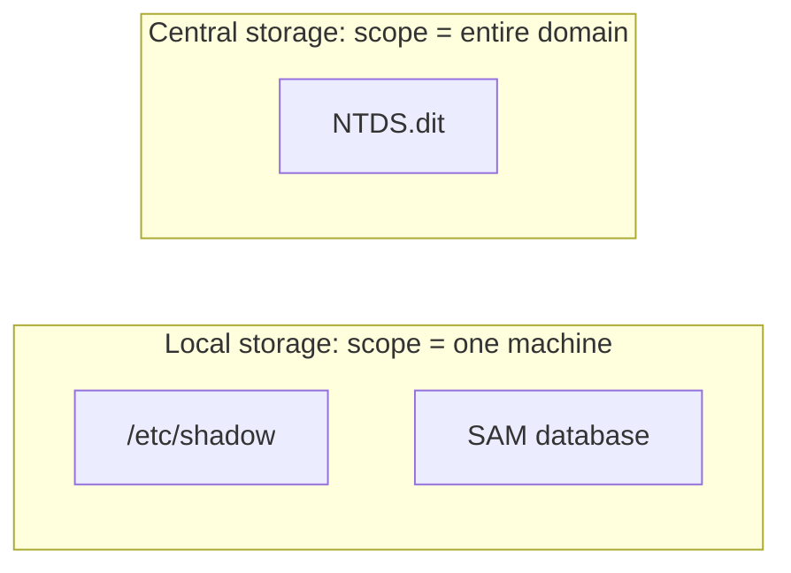

| Topic | Level | Reading Time | Prerequisites |
|---|---|---|---|
| Group Policy and Credential Storage | Intermediate | ~20 min | Active Directory Core Concepts |

> **الهدف من الـ Section ده:**  
>  هتفهم إزاي Active Directory بيفرض القواعد على مئات الأجهزة من غير ما حد يلمسهم واحد واحد، وهتشوف فين بالظبط بيتخزن السر الأكبر في أي نظام: password hashes، على Linux وWindows وActive Directory.


## Learning Objectives

By the end of this section, you will be able to:

- Explain what **Group Policy (GPOs)** is, and how it applies settings centrally without visiting each machine.
- Explain how Group Policy **re-applies itself automatically**, even if a user changes a setting locally.
- List concrete, practical examples of what Group Policy can enforce across an organization.
- Explain how **Organizational Units (OUs)** let administrators target policies to specific groups instead of everyone.
- Describe where password hashes are stored on **Linux** (`/etc/shadow`), a **standalone Windows PC** (`SAM`), and **Active Directory** (`NTDS.dit`).
- Explain why `NTDS.dit` makes the Domain Controller the highest-value target in any organization.

## Table of Contents

- [Learning Objectives](#learning-objectives)
- [What Is Group Policy](#what-is-group-policy)
  - [The Rule Book, in Action](#the-rule-book-in-action)
  - [Why It Matters at Scale](#why-it-matters-at-scale)
  - [Self-Reapplying Rules](#self-reapplying-rules)
- [Group Policy in Practice](#group-policy-in-practice)
  - [Eight Concrete Examples](#eight-concrete-examples)
  - [Targeting Policies with Organizational Units](#targeting-policies-with-organizational-units)
- [Where Passwords Are Stored on Linux](#where-passwords-are-stored-on-linux)
  - [The Two-File Split](#the-two-file-split)
  - [Trying It Yourself](#trying-it-yourself)
- [Where Passwords Are Stored on a Standalone Windows PC](#where-passwords-are-stored-on-a-standalone-windows-pc)
  - [The SAM Database](#the-sam-database)
- [Where Passwords Are Stored in Active Directory](#where-passwords-are-stored-in-active-directory)
  - [NTDS.dit](#ntdsdit)
  - [Comparing the Three Storage Locations](#comparing-the-three-storage-locations)
- [Career Path Connections](#career-path-connections)
- [Key Terms Glossary](#key-terms-glossary)
- [Summary](#summary)

## What Is Group Policy

### The Rule Book, in Action

**Group Policy** (تقنياً: **Group Policy Objects**, أو **GPOs**) هي **ميزة الـ rule-book** بتاعة Active Directory. بتسمح للـ administrators يحددوا إعدادات **مرة واحدة، مركزياً**، وتتطبق أوتوماتيك على مئات الأجهزة **في نفس الوقت**، من غير الحاجة لزيارة كل جهاز على حدة.

### Why It Matters at Scale

لو الشركة عايزة تطبق قاعدة password على **500 جهاز**، حد لازم يظبطها **500 مرة** لو مفيش Group Policy. الـ GPO بتحل المشكلة دي بالظبط: تظبط القاعدة **مرة واحدة** في Active Directory، وهي بتتطبق أوتوماتيك على كل جهاز متعين ليها.



### Self-Reapplying Rules

الـ GPO **بتفرض نفسها من جديد باستمرار**، عادةً **كل 90 دقيقة**، أو عند كل **restart**، حتى لو حد حاول يغيّرها محلياً.

> [!IMPORTANT]
> Even if someone changes a setting locally, Group Policy re-applies it on the next refresh cycle. This is what makes GPOs a real enforcement mechanism rather than just a suggestion: a user cannot simply undo a policy and expect it to stay undone.



## Group Policy in Practice

### Eight Concrete Examples

الجدول ده بيوضح أمثلة عملية على إيه اللي ممكن تتحكم فيه بـ Group Policy:

| # | Example |
|---|---|
| 1 | قواعد الـ password: أقل طول، تعقيد، وانتهاء صلاحية |
| 2 | تقييد الوصول لـ Control Panel وSettings |
| 3 | قفل الشاشة أوتوماتيك بعد فترة خمول |
| 4 | ربط network drives أوتوماتيك حسب القسم |
| 5 | نشر software أوتوماتيك (زي antivirus) لمجموعة معينة |
| 6 | ضبط الـ wallpaper وbrowser homepage على مستوى الشركة كلها |
| 7 | منع أجهزة USB storage |
| 8 | تعطيل حساب الـ guest، وفرض قفل الشاشة |



### Targeting Policies with Organizational Units

**مش كل قاعدة لازم تتطبق على الجميع**. الـ GPOs تقدر تستهدف مجموعات معينة، مثلاً منع أجهزة USB **بس على قسم الـ Finance**، وده بيتم باستخدام **Organizational Units (OUs)**، وهي **مجلدات جوه Active Directory** بتجمع المستخدمين والأجهزة مع بعض.



> [!TIP]
> Organizational Units are the mechanism that turns "one rule for everyone" into "the right rule for the right group." Without OUs, administrators would face the same all-or-nothing problem Group Policy was designed to eliminate.

## Where Passwords Are Stored on Linux

### The Two-File Split

على **Linux**، معلومات حساب المستخدم متقسمة على **ملفين**:

| File | Stores | Access |
|---|---|---|
| `/etc/passwd` | قايمة الـ usernames ومعلومات أساسية (user ID، مجلد home، الـ shell الافتراضي)، **لكن مش الـ passwords الفعلية** | أي مستخدم يقدر يقراه |
| `/etc/shadow` | الـ **password hashes** الفعلية (نسخة مشفرة one-way من الـ password، مش الـ password الصريح نفسه)، بالإضافة لقواعد انتهاء صلاحية الـ password | **root بس** يقدر يقراه |

> [!NOTE]
> `/etc/passwd` used to store actual passwords decades ago. It no longer does, but the historical name stuck, which is why the file's name can be misleading today.



### Trying It Yourself

```bash
cat /etc/passwd
sudo cat /etc/shadow
```

الأمر الأول بيشتغل لأي مستخدم. الأمر التاني هيطلب password الـ sudo، وده بيوضح عملياً إن **المستخدمين العاديين ممنوعين** من قراءة الـ password hashes، **root بس** هو اللي يقدر.

> [!TIP]
> Run these two commands on your own Linux machine. Notice that the second command prompts for authentication even if you are already logged in, a direct demonstration of the standard-user-versus-root separation from the previous file in this series.

## Where Passwords Are Stored on a Standalone Windows PC

### The SAM Database

الـ password hashes بتاعة الحسابات المحلية بتتخزن في ملف اسمه **SAM (Security Account Manager) database**.

الملف ده **مقفول وغير قابل للوصول** أثناء تشغيل Windows بشكل عادي، **حتى الـ administrators مايقدروش يفتحوه مباشرة**. Windows بيحميه بشدة لأنه بيحمل password hash **كل حساب محلي** على الجهاز ده.

```text
C:\Windows\System32\config\SAM
```

الملف ده **بيوازي** ملف `/etc/shadow` على Linux؛ الاتنين بيخدموا نفس الغرض: **الخزنة المحمية** لـ password hashes حسابات الجهاز المحلي.

| System | Local Password Storage | Locked While Running? |
|---|---|---|
| Linux | `/etc/shadow` | يقدر يتقرأ بـ root بس |
| Windows (standalone) | `SAM` database | مقفول تماماً، حتى الـ admins |

## Where Passwords Are Stored in Active Directory

### NTDS.dit

على **Domain Controller**، الحسابات بتخص **الـ domain كله، مش جهاز واحد**. الـ password hash بتاع **كل مستخدم في الـ domain** بيعيش في **ملف قاعدة بيانات واحد**: **`NTDS.dit`** (NT Directory Services).

الملف ده بيحمل password hashes **كل حساب مستخدم في الشركة كلها**، وده بالظبط ليه الـ Domain Controller هو **الهدف الأعلى قيمة** في أي مؤسسة. زي الـ SAM، هو **مقفول ومحمي** أثناء تشغيل السيرفر.



### Comparing the Three Storage Locations

| Where | What It's Called | What It Stores |
|---|---|---|
| Linux, single PC | `/etc/shadow` | Password hashes لمستخدمي جهاز Linux ده بس |
| Windows, single PC | SAM database | Password hashes لمستخدمي جهاز Windows ده بس |
| Active Directory | `NTDS.dit` (على الـ DC) | Password hashes **لكل مستخدم في الـ domain كله** |



> [!IMPORTANT]
> The pattern across all three systems is identical: readable account information stays in an accessible file, while the actual password hashes sit in a separate, tightly locked file. The only thing that changes is scope: one machine locally, versus the entire company centrally. This is exactly why compromising `NTDS.dit` is structurally worse than compromising any single SAM database.

## Career Path Connections

| Career Path | How This Topic Applies |
|---|---|
| SOC Analyst | Treats any attempt to access or extract `NTDS.dit` as a critical, Tier 0 alert |
| Penetration Tester | Extracting `NTDS.dit` (often via a technique called DCSync) is a common objective in internal Active Directory assessments |
| GRC | Group Policy enforcement of password rules is a direct, auditable compliance control |
| Cloud Security | Cloud identity providers replace local GPOs with cloud-native policy engines, but the same "central rule, central enforcement" logic applies |

## Key Terms Glossary

| Term | Definition |
|---|---|
| Group Policy (GPO) | The Active Directory feature that centrally configures and enforces settings across many computers |
| Organizational Unit (OU) | A folder-like structure in Active Directory used to group users and computers for targeted policy application |
| /etc/passwd | The Linux file storing usernames and basic account info, readable by any user |
| /etc/shadow | The Linux file storing password hashes, readable only by root |
| SAM Database | The Windows file storing local account password hashes on a standalone PC |
| NTDS.dit | The Active Directory database file on a Domain Controller storing password hashes for every domain user |
| Password Hash | A one-way, scrambled version of a password, stored instead of the plaintext password itself |

## Summary

- **Group Policy is Active Directory's enforcement mechanism:** إعدادات بتتظبط مرة واحدة مركزياً، وتتطبق أوتوماتيك على مئات الأجهزة.
- **Rules reapply themselves:** التغيير المحلي بيترجع للإعداد الأصلي عند أول refresh cycle، عادةً كل 90 دقيقة أو عند الـ restart.
- **Organizational Units allow targeted policy:** بدل قاعدة واحدة للجميع، القواعد بتتوجه لمجموعات محددة زي قسم الـ Finance.
- **Linux splits account info across two files:** `/etc/passwd` مقروء للجميع، و`/etc/shadow` بـ password hashes، مقروء بـ root بس.
- **Windows mirrors the same split locally:** الـ SAM database هو معادل `/etc/shadow`، مقفول تماماً وقت تشغيل النظام.
- **Active Directory centralizes this at domain scale:** `NTDS.dit` بيحمل password hashes كل مستخدم في الشركة كلها، مش جهاز واحد بس.
- **The pattern is the same everywhere, only the scope changes:** ملف مقفول لحماية الـ hashes، والفرق الوحيد بين local وcentral هو حجم الضرر لو اتخترق.

