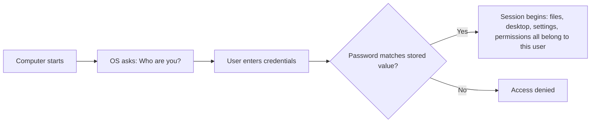
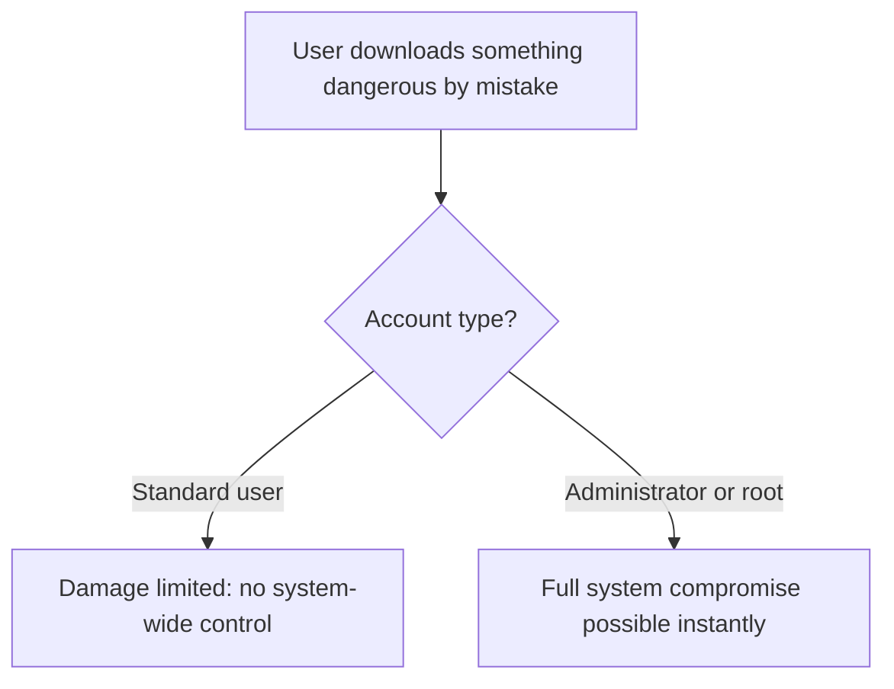
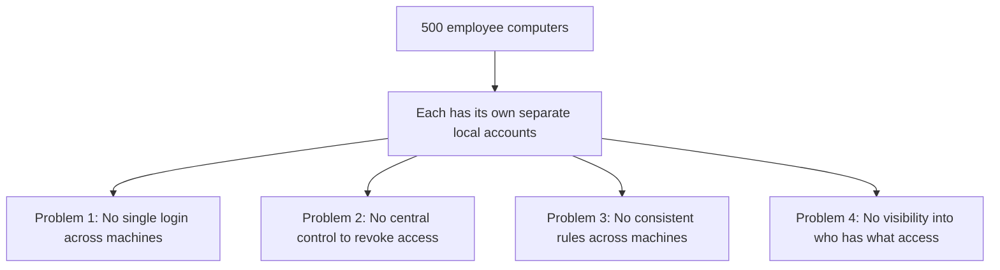
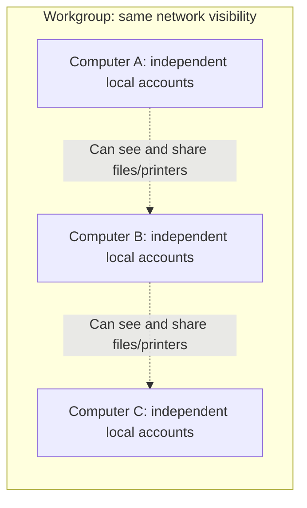

| Topic | Level | Reading Time | Prerequisites |
|---|---|---|---|
| Local Identity and the Scaling Problem | Beginner | ~15 min | None |

> **الهدف من الـ Section ده:**  
>  هتفهم إيه هو الـ user account بالظبط، ليه الأنظمة بتفرق بين admin وstandard user، وليه إدارة الهوية على مستوى الجهاز الواحد بتنهار تماماً لما نوصل لشركة فيها مئات الأجهزة.


## Learning Objectives

By the end of this section, you will be able to:

- Explain what a **user account** is and how the operating system uses it to answer "who are you?" at every login.
- Locate and inspect local user accounts on both **Windows** and **Linux**.
- Differentiate between an **administrator/root** account and a **standard user** account, and explain why the separation exists.
- Describe the four core problems that appear when an organization tries to manage identity across hundreds of separate computers.
- Explain what a **Workgroup** is, and why it solves visibility but not identity management.

## Table of Contents

- [Learning Objectives](#learning-objectives)
- [What Is a User Account](#what-is-a-user-account)
  - [The Core Idea](#the-core-idea)
  - [One Machine, Many Accounts](#one-machine-many-accounts)
  - [Practical Demo: Viewing Local Accounts](#practical-demo-viewing-local-accounts)
- [Why Multiple Accounts Exist](#why-multiple-accounts-exist)
  - [Administrator and Root Versus Standard User](#administrator-and-root-versus-standard-user)
  - [Why the Separation Exists](#why-the-separation-exists)
  - [Checking Your Own Account Role](#checking-your-own-account-role)
- [Scaling the Problem: One Computer Versus 500](#scaling-the-problem-one-computer-versus-500)
  - [Problem 1: No Single Login](#problem-1-no-single-login)
  - [Problem 2: No Central Control](#problem-2-no-central-control)
  - [Problem 3: No Consistent Rules](#problem-3-no-consistent-rules)
  - [Problem 4: No Visibility](#problem-4-no-visibility)
- [Before Active Directory: The Workgroup](#before-active-directory-the-workgroup)
  - [What a Workgroup Is](#what-a-workgroup-is)
  - [Why a Workgroup Is Not Enough for a Company](#why-a-workgroup-is-not-enough-for-a-company)
- [Career Path Connections](#career-path-connections)
- [Key Terms Glossary](#key-terms-glossary)
- [Summary](#summary)

## What Is a User Account

### The Core Idea

كل كمبيوتر محتاج يعرف **مين اللي بيستخدمه**. الـ **user account** هو هوية (identity) على الكمبيوتر: ليه username وpassword، وهو اللي بيحدد إنت مسموحلك تعمل إيه على الجهاز ده.

Windows وLinux **الاتنين شغالين بنفس المنطق**. لما جهازك يشتغل، هو **مش بيدخل ويسيب أي حد يستخدمه**؛ هو بيسأل: **مين إنت؟** وبيقارن الـ password بتاعك مع اللي محفوظ عنده.

بمجرد ما تدخل (login)، نظام التشغيل بيفتكر إن **كل حاجة بتحصل في الـ session دي بتاعتك إنت**: ملفاتك، الـ desktop بتاعك، إعدادات التطبيقات المثبتة، وصلاحياتك.



### One Machine, Many Accounts

جهاز فيزيائي واحد يقدر **يحتوي على أكتر من حساب في نفس الوقت**. تخيل كمبيوتر العيلة: الأب والأم والأولاد، كل واحد منهم يقدر يكون عنده **account منفصل** على نفس الجهاز. كل شخص بياخد **desktop منفصل، مجلد documents منفصل، bookmarks منفصلة في المتصفح**، بشكل منفصل تماماً، رغم إن الـ hardware واحد.

### Practical Demo: Viewing Local Accounts

على **Windows**:

```text
Press Windows + R
Type: netplwiz
Press Enter
```

ده بيفتح **User Accounts** وبيوريك كل حساب موجود على الجهاز ده.

على **Linux**، افتح terminal وشغّل:

```bash
cat /etc/passwd
```

الأمر ده بيوريك **كل حساب مستخدم موجود** على نظام Linux ده، سطر واحد لكل account.

> [!TIP]
> Try both commands on your own machine right now. On Windows, notice the "Group" column in netplwiz, and on Linux notice how many accounts exist beyond the one you normally log in with, including system accounts you never interact with directly.

## Why Multiple Accounts Exist

### Administrator and Root Versus Standard User

مش كل الحسابات متساوية. في Windows وLinux، الحسابات ليها **roles**:

| Role | System | Capability |
|---|---|---|
| Administrator | Windows | يقدر يعمل أي حاجة: تثبيت software، تغيير إعدادات النظام، إنشاء أو حذف حسابات تانية، الوصول لأي ملف |
| Root | Linux | نفس الصلاحيات المطلقة، بمسمى مختلف |
| Standard User | Windows and Linux | يقدر يستخدم الجهاز، يشغّل برامج، ويدير ملفاته الخاصة، لكن **مايقدرش** يغيّر إعدادات النظام العامة أو يثبت معظم الـ software من غير كلمة سر الـ admin |

### Why the Separation Exists

الفصل ده **موجود لأسباب أمان**. لو standard user نزّل حاجة ضارة بالغلط، الضرر **محدود**، لأن الحساب ده أصلاً مالوش تحكم كامل في الجهاز.

لو **كل الناس شغالة كـ administrator طول الوقت**، غلطة واحدة أو قطعة malware واحدة تقدر **تسيطر على الجهاز كله فوراً**.



> [!IMPORTANT]
> The separation between administrator and standard user is one of the oldest and most effective security controls in computing. It applies the principle of least privilege at the most basic level: the operating system account itself.

### Checking Your Own Account Role

على **Windows**، في `netplwiz`، شوف عمود **Group** — هيكتب **Administrators** أو **Users**.

على **Linux**، شغّل في الـ terminal:

```bash
groups
```

الأمر ده بيوريك أنهي groups حسابك عضو فيها. لو شفت **`sudo`** في القايمة، ده معناه إن الحساب عنده **صلاحيات admin-level**.

## Scaling the Problem: One Computer Versus 500

كل اللي شرحناه لحد دلوقتي بيشتغل كويس على **جهاز واحد**. لكن تخيل شركة فيها **500 جهاز موظفين**، وكل جهاز عنده **حسابات محلية منفصلة تماماً**، غير متصلة بأي جهاز تاني. أربع مشاكل بتظهر فوراً:

### Problem 1: No Single Login

لو أحمد شغال على **Desk A** النهاردة، وعلى **Desk B** بكرة، هو محتاج **حساب منفصل** يتعمل على كل جهاز ممكن يستخدمه، بـ **password منفصل** يفتكره على كل واحد.

### Problem 2: No Central Control

لو الشركة عايزة تفصل موظف وتقفل الوصول بتاعه **فوراً**، الـ IT محتاجين يروحوا **لكل الـ 500 جهاز واحد واحد** ويمسحوا الحساب، أو يتمنوا إن الشخص ده عمره ما لمس جهاز معين.

### Problem 3: No Consistent Rules

لو الشركة عايزة كل password يكون **10 حروف على الأقل**، حد لازم **يظبط الإعداد ده يدوياً على كل جهاز، 500 مرة**.

### Problem 4: No Visibility

مفيش **مكان واحد** تشوف فيه مين عنده حساب، مين admin، أو مين دخل على أنهي جهاز.



> [!IMPORTANT]
> This is the core problem Active Directory exists to solve: managing identity and access at scale, from one central place. Every concept in the rest of this series builds on solving exactly these four problems.

## Before Active Directory: The Workgroup

### What a Workgroup Is

قبل Active Directory، Windows كان عنده طريقة أبسط تخلي الأجهزة تتعرف على بعضها في نفس الشبكة: **Workgroup**.

الـ **Workgroup** هو مجرد **اسم** بيشترك فيه مجموعة أجهزة Windows، عشان يقدروا يشوفوا بعض على الشبكة المحلية (مثلاً لمشاركة ملفات أو printer).

ده **كل اللي هو ده فعلاً**: workgroup **مالوش central authority، ولا حسابات مشتركة، ولا password مركزي**. كل جهاز في الـ workgroup **لسه بيدير حساباته المحلية بشكل مستقل تماماً**، بالظبط زي ما شرحنا في القسمين اللي فاتوا.

اسم الـ workgroup هو مجرد **label للتجميع**، شبه إنك تحط أجهزة في نفس "الحي" المرئي على الشبكة.



بشكل افتراضي (**by default**)، كل جهاز Windows بيكون أصلاً في workgroup معينة.

### Why a Workgroup Is Not Enough for a Company

**السيناريو:** أحمد عنده حساب على اللابتوب بتاعه. هو قاعد على مكتب سارة ويحاول يدخل. **حسابه مش موجود هناك**، لأن الـ workgroups بتشارك **الرؤية على الشبكة بس، مش الحسابات**. كل جهاز لسه **جزيرة منفصلة** بتدير نفسها.

| Scenario | Verdict |
|---|---|
| بيت أو مكتب صغير بيشارك printer | مناسب تماماً |
| شركة فيها مئات الأجهزة | بينهار: **مفيش central login، مفيش central control، مفيش central rules** — نفس المشاكل التلاتة من قبل، لسه من غير حل |

> [!WARNING]
> A Workgroup is a networking convenience, not an identity management system. It solves "can these computers see each other?" and does nothing for "can this person log in anywhere with one account?" Confusing the two is a common early misunderstanding.

## Career Path Connections

| Career Path | How This Topic Applies |
|---|---|
| SOC Analyst | Understands local account privileges (admin vs standard) when assessing the severity of a compromised endpoint |
| Penetration Tester | Checks local account configurations and privilege separation as an early step in host enumeration |
| GRC | Password and account policies at scale are a direct compliance concern that Active Directory later addresses |
| Cloud Security | Cloud identity systems solve the exact same four scaling problems, just for cloud resources instead of physical machines |

## Key Terms Glossary

| Term | Definition |
|---|---|
| User Account | An identity on a computer, consisting of a username and password, that determines what a person is allowed to do |
| Session | The period after login during which files, settings, and permissions belong to the logged-in user |
| Administrator | A Windows account role with full control over the machine |
| Root | The Linux equivalent of Administrator, with full control over the system |
| Standard User | An account role that can use the computer but cannot change system-wide settings or install most software |
| Principle of Least Privilege | Granting only the minimum access required, applied here at the operating system account level |
| Workgroup | A shared name that lets Windows computers see each other on a local network, with no central accounts or authority |
| Local Account | An account that exists only on one specific computer, unconnected to any other machine |

## Summary

- **A user account answers "who are you?":** كل login بيتفحص مقابل username وpassword محفوظين، والـ session كله بيتربط بالهوية دي.
- **One machine can hold many separate identities:** كل حساب على نفس الجهاز بياخد desktop وملفات وإعدادات منفصلة بالكامل.
- **Administrator/root versus standard user is a core safety separation:** بيحد من الضرر لو حصل غلط أو اختراق، بتطبيق مبدأ least privilege من أول لبنة في النظام.
- **Scaling to hundreds of machines breaks local account management completely:** أربع مشاكل بتظهر: no single login, no central control, no consistent rules, no visibility.
- **A Workgroup solves visibility, not identity:** الأجهزة بتشوف بعض على الشبكة، لكن كل جهاز لسه بيدير حساباته لوحده.
- **These four problems are exactly what Active Directory exists to solve:** الملفات الجاية في السلسلة دي هتبني على المشكلة دي مباشرة.

