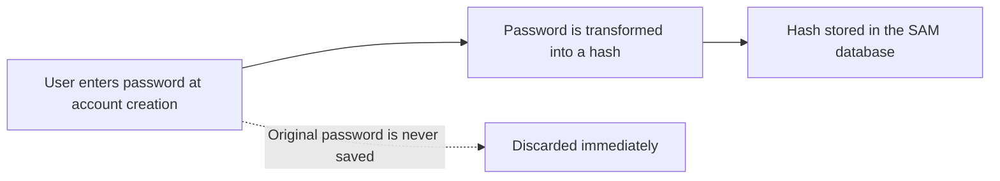
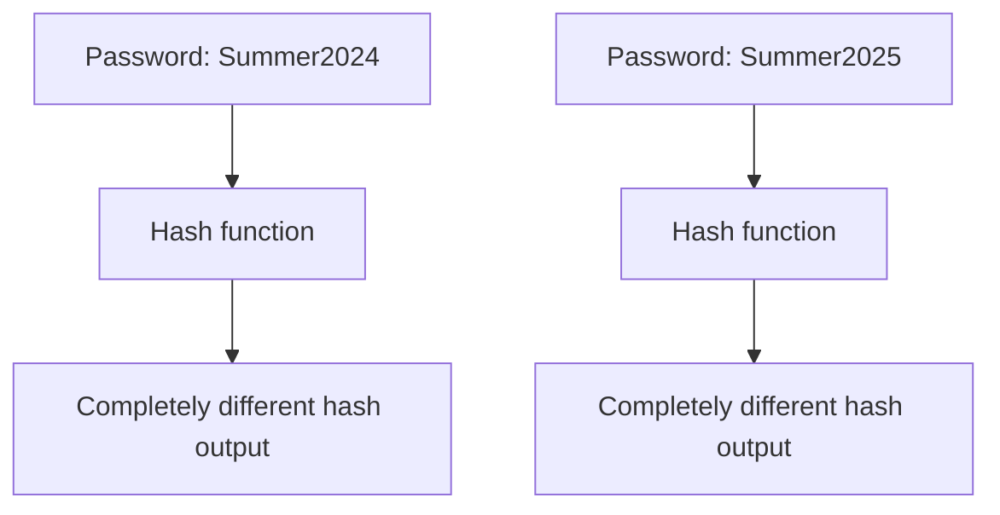
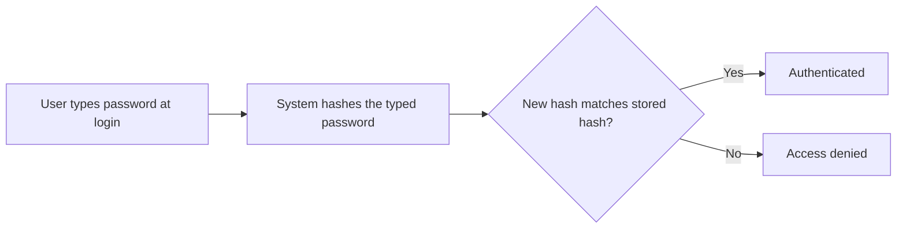
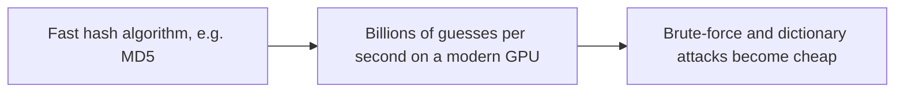
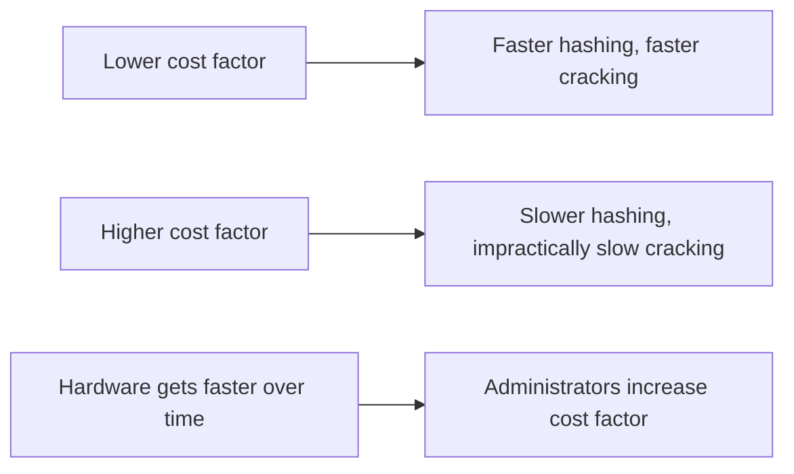
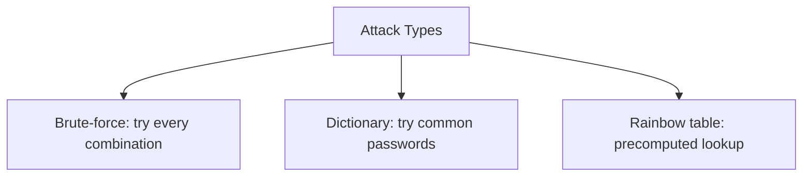
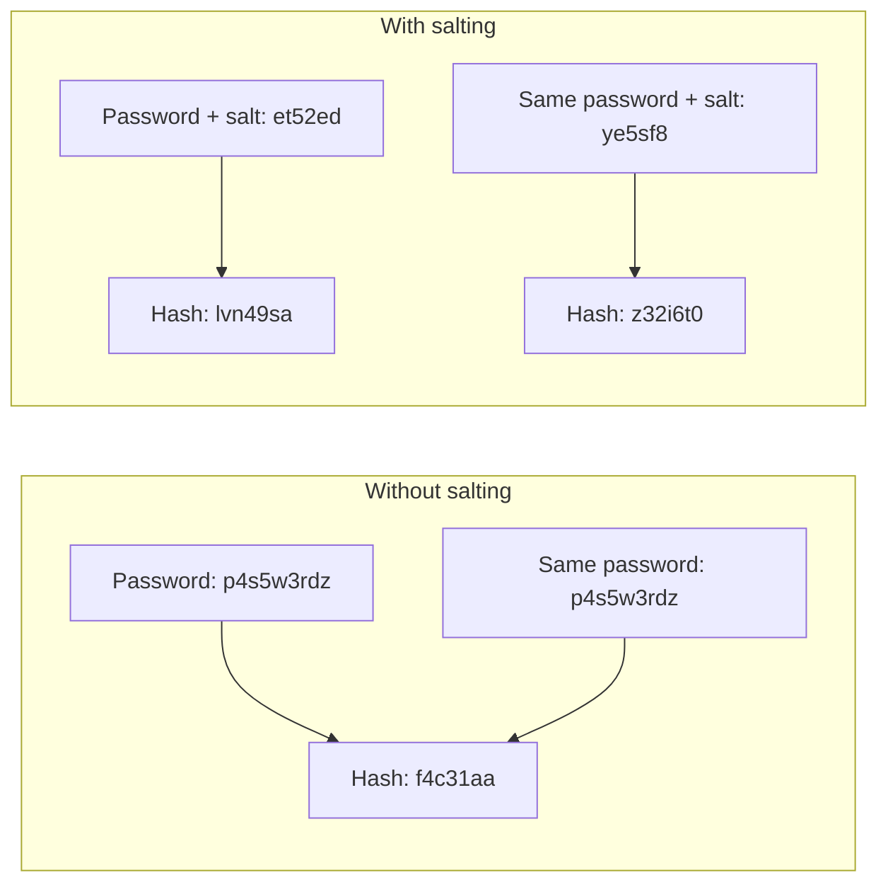
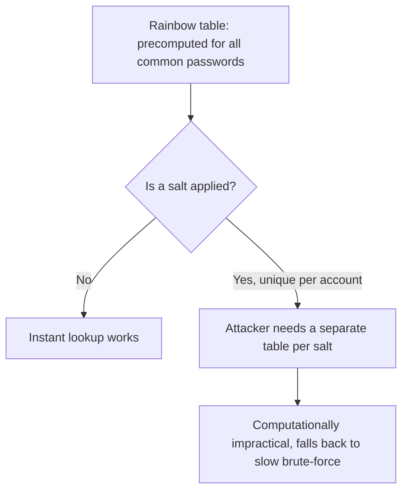
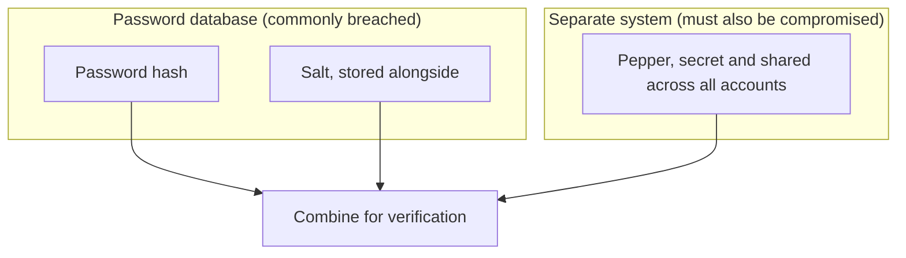

| Topic | Level | Reading Time | Prerequisites |
|---|---|---|---|
| Password Hashing, Salting, and Peppering | Intermediate | ~20 min | Group Policy and Credential Storage |

> **الهدف من الـ Section ده:**  
> هتفهم ليه الـ passwords بتتخزن كـ hash مش كنص صريح، وإيه الفرق الجوهري بين الـ hashing والـ encryption، وليه خوارزميات عامة زي MD5 خطر على الـ passwords تحديداً، وإزاي الـ salting والـ peppering بيحلوا مشاكل حقيقية في العالم الواقعي.


## Learning Objectives

By the end of this section, you will be able to:

- Explain why storing passwords in plain text is always a poor practice, and what happens instead when an account is created.
- List the four core properties every security hash function must have: **deterministic, one-way, avalanche effect, fixed output length**.
- Explain the fundamental difference between **hashing** and **encryption**, and why passwords must be hashed, never encrypted.
- Explain why fast general-purpose algorithms like **MD5** and **SHA-256** are a bad fit for passwords, and what **key stretching** means.
- Differentiate between **brute-force**, **dictionary**, and **rainbow table** attacks.
- Explain how **salting** defeats rainbow tables, and how **peppering** adds a second, independent layer of defense.

## Table of Contents

- [Learning Objectives](#learning-objectives)
- [Why Plaintext Is Dangerous](#why-plaintext-is-dangerous)
  - [The Assume-Breach Mindset](#the-assume-breach-mindset)
  - [What Happens Instead](#what-happens-instead)
- [Core Properties of a Security Hash Function](#core-properties-of-a-security-hash-function)
- [Hashing Versus Encryption](#hashing-versus-encryption)
  - [The Key Difference](#the-key-difference)
  - [Why Passwords Are Never Encrypted](#why-passwords-are-never-encrypted)
  - [How Login Actually Works](#how-login-actually-works)
- [Why Generic Algorithms Are a Bad Fit](#why-generic-algorithms-are-a-bad-fit)
  - [Speed Is the Problem](#speed-is-the-problem)
  - [Dedicated Password-Hashing Algorithms](#dedicated-password-hashing-algorithms)
  - [Key Stretching](#key-stretching)
- [Attack Types to Know](#attack-types-to-know)
- [Salting and Peppering: The Problem](#salting-and-peppering-the-problem)
  - [Identical Passwords, Identical Hashes](#identical-passwords-identical-hashes)
  - [The Salt Solution](#the-salt-solution)
  - [Salting Example Table](#salting-example-table)
- [Salting in Depth](#salting-in-depth)
  - [Why Salting Defeats Rainbow Tables](#why-salting-defeats-rainbow-tables)
  - [Salt Requirements and Storage](#salt-requirements-and-storage)
- [Peppering: The Second Layer](#peppering-the-second-layer)
  - [How a Pepper Differs from a Salt](#how-a-pepper-differs-from-a-salt)
  - [Where a Pepper Is Stored](#where-a-pepper-is-stored)
  - [Modern Best Practice](#modern-best-practice)
- [Career Path Connections](#career-path-connections)
- [Key Terms Glossary](#key-terms-glossary)
- [Summary](#summary)

## Why Plaintext Is Dangerous

### The Assume-Breach Mindset

تخزين الـ passwords كنص صريح (**plain text**) هو دايماً **ممارسة أمنية ضعيفة**.

المبدأ الأساسي هنا: **افترض إن أي نظام هيتخترق في يوم من الأيام**. لما ده يحصل، لازم يكون فيه **controls** موجودة مسبقاً تخلي الحركة الجانبية (**lateral movement**) لأنظمة تانية **أصعب بكتير**.

> [!NOTE]
> This "assume breach" mindset is the same principle underlying Zero Trust, covered in the Zero Trust Model file. Password hashing is one of the most basic, oldest practical applications of that same assumption.

### What Happens Instead

لكل السبب ده، الـ passwords **مابتتخزنش كنص صريح**، لكن بتتحول لـ **hashed values** قبل التخزين.

لما account يتعمل، الـ password اللي اتكتب **بيتحول لـ hash**، وهو اللي بيتخزن في قاعدة بيانات الـ **SAM**. الـ password الأصلي **مابيتحفظش أبداً**.

```text
Path: C:\Windows\System32\config\SAM
```



> [!IMPORTANT]
> The original password is never saved, anywhere, under normal operation. Only the hash persists. This single fact is why even a full database leak does not hand an attacker the plaintext passwords directly.

## Core Properties of a Security Hash Function

أي hash function بتتستخدم لأغراض أمنية **لازم** يكون عندها الخواص الأربعة دي:

| Property | Meaning |
|---|---|
| **Deterministic** | نفس الـ input دايماً بينتج نفس الـ output |
| **One-way** | يكون **غير ممكن حسابياً** إنك ترجع الـ hash للـ password الأصلي |
| **Avalanche effect** | تغيير حرف واحد بس في الـ password بينتج hash **مختلف تماماً**، وده بيمنع المهاجم من تخمين الأنماط |
| **Fixed output length** | بغض النظر عن طول الـ password، حجم الـ hash output بيفضل **ثابت** (مثلاً MD5 دايماً بينتج 128 bit) |



> [!TIP]
> The avalanche effect is easy to verify yourself: hash two nearly identical strings (differing by one character) with any hash function online or in a terminal, and compare the outputs. They will look completely unrelated, with no visible pattern connecting them.

## Hashing Versus Encryption

### The Key Difference

**Encryption قابل للعكس بمفتاح**؛ الـ **hashing مش قابل للعكس خالص**.

### Why Passwords Are Never Encrypted

الـ passwords **مفروض ماتتشفرش أبداً** للتخزين؛ هي المفروض تتعمل لها hash. السبب: **لو مهاجم سرق مفتاح التشفير**، كل الـ passwords **بترجع فوراً** لشكلها الأصلي.

مع الـ hashing، **مفيش مفتاح يتسرق أصلاً**؛ المهاجم مضطر **يخمّن password ويعمله hash ويقارن النتيجة**.

| Approach | Reversible? | Risk If Stolen |
|---|---|---|
| Encryption | نعم، بمفتاح | سرقة المفتاح = استرجاع كل الـ passwords فوراً |
| Hashing | لأ، نهائياً | المهاجم مضطر يخمّن ويعمل hash لكل محاولة |

### How Login Actually Works

لما المستخدم يدخل، النظام **مابيقارنش** الـ password المكتوب مع password مخزّن مباشرة. هو بيعمل hash لللي اتكتب، وبيقارن الـ hash الجديد ده مع الـ hash المخزّن. لو اتطابقوا، المستخدم بيتوثّق.



وبسبب ده، **حتى الـ administrators** بتوع موقع معين **مايقدروش يشوفوا password المستخدم**؛ هما بس بيشوفوا الـ hash.

> [!IMPORTANT]
> If a "customer support" process ever offers to "look up" or "resend" your original password instead of resetting it, that is a red flag. A system following proper hashing practice structurally cannot retrieve your original password, even if it wanted to.

## Why Generic Algorithms Are a Bad Fit

### Speed Is the Problem

خوارزميات زي **MD5** و**SHA-256** عندها نقط ضعف معروفة (زي الـ **hash collisions** في MD5)، ومع ده MD5 لسه بيتستخدم لـ **integrity checksums**.

الخوارزميات دي **مصممة تكون سريعة**، وده مفيد لـ checksums وفحص سلامة الملفات، لكنه **سيء جداً للـ passwords تحديداً**، لأن **السرعة بتساعد المهاجم**.

**GPU حديث** يقدر يحسب **مليارات الـ MD5 hashes في الثانية**، وده بيخلي هجمات الـ **brute-force** و**dictionary attacks** سريعة ورخيصة.



### Dedicated Password-Hashing Algorithms

لهذا السبب، فيه خوارزميات **مخصصة لتخزين الـ passwords**:

| Algorithm | Note |
|---|---|
| **bcrypt** | واسع الانتشار، أقدم نسبياً |
| **scrypt** | مصمم ليكون memory-hard بالإضافة للبطء |
| **Argon2** | يُعتبر حالياً **الأقوى**، فاز بـ **2015 Password Hashing Competition** |

### Key Stretching

الخوارزميات دي **بطيئة عن قصد**، وبتستخدم **cost factor قابل للضبط**، وهو إعداد بيتحكم في عدد **جولات الحساب** المنفذة.

مع زيادة سرعة الأجهزة بمرور الوقت، الـ administrators بيزودوا الـ cost factor، عشان **كسر الـ hash يفضل بطيء بشكل غير عملي**. المفهوم ده اسمه **key stretching**.



> [!TIP]
> Key stretching is a moving target by design. A cost factor considered strong today will not stay strong forever as hardware improves; this is why dedicated password-hashing algorithms expose a tunable cost factor rather than a fixed one.

## Attack Types to Know

| Attack | How It Works |
|---|---|
| **Brute-force attack** | تجربة كل تركيبة ممكنة من الحروف لحد ما الـ hash يتطابق |
| **Dictionary attack** | تجربة قايمة passwords شائعة بدل تركيبات عشوائية، لأن معظم الناس بتستخدم passwords يسهل توقعها |
| **Rainbow table** | جدول محسوب مسبقاً لقيم الـ hash لمجموعات ضخمة من الـ passwords المحتملة، بيسمح للمهاجم **يدور على الـ hash فوراً** بدل ما يحسبه حياً |



> [!IMPORTANT]
> The rainbow table is the direct motivation for salting, covered in the next section. Understanding why a precomputed lookup table works is the key to understanding why salting defeats it so effectively.

## Salting and Peppering: The Problem

### Identical Passwords, Identical Hashes

السؤال اللي بيفتح الموضوع: **إيه اللي بيحصل لو فيه حسابات مختلفة بنفس الـ password بالظبط؟**

ده خطير، لأنه **لو مهاجم كسر hash واحد، هو بيعرف فوراً password كل مستخدم تاني شارك نفس الـ hash**.

### The Salt Solution

الهدف: نضمن إن **مفيش قيمتين مخزّنتين متطابقتين**، حتى لو المستخدمين اختاروا نفس الـ password بالظبط. ده بيتحقق بإضافة **Salt**.

**Salt** هو **قيمة نصية عشوائية** بتتضاف للـ password **قبل** عملية الـ hashing؛ وبعدين بتتخزن **جنب** قيمة الـ hash (وممكن تتسرق كمان، لأنها مش سرية أصلاً).

> [!NOTE]
> If a salt is kept secret and stored in a secure location separately, it is called a **Pepper**. This distinction between a public salt and a secret pepper is explored in full later in this file.

### Salting Example Table

| | User (no salt) | Attacker (no salt) | User (salted) | Attacker (salted) |
|---|---|---|---|---|
| Password | `p4s5w3rdz` | `p4s5w3rdz` | `p4s5w3rdz` | `p4s5w3rdz` |
| Salt | – | – | `et52ed` | `ye5sf8` |
| Hash | `f4c31aa` | `f4c31aa` | `lvn49sa` | `z32i6t0` |

بدون salting: **passwords متطابقة بتنتج hashes متطابقة**، ظاهرة بمجرد نظرة.

مع salting: **passwords متطابقة بتنتج hashes مختلفة تماماً**، لأن كل واحدة اتدمجت مع قيمة عشوائية فريدة أولاً.



## Salting in Depth

### Why Salting Defeats Rainbow Tables

الـ **rainbow table** مفيد بس **لو المهاجم يقدر يحسب الـ hashes مرة واحدة ويعيد استخدامها ضد حسابات كتير**.

بمجرد ما **كل password يكون عنده salt عشوائي فريد** قبل الـ hashing، المهاجم **محتاج rainbow table منفصل تماماً لكل قيمة salt**، وده **مستحيل عملياً من الناحية الحسابية**.

ده بيجبر المهاجم يرجع لـ **brute-forcing بطيء لكل حساب على حدة**، بدل الـ lookup الفوري.



### Salt Requirements and Storage

| Requirement | Detail |
|---|---|
| Secrecy | الـ salts **مش لازم تكون سرية**؛ بتتخزن عادةً **جنب الـ hash** في نفس الـ record |
| Uniqueness | لازم تكون **فريدة لكل password/مستخدم**، **مينفعش تتكرر** عبر الحسابات أبداً |
| Length | يُفضَّل تكون **طويلة بما يكفي** (شائع: **16 byte / 128 bit**) |
| Generation | لازم تتولّد باستخدام **cryptographically secure random number generator**، مش counter متوقع أو تسلسل عادي |

> [!WARNING]
> Reusing a salt across accounts, or generating salts predictably (e.g., an incrementing counter), defeats the entire purpose of salting. A reused or predictable salt brings back exactly the rainbow table risk salting was designed to eliminate.

## Peppering: The Second Layer

### How a Pepper Differs from a Salt

على عكس الـ salt، الـ **pepper** هو **نفس القيمة السرية** المطبقة على **كل الـ passwords** (مش فريدة لكل مستخدم).

| Aspect | Salt | Pepper |
|---|---|---|
| Uniqueness | فريد لكل مستخدم | نفس القيمة لكل الحسابات |
| Secrecy | مش سري، بيتخزن جنب الـ hash | **سري**، ومخزّن بشكل منفصل |
| Storage location | في الـ database record نفسه | غالباً في كود الـ application، environment variable، أو **HSM** |

### Where a Pepper Is Stored

الـ pepper بيتخزن **منفصل تماماً** عن قاعدة بيانات الـ passwords، غالباً في **application source code**، أو **environment variable**، أو **Hardware Security Module (HSM)**.



**الغرض:** لو مهاجم سرق **بس قاعدة بيانات الـ passwords** (سيناريو شائع جداً في الاختراقات)، لسه **مش معاه الـ pepper**، فمش هيقدر يعمل محاولة **offline cracking** صحيحة.

الـ pepper بيشتغل كـ **سر ثاني ومستقل** يحتاج اختراق **نظام مختلف تماماً** عشان يتحصل عليه.

> [!IMPORTANT]
> The pepper's value comes entirely from being stored somewhere structurally different from the password database. If the pepper sits in the same database as the hashes and salts, it provides no additional protection, because the same breach that exposes one exposes the other.

### Modern Best Practice

الممارسة الحديثة: خوارزميات زي **bcrypt** و**Argon2** **بتدمج الـ salting أوتوماتيك** كجزء من الخوارزمية نفسها. الـ **peppering** لسه حاجة الـ developers بيضيفوها **يدوياً على مستوى الـ application** كطبقة دفاع إضافية.

| Mechanism | Built Into Modern Algorithms? |
|---|---|
| Salting | نعم، تلقائي في bcrypt وArgon2 |
| Peppering | لأ، بيتضاف يدوياً على مستوى الـ application |

## Career Path Connections

| Career Path | How This topic applies |
|---|---|
| SOC Analyst | Recognizes the severity difference between a leaked hash database with proper salting versus one without |
| Penetration Tester | Attempts rainbow table and dictionary attacks against captured hashes, where applicable and authorized |
| GRC | Password storage standards (algorithm choice, cost factor, salting) are a direct, auditable security control |
| Cloud Security | Cloud identity providers and secrets managers implement salting, peppering (via HSM-backed secrets), and key stretching natively |

## Key Terms Glossary

| Term | Definition |
|---|---|
| Hash | A one-way, fixed-length transformation of input data, used to store passwords without saving the original |
| Deterministic | A property where the same input always produces the same output |
| One-Way | A property where reversing a hash back to the original input is computationally infeasible |
| Avalanche Effect | A property where a tiny input change produces a completely different output |
| Encryption | A reversible transformation of data that requires a key to recover the original |
| Key Stretching | Deliberately slowing a hash algorithm via a configurable cost factor to resist brute-force attacks |
| Brute-Force Attack | Trying every possible character combination until a hash matches |
| Dictionary Attack | Trying a list of common passwords instead of random combinations |
| Rainbow Table | A precomputed table of hash values enabling instant lookup instead of live computation |
| Salt | A random value added to a password before hashing, stored alongside the hash, not secret |
| Pepper | A secret value applied to all passwords, stored separately from the password database |
| HSM | Hardware Security Module, a dedicated device for securely storing cryptographic secrets |

## Summary

- **Plaintext passwords are never acceptable:** الـ assume-breach mindset بيفترض إن النظام هيتخترق يوماً ما، فالـ hashing لازم يكون موجود مسبقاً.
- **A security hash must be deterministic, one-way, have an avalanche effect, and produce fixed-length output.**
- **Hashing and encryption solve different problems:** التشفير قابل للعكس بمفتاح، والـ hashing مش قابل للعكس خالص، ولذلك الـ passwords بتتعمل لها hash مش تشفير.
- **Fast algorithms like MD5 and SHA-256 are dangerous for passwords specifically:** السرعة اللي مفيدة للـ checksums بتساعد المهاجم في brute-forcing.
- **Dedicated algorithms (bcrypt, scrypt, Argon2) are deliberately slow:** بفضل cost factor قابل للضبط، ومفهوم key stretching.
- **Three core attacks threaten weak password storage:** brute-force، dictionary، وrainbow tables.
- **Salting makes identical passwords produce different hashes:** وبيجبر المهاجم على برute-forcing بطيء بدل الـ lookup الفوري.
- **Peppering adds a second, independent secret:** مخزّن في مكان منفصل تماماً، فسرقة قاعدة بيانات الـ passwords وحدها مش كافية.

