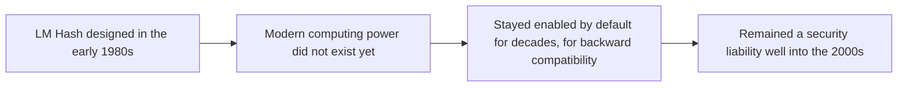
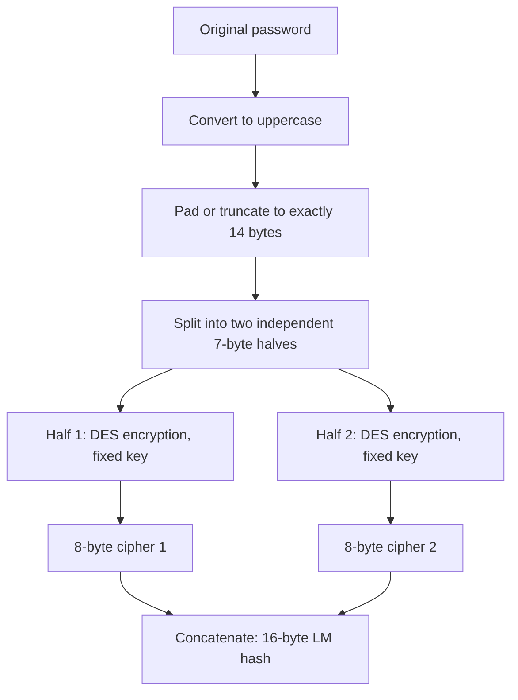
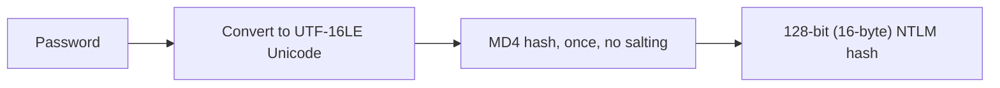
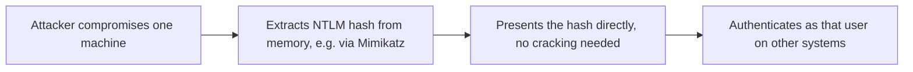
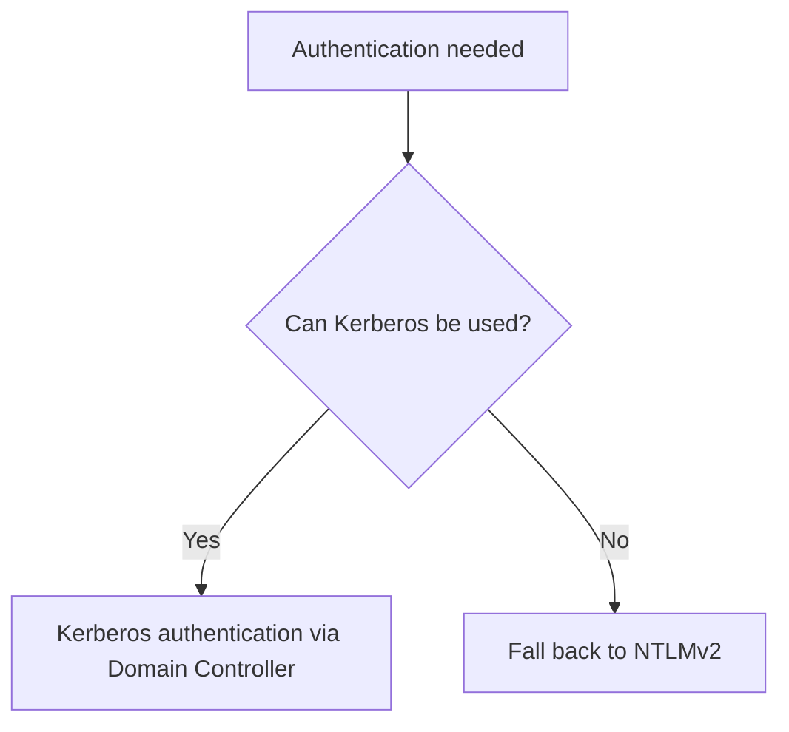
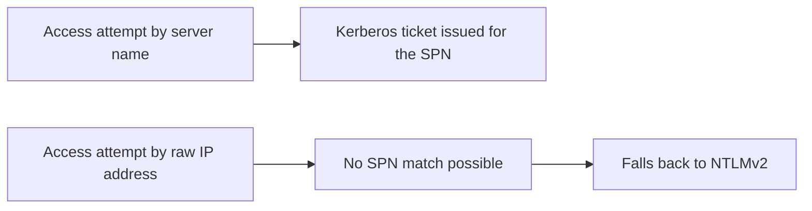
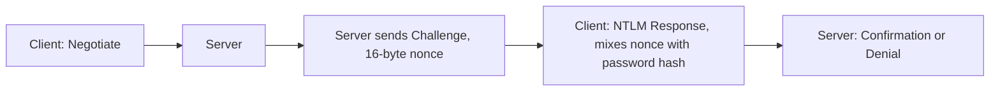
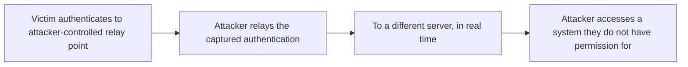
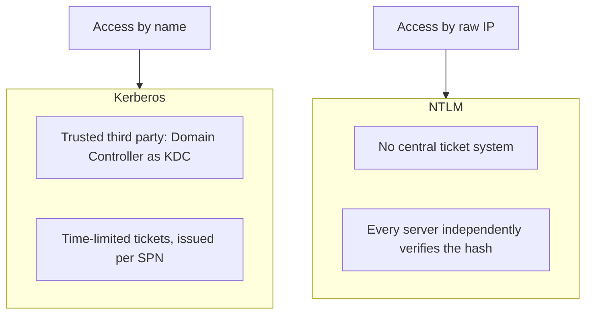

| Topic | Level | Reading Time | Prerequisites |
|---|---|---|---|
| Windows Authentication Hashes: LM, NTLM, and NTLMv2 | Intermediate | ~25 min | Password Hashing, Salting, and Peppering, Active Directory Core Concepts |

> **الهدف من الـ Section ده:**  
> هتفهم إزاي Windows اتطور عبر عقود في تخزين وفحص الـ passwords، من الـ LM Hash الضعيف جداً، لحد NTLMv2، وهتفهم ليه الشبكات الحديثة بتفضّل Kerberos كلما أمكن، وNTLM بيفضل موجود كـ fallback.

## Learning Objectives

By the end of this section, you will be able to:

- Explain the historical origin of **LM Hash** and describe step by step why its design makes it trivially weak today.
- Explain how **NTLM Hash** improved on LM, and why it is still vulnerable to **rainbow tables** and **Pass-the-Hash** attacks.
- Describe the **NTLMv2 Challenge-Response** process from Negotiate to Confirmation/Denial.
- Explain why **Kerberos** is preferred over NTLM, and the specific technical reason (name resolution and SPNs) that forces a fallback to NTLM.
- List concrete mitigations against NTLM relay attacks: **SMB/LDAP Signing**, **EPA**, and disabling legacy protocols via Group Policy.

## Table of Contents

- [Learning Objectives](#learning-objectives)
- [LM Hash: Background](#lm-hash-background)
  - [Origin and Why It Persisted](#origin-and-why-it-persisted)
- [LM Hash: How It Works and Why It Is Weak](#lm-hash-how-it-works-and-why-it-is-weak)
  - [The Step-by-Step Process](#the-step-by-step-process)
  - [Why Splitting the Password Is Catastrophic](#why-splitting-the-password-is-catastrophic)
  - [Practical Implication](#practical-implication)
- [NTLM Hash: Introduction](#ntlm-hash-introduction)
  - [What NTLM Fixed](#what-ntlm-fixed)
- [NTLM Hash: Computation and Weaknesses](#ntlm-hash-computation-and-weaknesses)
  - [How It Is Computed](#how-it-is-computed)
  - [Improvements Over LM](#improvements-over-lm)
  - [Why NTLMv1 Is Still Weak](#why-ntlmv1-is-still-weak)
  - [Pass-the-Hash](#pass-the-hash)
- [NTLMv2: Why It Was Created](#ntlmv2-why-it-was-created)
  - [Kerberos as the Preferred Protocol](#kerberos-as-the-preferred-protocol)
- [NTLMv2: Why Kerberos Is Not Always Used](#ntlmv2-why-kerberos-is-not-always-used)
  - [The Name Resolution Requirement](#the-name-resolution-requirement)
- [NTLMv2: Challenge-Response Process](#ntlmv2-challenge-response-process)
  - [The Four Steps](#the-four-steps)
- [NTLMv2: Completing Authentication](#ntlmv2-completing-authentication)
  - [How the Server Verifies the Response](#how-the-server-verifies-the-response)
  - [What Makes NTLMv2 Stronger Than NTLMv1](#what-makes-ntlmv2-stronger-than-ntlmv1)
- [NTLMv2: Remaining Vulnerabilities and Mitigations](#ntlmv2-remaining-vulnerabilities-and-mitigations)
  - [NTLM Relay Attacks](#ntlm-relay-attacks)
  - [Mitigations](#mitigations)
- [Kerberos Versus NTLM: Summary Comparison](#kerberos-versus-ntlm-summary-comparison)
- [Career Path Connections](#career-path-connections)
- [Key Terms Glossary](#key-terms-glossary)
- [Summary](#summary)

## LM Hash: Background

### Origin and Why It Persisted

**LM (LAN Manager) hash** كان بيستخدم لتحويل الـ passwords لـ hash values، وبعدين تخزينها في قاعدة بيانات **SAM**، وده من تصميم **Microsoft**.

الـ LM اتصمم في **أوائل الثمانينات** لبرنامج **LAN Manager** الأصلي، **قبل ما القوة الحاسوبية الحديثة تكون موجودة بوقت طويل جداً**. ومع ذلك، فضل **مُفعّل افتراضياً في Windows لعقود**، بسبب التوافق مع الأنظمة القديمة (**backward compatibility**)، وده السبب في إنه فضل **خطر أمني حقيقي لحد أواخر الألفينات**.

> [!NOTE]
> This connects directly to the dedicated password-hashing algorithms (bcrypt, scrypt, Argon2) covered in the previous file. LM Hash is a historical example of exactly the opposite design philosophy: fast, structurally weak, and never updated for decades.

## LM Hash: How It Works and Why It Is Weak

### The Step-by-Step Process

- حوّل الـ password لـ **حروف كبيرة (uppercase)** بالكامل.
- **Pad** (لو أقل من 14 byte) و**truncate** (لو أكتر من 14 byte) لحد ما يوصل بالظبط لـ **14 byte**.
- اقسم الناتج لـ **نصفين مستقلين، كل واحد 7 byte**.
- كل نص بيتشفر منفصل باستخدام خوارزمية **DES** القديمة بمفتاح ثابت، وده بينتج **ciphers بحجم 8 byte لكل نص**.
- الاتنين **8-byte ciphers** بيتلزقوا مع بعض (**concatenated**) ليكوّنوا الـ **LM hash النهائي بحجم 16 byte**.

### Why Splitting the Password Is Catastrophic

**Password123** و**PASSWORD123** بينتجوا **نفس الـ hash بالظبط**، لأن كل الـ password بيتحول لحروف كبيرة قبل الـ hashing، وده **بيطبّق مساحة الحروف الممكنة (character space)**.

وبسبب إن النصفين بيتعملهم hash **بشكل مستقل تماماً**، المهاجم يقدر **يكسر كل نص 7-byte لوحده**، بدل الـ password كامل بطول 14 حرف دفعة واحدة، وده **بيقلل مساحة البحث (keyspace) الفعلية بشكل هائل**.

لو الـ password **7 حروف أو أقل**، النص التاني بيتحول لقيمة **padding ثابتة ومعروفة**، وده **بيكشف فوراً** إن الـ password قصير.

| Weakness | Consequence |
|---|---|
| تحويل لحروف كبيرة | يقلل مساحة التخمين بشكل كبير |
| تقسيم لنصفين مستقلين | كسر 7 بايت x2 أسهل بكتير من كسر 14 حرف دفعة واحدة |
| Padding للـ passwords القصيرة | يكشف طول الـ password فوراً |

### Practical Implication

الـ LM hashes ممكن **تتكسر في ثواني لدقائق** بأدوات حديثة، لأن مساحة البحث المقلّصة بتخلي **rainbow tables مخصصة فعالة جداً**.

**Microsoft عطّلت تخزين LM hash افتراضياً** بدءاً من **Windows Vista** و**Server 2008**.

> [!IMPORTANT]
> LM Hash is the historical object lesson in why "deterministic, one-way, avalanche effect, fixed output length" alone is not enough: a hash function must also resist being decomposed into smaller, independently crackable pieces. LM Hash violated this by design.

## NTLM Hash: Introduction

### What NTLM Fixed

**NTLM** بقى **الخليفة** للـ LM hashes، اتصمم يحل نقط ضعف LM.

هو بيستخدم خوارزمية **MD4** الأقوى. وغطّى بعض نقط ضعف LM، بما فيها **حد الـ 14 حرف** وغياب **التفرقة بين الحروف الكبيرة والصغيرة**.

**NTLMv1 لسه ضعيف** وقابل للكسر بهجمات زي **rainbow tables**.

## NTLM Hash: Computation and Weaknesses

### How It Is Computed

الـ password بيتحول لـ **Unicode (UTF-16LE)**، وبيمر على خوارزمية **MD4** **مرة واحدة بالظبط**، **من غير أي salting**، وبينتج hash بحجم **128 bit (16 byte)**.

### Improvements Over LM

| Improvement | Detail |
|---|---|
| حفظ الـ case sensitivity | مفيش تحويل لحروف كبيرة |
| إلغاء التقسيم لـ 14 حرف | الـ password بيتعمله hash كامل دفعة واحدة |
| دعم Unicode كامل | LM كان مقتصر على مجموعة حروف محددة |

### Why NTLMv1 Is Still Weak

- **مفيش salting خالص**: passwords متطابقة عبر حسابات مختلفة بتنتج **نفس الـ hash بالظبط**، وده بيخلي **rainbow tables فعالة**.
- **MD4 خوارزمية مكسورة ومهجورة**، بها نقط ضعف cryptanalytic معروفة (الـ collisions ممكن تتولّد بسرعة).

### Pass-the-Hash

بما إن مصادقة Windows تاريخياً كانت **محتاجة بس الـ hash** (مش الـ plaintext password) عشان تتحقق، **مهاجم سرق NTLM hash من الذاكرة** (باستخدام أدوات زي **Mimikatz**) **مش محتاج حتى يكسره**؛ هو يقدر **يقدّم الـ hash مباشرة** عشان يتوثّق كـ هذا المستخدم على أنظمة تانية.

ده واحدة من **أكتر تقنيات الـ lateral movement شيوعاً** في هجمات شبكات Windows الواقعية.

> [!WARNING]
> Pass-the-Hash means that cracking the password is not even necessary for lateral movement. The hash itself functions as a usable credential. This is why protecting memory (where hashes are cached) and limiting NTLM usage are both treated as critical defenses.

## NTLMv2: Why It Was Created

بما إن **NTLMv1 كان عرضة لـ rainbow tables**، Microsoft طوّرت آلية أقوى لتخزين والمصادقة باستخدام الـ password hashes: **NTLMv2**.

### Kerberos as the Preferred Protocol

معظم المؤسسات النهاردة بتتوثّق باستخدام **Kerberos authentication** في بيئة **Active Directory**. السيرفر المسؤول عن المصادقة دي هو **Domain Controller**.

لما **Kerberos مايكونش ممكن**، Windows **بيرجع (fall back)** لاستخدام **NTLMv2** للمصادقة.

## NTLMv2: Why Kerberos Is Not Always Used

### The Name Resolution Requirement

**Kerberos محتاج أسماء (names) عشان يشتغل**؛ لو مفيش اسم، Kerberos **مايقدرش يُستخدم**.

مثال: file share على server بعيد ليه **اسم بيترجم لـ IP address**. الوصول العادي للـ share بيستخدم **اسم السيرفر أو الـ IP بتاعه**.

لو حد وصل للـ share **باستخدام الـ IP address بدل اسم السيرفر**، **Kerberos مايقدرش يُستخدم**، وWindows **بينزل (downgrades)** لمصادقة **NTLMv2**.

**تفصيل تقني إضافي:** تذاكر Kerberos بتتصدر لـ **Service Principal Name (SPN)** محدد، **مش لعنوان IP**؛ ده **بالظبط** السبب في إن ترجمة الأسماء (**name resolution**) مهمة جداً عشان Kerberos يشتغل.

> [!NOTE]
> This is the same underlying principle as the TLS certificate mismatch covered in the DNS Sinkhole file: a certificate is bound to a domain name, not an IP, and a Kerberos ticket is bound to a service name, not an IP. Both protocols fail, or fall back, when identity is tied to a name that a raw IP connection cannot provide.

## NTLMv2: Challenge-Response Process

### The Four Steps

- الجهاز بيبعت طلب مصادقة اسمه **Negotiate** لسيرفر المصادقة.
- حزمة الـ negotiation دي بتقول للسيرفر **أنهي إصدار وparameters للمصادقة يتستخدموا**.
- السيرفر بعد كده بيبعت **Challenge** للـ client.
- الـ challenge، واللي بيتسمى كمان **nonce**، هو رقم عشوائي بحجم **16 byte**.
- الـ client بياخد الـ nonce ده ويمزجه (عن طريق حسابات رياضية/تشفيرية) مع الـ **password hash** عشان يولّد **response**.

## NTLMv2: Completing Authentication

### How the Server Verifies the Response

الـ response بيترجع للسيرفر. بما إن السيرفر **أصلاً عارف password hash المستخدم**، هو **بيحسب الـ response الخاص بيه بشكل مستقل** باستخدام نفس الـ nonce، ويقارنه مع الـ response الوارد. لو اتطابقوا، المستخدم بيتوثّق بنجاح.

### What Makes NTLMv2 Stronger Than NTLMv1

**تفصيل تقني:** NTLMv2 بيستخدم **HMAC-MD5** بدل MD4 الخام، وبيدمج داتا إضافية في الـ response بعيداً عن الـ nonce بس، بما فيها **timestamp**، و**nonce مولّد من الـ client**، ومعلومات **السيرفر المستهدف**. الداتا الإضافية دي بتخلي **replay attacks** والـ precomputation على طريقة rainbow tables **أصعب بكتير** مقارنة بـ NTLMv1.

بما إن الـ **password/hash الفعلي مابيعديش الشبكة مباشرة**، شخص بيلتقط الـ traffic (**eavesdropper**) **مش هيقدر يستخرج الـ password فوراً**.

| Aspect | NTLMv1 | NTLMv2 |
|---|---|---|
| Hash algorithm used | MD4 raw | HMAC-MD5 |
| Extra data in response | Nonce only | Timestamp + client nonce + target server info |
| Replay resistance | Weak | Much stronger |
| Rainbow table precomputation | Effective | Far harder |

> [!TIP]
> The additional data NTLMv2 incorporates (timestamp, client nonce, server info) is conceptually similar to why a nonce exists at all: it ties each authentication exchange to a specific, non-repeatable context, making captured traffic far less reusable by an attacker.

## NTLMv2: Remaining Vulnerabilities and Mitigations

### NTLM Relay Attacks

بدل محاولة كسر الـ response، مهاجم موجود **في النص (positioned in the middle)** بيعمل **relay** لمحاولة مصادقة ملتقطة لسيرفر تاني **في الوقت الفعلي**، وبالفعل بـ**"يستعير"** مصادقة الضحية عشان يوصل لنظام المهاجم مش مصرحله يوصله.

أدوات شائعة: **Responder**، **ntlmrelayx**.

**الـ offline cracking لسه ممكن نظرياً** لو مهاجم التقط **challenge-response exchange كامل** وعنده قوة حوسبة كبيرة، رغم إنه **أصعب بكتير** من كسر NTLMv1.

### Mitigations

| Mitigation | What It Does |
|---|---|
| **SMB Signing و LDAP Signing** | يوقّع كل رسالة تشفيرياً، بحيث session مُعاد توجيهها (relayed) يتكتشف ويترفض |
| **Extended Protection for Authentication (EPA)** | بيربط المصادقة بـ **قناة TLS محددة** اتفاوض عليها، ويمنع الـ relay لقناة مختلفة |
| **تعطيل NTLM بالكامل حيث ممكن** | وفرض **Kerberos-only authentication** في Active Directory |
| **تعطيل LM وNTLMv1 عن طريق Group Policy** | إعداد: **Network security: LAN Manager authentication level** — بيسيب NTLMv2 بس كـ fallback |

> [!IMPORTANT]
> Even NTLMv2's strongest protections do not eliminate relay attacks; they only make cracking the captured response harder. Relay attacks sidestep cracking entirely by reusing the authentication attempt itself in real time, which is why signing and channel-binding (EPA) are the actual mitigations, not stronger hashing.

## Kerberos Versus NTLM: Summary Comparison

| Aspect | Kerberos | NTLM |
|---|---|---|
| Trust model | Third-party موثوق (Domain Controller بيشتغل كـ **Key Distribution Center**) | مفيش نظام تذاكر مركزي |
| Verification | تذاكر محدودة المدة (**time-limited tickets**)، مفيش حاجة تبعت داتا مشتقة من الـ password في كل طلب | كل سيرفر الـ client بيكلمه لازم **يعرف أو يتحقق من الـ password hash بشكل مستقل** |
| Scalability | مناسب للشبكات الكبيرة | نقطة ضعف هيكلية في الشبكات الكبيرة |
| Identifier used | **Service Principal Name (SPN)** | عادةً IP أو اسم جهاز، بدون تذكرة |
| Why name resolution matters | تذاكر Kerberos **بتتصدر لـ SPN محدد، مش IP** | بدون SPN، النظام **يرجع (downgrades)** لـ NTLM |

> [!IMPORTANT]
> Kerberos avoids sending password-derived material for every single authentication request, which is both more secure and more scalable. NTLM's lack of a centralized ticket system is a structural weakness for large networks, not just a cryptographic one: every single server must independently trust and verify the hash.

## Career Path Connections

| Career Path | How This Topic Applies |
|---|---|
| SOC Analyst | Monitors for Pass-the-Hash indicators and unexpected NTLM authentication where Kerberos should be used |
| Penetration Tester | NTLM relay (via tools like Responder and ntlmrelayx) and Pass-the-Hash are core techniques in internal Active Directory assessments |
| GRC | Disabling LM/NTLMv1 via Group Policy is a standard, auditable hardening requirement |
| Cloud Security | Hybrid identity environments (cloud plus on-premises AD) must account for legacy NTLM fallback on internal resources |

## Key Terms Glossary

| Term | Definition |
|---|---|
| LM Hash | The original, deeply weak Windows password hash from the 1980s, disabled by default since Windows Vista/Server 2008 |
| NTLM Hash | A successor to LM Hash using MD4, with no salting |
| Pass-the-Hash | An attack where a stolen hash is presented directly for authentication without ever being cracked |
| NTLMv2 | An improved challenge-response authentication mechanism replacing NTLMv1 |
| Nonce | A random, single-use number (16 bytes in NTLMv2) used in a challenge-response exchange |
| Kerberos | A ticket-based authentication protocol using a trusted third party, typically the Domain Controller |
| Key Distribution Center (KDC) | The Domain Controller's role when issuing Kerberos tickets |
| Service Principal Name (SPN) | The specific service identifier a Kerberos ticket is issued for |
| NTLM Relay Attack | Forwarding a captured authentication attempt to a different server in real time, rather than cracking it |
| SMB/LDAP Signing | Cryptographically signing messages to detect and reject relayed sessions |
| Extended Protection for Authentication (EPA) | Binding authentication to the specific TLS channel it was negotiated over |

## Summary

- **LM Hash is historically weak by design:** تحويل لحروف كبيرة، تقسيم لنصفين 7-byte، وDES بمفتاح ثابت، كل ده قلّل مساحة البحث بشكل هائل.
- **NTLM improved on LM but kept no salting:** passwords متطابقة بتنتج نفس الـ hash، وMD4 نفسه خوارزمية مكسورة.
- **Pass-the-Hash skips cracking entirely:** الـ hash نفسه بيشتغل كـ credential قابل للاستخدام المباشر.
- **NTLMv2 adds real improvements:** HMAC-MD5، وبيانات إضافية (timestamp, client nonce, server info) بتصعّب الـ replay والـ precomputation.
- **Kerberos is preferred, with Domain Controller as KDC:** تذاكر محدودة المدة، تحقق لمرة واحدة، مش لكل سيرفر على حدة.
- **Name resolution is the technical reason for NTLM fallback:** تذاكر Kerberos مرتبطة بـ SPN، مش IP؛ الوصول بالـ IP بيجبر النزول لـ NTLMv2.
- **NTLM relay remains a real threat even with NTLMv2:** الدفاع الحقيقي هو SMB/LDAP Signing وEPA، مش قوة الـ hashing نفسها.
- **The structural difference matters at scale:** Kerberos مركزي وقابل للتوسع، NTLM بيحتاج كل سيرفر يتحقق بشكل مستقل، وده نقطة ضعف هيكلية في الشبكات الكبيرة.
