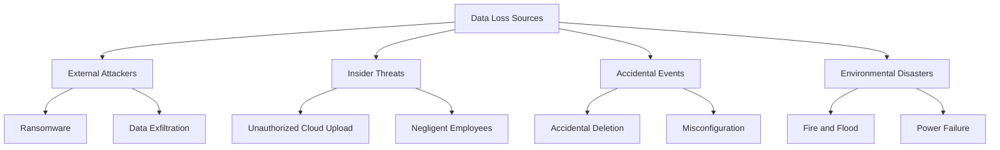
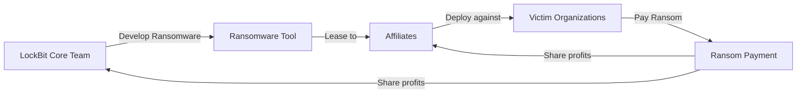
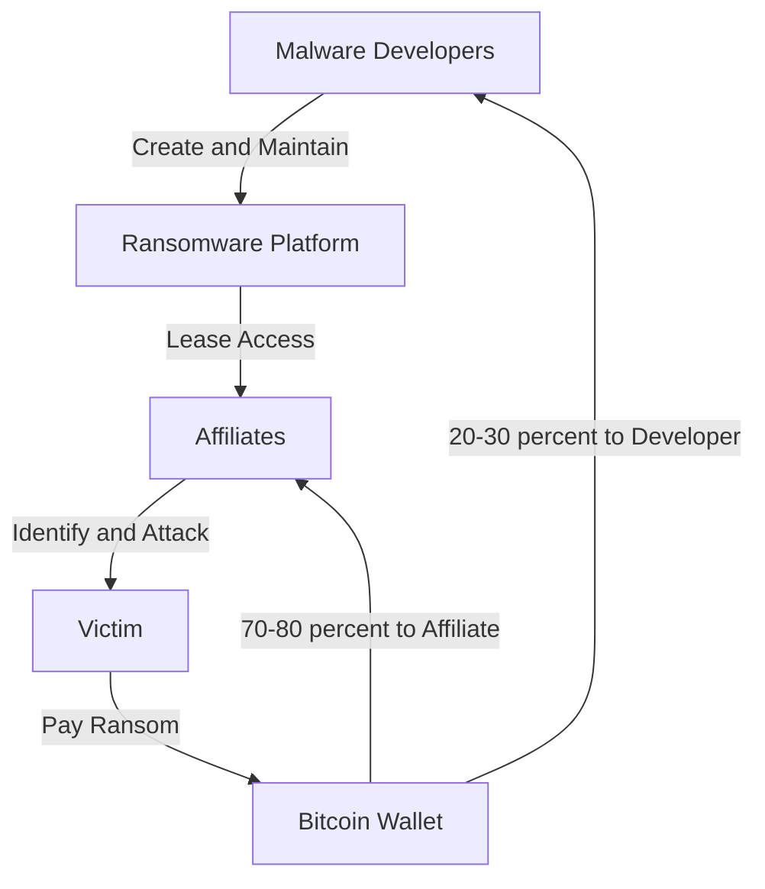
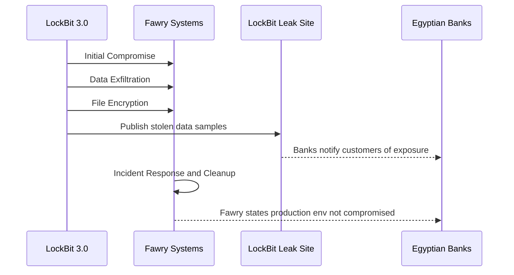
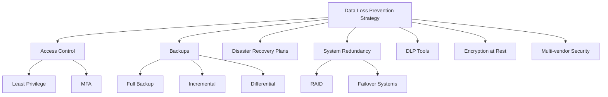
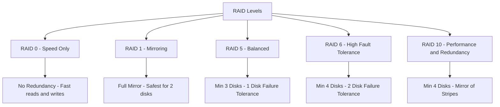
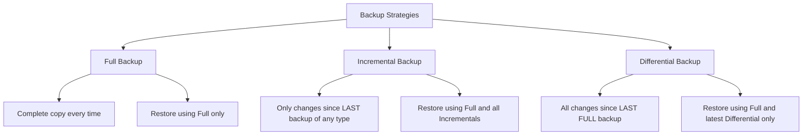
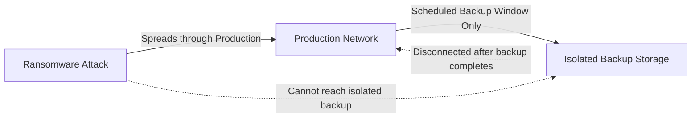
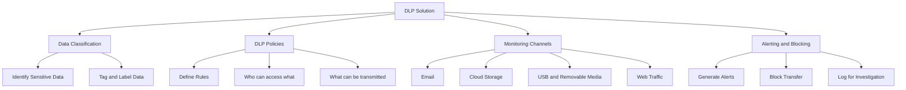
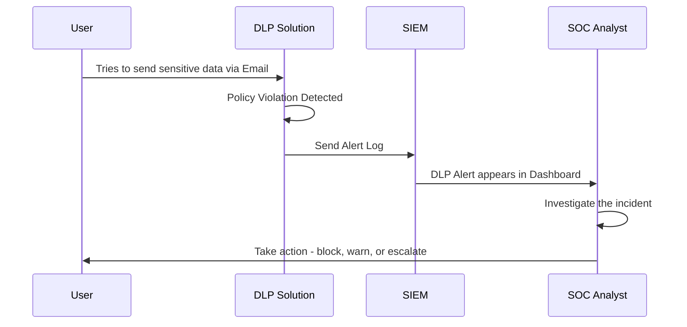

> **الهدف من الـ Section ده:**  
> هتفهم إيه هو الـ Data Loss Prevention، وإزاي البيانات بتتسرب أو بتتاتك، وهتتعرف على واحدة من أخطر الـ Ransomware Groups في التاريخ. كمان هتعرف إزاي تحمي بيانات الـ Organization بالـ Backups والـ RAID وأدوات الـ DLP — وده كله هيخليك كـ SOC Analyst تعرف تتعامل مع scenarios زي دي في الواقع.
---

## Table of Contents

- [ما هو الـ Data Loss؟](#ما-هو-الـ-data-loss)
- [الفرق بين Data Corruption و Data Leakage](#الفرق-بين-data-corruption-و-data-leakage)
- [مصادر الـ Data Loss](#مصادر-الـ-data-loss)
- [LockBit — أخطر Ransomware Group](#lockbit--أخطر-ransomware-group)
- [Ransomware-as-a-Service (RaaS)](#ransomware-as-a-service-raas)
- [حملة LockBit ضد Fawry في مصر](#حملة-lockbit-ضد-fawry-في-مصر)
- [طرق الحماية والوقاية](#طرق-الحماية-والوقاية)
- [RAID — Storage Redundancy](#raid--storage-redundancy)
- [Backup Strategies](#backup-strategies)
- [أمان الـ Backups نفسها](#أمان-الـ-backups-نفسها)
- [DLP Tools وتكاملها مع SIEM](#dlp-tools-وتكاملها-مع-siem)
- [Summary](#Summary)

---

## ما هو الـ Data Loss؟

الـ **Data Loss** هو أي حدث بيخلي البيانات مش متاحة، متضررة، أو بتوصل لأيدي غلط. مش لازم يكون هجوم متعمد — أحياناً بييجي من:

- **Accidental Deletion** — حذف غير مقصود للملفات
- **Environmental Disasters** — حريق، فيضان، كهربا وقعت
- **Hardware Failure** — العتاد الفيزيائي اتعطل
- **Ransomware / Malware** — برامج خبيثة بتشفر أو بتمسح البيانات
- **Insider Threat** — موظف بيرفع بيانات حساسة على cloud storage غير مرخص

---

## الفرق بين Data Corruption و Data Leakage

الفرق ده مهم جداً تفهمه وتقدر تشرحه في الـ Interview:

| المفهوم | التعريف | المثال |
|---|---|---|
| **Data Corruption** | تغيير أو تلف البيانات بحيث تبقى غلط أو مش قابلة للاستخدام | Ransomware بيشفر الملفات |
| **Data Leakage** | الكشف غير المصرح به عن بيانات حساسة لجهة خارجية | سرقة بيانات عملاء ونشرها |

> [!IMPORTANT]
> في بعض الهجمات المتقدمة، الاتنين بيحصلوا مع بعض. مثلاً الـ **LockBit Ransomware** — بيعمل **data exfiltration** الأول (leakage)، وبعدين بيعمل encryption للأنظمة (corruption). ده اللي بيسموه **Double Extortion**.

---

## مصادر الـ Data Loss

الـ Data Loss مش دايماً بييجي من Hacker خارجي. فيه مصادر تانية مهمة:



> [!WARNING]
> كـ SOC Analyst، لازم تراقب access للـ **cloud storage services** زي Google Drive وDropbox وOneDrive. موظف بيرفع ملفات حساسة على cloud شخصي ده يعتبر **data leakage** حتى لو مفيش قصد سيء.

بعض الـ Security Solutions بتعمل **Website Categorization** — يعني بتصنف المواقع حسب نوعها (cloud storage, social media, etc.) وبتقدر تعمل **rules** تطلع alerts لما حد بيعمل traffic لـ categories معينة.

---

## LockBit — أخطر Ransomware Group

### مين هم LockBit؟

الـ **LockBit** هي واحدة من أخطر وأنجح الـ Ransomware Groups في التاريخ. ظهرت في 2019 واستمرت لحد ما اتمسكت في 2024.



### ليه LockBit كانت خطيرة جداً؟

| الميزة | التفاصيل |
|---|---|
| **Double Extortion** | بيعملوا exfiltration للبيانات الأول، وبعدين encryption |
| **RaaS Model** | بيأجروا الـ Ransomware لـ Affiliates مقابل نسبة من الأرباح |
| **Customer Service** | فعلاً كان عندهم support team للضحايا |
| **Leak Site** | عندهم موقع ينشروا عليه البيانات المسروقة كتهديد |
| **High Success Rate** | اتعاملوا مع آلاف المنظمات حول العالم |

> [!NOTE]
> الـ Fun Fact: LockBit كانت عندهم customer service أحسن من كتير من الشركات الحقيقية — عشان لو الضحية دفعت، يضمنوا ليها إن البيانات اتمسحت فعلاً وإنهم بيبعتولها الـ decryption key.

---

## Ransomware-as-a-Service (RaaS)

ده سؤال شائع جداً في الـ Interviews — لازم تعرف تشرحه بالتفصيل.

### الـ RaaS Model

الـ **Ransomware-as-a-Service (RaaS)** هو نموذج تجاري إجرامي على غرار الـ SaaS في الـ IT العادي، بس بدل ما تبيع software قانوني، بتبيع Ransomware.



**شرح مبسط:**
- الـ **Developers** بيعملوا الـ Ransomware ويصونوه
- الـ **Affiliates** بيدفعوا subscription أو نسبة من الأرباح عشان يستخدموه
- الـ Affiliates هم اللي بينفذوا الهجوم فعلياً
- الأرباح بتتقسم بين الطرفين

> [!IMPORTANT]
> حتى لو الـ Group اتمسكت أو اتحلت، الـ **Ransomware Ecosystem** بيرجع تاني تحت أسماء جديدة. LockBit اتمسكوا في 2024، بس المتوقع إن أعضاء بيشتغلوا في groups تانية أو عاملين واحدة جديدة.

---

## حملة LockBit ضد Fawry في مصر

### قصة الهجوم

في نهاية 2023، **Fawry** — شركة المدفوعات الرقمية المصرية الشهيرة — اتعرضت لهجوم من مجموعة LockBit 3.0.



### الدروس المستفادة:

- حتى الشركات الكبيرة والمنظمة ممكن تتضرب
- الـ **Double Extortion** بيخلي الضرر مزدوج — حتى لو الشركة عندها backups، البيانات المسروقة اتنشرت
- الـ Incident Response السريع مهم جداً للتقليل من الضرر

---

## طرق الحماية والوقاية

أهم طرق الحماية من الـ Data Loss:



> [!TIP]
> الـ **Access Control** هو أهم mitigation على الإطلاق. لو كل شخص بس يوصل للبيانات اللي محتاجها بالظبط، هتقلل كتير من سطح الهجوم.

---

## RAID — Storage Redundancy

### ما هو الـ RAID؟

الـ **RAID (Redundant Array of Independent Disks)** هي تقنية storage بتجمع أكتر من Hard Disk مع بعض في وحدة واحدة منطقية عشان:

- تحسين الـ **Fault Tolerance** (التحمل ضد الأعطال)
- تحسين الـ **Performance** (السرعة)
- أو الاتنين مع بعض

### مفاهيم أساسية في الـ RAID:

| المفهوم | المعنى |
|---|---|
| **Mirroring** | نسخ نفس البيانات على أكتر من Disk — عشان لو واحد اتعطل التاني موجود |
| **Striping** | توزيع البيانات على أكتر من Disk — لتسريع القراءة والكتابة |
| **Parity** | معلومات إضافية بتتحسب من البيانات وبتستخدم في استرجاع البيانات لو Disk اتعطل |

### مقارنة بين أهم أنواع RAID:

| RAID Level | الميزة الأساسية | الـ Redundancy | الأداء | الاستخدام المثالي |
|---|---|---|---|---|
| **RAID 0** | Striping فقط | لا يوجد | ممتاز | Editing / Gaming |
| **RAID 1** | Mirroring | عالي | متوسط | Critical Data |
| **RAID 5** | Striping + Parity واحد | متوسط | جيد | Balanced Workloads |
| **RAID 6** | Striping + Double Parity | عالي جداً | جيد | High Availability |
| **RAID 10** | Mirror + Stripe | عالي | ممتاز | Databases |



> [!WARNING]
> الـ **RAID مش بديل عن الـ Backup**! الـ RAID بيحمي من عطل الـ Hardware فقط — لو فيه Ransomware شفّر الملفات، هيشفرها على كل الـ Disks مع بعض في نفس الوقت.

---

## Backup Strategies

الـ Backup مش مجرد "انسخ الملفات" — فيه strategies مختلفة لكل منها مميزات وعيوب.

### Full Backup

بتاخد **نسخة كاملة** من كل البيانات في كل مرة.

```
Source: [File A][File B][File C][File D][File E]
Backup: [File A][File B][File C][File D][File E]  -- Everything copied
```

| المميزات | العيوب |
|---|---|
| Restore سريع وبسيط | بياخد وقت وspace كتير |
| مش محتاج backups تانية للـ Restore | مكلف جداً لو عندك بيانات ضخمة |

---

### Incremental Backup

بتنسخ **بس اللي اتغير** من آخر backup من أي نوع.

```
Sunday:    FULL  [A][B][C][D][E]
Monday:    INC   [F]              -- New file only
Tuesday:   INC   [G][C*]          -- New file + modified C
Wednesday: INC   [H]              -- New file only
```

**عند الـ Restore:** محتاج الـ Full + كل الـ Incrementals بالترتيب.

---

### Differential Backup

بتنسخ **كل اللي اتغير** من آخر **Full Backup** فقط (مش من آخر backup).

```
Sunday:    FULL  [A][B][C][D][E]
Monday:    DIFF  [F]                      -- All changes since Sunday
Tuesday:   DIFF  [F][G][C*]               -- All changes since Sunday (cumulative)
Wednesday: DIFF  [F][G][C*][H]            -- All changes since Sunday (cumulative)
```

**عند الـ Restore:** محتاج الـ Full + آخر Differential فقط.

---

### مقارنة بين الأنواع الثلاثة:

| النوع | حجم الـ Backup | وقت الـ Backup | سرعة الـ Restore | التعقيد |
|---|---|---|---|---|
| **Full** | كبير جداً | بطيء | سريع جداً | بسيط |
| **Incremental** | صغير | سريع جداً | بطيء (محتاج كل الـ files) | معقد |
| **Differential** | متوسط ومتزايد | متوسط | سريع (Full + 1 Diff) | متوسط |



> [!TIP]
> في معظم الـ Enterprises بيستخدموا مزيج: **Full** أسبوعياً + **Incremental** يومياً. ده بيوازن بين التكلفة وسرعة الـ Restore.

---

## أمان الـ Backups نفسها

الـ Backup بتاعتك ممكن تبقى هي نفسها هدف للـ Attacker!

### أهم مبادئ حماية الـ Backups:

**1. Isolation — العزل**

> [!IMPORTANT]
> الـ Backup Storage لازم يكون **منفصل تماماً** عن الـ Production Network. لو الـ Ransomware وصل للـ Backups، هتلاقي نفسك من غير أي طريقة للـ Restore.



**2. Temporary Connection**
الـ Network Access للـ Backup Storage يتفتح بس وقت الـ Backup وبعدين يتقفل فوراً.

**3. Multi-vendor Security**
استخدام Security Controls من Vendors مختلفين — لو واحد اتاخد أو عنده vulnerability، التاني ممكن يكتشفه.

**4. Verify Backups**
لازم تتأكد إن الـ Backups شغالة فعلاً ومش مجرد ملفات فارغة أو corrupted. تقدر تعمل ده من خلال الـ **SIEM** — تجيب الـ Logs من الـ Backup Solution وتراقب الـ successful backup logs.

**5. Encryption at Rest**
البيانات المتنسخة لازم تكون **مشفرة** — عشان حتى لو الـ Attacker وصلها، ميقدرش يقراها.

---

### ليه الـ Organizations بتصرف ملايين على الأمن والـ Backup؟

> [!WARNING]
> تحت قوانين زي الـ **GDPR**، المنظمات ممكن تتغرم حتى **4% من إيراداتها السنوية العالمية** لو حصل data breach بسبب إهمال. وفضلاً عن ده، الضرر للـ Reputation في السوق ممكن يكون أخطر من الغرامة نفسها.

---

## DLP Tools وتكاملها مع SIEM

### ما هو الـ DLP Solution؟

الـ **Data Loss Prevention (DLP)** هو نوع من Security Solutions بيراقب ويكتشف ويمنع الإرسال غير المصرح به للبيانات الحساسة عبر:

- **Email** — إرسال بيانات حساسة ببريد إلكتروني
- **Cloud Services** — رفع ملفات على Google Drive أو OneDrive شخصي
- **Removable Media** — نسخ البيانات على USB أو External HDD
- **Web Traffic** — تحميل أو إرسال بيانات عبر المتصفح

### مكونات الـ DLP:



### Data Classification — الأساس

> [!IMPORTANT]
> الـ DLP مش هيشتغل صح من غير **Data Classification** صح. لازم الأول تعرف البيانات اللي عندك — إيه منها حساس؟ إيه منها Public? الـ DLP Policies بتتبنى على الـ Classification.

### أنواع الـ DLP Policies:

| النوع | المثال |
|---|---|
| **Content-based** | أي ملف فيه رقم Credit Card يتمنع من الإرسال |
| **Context-based** | بيانات بتتبعت من جهاز في قسم الـ Finance على Email خارجي |
| **User-based** | Contractor مش مسموحله يحمل بيانات معينة |

### الـ DLP في بيئة الـ SOC:

كـ SOC Analyst، الـ DLP بيتكامل مع الـ **SIEM Solution** بتاعك:



> [!TIP]
> لما تشوف DLP Alert في الـ SIEM، أول حاجة بتعملها هي تفهم الـ Context: مين الـ User؟ إيه البيانات اللي حاول يبعتها؟ لمين؟ هل ده جزء من شغله الطبيعي؟ الـ False Positives شائعة جداً في الـ DLP.

---

## Summary

- **Data Loss** بييجي من مصادر كتير — مش بس External Hackers، في Insiders وحوادث عرضية وكوارث بيئية.

- **Data Corruption** ≠ **Data Leakage** — الأول بيأثر على سلامة البيانات (Integrity)، والتاني على سريتها (Confidentiality). وبعض الهجمات زي LockBit بتعمل الاتنين مع بعض (**Double Extortion**).

- **LockBit** كانت أخطر Ransomware Group وشغّلت بموديل **RaaS** — بتأجر أدواتها للـ Affiliates مقابل نسبة من الأرباح.

- **RaaS** هو نموذج تجاري إجرامي — لازم تعرف تشرحه في الـ Interview مع مثال زي LockBit.

- **RAID** بيحمي من عطل الـ Hardware فقط، وهو مش بديل عن الـ Backup — الـ Ransomware بيضرب الاتنين لو مش معزولين.

- أنواع الـ Backup الثلاثة:
  - **Full** → كل حاجة كل مرة
  - **Incremental** → اللي اتغير من آخر أي Backup
  - **Differential** → اللي اتغير من آخر Full Backup فقط

- **Backup Isolation** من أهم ممارسات الأمن — الـ Backup لازم يكون منفصل عن الـ Production Network ومتوصلش إلا وقت الـ Backup نفسه.

- الـ **DLP** بيراقب ويمنع إرسال البيانات الحساسة عبر Email وCloud وUSB — وبيتكامل مع الـ SIEM لإطلاق الـ Alerts.

- الـ **Data Classification** هي الأساس اللي بيبنى عليه أي DLP Policy — من غيرها الـ DLP مش هيشتغل صح.

- الغرامات تحت **GDPR** ممكن توصل لـ **4% من الإيرادات السنوية العالمية** — ده بيبرر الاستثمار الضخم في الأمن والـ Backup Solutions.
