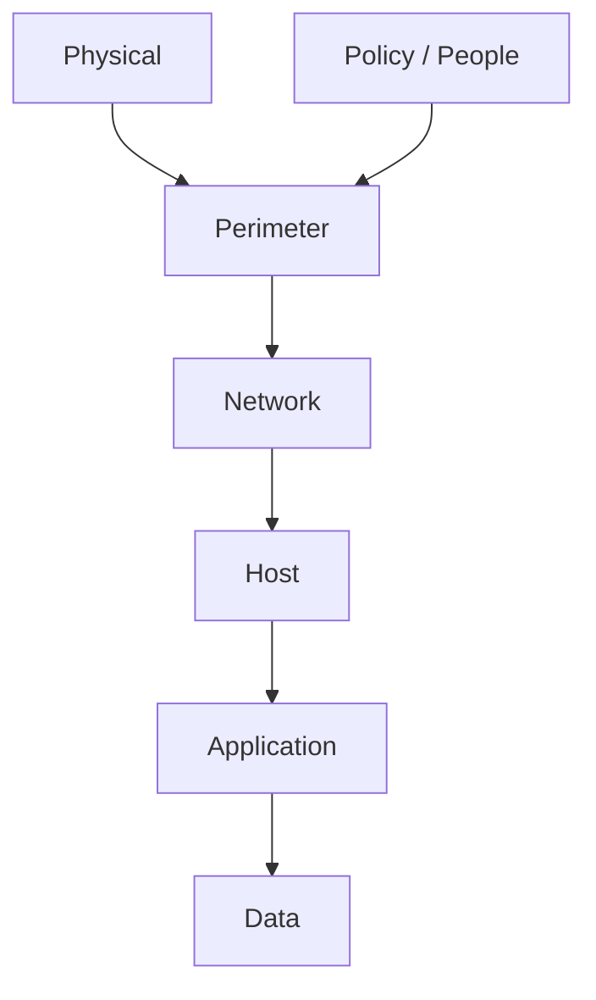
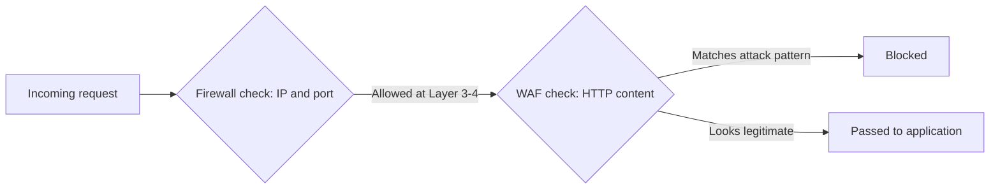
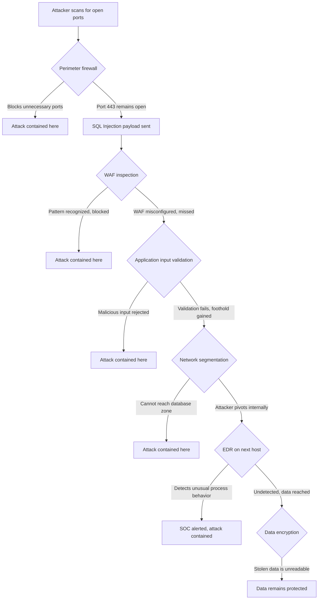

| Topic | Level | Reading Time | Prerequisites |
|---|---|---|---|
| Defense in Depth Model | Beginner | ~15 min | None |

> **الهدف من الـ Section ده:**  
> هتفهم إيه هي فلسفة الـ Defense in Depth، وإيه هي الطبقات السبع اللي بتتكون منها، وإزاي كل طبقة بتمسك اللي فاتت من التانية.

## Learning Objectives

By the end of this section, you will be able to:

- Define **Defense in Depth (DiD)** and explain why the word *independent* is the core of the strategy.
- List the seven layers of a modern DiD model and describe the main controls in each one.
- Explain the difference between what a **firewall** sees and what a **WAF** sees, at the OSI layer level.
- Trace a single attack attempt through multiple layers and explain how each layer either stops it or hands off to the next.
- Explain why physical security and the human factor are layers that get overlooked, and why that is dangerous.

## Table of Contents

- [Learning Objectives](#learning-objectives)
- [What Is Defense in Depth](#what-is-defense-in-depth)
  - [The Core Definition](#the-core-definition)
  - [The Key Word Is Independent](#the-key-word-is-independent)
  - [Military Origin](#military-origin)
- [The Modern Layer Model](#the-modern-layer-model)
  - [Overview of the Layers](#overview-of-the-layers)
  - [Perimeter Security Layer](#perimeter-security-layer)
  - [Network Security Layer](#network-security-layer)
  - [Host Security Layer](#host-security-layer)
  - [Application Security Layer](#application-security-layer)
  - [Data Security Layer](#data-security-layer)
  - [Two Layers Often Left Out](#two-layers-often-left-out)
- [Firewalls Versus WAF: A Layer Distinction](#firewalls-versus-waf-a-layer-distinction)
- [Putting the Whole Model Together](#putting-the-whole-model-together)
  - [Attack Walk-Through](#attack-walk-through)
  - [Diagram of the Walk-Through](#diagram-of-the-walk-through)
- [Career Path Connections](#career-path-connections)
- [Key Terms Glossary](#key-terms-glossary)
- [Summary](#summary)

## What Is Defense in Depth

### The Core Definition

**Defense in Depth (DiD)** هي استراتيجية أمنية بتقوم على وضع **عدة controls أمنية مستقلة** بين المهاجم والـ asset اللي بتحميه، بحيث لو control واحد اتخطى، يبقى فيه control تاني لسه موجود يمسك الهجوم.

الفكرة الأساسية: **مفيش control واحد المفروض تعتمد عليه بالكامل**، مهما كان قوي.

### The Key Word Is Independent

الكلمة الأهم في التعريف هي **independent**. كل طبقة المفروض تشتغل على **نقطة مختلفة** في النظام. لو طبقتين بيتهزموا بنفس التقنية بالظبط، يبقى دول مش طبقتين فعلياً، **دول طبقة واحدة اتكررت**.

الـ DiD مش معناها "اشتري منتجات أكتر". الفكرة إنها بتغطي **أسطح هجوم مختلفة (attack surfaces)**:

- الـ network traffic.
- الـ operating system.
- كود الـ application.
- الداتا نفسها.
- الناس المستخدمين للنظام.

> [!IMPORTANT]
> Buying five firewalls from five different vendors is not Defense in Depth. It is one layer duplicated five times, because all five can be defeated by the exact same technique: a network-layer bypass. Real depth means covering different attack surfaces, not multiplying the same control.

### Military Origin

المصطلح جاي من **الاستراتيجية العسكرية**. بدل ما توقف العدو عند خط دفاع واحد بس، بتبني عدة خطوط دفاعية، بحيث حتى لو الخط الأول اتخرق، المهاجم بيخسر **زخم ووقت وموارد** عند كل خط بعده.

الأمن السيبراني استعار المفهوم ده **حرفياً**: بدل خط دفاعي واحد، فيه طبقات متتالية، وكل طبقة بتكلف المهاجم وقت وجهد إضافي حتى لو كان عنده الأدوات اللازمة يعدي طبقة معينة.

## The Modern Layer Model

### Overview of the Layers

الموديل الحديث للـ Defense in Depth بيتكون من طبقات، طبقة ورا طبقة:

الجدول التالي بيلخص الطبقات والـ controls الأساسية في كل واحدة:

| Layer | Main Controls | What It Protects |
|---|---|---|
| Perimeter | Firewall, reverse proxy, anti-DDoS, VPN gateway | The boundary with untrusted networks |
| Network | Segmentation, NAC, VLANs | Everything already allowed inside |
| Host | Hardening, application control, vulnerability scanning, EDR | Individual machines |
| Application | Authentication and authorization, input validation, overflow protection, secure coding | The software itself |
| Data | Encryption at rest, encryption in transit, classification, DLP | The data, even after every other layer fails |
| Physical | Locks, badges, cameras, server room access control | Physical access to hardware |
| Policy / People | Security awareness training, phishing simulations, clear policies | Human decision-making |

بالإضافة لكده، فيه controls بتشتغل **عبر الطبقات كلها**، مش طبقة لوحدها:

- **IDS و IPS:** بيفحصوا أنماط الـ traffic بحثاً عن signatures معروفة، وممكن يمنعوها في الوقت الفعلي.
- **Logging and monitoring (SIEM):** بيجمع الأدلة من كل طبقة في مكان واحد، عشان الهجوم يتكتشف ويتحقق فيه حتى لو ماتمنعش في الوقت الفعلي.
- **Backups:** بتضمن إن حتى الهجوم الناجح بالكامل (زي الـ ransomware) ما يسببش ضرر دائم مالوش رجوع.

> [!NOTE]
> SIEM stands for Security Information and Event Management. Its role is not to stop an attack in real time like a firewall or WAF, but to give the SOC team the full picture across every layer, which is essential for investigation after the fact.

### Perimeter Security Layer

الـ **perimeter** هو **الحد الخارجي** بين مؤسستك والشبكات غير الموثوقة (الإنترنت، شبكات الشركاء، الـ guest Wi-Fi).

الـ controls الأساسية: **firewalls, reverse proxies, anti-DDoS appliances, VPN gateways**.

مهمة الـ perimeter **مش إنه يوقف كل هجوم**، لأن ده مستحيل. مهمته إنه **يفلتر الضوضاء الواضحة عالية الحجم** (scans, junk traffic, known-bad IPs)، عشان الطبقات الداخلية تتعامل بس مع التهديدات الأكتر تعقيداً.

الـ **anti-DDoS** مهم جداً هنا تحديداً، لأن الهجمات الـ **volumetric** (كميات ضخمة من الـ traffic بهدف إغراق الخدمة) لازم تتمتص أو تتفلتر **قبل ما توصل للـ servers الفعلية**. مفيش control داخلي هيقدر يوقف flood أصلاً شبع الـ network link.

### Network Security Layer

الطبقة دي بتركز على حماية **كل حاجة جوه الـ perimeter**، بمجرد ما الـ traffic بيتسمح بيه ويدخل.

- **Network segmentation:** تقسيم الشبكة لـ zones منفصلة (زي DMZ للـ public-facing servers، zone منفصلة للأجهزة الداخلية، وzone منفصلة للـ databases الحساسة)، عشان اختراق zone واحدة ما يعرضش كل الـ zones التانية.
- **Network Access Control (NAC):** بيضمن إن الأجهزة المصرح بيها والمتوافقة بس هي اللي تقدر تنضم للشبكة أصلاً (بيتحقق مثلاً هل الجهاز عليه antivirus محدّث قبل ما يديله access).
- الـ **VLANs** هي التقنية العملية اللي بتستخدم عادةً لتنفيذ الـ segmentation، بتسمح تفصل الـ traffic منطقياً حتى على نفس الـ hardware الفيزيائي.

> [!NOTE]
> This connects directly to the network segmentation and VLAN topics covered in the Network Security Foundations series. The same VLAN technology serves as the practical mechanism enforcing this DiD layer.

### Host Security Layer

الطبقة دي بتحمي **الأجهزة الفردية**: servers, workstations, laptops.

- **Hardening:** إزالة أو تعطيل أي حاجة مش محتاجينها فعلياً، زي الـ unused services والـ default accounts والـ unnecessary open ports. كل feature مش مستخدم هو **ثغرة محتملة من غير أي فايدة حقيقية للبيزنس**.
- **Application control (allow-listing):** بيسمح بتشغيل الـ software المعتمد مسبقاً بس، وده بيقفل معظم الـ malware أوتوماتيك، لأن الـ malware **بالتعريف** مش على الـ approved list.
- **Vulnerability scanning:** فحص دوري للأنظمة عن patches ناقصة معروفة أو misconfigurations، **قبل** ما المهاجم يلاقيها هو الأول.
- **Anti-malware (EDR) agents:** بتكتشف وترد على النشاط الضار اللي بيحصل فعلياً على الـ endpoint، وده مهم لأن بعض الهجمات **مبتلمسش الشبكة أصلاً بشكل يتكتشف**، زي الـ malware اللي بييجي عن طريق USB.

### Application Security Layer

الطبقة دي عن **خلي الـ software نفسه مقاوم للإساءة**، مش بس مراقبته من بره.

- **Authentication and authorization:** التحقق من هوية المستخدم، وبشكل منفصل، تحديد إيه اللي المستخدم المتحقق منه مسموح له يعمله. **دول مشكلتين مختلفتين** — نظام ممكن يتعرف على المستخدم صح، ويسمحله برضو يعمل حاجة مش المفروض يعملها.
- **Input validation:** عدم الثقة أبداً في أي داتا جاية من المستخدم؛ كل input لازم يتفحص مقابل الشكل والطول والنوع المتوقع قبل ما الـ application يعالجه. معظم هجمات طبقة الـ application (SQL Injection, Cross-Site Scripting, Command Injection) موجودة **تحديداً لأن الـ input ماتفحصش**.
- **Overflow protections:** منع المهاجم من إرسال داتا أكتر من اللي البرنامج متوقعها، واللي في اللغات غير الآمنة ممكن تسمح للمهاجم يكتب فوق الـ memory ويشغل كود بتاعه.
- **Secure coding practices and code review:** اكتشاف المشاكل دي **قبل** ما الـ software ينشر أصلاً، لأن إصلاح ثغرة بعد الإصدار أغلى وأخطر بكتير من اكتشافها أثناء التطوير.

### Data Security Layer

حتى لو كل طبقة تانية فشلت والمهاجم وصل للداتا، الطبقة دي بتحدد **هل الداتا دي فعلاً مفيدة له ولا لأ**.

- **Encryption at rest:** الداتا المخزنة على الـ disk غير قابلة للقراءة من غير الـ key الصح، فسرقة الملفات الخام مبتديش المهاجم أي حاجة مفيدة.
- **Encryption in transit:** الداتا المتحركة عبر الشبكة (زي HTTPS) مينفعش تتعترض وتتقرأ حتى لو مهاجم قاعد على نفس مسار الشبكة.
- **Data classification:** توسيم الداتا حسب حساسيتها (public, internal, confidential, restricted)، عشان controls أقوى تتطبق أوتوماتيك على الداتا اللي فعلاً بتستاهل، بدل ما نطبق نفس الحماية الضعيفة أو القوية على كل حاجة.
- **Data Loss Prevention (DLP):** أدوات بتراقب وتمنع الداتا الحساسة من الخروج من المؤسسة بشكل غير سليم، زي موظف بيحاول يبعت بالإيميل ملف فيه أرقام كروت ائتمان عملاء لبره الشركة.

### Two Layers Often Left Out

فيه طبقتين بتتنسوا كتير من الناس:

- **Physical security:** أقفال، بادجات، كاميرات، التحكم في دخول غرفة الـ servers. كل الأمان الشبكي في الدنيا **مالوش قيمة** لو حد يقدر يمشي لغرفة الـ servers ويوصل جهاز مباشرة في الشبكة، أو ببساطة يسرق الـ hardware نفسه.
- **Policy layer:** تدريب الوعي الأمني، محاكاة هجمات الـ phishing، وسياسات واضحة. **البشر بيفضلوا أكتر نقطة دخول بيتم استغلالها**، لأنه غالباً أسهل تخدع شخص يدّيك كلمة السر بدل ما تخترق خمس طبقات تقنية.

> [!WARNING]
> An organization can invest heavily in firewalls, WAFs, and EDR, and still be breached through a single employee clicking a phishing link, or a visitor plugging a device into an unlocked server room. Physical and human layers are not optional extras; they are as critical as the technical ones.

## Firewalls Versus WAF: A Layer Distinction

الشبكات منظمة في طبقات (زي **OSI model**). الفرق بين الـ **firewall** والـ **WAF** هو مثال ممتاز على معنى "طبقات مستقلة" فعلياً.

الـ firewalls تقليدياً بتشتغل على **Layer 3** (عنونة الـ IP) و **Layer 4** (الـ ports وسلوك TCP/UDP). عند الـ Layers 3-4، الـ firewall يقدر يشوف بس حاجات زي "حد بيحاول يتصل بـ port 443 من الـ IP ده". مالوش أي رؤية لجوة الاتصال نفسه بمجرد ما بيتسمح بيه.

الـ **WAF** بيشتغل على **Layer 7** (طبقة الـ application)، يعني يقدر يقرا **المحتوى الفعلي** لطلب الـ HTTP: الـ URL، الـ parameters، الـ headers، الـ cookies، والـ request body.

| Aspect | Firewall | WAF |
|---|---|---|
| OSI Layer | Layer 3 and 4 | Layer 7 |
| What it sees | Source IP, destination port, protocol behavior | Full HTTP/HTTPS content |
| Example decision | "TCP 443 is ALLOWED" | Recognizes `GET /login.php?user=admin' OR '1'='1` as a SQL Injection attempt and blocks it |

> [!IMPORTANT]
> A firewall allowing a connection on port 443 tells you nothing about what is inside that encrypted, application-level conversation. This is exactly why the WAF exists as a separate, independent layer, not a redundant one.

للتفصيل الكامل عن الـ WAF (أنواعه، إزاي بيقرر يمنع إيه، وحدوده)، شوف الملف المخصص: **WAF (Web Application Firewall)**.

## Putting the Whole Model Together

### Attack Walk-Through

أفضل طريقة تفهم الـ Defense in Depth هي إنك تتابع محاولة هجوم واحدة، وتشوف إزاي كل طبقة **إما بتوقفها أو بتسلمها للطبقة اللي بعدها** لو الأولى فشلت:

| Step | Attacker Action | Layer Response |
|---|---|---|
| 1 | Scans the internet for open ports | Perimeter firewall blocks unnecessary ports; only 443 remains open |
| 2 | Sends an SQL Injection payload through the web form | Firewall does not understand HTTP content and lets it pass, but the WAF recognizes the SQLi pattern and blocks the request |
| 3 | Suppose the WAF is misconfigured and misses it | The application itself has input validation, so the malicious input is rejected before it reaches the database |
| 4 | Suppose that fails too and the attacker gets a foothold on one server | Network segmentation prevents them from reaching the internal database zone directly |
| 5 | Suppose they still pivot internally | EDR on the next host detects the unusual process behavior and alerts the SOC team |
| 6 | Suppose everything above somehow fails and data is stolen | Data was encrypted, so the stolen data is useless without the key |

> [!IMPORTANT]
> This is the entire point of Defense in Depth: no single failure is catastrophic on its own. Each layer buys time or fully stops the attack, and the layer after it is designed to catch exactly what the previous one might miss.

### Diagram of the Walk-Through

## Career Path Connections

| Career Path | How This Topic Applies |
|---|---|
| SOC Analyst | Monitors alerts across every layer through the SIEM, and understands which layer generated a given signal |
| Penetration Tester | Tests each layer independently to check whether it truly adds an obstacle, or duplicates a control already defeated elsewhere |
| GRC | Defense in Depth maps directly to control frameworks such as ISO 27001 and NIST 800-53, which require layered, documented controls |
| Cloud Security | Cloud environments implement the same layers through security groups, WAF services, IAM, and encryption features offered by the provider |

## Key Terms Glossary

| Term | Definition |
|---|---|
| Defense in Depth (DiD) | A strategy of placing multiple independent security controls between an attacker and an asset |
| Attack Surface | The different points a system exposes that could be targeted, such as network, OS, application, data, or people |
| Perimeter | The outermost boundary between an organization and untrusted networks |
| Anti-DDoS | Controls designed to absorb or filter volumetric traffic floods before they reach protected servers |
| Network Segmentation | Dividing a network into separate zones so a breach in one zone does not expose the others |
| NAC | Network Access Control, ensures only authorized and compliant devices can join the network |
| Hardening | Reducing a system's attack surface by disabling unused services, accounts, and ports |
| Application Control | Allow-listing, permitting only pre-approved software to run |
| EDR | Endpoint Detection and Response, monitors and responds to malicious activity on a host |
| Input Validation | Checking that user-supplied data matches the expected format, length, and type before processing |
| Encryption at Rest | Protecting stored data so it is unreadable without the correct key |
| Encryption in Transit | Protecting data moving across a network from interception |
| DLP | Data Loss Prevention, tools that monitor and block sensitive data from leaving an organization improperly |
| SIEM | Security Information and Event Management, centralizes logs and alerts from every layer |
| WAF | Web Application Firewall, inspects Layer 7 HTTP and HTTPS content for application-layer attacks |

## Summary

- **Defense in Depth relies on independence:** لو طبقتين بيتهزموا بنفس الطريقة، دول طبقة واحدة اتكررت، مش طبقتين حقيقيتين.
- **The strategy covers different attack surfaces:** network, OS, application code, data, والناس، مش مجرد شراء منتجات أكتر.
- **The origin is military:** كل خط دفاعي بيكلف المهاجم وقت وموارد، حتى لو الخط الأول اتخرق.
- **Seven layers to remember:** Perimeter, Network, Host, Application, Data، بالإضافة لـ Physical و Policy/People.
- **Firewall versus WAF is a clean example of independence:** الـ firewall بيشتغل على Layer 3/4، والـ WAF على Layer 7، وكل واحد بيشوف حاجة مختلفة تماماً.
- **Physical and human layers are commonly overlooked:** لكنهم أخطر بكتير مما يبان، لأن البشر أسهل نقطة دخول للمهاجم.
- **The attack walk-through proves the point:** مفيش فشل واحد كان كارثي لوحده، لأن كل طبقة كانت مصممة تمسك اللي فات من اللي قبلها.

