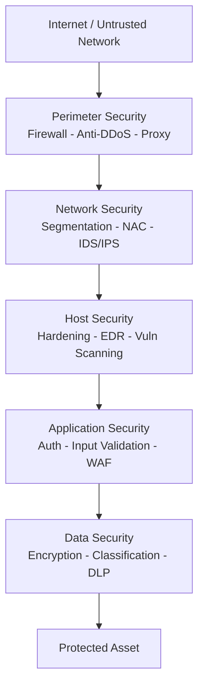
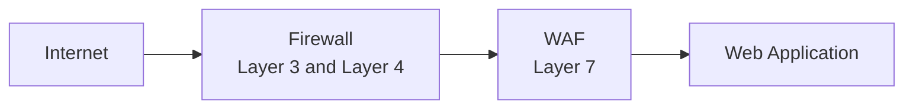
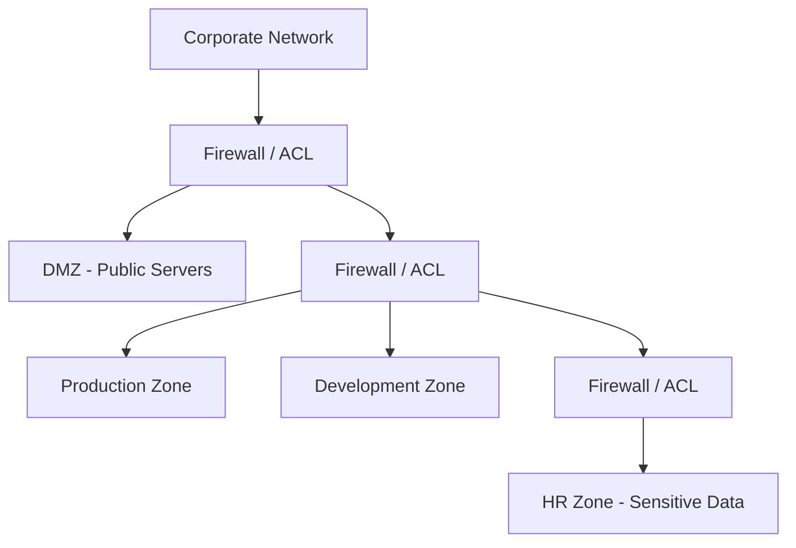
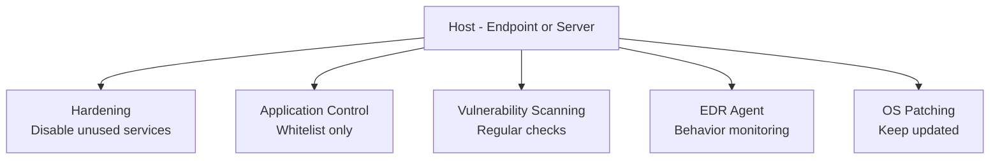
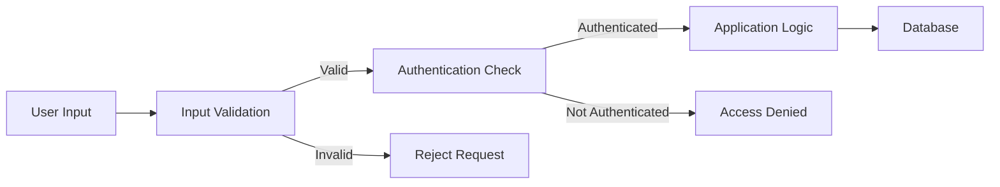
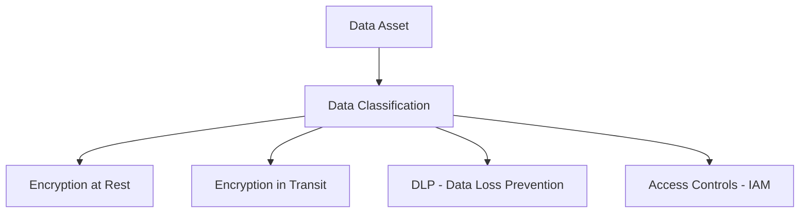
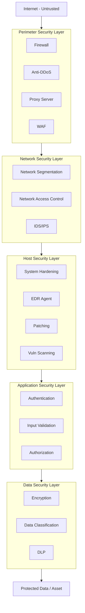

> **الهدف من الـ Section ده:**  
> هتفهم إيه معنى الـ Defense in Depth وليه منقدرش نعتمد على طبقة حماية واحدة بس، وهتتعرف على كل طبقة من طبقات الأمن — من الـ Perimeter لحد الـ Data — وإزاي كل طبقة بتحمي الـ Asset من ناحية مختلفة.
---

## Table of Contents

- [ما هو الـ Defense in Depth؟](#ما-هو-الـ-defense-in-depth)
- [ليه محتاجين أكتر من Layer واحدة؟](#ليه-محتاجين-أكتر-من-layer-واحدة)
- [مثال عملي: من Firewall فقط لـ Full Defense Stack](#مثال-عملي-من-firewall-فقط-لـ-full-defense-stack)
- [The Layers of Defense in Depth](#the-layers-of-defense-in-depth)
  - [1. Perimeter Security](#1-perimeter-security)
  - [2. Network Security](#2-network-security)
  - [3. Host Security](#3-host-security)
  - [4. Application Security](#4-application-security)
  - [5. Data Security](#5-data-security)
- [Defense in Depth — Full Architecture Diagram](#defense-in-depth--full-architecture-diagram)
- [Summary](#summary)

---

## ما هو الـ Defense in Depth؟

الـ **Defense in Depth** هو مبدأ أمني بيقول إننا مش هنعتمد على **طبقة حماية واحدة** — لأن لو الطبقة دي اتكسرت، الـ Attacker هيوصل لكل حاجة.

الفكرة الأساسية هي إننا نبني **طبقات متعددة ومستقلة** من الحماية، بحيث لو طبقة فشلت، الطبقة اللي وراها بتوقف أو بتبطئ الـ Attacker.

> [!IMPORTANT]
> الـ Defense in Depth مش معناه تكرار نفس الأداة أكتر من مرة — المقصود هو استخدام **أدوات مختلفة** بتحمي من **زوايا مختلفة**، كل واحدة بتعالج نوع تهديد معين.

---

## ليه محتاجين أكتر من Layer واحدة؟

### زمان — الـ Perimeter Firewall كان كافي

في الأيام القديمة، المواقع كانت بسيطة جداً — صفحات HTML ثابتة، محتوى بسيط، مفيش Transactions أو User Data أو APIs. في الوقت ده، كان الـ **Perimeter Firewall** الوحيد بيعتبر كافي لحماية كل حاجة.

### دلوقتي — التعقيد زاد والتهديدات زادت

دلوقتي الـ Web Applications بقت معقدة جداً:
- فيه **Databases** بتخزن بيانات حساسة
- فيه **APIs** بتتكلم مع خدمات خارجية
- فيه **User Authentication** و **Sessions**
- فيه **Cloud Infrastructure** و **Microservices**

الـ Attacker دلوقتي عنده آلاف الـ Attack Vectors — ملوش لازمة يكسر الـ Firewall لو قدر يعمل **SQL Injection** في الـ Application مثلاً.

> [!WARNING]
> الاعتماد على **Firewall واحد بس** دلوقتي = نسيان إن الـ Attacker ممكن يدخل من الـ Application Layer أو الـ Endpoint أو حتى من موظف داخل الشركة.

---

## مثال عملي: من Firewall فقط لـ Full Defense Stack

| الطريقة القديمة | الطريقة الصح (Defense in Depth) |
|---|---|
| Firewall فقط | Firewall + IDS + EDR + Hardening + IAM + Logging + Backups + Training + Network Segmentation |

كل عنصر في الـ Stack ده بيحمي من ناحية مختلفة:

| الأداة | وظيفتها |
|---|---|
| **Firewall** | يتحكم في الـ Traffic على Layer 3 و Layer 4 |
| **WAF (Web Application Firewall)** | يحمي الـ Application على Layer 7 |
| **IDS (Intrusion Detection System)** | يكشف الـ Attacks والـ Anomalies |
| **EDR (Endpoint Detection & Response)** | يحمي الـ Endpoints ويرد على الـ Threats |
| **Hardening** | يقلل الـ Attack Surface على مستوى الـ OS والـ Services |
| **IAM (Identity & Access Management)** | يتحكم مين يقدر يوصل لإيه |
| **Logging & SIEM** | يسجل كل حاجة عشان تقدر تعمل Forensics وتكتشف Incidents |
| **Backups** | بتعيد البيانات لو حصل Ransomware أو Data Loss |
| **Security Training** | بتحمي من الـ Human Error والـ Social Engineering |
| **Network Segmentation** | بتحصر الـ Damage لو Attacker دخل جزء معين |

> [!TIP]
> فكر في الـ Defense in Depth زي الـ **Onion** — لو قشرت طبقة، لسه فيه طبقات تانية جوه. الـ Attacker محتاج يكسر كل طبقة على حدة.

---

## The Layers of Defense in Depth

---

### 1. Perimeter Security

الـ **Perimeter Security** هي **أول خط دفاع** — الحاجة اللي بتتحكم في إيه اللي بيدخل وبيخرج من حدود الـ Network بتاعتك.

**مكانها:** بين المؤسسة والـ Internet أو أي Untrusted Network تاني.

**الأدوات الشائعة:**

| الأداة | الوظيفة |
|---|---|
| **Firewall** | يفلتر الـ Traffic بناءً على Rules (IP، Port، Protocol) |
| **Proxy Server** | يعمل Intermediary بين الـ Users والـ Internet، بيخفي الـ Internal IPs |
| **Anti-DDoS Appliance** | يمتص ويصفي هجمات الـ DDoS قبل ما توصل للشبكة الداخلية |
| **IPS (Intrusion Prevention System)** | يكشف ويوقف الـ Attacks على مستوى الـ Network |

> [!NOTE]
> الـ Firewall التقليدي بيشتغل على **Layer 3 (Network)** و **Layer 4 (Transport)** — يعني بيتحكم في الـ IP Addresses والـ Ports. لكن مش بيفهم الـ HTTP Requests التفصيلية جوه الـ Application.

> [!IMPORTANT]
> الـ **WAF (Web Application Firewall)** جاي عشان يكمل الـ Firewall التقليدي — هو بيشتغل على **Layer 7 (Application)** ويقدر يفهم الـ HTTP Requests ويوقف هجمات زي الـ SQL Injection والـ XSS.

---

### 2. Network Security

بعد ما الـ Traffic عدى الـ Perimeter، الـ **Network Security** بتحمي الـ **Internal Network** من الداخل.

**الهدف:** حتى لو Attacker عدى الـ Perimeter، نمنعه من التحرك بحرية جوه الشبكة الداخلية.

#### Network Segmentation

الـ Network Segmentation هو تقسيم الشبكة الداخلية لـ **Zones** أو **Segments** منفصلة، بحيث كل Zone بتضم أنظمة بنفس مستوى الحساسية أو نفس الوظيفة.

> [!NOTE]
> الـ **DMZ (Demilitarized Zone)** هي Zone خاصة بالـ Servers اللي محتاجة تتكلم مع الـ Internet (زي Web Servers و Mail Servers) — بتكون معزولة عن الـ Internal Network.

#### Network Access Control (NAC)

الـ NAC هو نظام بيتأكد إن الأجهزة اللي بتحاول تتصل بالشبكة **بتستوفي المعايير الأمنية** — زي إن عندها Antivirus محدّث أو Patch معين مركّب.

> [!TIP]
> الـ Network Segmentation بيطبق مبدأ الـ **Least Privilege** على مستوى الشبكة — كل System مش محتاج يتكلم مع كل حاجة تانية بدون سبب.

---

### 3. Host Security

الـ **Host Security** هي الطبقة اللي بتحمي كل **Device** أو **Server** على حدة — من جوا.

**الهدف:** تقليل الـ Attack Surface على مستوى الـ Endpoint وجعل الـ System صعب يتاخد.

#### System Hardening

الـ Hardening هو عملية **تقليص كل حاجة مش محتاجها** على الـ System:
- إيقاف الـ Services والـ Ports غير المستخدمة
- حذف الـ Default Accounts والـ Passwords
- تطبيق الـ Security Baselines والـ CIS Benchmarks
- تحديث الـ OS والـ Software بانتظام (Patching)

#### Application Control

بيسمح بس للـ Applications الـ Approved إنها تشتغل على الـ System، وبيمنع أي برنامج تاني.

#### Vulnerability Scanning

فحص الـ System بانتظام عشان تلاقي الـ Vulnerabilities قبل الـ Attacker.

#### Anti-Malware / EDR

- الـ **Antivirus** التقليدي بيعتمد على الـ Signatures لكشف الـ Malware.
- الـ **EDR (Endpoint Detection & Response)** أذكى — بيتابع الـ Behavior ويرد على الـ Threats بشكل تلقائي.

> [!WARNING]
> الـ Hardening مش حاجة بتعملها مرة وتنساها — لازم يكون فيه **Continuous Patching** و **Regular Scanning** عشان تواكب الـ New Vulnerabilities.

---

### 4. Application Security

الـ **Application Security** بتحمي الـ **Application نفسها** من جوا — يعني الـ Code والـ Logic اللي شغالة عليهم.

**الهدف:** بناء تطبيق آمن بطبيعته — مش مجرد وضع Firewall قدامه.

#### Authentication Mechanisms

التحقق من هوية المستخدم قبل ما يوصل لأي حاجة:
- استخدام **MFA (Multi-Factor Authentication)**
- تطبيق **Strong Password Policies**
- استخدام **OAuth / SAML** للـ Federated Authentication

#### Input Validation

**كل input جاي من المستخدم يُعتبر خطير حتى يثبت العكس.**

الـ Input Validation بيتأكد إن البيانات اللي بتيجي بتطابق الـ Expected Format قبل ما يتعمل بيها أي حاجة:
- منع الـ **SQL Injection**
- منع الـ **XSS (Cross-Site Scripting)**
- منع الـ **Command Injection**

#### Overflow Protections

حماية الـ Application من هجمات الـ **Buffer Overflow** اللي بتحاول تكتب data في أماكن مش المفروض.

> [!IMPORTANT]
> الـ **WAF** بيحمي من الخارج، لكن الـ Application Security الحقيقية هي اللي بتتعمل **جوا الـ Code نفسه** — الاتنين لازم يكونوا موجودين مع بعض.

---

### 5. Data Security

الـ **Data Security** هي الطبقة الأعمق — بتحمي **البيانات نفسها** حتى لو كل الطبقات التانية اتكسرت.

**الهدف:** حتى لو Attacker وصل للـ Data، يكونها بلا معنى أو ما يقدرش يستخدمها.

#### Encryption

تحويل البيانات لشكل غير مقروء بدون الـ Key المناسب:

| النوع | المثال | الاستخدام |
|---|---|---|
| **Encryption at Rest** | تشفير قاعدة البيانات | حماية البيانات المخزنة |
| **Encryption in Transit** | TLS/HTTPS | حماية البيانات أثناء النقل |
| **End-to-End Encryption** | Signal, WhatsApp | حماية من المرسل للمستقبل |

#### Data Classification

تصنيف البيانات حسب حساسيتها عشان تعرف إزاي تتعامل معاها:

| المستوى | الوصف | مثال |
|---|---|---|
| **Public** | عادي، مفيش مشكلة لو اتعرف | Marketing Materials |
| **Internal** | للاستخدام الداخلي بس | Internal Memos |
| **Confidential** | حساس، محتاج حماية | Customer Data |
| **Restricted / Top Secret** | في غاية الحساسية | Financial Records, Medical Data |

> [!NOTE]
> لما تعرف تصنيف كل Data، تقدر تحدد: مين يقدر يوصلها، إزاي تتخزن، إزاي تتنقل، وإمتى تتحذف.

> [!TIP]
> الـ **DLP (Data Loss Prevention)** هو نظام بيراقب الـ Data ويمنع إنها تطلع برا المنظمة بشكل غير مصرح بيه — سواء عن طريق Email أو USB أو Upload.

---

## Defense in Depth — Full Architecture Diagram

---

## Summary

### أهم النقط اللي اتغطت في الـ Section ده:

- **الـ Defense in Depth** هو مبدأ أمني بيعتمد على **طبقات متعددة ومستقلة** من الحماية — لو طبقة فشلت، اللي وراها بتوقف الـ Attack.

- **زمان** كان الـ Perimeter Firewall كافي — **دلوقتي** التعقيد زاد والـ Attack Vectors كترت ومحتاجين Full Security Stack.

- **الطبقات الخمسة:**

| الطبقة | الهدف الأساسي | أمثلة على الأدوات |
|---|---|---|
| **Perimeter Security** | تحكم في الـ Border | Firewall, WAF, Anti-DDoS |
| **Network Security** | حماية الشبكة الداخلية | Segmentation, NAC, IDS |
| **Host Security** | تأمين كل Device على حدة | Hardening, EDR, Patching |
| **Application Security** | بناء App آمن من الجوا | Auth, Input Validation, WAF |
| **Data Security** | حماية البيانات نفسها | Encryption, Classification, DLP |

- الـ **Firewall** بيشتغل على Layer 3 و Layer 4 — الـ **WAF** بيكمله على Layer 7.

- الـ Defense in Depth مش رفاهية — في العالم الحديث ده، هو الـ **Minimum Standard** لأي منظمة جادة في الأمن.

> [!IMPORTANT]
> الـ Security مش Product تشتريه — هو **Process** مستمر. كل طبقة محتاجة صيانة، مراجعة، وتحديث دائم.
