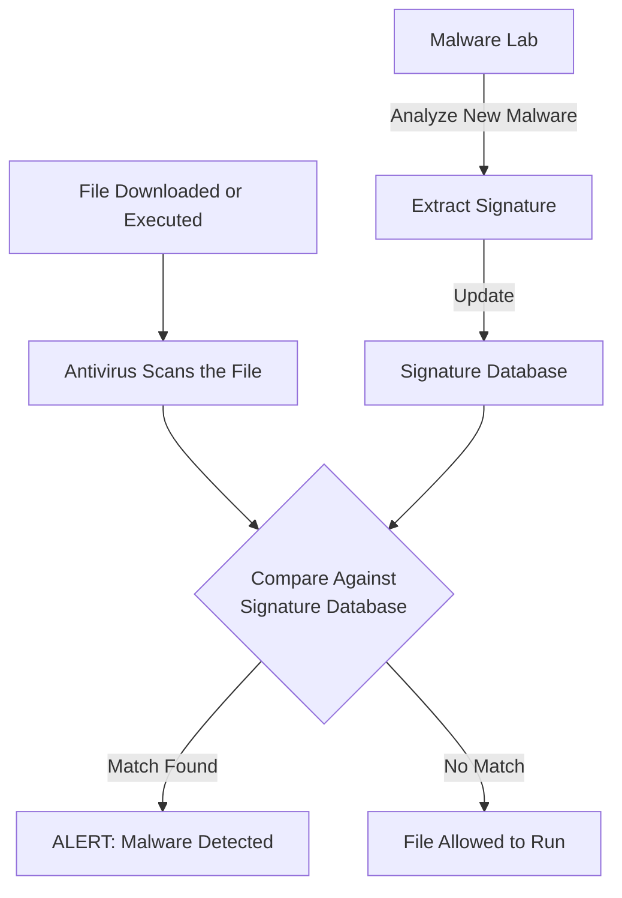
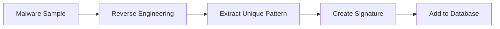
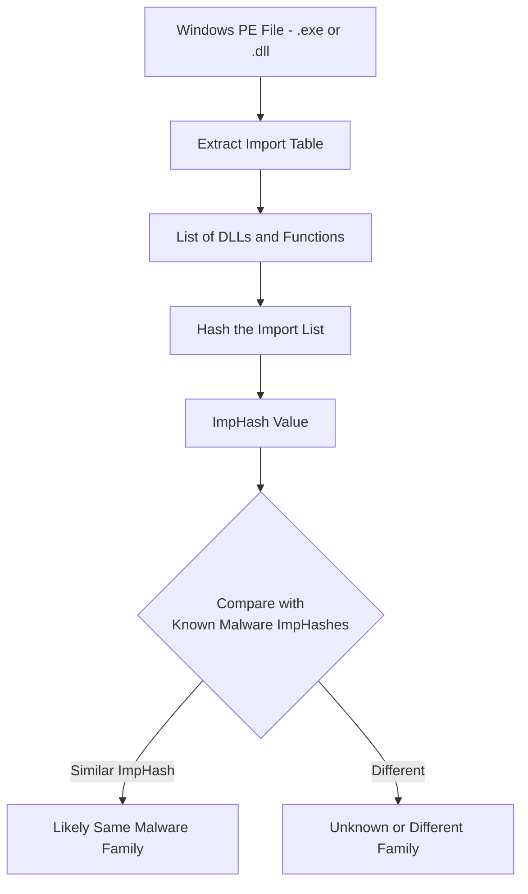
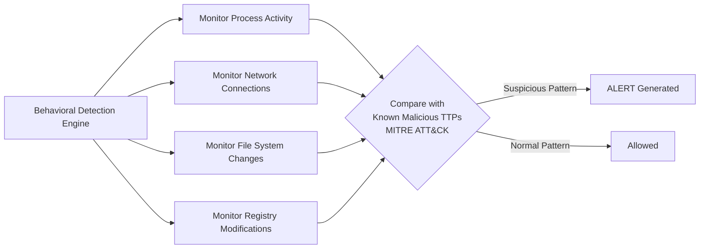
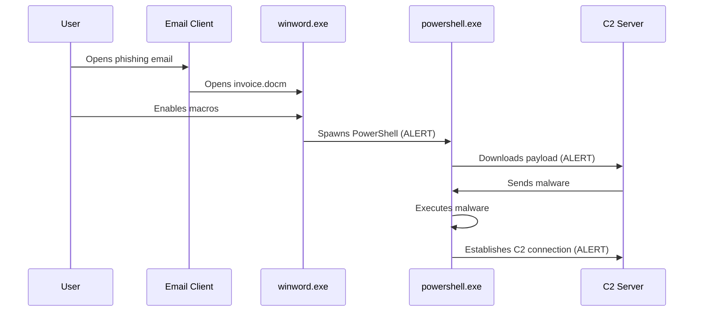
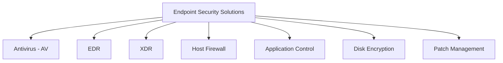
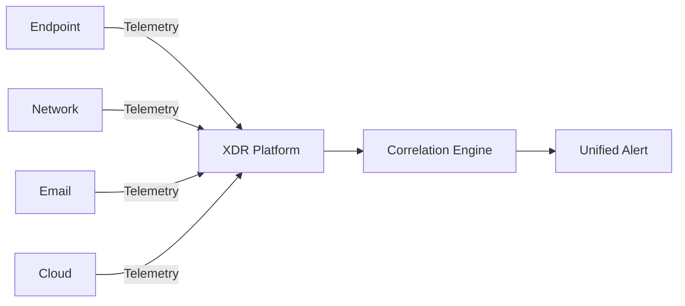
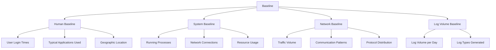
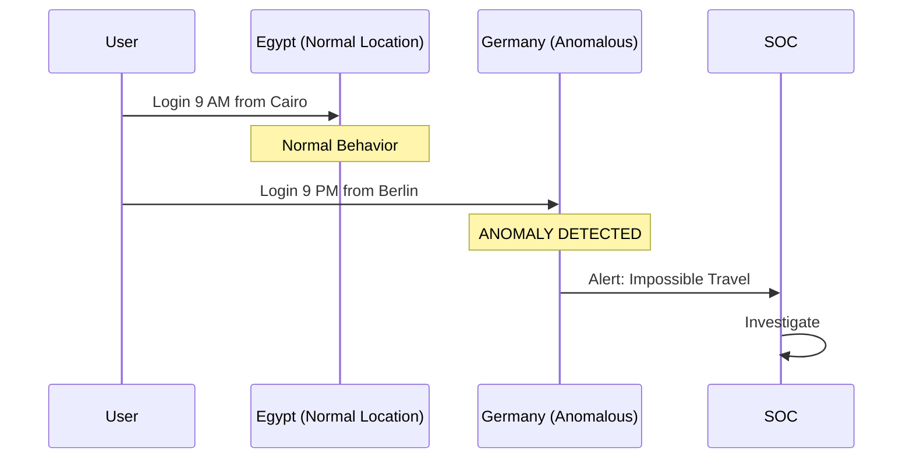

> **الهدف من الـ Section ده:**  
> هتعرف يعني إيه Endpoint وليه حمايته مهمة في أي Organization، وهتفهم الفرق بين Signature-based وBehavioral Detection. كمان هتشوف إزاي الـ EDR بيكتشف التهديدات ويحمي الأجهزة من الهجمات المتقدمة، وهتتعرف على مفهوم الـ Baseline وإزاي بيساعد الـ SOC Team يفرق بين النشاط الطبيعي وأي سلوك مشبوه.
---


## Table of Contents

- [What is an Endpoint](#what-is-an-endpoint)
- [Signature-based Detection](#signature-based-detection)
- [Import Hashing - ImpHash](#import-hashing---imphash)
- [Behavioral Detection](#behavioral-detection)
- [Endpoint Security Solutions](#endpoint-security-solutions)
- [Baselines](#6-baselines)
- [Summary](#summary)

---

## What is an Endpoint

الـ **Endpoint** هو أي Device بيتوصل على الـ Network، سواء كان:
- Laptop أو Desktop
- Mobile Phone أو Tablet
- Server
- Printer أو IoT Device

بمعنى تاني، أي حاجة ليها IP Address وبتتكلم على الشبكة هي Endpoint.

### ليه Endpoint Security مهمة؟

```
Attacker → [Internet] → Endpoint (First Point of Entry) → Network
```

الـ Endpoint هي **أول نقطة دخول** للـ Attacker في معظم الـ Incidents، سواء عن طريق:
- Phishing Email بيوصل للـ User
- Malicious USB
- Vulnerable Software على الجهاز

> [!IMPORTANT]
> الـ Endpoint Security مش بس عن منع الـ Attacks، هي كمان بتدي الـ SOC Team **Visibility** كاملة على اللي بيحصل على كل جهاز في الشبكة، وبتساعد في تحديد الـ Root Cause في معظم الـ Incidents.

> [!WARNING]
> الـ Endpoint Security بتعتمد بشكل كبير على **Employee Awareness**، لأن الـ User نفسه غالباً هو أضعف حلقة في السلسلة.

---

## Signature-based Detection

### الفكرة الأساسية

الـ Signature-based Detection بتشتغل زي الـ Wanted List — عندك قاعدة بيانات فيها "بصمات" الـ Malware المعروفة، وأي File بييجي بتقارنه بالقاعدة دي.



### إيه الـ Signature؟

الـ Signature ممكن تكون:

| نوع الـ Signature | مثال |
|---|---|
| **File Hash** (MD5 / SHA256) | `d41d8cd98f00b204e9800998ecf8427e` |
| **Byte Sequence** | `A1 B2 C3 D4 E5` في مكان معين في الـ File |
| **Malicious String** | URL أو Registry Key معروف بيستخدمه Malware |
| **Code Pattern** | تسلسل معين من الـ Instructions |

### إزاي بتتعمل الـ Signature؟



الـ Security Researchers بياخدوا Sample من الـ Malware، بيعملوا Reverse Engineering عليه، بيستخرجوا الـ Pattern الفريد بتاعه، وبيضيفوه للـ Database.

### حدود الـ Signature-based Detection

> [!WARNING]
> الـ Antivirus بيعمل Update للـ Database باستمرار، لكن عنده مشكلتين أساسيتين:
> 1. **Zero-Day Attacks**: لو الـ Malware جديد ومحدش شافه قبل كده، مفيش Signature ليه في الـ Database.
> 2. **Easy Evasion**: أصغر تغيير في الـ File (حتى byte واحد) بيغير الـ Hash بالكامل، يعني الـ Malware بيفلت من الـ Detection ببساطة.

```
Original Malware Hash:  d41d8cd98f00b204e9800998ecf8427e  → DETECTED
Modified Malware Hash:  a87ff679a2f3e71d9181a67b7542122c  → NOT DETECTED
```

> [!TIP]
> رغم كده، الـ Antivirus لسه مهم وبنستخدمه لأنه **سريع جداً وكفء** في اكتشاف الـ Known Threats، وبيوفر Layer تانية من الـ Defense.

---

## Import Hashing - ImpHash

### المشكلة اللي ImpHash بتحلها

بما إن أي تغيير صغير في الكود بيغير الـ Hash بالكامل، الـ Attackers عملوا حاجة بسيطة جداً — غيروا byte واحد أو أضافوا Comment، والـ File بقى مختلف تماماً بالنسبة للـ Antivirus.

الحل كان التفكير في طريقة Hash تعتمد على حاجة **أصعب في التغيير**.

### ImpHash إيه؟

الـ **ImpHash (Import Hash)** هو Hash مش بيتحسب على كامل الـ File، لكن بيتحسب على:
- الـ **DLLs** اللي الـ Program بيستخدمها (زي `kernel32.dll`، `user32.dll`)
- الـ **Functions** اللي بيعملها Import (زي `CreateFile`، `VirtualAlloc`)



### مثال توضيحي

لو عندنا Malware بيستخدم الـ Functions دي:
```
kernel32.dll: CreateProcess, VirtualAlloc, WriteProcessMemory
wininet.dll: InternetOpen, InternetConnect
```

حتى لو الـ Attacker غير bytes تانية في الـ File، طالما الـ Functions دي بالترتيب ده موجودة، الـ ImpHash هيفضل نفسه.

### مميزات وعيوب ImpHash

| الجانب | التفاصيل |
|---|---|
| **المميزات** | مقاومة للتغييرات الصغيرة في الكود |
| **العيب الأول** | يشتغل بس على **Windows PE Files** (.exe, .dll) |
| **العيب التاني** | سهل التحايل عليه بالنسبة للـ Advanced Attackers (بس صعب أكتر من Hash العادي) |
| **استخدام SOC** | بيستخدمه الـ SOC Team في الـ Threat Hunting |

> [!IMPORTANT]
> **SOC Notice مهم جداً:** لو اكتشفت Malware، **لا تبدأ الـ Incident Response فوراً** من غير ما تعمل Analysis وValidation الأول. اعرف الـ Scope الكاملة للـ Incident الأول — "Scope First". الحركة السريعة من غير فهم ممكن تأدي لـ Conclusions غلط وتعقيد الموضوع أكتر.

---

## Behavioral Detection

### الفلسفة المختلفة

الـ Signature-based Detection بتسأل: **"الـ File ده مين؟"**
الـ Behavioral Detection بتسأل: **"الـ File ده بيعمل إيه؟"**



### مثال على Behavioral Chain

```
winword.exe
    └─ spawns → powershell.exe
                    └─ downloads → payload.exe  (HTTP to external IP)
                                       └─ connects to → C2 Server
```

الـ Chain ده مثال كلاسيكي لـ Malicious Behavior — حتى لو الـ Hash جديد وما في Signature ليه، الـ Behavior نفسه هو اللي بيطلق الـ Alert.

### ربط بـ MITRE ATT&CK

الـ Behavioral Detection مبنية أساساً على الـ **TTPs (Tactics, Techniques, and Procedures)** اللي بيرصدها الـ MITRE ATT&CK Framework:

| الـ Tactic | مثال في سيناريو Phishing |
|---|---|
| **Initial Access** | Phishing Email |
| **Execution** | Macros في Word Document |
| **Defense Evasion** | Obfuscated PowerShell Command |
| **Command & Control** | Connection to External C2 Server |

### سيناريو حقيقي خطوة بخطوة



### ليه Behavioral Detection أقوى؟

> [!IMPORTANT]
> الـ Behavioral Detection:
> - **بيكتشف Zero-Day Malware** — حتى لو مفيش Signature ليه
> - **بيكتشف Fileless Attacks** — اللي بتشتغل في الـ Memory من غير ما تكتب File على الـ Disk
> - **أصعب بكتير في التحايل عليه** — لأن الـ Attacker لازم يغير طريقة هجومه بالكامل

### أهم Solution بتستخدم Behavioral Detection

الـ **EDR (Endpoint Detection & Response)** هو الـ Solution الأشهر اللي بيعتمد على الـ Behavioral Detection.

معظم الـ Organizations بتستخدم الاتنين مع بعض:
- **Antivirus**: للـ Known Threats (سريع وخفيف)
- **EDR**: للـ Zero-Day والـ Advanced Attacks (أعمق وأكثر تفصيلاً)

---

## Endpoint Security Solutions



### الـ Solutions بالتفصيل

#### Antivirus (AV)
- النوع: **Signature-based**
- بيعمل إيه: بيقارن الـ Files بـ Database من الـ Known Malware Signatures
- القوة: سريع، خفيف، فعال ضد الـ Known Threats
- الضعف: مش فعال ضد الـ Zero-Day والـ Fileless Attacks

---

#### EDR (Endpoint Detection & Response)
- النوع: **Behavior-based**
- بيعمل إيه:
  - بيراقب نشاط الـ Endpoint في Real-Time
  - بيسجل الـ Telemetry (كل العمليات والاتصالات)
  - بيكتشف الـ Suspicious Behavior بناءً على الـ TTPs
- القوة: بيكتشف الـ Advanced Attacks والـ Zero-Day
- أمثلة: CrowdStrike Falcon, Microsoft Defender for Endpoint, SentinelOne

---

#### XDR (Extended Detection & Response)
- النوع: **Correlated Multi-source Detection**
- بيعمل إيه: بيجمع الـ Telemetry من مصادر متعددة ويحللها مع بعض



- القوة: **Broader Visibility** — بيشوف الـ Attack الكاملة من بدايتها للنهاية عبر كل الـ Layers

---

#### Host Firewall
- النوع: **Traffic Control**
- بيعمل إيه: بيتحكم في الـ Inbound والـ Outbound Traffic على مستوى الـ Device
- القوة: بيمنع الـ Unauthorized Access ويقلل الـ Lateral Movement

---

#### Application Control
- النوع: **Whitelisting**
- بيعمل إيه: بيسمح بس للـ Approved Applications إنها تشتغل
- القوة: حتى لو الـ Malware دخل، مش هيقدر يتنفذ لو مش في الـ Whitelist

---

#### Disk Encryption
- النوع: **Data Protection at Rest**
- بيعمل إيه: بيعمل Encrypt لكل البيانات على الـ Disk
- القوة: لو الجهاز اتسرق أو اتفقد، البيانات مش هتتقرأ من غير الـ Key
- أمثلة: BitLocker (Windows), FileVault (macOS)

---

#### Patch Management
- النوع: **Vulnerability Remediation**
- بيعمل إيه: بيضمن إن كل الـ Systems والـ Applications محدثة بآخر الـ Security Patches
- القوة: بيغلق الـ Known Vulnerabilities اللي الـ Attackers ممكن يستغلوها

> [!TIP]
> الـ Solutions دي مش بديلة عن بعض، هي **Complementary** — كل واحدة بتغطي Layer مختلفة في الـ Defense-in-Depth Strategy.

---

## Baselines

### إيه هو الـ Baseline؟

الـ **Baseline** هو صورة واضحة لـ "الـ Normal" في بيئتك — اعرف اللي طبيعي عشان تعرف اللي غريب.

> [!IMPORTANT]
> المبدأ الأساسي للـ Baseline: **"Know what normal looks like → detect what's abnormal"**

### أنواع الـ Baselines



### الـ Human Baseline

الـ SOC Team محظوظة لأن في الغالب فيه **IT Administrators** عندهم خبرة طويلة في البيئة وعارفين كل حاجة طبيعية فيها.

الناس دي **Asset قيّم جداً** — في أي Investigation، تقدر ترجعلهم وتسألهم:
- "هل من الطبيعي إن الـ Server ده بيعمل كذا؟"
- "هل الـ User ده بيستخدم PowerShell عادةً؟"

> [!TIP]
> من خبرة عملية: هترجع للـ IT Admin كتير جداً في الـ SOC Work — اعتبره جزء أساسي من الـ Investigation Process.

### بناء الـ Baseline

عشان تبني Baseline صح، لازم تجمع بيانات على مدى وقت كافي وتحدد:

| العنصر | الأسئلة اللي المفروض تجاوب عليها |
|---|---|
| **Login Patterns** | إمتى المستخدم بيتلوج؟ من فين؟ بأي Device؟ |
| **Applications** | إيه الـ Applications اللي بيفتحها بانتظام؟ |
| **Network Traffic** | أنهي Domains بيتصل بيها؟ كام بيانات بيعدي؟ |
| **Log Volume** | كام Log بييجي من كل System في اليوم؟ |
| **System Access** | أنهي Servers بتتوصل بيها؟ في أنهي أوقات؟ |

### مثال عملي - Volume-based Anomaly

```
Normal:     100 Login Events / Day    ✓
Anomaly:   5000 Login Events / Day    ← INVESTIGATE
```

لو شايف 5000 Login في يوم واحد بدل الـ 100 الطبيعيين، ده Indicator واضح إن في حاجة مش طبيعية — ممكن يكون Brute Force Attack.

### مثال عملي - Geographic Anomaly



اليوزر بيتلوج من مصر الصبح والساعة 9 بالليل بيتلوج من ألمانيا — ده مستحيل جغرافياً ويُعرف بالـ **Impossible Travel**.

### إزاي EDR بيستخدم Baselines

الـ EDR بيبني Baseline للكل User وكل Endpoint:

**مرحلة التعلم:**
```
User: Ahmed
- Login Time: 9 AM - 5 PM
- Applications: outlook.exe, chrome.exe, excel.exe
- Network: mail.company.com, internal servers
```

**مرحلة الـ Detection:**
```
Ahmed logs in at 3 AM           → ALERT (Time Anomaly)
Runs powershell.exe -enc ...    → ALERT (Encoded Command)
Connects to 45.33.22.11         → ALERT (Unknown External IP)
```

### تحديات الـ Baselines

> [!WARNING]
> **False Positives وAlert Fatigue** هما أكبر تحديين في الـ Baseline Detection:
> - لو الـ Thresholds ضيقة أوي، هتبقى فيه Alerts كتير جداً على حاجات طبيعية
> - الـ Alert Fatigue بتخلي الـ SOC Analysts يبدأوا يتجاهلوا الـ Alerts — وده خطير جداً
> - إنشاء Baseline دقيق ومستقر هو في حد ذاته عملية صعبة ومعقدة

> [!IMPORTANT]
> **Tuning** الـ Detection Sensitivity هو جزء أساسي من شغل الـ SOC Team — مش بس بتبني الـ Baseline وتسيبه، محتاج تراجعه وتضبطه باستمرار.

---

## Summary

### الملخص

- **الـ Endpoint** هو أي Device متصل بالشبكة، وهو أول نقطة دخول للـ Attackers، والـ EDR بيدي الـ SOC Team Visibility كاملة عليه.

- **Signature-based Detection** بتشتغل عن طريق مقارنة الـ Files بـ Database من الـ Known Malware — سريعة وفعالة ضد الـ Known Threats، لكن سهل التحايل عليها بأي تغيير بسيط في الـ File.

- **ImpHash** هو تحسين على الـ Hash العادي بيعتمد على الـ Imported DLLs والـ Functions بدل الـ File Content كلها — بيصعّب الـ Evasion بس مش مستحيل، وبيشتغل بس على Windows PE Files.

- **Behavioral Detection** هي الـ Approach الأقوى — بدل ما تتسأل "الـ File ده مين؟" بتتسأل "بيعمل إيه؟" — بتكتشف Zero-Day وFileless Attacks وأصعب في التحايل عليها.

- **Endpoint Security Solutions** متعددة ومتكاملة: AV للـ Known Threats، EDR للـ Advanced Threats، XDR للـ Correlation عبر كل الـ Layers، بجانب Host Firewall وApplication Control وDisk Encryption وPatch Management.

- **Baselines** هي صورة الـ "Normal" في بيئتك — بتساعدك تكتشف الـ Anomalies سواء كانت Volume-based أو Time-based أو Geographic. أكبر تحدي فيها هو الـ False Positives والـ Alert Fatigue.

> [!TIP]
> **Takeaway للـ SOC Analyst:** المعادلة الذهبية هي AV + EDR + Baselines. الـ AV للسرعة، الـ EDR للعمق، والـ Baselines للـ Context — الثلاثة مع بعض بيديك picture كاملة عن أي Endpoint في شبكتك.
