> **الهدف من الـ Section ده:**  
> هتفهم إيه هو الـ IAM وليه هو من أهم المفاهيم في الـ Cybersecurity، وهتعرف الفرق بين الـ Authentication Levels وإزاي الـ SSO بيسهّل الحياة على اليوزرز وعلى الـ Security Team في نفس الوقت.
---
## Table of Contents

[What is IAM?](#what-is-iam)
[The Three Core Questions of IAM](#the-three-core-questions-of-iam)
[Authenticator Assurance Levels (AAL)](#authenticator-assurance-levels-aal)
   - [AAL1 — Single Factor](#aal1--single-factor)
   - [AAL2 — Two Factors](#aal2--two-factors)
   - [AAL3 — Hardware-Based (Phishing Resistant)](#aal3--hardware-based-phishing-resistant)
   - [NIST and the Role of Standards](#nist-and-the-role-of-standards)
   - [GRC — Who Enforces the Standards?](#grc--who-enforces-the-standards)
[Single Sign-On (SSO)](#single-sign-on-sso)
   - [How SSO Works](#how-sso-works)
   - [Active Directory as SSO](#active-directory-as-sso)
   - [Federation and Common Protocols](#federation-and-common-protocols)
[Summary](#summary)

---

## What is IAM?

**Identity and Access Management (IAM)** هو الـ Framework اللي بيضمن إن الـ Right Entities — سواء كانوا ناس أو Services أو Applications — عندهم الـ Appropriate Access للـ Right Resources في الـ Right Time.

بمعنى أبسط: الـ IAM هو اللي بيتحكم في **مين يقدر يدخل على إيه ومتى**.

```
IAM = Who + What + When + Why
```

> [!IMPORTANT]
> الـ IAM مش بس عن الـ Passwords. ده Framework كامل بيشمل كيف بنتحقق من هوية الناس، وإيه اللي مسموح لهم يعملوه، وإزاي بنراقب كل ده.

---

## The Three Core Questions of IAM

الـ IAM بيجاوب على 3 أسئلة أساسية:

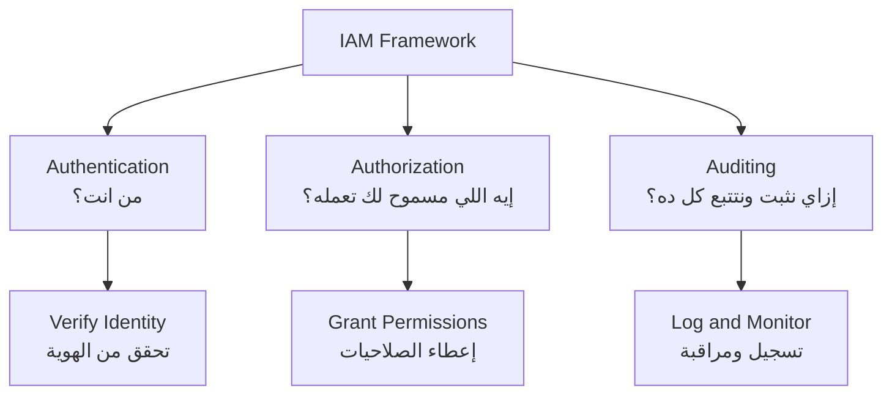

| السؤال | المصطلح | المعنى |
|---|---|---|
| من أنت؟ | **Authentication** | التحقق من هوية المستخدم |
| إيه اللي مسموح لك تعمله؟ | **Authorization** | تحديد الصلاحيات المتاحة |
| إزاي نثبت ونتتبع كل ده؟ | **Auditing** | تسجيل ومراجعة كل العمليات |

> [!NOTE]
> الـ Authentication والـ Authorization دايمًا بييجوا مع بعض، بس مهم تفرق بينهم. تقدر تكون **Authenticated** (ثبتّ هويتك) بس مش **Authorized** (مش عندك صلاحية) تعمل حاجة معينة.

---

## Authenticator Assurance Levels (AAL)

الـ **AAL (Authenticator Assurance Levels)** هي مستويات بتحدد **قوة الـ Authentication Mechanism** المستخدمة للتحقق من هوية اليوزر. دي معايير بتحددها **NIST**.

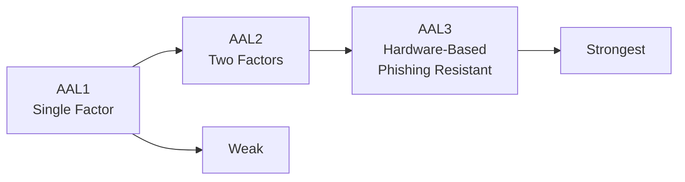

---

### AAL1 — Single Factor

ده أضعف مستوى في الـ AAL. بيعتمد على **عامل واحد بس** للتحقق من الهوية.

**المثال الأوضح:** Username + Password

```
User enters: username → password → Access Granted
```

> [!WARNING]
> الـ AAL1 بيُعتبر ضعيف في الأنظمة الحساسة لأن لو حد عرف الـ Password بتاعك، خلاص قدر يدخل. مفيش طبقة حماية تانية.

---

### AAL2 — Two Factors

في الـ AAL2 بقى، لازم يتم استخدام **عاملين مختلفين** للتحقق من الهوية.

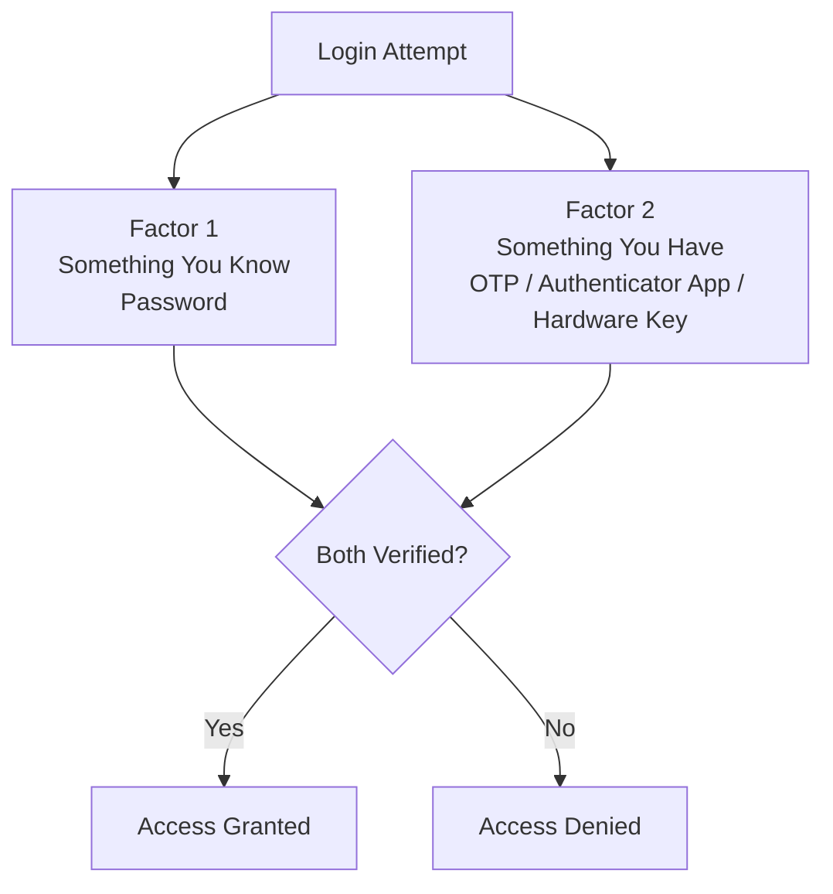

العوامل المستخدمة في الـ AAL2:

| العامل | النوع | المثال |
|---|---|---|
| **Something You Know** | معلومة تعرفها | Password, PIN |
| **Something You Have** | شيء عندك | OTP, Authenticator App, Hardware Key |
| **Something You Are** | صفة فيك | Fingerprint, Face ID |

> [!NOTE]
> في الـ AAL2 لازم يكون العاملين من **نوعين مختلفين**. مثلاً Password + OTP ده AAL2، أما Password + Security Question فده مش AAL2 لأن الاتنين من نوع "Something You Know".

---

### AAL3 — Hardware-Based (Phishing Resistant)

ده أقوى مستوى، وبيُعتبر **Resistant to Phishing**. بيتطلب:

1. **Hardware-Based Authenticator** — زي USB Security Key (FIDO2)
2. **Verifier Impersonation Resistance** — يعني حتى لو حد عمل Fake Website أو Phishing Site، الـ Key مش هيشتغل لأنه بيتحقق من الـ Domain الحقيقي

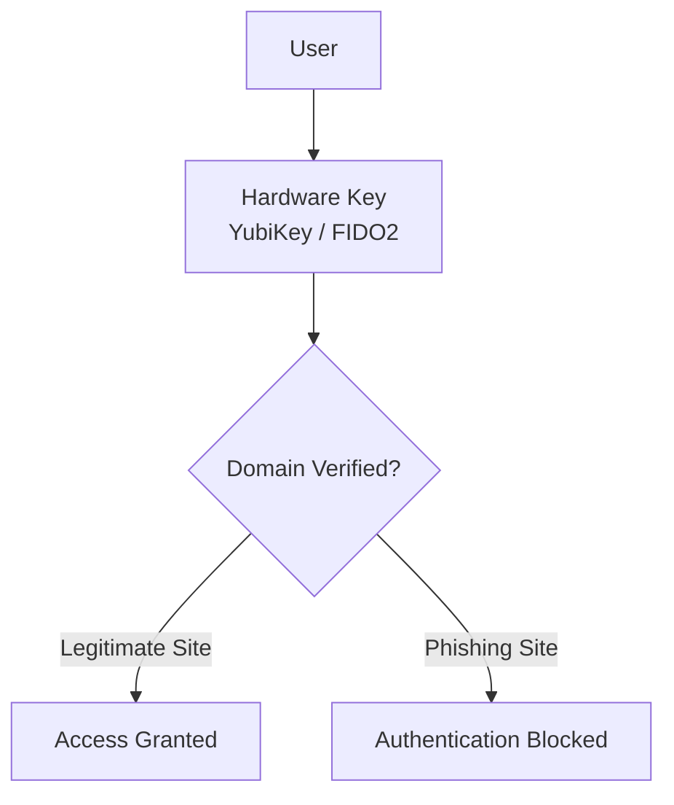

> [!IMPORTANT]
> الـ AAL3 مش بيُطلب في كل حاجة. بيتطبق على الأنظمة الأكثر حساسية زي الـ Databases الحساسة، والـ Admin Panels، وأي نظام فيه بيانات Critical.

**أمثلة على متى يُطبق كل مستوى:**

| الخدمة | المستوى المناسب |
|---|---|
| موقع إخباري عام | AAL1 |
| حساب بنكي | AAL2 |
| نظام إدارة قاعدة بيانات حساسة | AAL3 |
| لوحة تحكم الـ Admin | AAL3 |

---

### NIST and the Role of Standards

**NIST (National Institute of Standards and Technology)** هي منظمة حكومية أمريكية بتعمل **Technical Standards وGuidelines** بتساعد المؤسسات إنها تأمن أنظمتها وبياناتها.

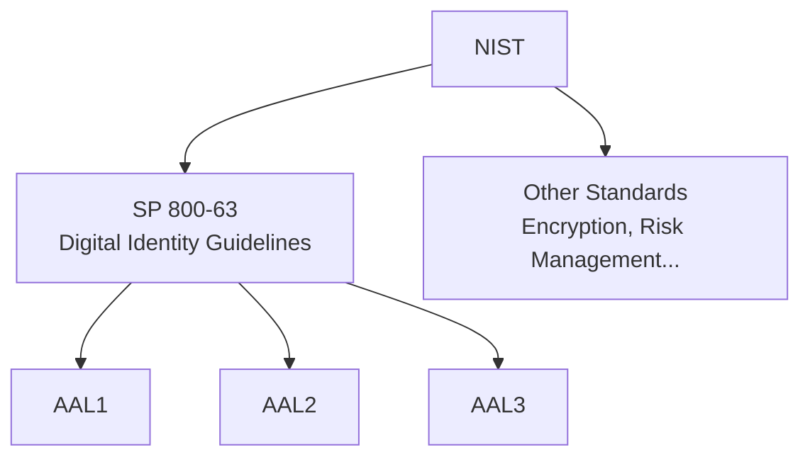

> [!NOTE]
> الـ NIST مش بتفرض القوانين، هي بتعمل **Guidelines وStandards** اللي الشركات والحكومات بتتبناها. الـ AAL مثلاً موجود في الـ **NIST SP 800-63B**.

---

### GRC — Who Enforces the Standards?

بعد ما عرفنا إن في Standards زي الـ AAL، السؤال هو **مين المسؤول إن الـ Standard ده يتطبق فعلاً؟**

الجواب هو: الـ **GRC Employee**.

**GRC = Governance, Risk, and Compliance**

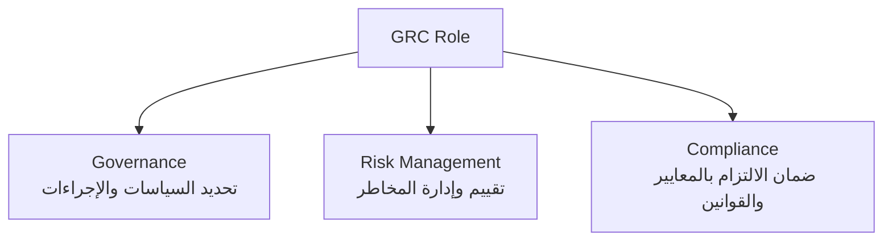

| الجزء | المعنى | مثال |
|---|---|---|
| **Governance** | تحديد السياسات والإجراءات اللي المؤسسة هتتبعها | كتابة Policy بتقول "كل اليوزرز لازم يستخدموا MFA" |
| **Risk** | تقييم وإدارة المخاطر | تحديد إن نظام معين ليه Risk عالي ويحتاج AAL3 |
| **Compliance** | ضمان إن المؤسسة ملتزمة بالـ Standards والقوانين | التأكد إن التطبيق متوافق مع NIST أو ISO 27001 |

> [!TIP]
> لو بتفكر في الـ Cybersecurity كـ Career، الـ GRC مجال مستقل ومهم جداً. مش لازم تكون Technical بنسبة 100%، لكن لازم تفهم الـ Standards والـ Regulations.

---

## Single Sign-On (SSO)

**Single Sign-On (SSO)** هي تقنية بتخلي اليوزر يعمل **Authentication مرة واحدة بس** باستخدام Credentials واحدة، وبعدين يقدر يدخل على **أكتر من Resource أو Application** من غير ما يدخل الـ Password تاني.

> [!NOTE]
> الـ SSO مبني على مفهوم "authenticate once, access many". ده بيوفر تجربة أفضل للمستخدم وأمان أعلى بسبب تقليل عدد الـ Passwords المستخدمة.

---

### How SSO Works

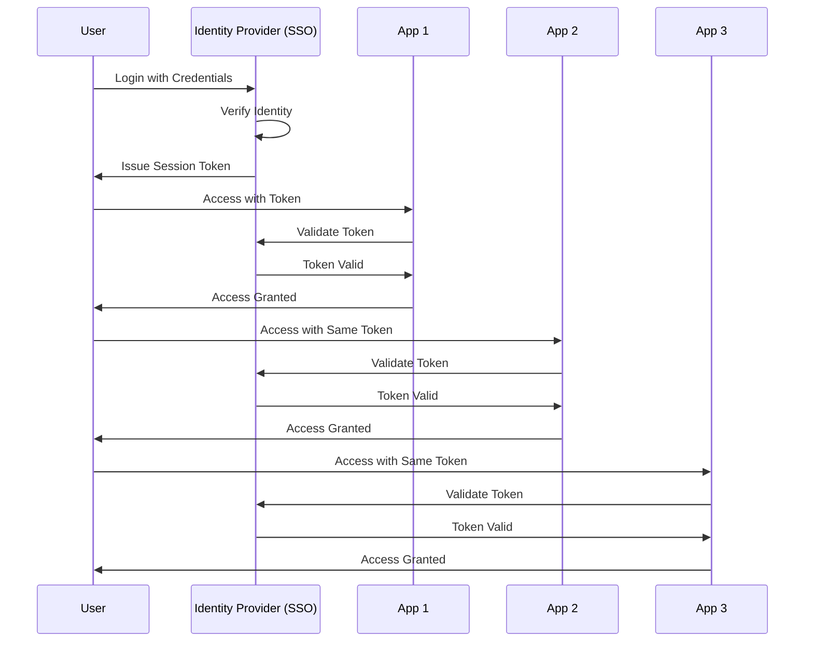

اليوزر بيعمل Login مرة واحدة، والـ Identity Provider بيعطيه **Token**، وبعدين كل Application بتتحقق من الـ Token ده بدل ما تطلب من اليوزر يدخل الـ Password تاني.

---

### Active Directory as SSO

واحدة من أشهر تطبيقات الـ SSO في البيئات المؤسسية هي الـ **Microsoft Active Directory**.

**Active Directory** بيعمل إيه؟

- هو **Central Directory Service** — يعني مكان مركزي لإدارة هويات المستخدمين
- بيخليك تعمل User مرة واحدة في مكان واحد
- الـ User ده بيقدر يـ Authenticate على **خدمات مختلفة كتير**

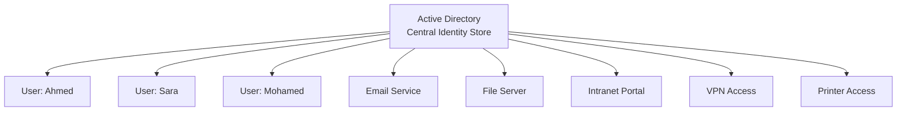

> [!IMPORTANT]
> بدل ما كل Application تعمل نظام Authentication بتاعها، الـ Active Directory بيعمل ده مركزيًا. ده بيعني إنك لو شلت يوزر من الـ AD، تلقائياً مش هيقدر يدخل على أي حاجة.

**مثال عملي:**

تخيل شركة فيها 500 موظف و20 نظام مختلف. بدون SSO:
- كل موظف عنده 20 Username و20 Password مختلفة
- الـ IT بيضطر يعمل Account لكل موظف في كل نظام

مع الـ Active Directory:
- كل موظف عنده Username وPassword واحدة
- الـ IT بيعمل Account واحد في الـ AD، والباقي بيتم تلقائياً

---

### Federation and Common Protocols

الـ **Federation** هي امتداد لفكرة الـ SSO — بيخلي اليوزر يـ Authenticate مع **Identity Provider واحد** ويقدر يدخل على **أنظمة في مؤسسات مختلفة**.

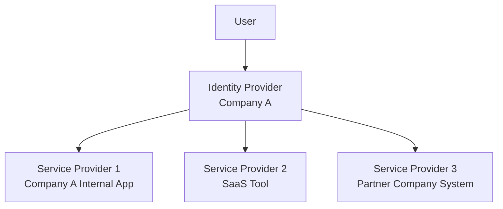

**البروتوكولات المستخدمة في الـ Federation والـ SSO:**

| البروتوكول | الاسم الكامل | الاستخدام |
|---|---|---|
| **SAML** | Security Assertion Markup Language | بيُستخدم في Enterprise SSO، بيعمل Assertion بـ XML |
| **OAuth 2.0** | Open Authorization | بيُستخدم في Authorization للـ Third-party Apps |
| **OIDC** | OpenID Connect | بيُبنى فوق OAuth 2.0، بيضيف Authentication |

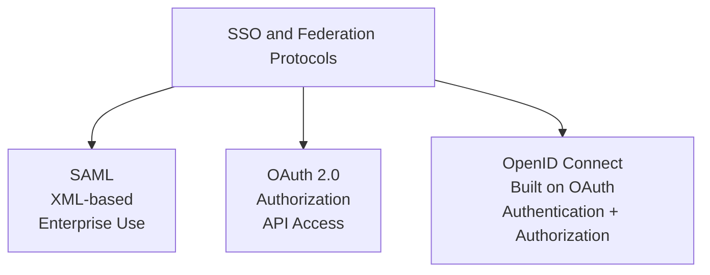

> [!NOTE]
> الفرق بين **OAuth** و**OIDC**: الـ OAuth بيعمل Authorization بس (تسمح لتطبيق يوصل لبياناتك). الـ OIDC بيضيف فوق ده الـ Authentication (بيتحقق فعلاً من هوية اليوزر).

**مثال حياتي:**

لما بتضغط "Login with Google" على أي موقع:
- الـ Google هنا هو الـ **Identity Provider**
- الموقع ده هو الـ **Service Provider**
- الـ OIDC أو OAuth هو الـ **Protocol** المستخدم
- ده ده الـ **Federation** في العمل

> [!TIP]
> الـ SSO بيحسن الأمان من ناحيتين: أولاً بيقلل عدد الـ Passwords اللي لازم اليوزر يتذكرها (وبالتالي بيقلل الـ Password Reuse)، وثانيًا بيخلي الـ IT Team تقدر تعمل Revoke للـ Access بتاع أي يوزر في مكان واحد بس.

---

## Summary

### أهم النقاط اللي اتكلمنا عنها في الـ IAM

- **IAM** هو الـ Framework اللي بيضمن إن الصح من الناس بيوصل للصح من الـ Resources في الوقت الصح، وبيجاوب على 3 أسئلة: **Authentication** (مين أنت؟)، **Authorization** (إيه اللي مسموح لك؟)، **Auditing** (إزاي نتتبع كل ده؟).

- **AAL (Authenticator Assurance Levels)** هي معايير بتحدد قوة الـ Authentication بـ 3 مستويات:
  - **AAL1**: عامل واحد (Password فقط) — الأضعف
  - **AAL2**: عاملين مختلفين (Password + OTP مثلاً) — وسط
  - **AAL3**: Hardware-Based وPhishing Resistant — الأقوى

- **NIST** هي المنظمة الأمريكية المسؤولة عن إنشاء الـ Standards والـ Guidelines الأمنية، ومنها الـ AAL.

- **GRC** هو الدور المسؤول عن ضمان تطبيق هذه المعايير داخل المؤسسات — وبيشمل **Governance** و**Risk Management** و**Compliance**.

- **SSO (Single Sign-On)** بيخلي اليوزر يـ Authenticate مرة واحدة ويوصل لأكتر من نظام، وأشهر تطبيقاته هو **Microsoft Active Directory**.

- **Federation** بتمتد فكرة الـ SSO لأكتر من مؤسسة، وبتستخدم بروتوكولات زي **SAML** و**OAuth 2.0** و**OIDC**.

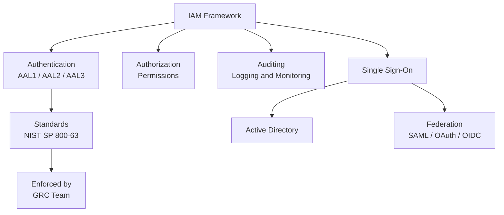
