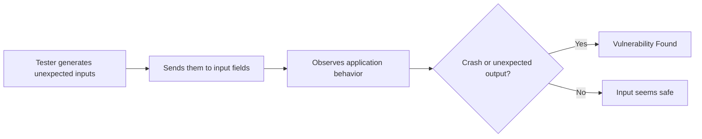
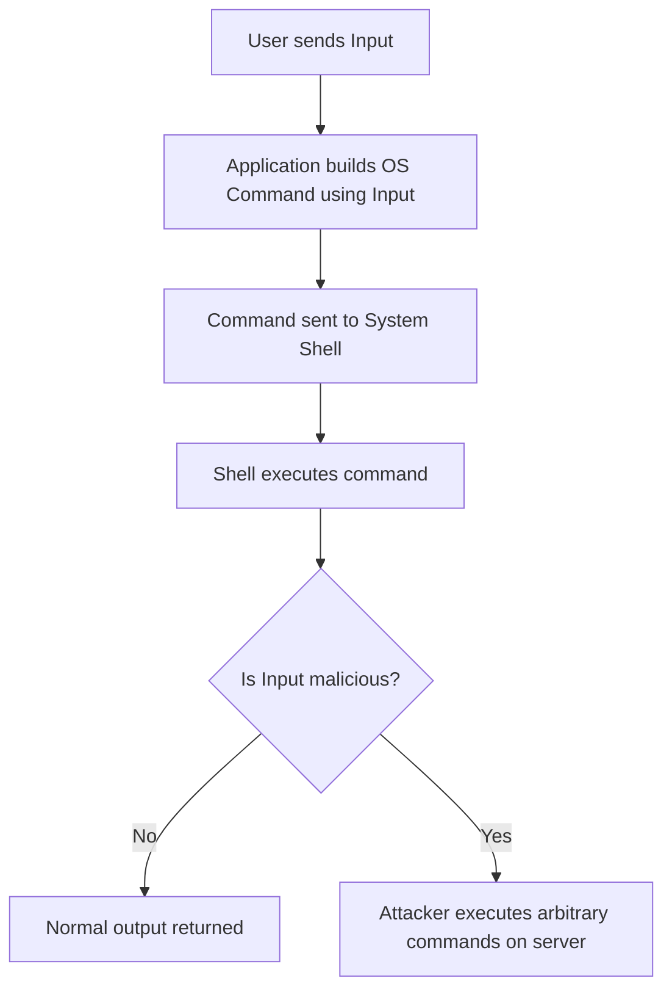
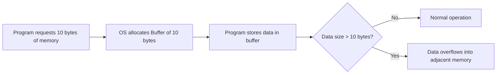
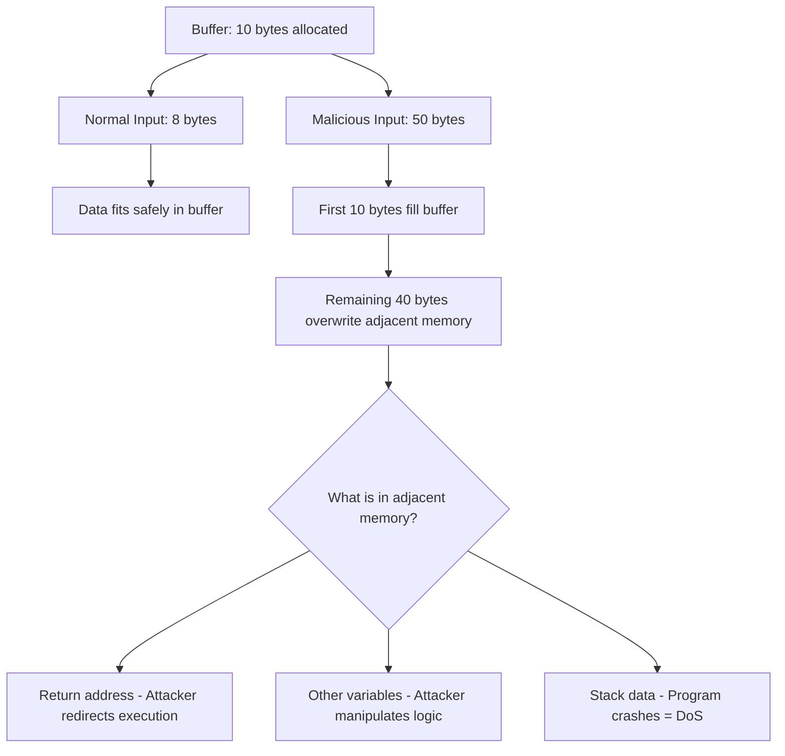
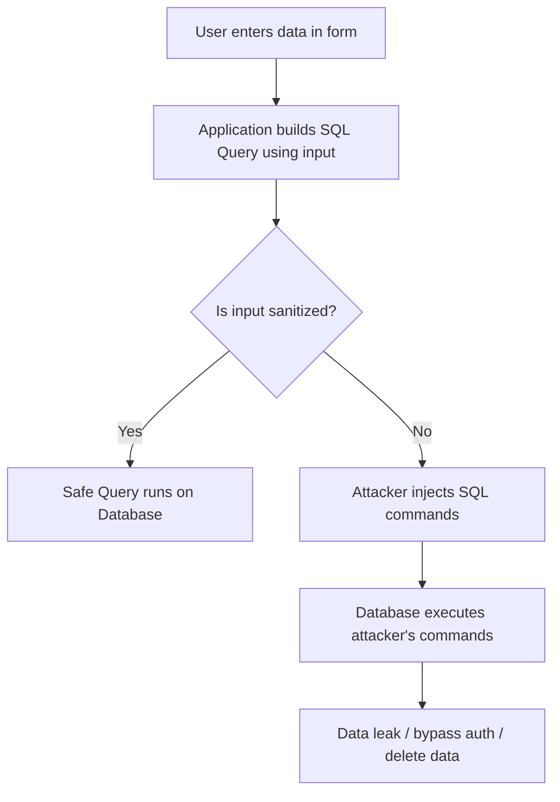
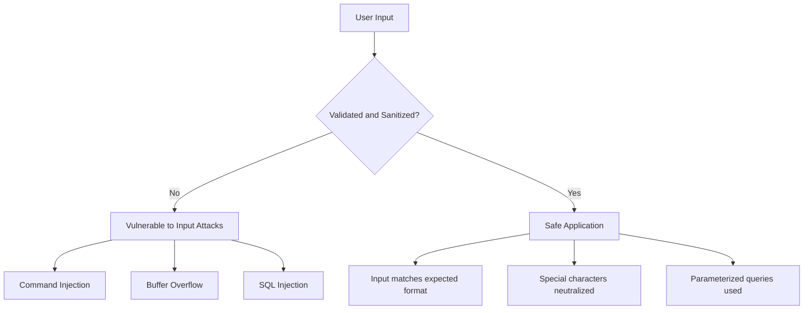

> **الهدف من الـ Section ده:**  
> هتفهم إيه هي الـ Input Attacks وإزاي الـ Attackers بيستغلوا الـ User Input عشان يتحكموا في الـ Application، وهتعرف الفرق بين Command Injection وBuffer Overflow وSQL Injection، وإزاي تتعامل معاها كـ Defender أو Developer.

---

## Table of Contents

- [What are Input Attacks?](#what-are-input-attacks)
- [Where Do Input Attacks Happen?](#where-do-input-attacks-happen)
- [How to Mitigate Input Attacks](#how-to-mitigate-input-attacks)
- [OS Command Injection](#os-command-injection)
  - [How it Works](#how-it-works)
  - [Real-World Example](#real-world-example)
  - [Prevention](#prevention)
- [Buffer Overflow](#buffer-overflow)
  - [How Memory Buffers Work](#how-memory-buffers-work)
  - [What Happens During Overflow](#what-happens-during-overflow)
- [SQL Injection (SQLi)](#sql-injection-sqli)
  - [How it Works](#how-it-works)
  - [Real-World Example](#real-world-example)
  - [Breaking Down the Query](#breaking-down-the-query)
- [Comparison Table](#comparison-table)
- [Summary](#summary)

---

## What are Input Attacks?

الـ **Input Attacks** هي نوع من الـ Cyberattacks اللي فيها الـ Attacker بيعدّل على الـ Data اللي بيبعتها للـ Application، بدل ما يبعت Input عادي، بيبعت Input خبيث عشان يخلي الـ Application يتصرف بطريقة غلط أو ضارة.

ببساطة: الـ Application شايف إن الـ User بيدخل بيانات عادية، لكن في الحقيقة الـ Attacker بيدخل **Commands أو Code**.

```
Normal Input:   username = "ahmed"
Malicious Input: username = "ahmed; cat /etc/passwd"
```

> [!IMPORTANT]
> الـ Root Cause دايمًا واحد: الـ Developers بيثقوا في الـ User Input من غير ما يعملوا Validation أو Sanitization كويسة.

**ليه بيحصل ده؟**
- الـ Developer مش بيفكر إن الـ User ممكن يبعت Input غير متوقع.
- الـ Application بياخد الـ Input وبيستخدمه مباشرةً في عمليات حساسة زي Database Queries أو System Commands.
- مفيش **Input Validation** — يعني مفيش check إن الـ Input بالشكل الصح.
- مفيش **Input Sanitization** — يعني مفيش تنظيف للحروف الخطيرة زي `'`, `;`, `--`.

---

## Where Do Input Attacks Happen?

الـ Input بييجي من أماكن كتير في أي Application، وكل مكان ممكن يبقى نقطة هجوم:

| Input Source | Example |
|---|---|
| **Login Forms** | Username / Password fields |
| **Search Bars** | Search queries sent to DB |
| **URL Parameters** | `example.com/page?id=5` |
| **HTTP Headers** | `User-Agent`, `Cookie`, `Referer` |
| **File Uploads** | Uploading a file with malicious name/content |
| **APIs** | JSON/XML body sent to backend |

> [!WARNING]
> أي مكان بيقبل Input من الـ User هو **Attack Surface** محتمل. مش بس الـ Forms الظاهرة، حتى الـ Hidden Fields والـ HTTP Headers خطيرة.

---

## How to Mitigate Input Attacks

في استراتيجيتين أساسيتين للتعامل مع الـ Input Attacks:

### Defense from the Developer Side

- **Never trust user input** — خد ده كـ Rule ذهبية: أي Input جاي من الـ User ممكن يكون خبيث.
- **Validate Input** — تأكد إن الـ Input بالـ Format الصح (رقم؟ نص؟ Email؟).
- **Sanitize Input** — نظّف الحروف الخطيرة قبل ما تستخدم الـ Input في أي عملية.
- **Use Allowlists** — قرر إيه المسموح بيه بدل ما تحاول تمنع كل اللي ممنوع.

### Defense from the Tester Side — Fuzzing

الـ **Fuzzing** هو تقنية اختبار بيستخدمها الـ Security Testers، بيبعتوا فيها inputs غريبة أو malformed للـ Application عشان يشوفوا إزاي بيتصرف.



> [!TIP]
> الـ Fuzzing مش بديل عن الـ Secure Coding، هو أداة بتتأكد بيها إن الـ Developer معملش حاجة غلط، وبتكشف الـ Edge Cases اللي الـ Developer ممكن يكون ناسيها.

---

## OS Command Injection

### How it Works

أحيانًا الـ Application محتاج ينفذ أوامر على الـ Operating System — زي إنه يعمل Folder، يرن Ping، أو يجيب Date.

الـ **OS Command Injection** بيحصل لما الـ Application ياخد الـ User Input ويحطه جوا Command بيتبعت للـ System Shell، من غير ما يعمل Validation.



> [!IMPORTANT]
> الـ Shell مش بيفرق بين الـ Command اللي الـ Developer كتبه والـ Command اللي الـ Attacker حقنه، هو بيشيل كل حاجة على إنها أمر يتنفذ.

### Real-World Example

تخيل إن عندنا Mailbox Application بيعمل Folder باسم الـ User عشان يحط فيه الـ Attachments.

الـ Developer كتب الكود ده:

```python
import subprocess

username = input("Enter username: ")
subprocess.run(f"mkdir {username}", shell=True)
```

لو الـ User كتب اسمه عادي: `ahmed`، الـ Command هيبقى:
```bash
mkdir ahmed
```

لكن لو الـ Attacker كتب: `ahmed; cat /etc/passwd`، الـ Command هيبقى:
```bash
mkdir ahmed; cat /etc/passwd
```

الـ Shell هيعمل الـ Folder، وبعدين هيعرض محتوى ملف الـ Passwords الخاص بالـ System!

> [!WARNING]
> الـ Semicolon `;` في Unix/Linux بتخلي الـ Shell ينفذ أكتر من Command في سطر واحد. الـ Attacker بيستخدم زي دي Metacharacters عشان يحقن Commands إضافية.

**Metacharacters شائعة في Command Injection:**

| Symbol | Effect |
|---|---|
| `;` | Run next command regardless |
| `&&` | Run next command if first succeeds |
| `\|\|` | Run next command if first fails |
| `\|` | Pipe output to next command |
| `` ` `` | Execute command inside backticks |
| `$()` | Command substitution |

### Prevention

**الحل الأفضل: استخدم Built-in Libraries بدل System Calls**

❌ **Unsafe — Using System Call:**
```python
import subprocess

# Dangerous: shell=True passes input directly to shell
result = subprocess.run("date", shell=True, capture_output=True)
print(result.stdout)
```

✅ **Safe — Using Built-in Library:**
```python
from datetime import datetime

# No shell involved, no system call
current_date = datetime.now()
print(current_date)
```

> [!NOTE]
> الفرق الجوهري: في الـ Safe Version مفيش Shell بيتشغل خالص. الـ Python Library بتتكلم مباشرةً مع الـ OS API من غير ما تمر بالـ Shell، فمفيش فرصة للـ Injection.

**لو مفيش بديل عن System Calls:**
- استخدم **Allowlist Validation** — اسمح بس بالقيم المتوقعة.
- استخدم **Parameterized Commands** — مش String Concatenation.
- طبّق **Principle of Least Privilege** — الـ Application متشغلش بـ Root.

---

## Buffer Overflow

### How Memory Buffers Work

الـ **Buffer** هو مساحة محدودة في الـ Memory بيخصصها الـ Program لتخزين بيانات مؤقتة.

لما الـ Developer بيكتب Code بيقول للـ OS: "احجزلي مساحة كذا Byte في الـ Memory"، الـ OS بيعمل الـ Buffer بالضبط الحجم ده.



### What Happens During Overflow

الـ **Buffer Overflow** بيحصل لما الـ Program يحاول يكتب في الـ Buffer بيانات أكبر من حجمه، فالبيانات الزيادة بتـ"تفيض" وتكتب فوق الـ Memory المجاورة.

**تخيل الموضوع كده:**
تخيل إن عندك كوباية بتتسع 200ml. لو حاولت تصب فيها 500ml، الـ 300ml الزيادة هتتسكب على الطاولة وتبلل الحاجات اللي جنبها. الـ Buffer في الـ Memory زي الكوباية دي، والـ Memory المجاورة زي الحاجات اللي على الطاولة.



**النتايج الممكنة:**

| Result | Description |
|---|---|
| **Program Crash** | الـ Program بيقفل فجأة — Denial of Service |
| **Data Corruption** | بيانات تانية في الـ Memory بتتبظبط |
| **Arbitrary Code Execution** | الـ Attacker بيعدل على الـ Return Address ويشغل كود خبيث |
| **Privilege Escalation** | لو الـ Program شغال بـ Admin، الـ Attacker بيكسب صلاحيات Admin |

> [!IMPORTANT]
> الـ Buffer Overflow مش بس بيأثر على الـ Security — هو كمان ممكن يعمل Crash تام للـ System. ده معناه إن حتى لو الـ Attacker مش قادر يشغل Code، ممكن يعمل **Denial of Service** بسهولة.

**مثال بسيط:**

```c
// Dangerous C code
char buffer[10];      // Buffer can hold only 10 characters
gets(buffer);         // gets() does NOT check input length — dangerous!
```

لو الـ User دخّل 50 حرف، الـ `gets()` هيكتبهم كلهم في الـ Memory، وهيتجاوز الـ 10 Bytes المحجوزة.

> [!TIP]
> الـ Buffer Overflow كان أشهر بكتير في الـ C وC++ لأنهم بيديك تحكم مباشر في الـ Memory. اللغات الأحدث زي Python وJava بيعملوا Automatic Bounds Checking، يعني بيتأكدوا تلقائيًا إن الـ Input ما يعديش الحجم المسموح بيه.

---

## SQL Injection (SQLi)

### How it Works

الـ **SQL Injection** بيحصل لما الـ Application يبني SQL Query باستخدام الـ User Input من غير ما يعمل Sanitization، فالـ Attacker يقدر يحقن SQL Commands تغير سلوك الـ Query.



### Real-World Example

**Normal Login Request:**
```
URL: http://www.example.com/login.php?passwd=1234&user=ahmed
```

الـ Application بيبني الـ Query دي:
```sql
SELECT * FROM users WHERE username = 'ahmed' AND password = '1234';
```

**Malicious Login Request (SQL Injection):**
```
URL: http://www.example.com/login.php?passwd=' or userID='admin';--
```

الـ Application بيبني الـ Query دي:
```sql
SELECT * FROM users WHERE username = 'admin' AND password = '' or userID='admin';--';
```

> [!WARNING]
> الـ `--` في آخر الـ Query ده **SQL Comment**. كل اللي بعده بيتعدّ Comment ومش بيتنفذ. الـ Attacker بيستخدمه عشان يلغي باقي الـ Query الأصلية ويتحكم في النتيجة.

### Breaking Down the Query

خلينا نفهم الـ SQL Query الأصلية:

```sql
SELECT * FROM users WHERE username = 'admin' AND password = '1234';
```

| Part | Meaning |
|---|---|
| `SELECT` | الأمر اللي بيجيب البيانات |
| `*` | يعني كل الـ Columns |
| `FROM users` | من الجدول اسمه `users` |
| `WHERE username = 'admin'` | اللي اسم المستخدم بتاعه `admin` |
| `AND password = '1234'` | **و** كمان الـ Password صح |

**ليه الـ Single Quote مهم؟**

الـ Single Quote `'` في الـ SQL بيستخدم لبداية ونهاية الـ String. لما الـ Attacker يحط `'` في الـ Input، بيـ"يقفل" الـ String قبل ما تنتهي، وبيقدر يضيف SQL Code إضافي.

**Types of SQL Injection:**

| Type | Description | Example |
|---|---|---|
| **Classic SQLi** | Attacker sees output directly | `' OR '1'='1` |
| **Blind SQLi** | No output, Attacker infers from behavior | True/False questions to DB |
| **Error-Based SQLi** | Extracts info from error messages | Trigger DB error with info |
| **Union-Based SQLi** | Uses UNION to retrieve extra data | `' UNION SELECT username, password FROM users--` |

> [!NOTE]
> الـ SQL Injection مش بس بيخلي الـ Attacker يتجاوز الـ Login، ممكن كمان يقرأ كل البيانات من الـ Database، يعدل عليها، يمسحها، أو حتى ينفذ Commands على الـ Server في بعض الـ Configurations.

**Prevention:**

```python
# Unsafe — String concatenation (Vulnerable to SQLi)
query = "SELECT * FROM users WHERE username = '" + username + "' AND password = '" + password + "'"

# Safe — Parameterized Query (Prepared Statement)
query = "SELECT * FROM users WHERE username = ? AND password = ?"
cursor.execute(query, (username, password))
```

> [!TIP]
> الـ **Parameterized Queries** (أو Prepared Statements) هي الحل الأقوى ضد الـ SQL Injection. فيها الـ SQL Code والـ Data بيتبعتوا بشكل منفصل للـ Database، فالـ Database بتعامل الـ Input على إنه Data بس، مش جزء من الـ Query.

---

## Comparison Table

| Attack | Target | How it Works | Primary Impact | Prevention |
|---|---|---|---|---|
| **Command Injection** | OS Shell | Injects shell commands via user input | RCE — Remote Code Execution | Avoid system calls, use libraries, validate input |
| **Buffer Overflow** | Application Memory | Sends input larger than buffer size | Crash, Code Execution, Privilege Escalation | Bounds checking, safe languages, ASLR/DEP |
| **SQL Injection** | Database | Injects SQL code via user input | Data theft, Auth bypass, Data destruction | Parameterized queries, ORMs, input validation |

---

## Summary

### Key Takeaways

- الـ **Input Attacks** كلها بتشترك في سبب واحد: **Trust in User Input** من غير Validation أو Sanitization.

- الـ **OS Command Injection** بيحصل لما الـ Application يحقن الـ User Input في System Command مباشرةً. الحل: استخدم Built-in Libraries بدل OS Commands.

- الـ **Buffer Overflow** بيحصل لما البيانات المرسلة أكبر من الـ Buffer المخصص. الـ Extra Data بتكتب فوق الـ Memory المجاورة وممكن تؤدي لـ Crash أو Code Execution.

- الـ **SQL Injection** بيحصل لما الـ Attacker يحقن SQL Code في Query الـ Application. الحل الأفضل هو **Parameterized Queries**.

- الـ **Fuzzing** أداة مهمة بتساعد الـ Security Testers يكشفوا الـ Input Validation Issues قبل ما الـ Attackers يعملوا.

- قاعدة ذهبية للـ Developers والـ Defenders: **"Never Trust User Input"** — دايمًا Validate، Sanitize، وRestrict.


