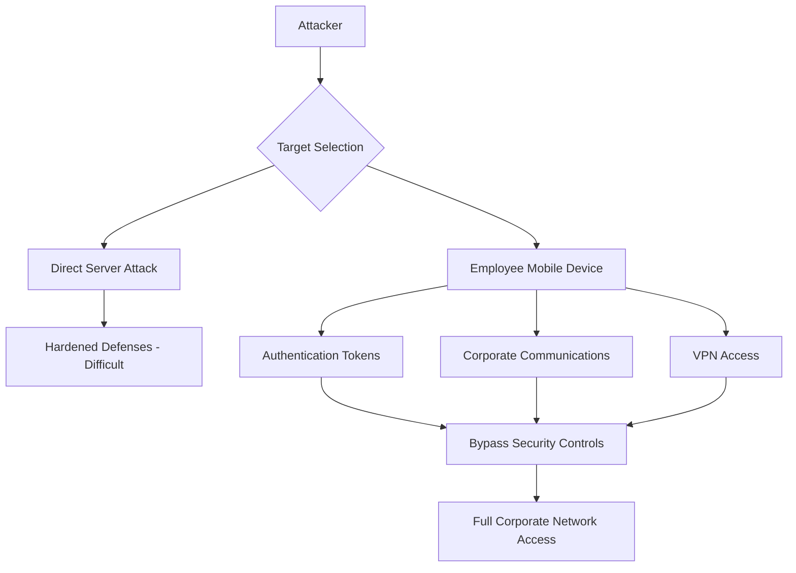
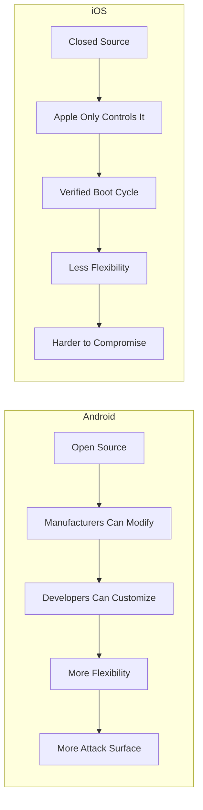
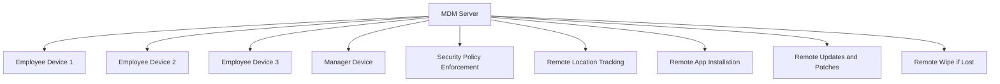
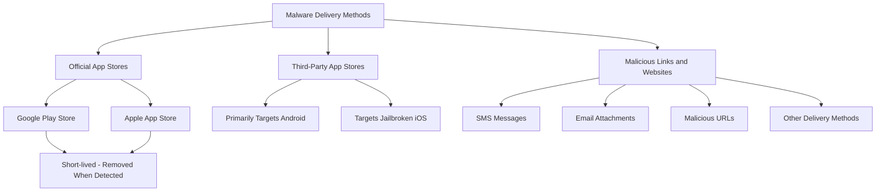

> **الهدف من الـ Section ده:**  
> هتفهم ليه الـ Mobile Security بقت من أهم محاور الـ Cybersecurity، وهتعرف الفرق بين Android و iOS من ناحية الـ Security، وإزاي المؤسسات بتتحكم في الأجهزة بالـ MDM، وإزاي الـ Malware بيوصل للموبايل.

---

## Table of Contents

- [What is Mobile Security?](#what-is-mobile-security)
- [Why Mobile Security Matters](#why-mobile-security-matters)
- [iOS vs Android — Security Comparison](#ios-vs-android--security-comparison)
- [Mobile Device Management (MDM)](#mobile-device-management-mdm)
- [How Malware is Delivered to Mobile Devices](#how-malware-is-delivered-to-mobile-devices)
- [Summary](#summary)

---

## What is Mobile Security?

الـ **Mobile Security** هي مجموعة الممارسات والتقنيات اللي بتحمي الأجهزة المحمولة من التهديدات المختلفة. الحماية دي بتشمل أربع محاور أساسية:

| المحور | الوصف |
|---|---|
| **The Device** | الجهاز نفسه — الهاردوير والـ OS |
| **The Data** | البيانات المخزنة على الجهاز |
| **The Applications** | التطبيقات المثبتة |
| **The Network Communication** | الاتصالات اللي بتتم عبر الشبكة |

> [!IMPORTANT]
> الموبايل مش مجرد جهاز شخصي — في كتير من المؤسسات بيُعتبر **بوابة دخول** للأنظمة الحساسة اللي محمية بالـ MFA. يعني لو اتاخد الموبايل، ممكن يتاخد معاه الـ Access لكل حاجة.

---

## Why Mobile Security Matters

### الموبايل كـ Gateway للأنظمة الحساسة

في البيئات الحديثة، الموظفين بيستخدموا موبايلاتهم في:
- **Email Access** — الوصول للبريد المؤسسي
- **VPN Authentication** — التحقق لدخول الشبكة الداخلية
- **MFA for Privileged Accounts** — التحقق بخطوتين للحسابات ذات الصلاحيات العالية

ده معناه إن الموبايل بقى **حلقة وصل حرجة** في سلسلة الأمن المؤسسي.

### سيناريو هجوم واقعي

تخيل معايا السيناريو ده:

```
الهدف: مؤسسة كبيرة فيها معلومات حساسة جداً

المهاجم عنده خيارين:
1. يهاجم الـ Hardened Servers مباشرة  ← صعب جداً
2. يدور على أضعف نقطة دخول ← أسهل بكتير

أضعف نقطة دخول = الموظف نفسه = موبايله
```



> [!WARNING]
> لو المهاجم نجح في اختراق موبايل **موظف واحد بس**، ممكن يحصل على:
> - **Authentication Tokens** — رموز التحقق
> - **Corporate Communications** — مراسلات الشركة
> - **VPN Access** — دخول على الشبكة الداخلية
>
> وده بيعني إنه عملياً بيتجاوز كل وسائل الحماية التقليدية.

### استجابة المؤسسات

عشان كده، كتير من المؤسسات بتاخد خطوات استباقية:

- توفير **أجهزة موبايل مخصصة** للموظفين اللي عندهم صلاحيات عالية
- **مراقبة الأجهزة** بشكل مستمر لرصد أي نشاط مشبوه
- ضمان إن الأجهزة **محدثة ومصححة** (Updated & Patched) في كل وقت

---

## iOS vs Android — Security Comparison

### الفرق الجوهري

**Android** هو نظام **Open Source** — أي حد يقدر يعدل فيه، سواء كانوا manufacturers أو developers.

**iOS** هو **Closed Ecosystem** — تحت سيطرة Apple الكاملة، ومحدش يقدر يعدل فيه من برا.



### ليه iOS أكثر أماناً؟

Apple بتتحقق من **كل مراحل الـ Boot Cycle**، يعني من أول ما الجهاز بيبدأ يشتغل، بيتتأكد إن كل حاجة شرعية وموقعة منها.

> [!NOTE]
> الـ **Boot Cycle Verification** ده بيعني إن أي تعديل غير مصرح بيه في النظام هيتم رصده فور بداية تشغيل الجهاز — ده بيخلي الـ Jailbreak والتعديلات غير المرخصة صعبة جداً.

### ليه Android أكثر استهدافاً؟

**Android بيمتلك ~80% من الـ Global Market Share.**

ده معناه:
- عدد المستخدمين أكبر بكثير
- فرصة النجاح في الهجوم أعلى
- المهاجمون بيركزوا طاقتهم على الأنظمة الأكثر انتشاراً

### مقارنة شاملة

| المعيار | Android | iOS |
|---|---|---|
| **Source** | Open Source | Closed Source |
| **Customization** | عالي جداً | محدود جداً |
| **Boot Verification** | متفاوت حسب الـ Manufacturer | Strict من Apple |
| **Market Share** | ~80% | ~20% |
| **Attacker Focus** | عالي | منخفض نسبياً |
| **Third-party Apps** | متاحة بسهولة | مقيدة بالـ App Store |
| **Jailbreak/Root** | أسهل نسبياً | أصعب بكثير |

> [!TIP]
> في بيئات الـ Enterprise اللي فيها بيانات حساسة جداً، الـ iOS غالباً هو الاختيار الأفضل من ناحية الـ Security — بس ده مش معناه إنه محصن بالكامل.

---

## Mobile Device Management (MDM)

### ما هو الـ MDM؟

الـ **Mobile Device Management** هو نظام بيستخدمه الـ Organization للتحكم في وتأمين الأجهزة المحمولة اللي بتوصل للمعلومات المؤسسية أو بتخزنها.

فكر فيه كـ **لوحة تحكم مركزية** بتخلي الـ IT Team يتحكم في كل الأجهزة من مكان واحد.



### أهم Features في الـ MDM

#### 1. Security Policy Enforcement

الـ MDM بيضمن إن كل الأجهزة مطبقة عليها سياسات الأمان الصح، زي:
- إجبارية الـ Screen Lock
- تشفير البيانات المخزنة
- منع التطبيقات من مصادر غير معتمدة

#### 2. Device Location Tracking

قدرة تحديد مكان الجهاز في أي وقت — مفيد في حالة:
- الجهاز اتسرق
- الجهاز اتفقد
- التتبع في بيئات العمل

#### 3. Remote App Management

- **تثبيت التطبيقات** على الجهاز عن بعد
- **حذف التطبيقات** غير المصرح بيها
- **تحديث النظام والتطبيقات** من غير تدخل المستخدم

> [!IMPORTANT]
> الـ MDM بيقدر يعمل **Remote Wipe** — يعني يمسح كل البيانات على الجهاز عن بعد لو الجهاز اتسرق أو الموظف اتطرد وماردش الجهاز.

### ملخص وظائف الـ MDM

| الوظيفة | الوصف | الفايدة |
|---|---|---|
| **Policy Enforcement** | تطبيق سياسات الأمان | ضمان الامتثال |
| **Location Tracking** | تتبع موقع الجهاز | استرداد الأجهزة المفقودة |
| **Remote App Install** | تثبيت التطبيقات عن بعد | توحيد البيئة |
| **Remote Updates** | تحديث النظام عن بعد | سد الثغرات الأمنية |
| **Remote Wipe** | مسح البيانات عن بعد | حماية البيانات عند الفقدان |

---

## How Malware is Delivered to Mobile Devices

### طرق توصيل الـ Malware للموبايل

المهاجمون عندهم أكتر من طريقة لإيصال الـ Malware لموبايلك:



### 1. Official App Stores (Google Play / App Store)

حتى الـ Official Stores مش محصنة بالكامل.

- الـ Malicious Apps أحياناً بتعدي عملية الـ Review
- بس عادةً بتتشال بسرعة **لما يتم اكتشاف سلوكها الضار**
- مثال عملي: التطبيقات اللي بتدعي إنها بتنزل فيديوهات من YouTube — دي غالباً مش قانونية وممكن تكون خطيرة

> [!NOTE]
> القاعدة دي بتوضح إن حتى الـ Official Stores مش 100% آمنة — دايماً اتحقق من المطور والـ Reviews والـ Permissions اللي التطبيق بيطلبها.

### 2. Third-Party App Stores

دي الأخطر.

- بتستهدف بشكل أساسي **Android** — لأنه بيسمح بتثبيت التطبيقات من مصادر خارجية (Sideloading)
- كمان بتستهدف **Jailbroken iOS Devices** — الأجهزة اللي اتعدل عليها النظام

> [!WARNING]
> تثبيت أي تطبيق من مصدر غير رسمي على Android (Sideloading) بيفتح باب كبير للـ Malware. النظام نفسه بيحذرك، بس كتير من الناس بتتجاهل التحذير.

### 3. Malicious Links, URLs & Attachments

دي أكثر طريقة شائعة وخطيرة.

الـ Attack Vectors هنا متعددة:
- **SMS (Smishing)** — رسائل نصية فيها لينكات ملغومة
- **Email (Phishing)** — إيميلات بمرفقات أو لينكات خطيرة
- **Malicious Websites** — مواقع مصممة لاستغلال ثغرات المتصفح
- **Other Delivery Methods** — واتساب، سوشيال ميديا، إلخ

> [!WARNING]
> الـ **Smishing** (SMS Phishing) خطير جداً لأن الناس بتوثق الرسائل النصية أكتر من الإيميلات — وده بيخلي نسبة النجاح عنده أعلى.

### مقارنة طرق التوصيل

| الطريقة | الجهاز المستهدف | مستوى الخطر | ملاحظة |
|---|---|---|---|
| **Official App Stores** | Android & iOS | متوسط | بتتشال بسرعة |
| **Third-Party Stores** | Android & Jailbroken iOS | عالي | بدون رقابة |
| **Malicious Links/SMS** | الكل | عالي جداً | الأكثر شيوعاً |
| **Email Attachments** | الكل | عالي | Phishing |

---

## Summary

### ملخص الـ Mobile Security

- **Mobile Security** بتحمي الجهاز، البيانات، التطبيقات، والاتصالات.

- الموبايل بقى **نقطة دخول حرجة** للأنظمة المؤسسية لأنه بيُستخدم في الـ MFA والـ VPN والـ Email المؤسسي — اختراقه يعني اختراق المؤسسة كلها.

- **iOS أكثر أماناً** من Android بسبب الـ Closed Ecosystem والـ Boot Cycle Verification، بينما **Android أكثر استهدافاً** بسبب الـ Open Source وحصته السوقية الكبيرة (~80%).

- الـ **MDM** هو الحل المؤسسي للتحكم في الأجهزة المحمولة — بيوفر الـ Policy Enforcement، التتبع، الإدارة عن بعد، والـ Remote Wipe.

- الـ **Malware** بيوصل للموبايل بثلاث طرق رئيسية:
  1. من الـ Official Stores (نادر وقصير المدة)
  2. من الـ Third-Party Stores (خطر عالي — Android والـ Jailbroken iOS)
  3. عبر Malicious Links في SMS أو Email أو مواقع (الأكثر شيوعاً)

> [!TIP]
> **للمقابلات:** لو اتسألت "ليه الموبايل Security مهم؟" — الإجابة المثالية هي إن الموبايل بقى الـ Weakest Link في سلسلة الـ MFA، وأي مهاجم بيقدر يوصله بيقدر يتجاوز كل الـ Perimeter Defenses.
