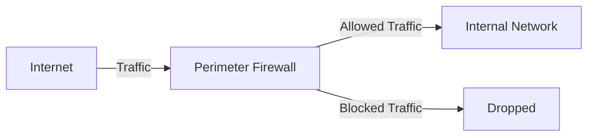
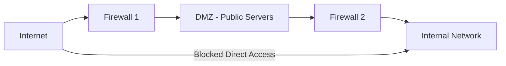
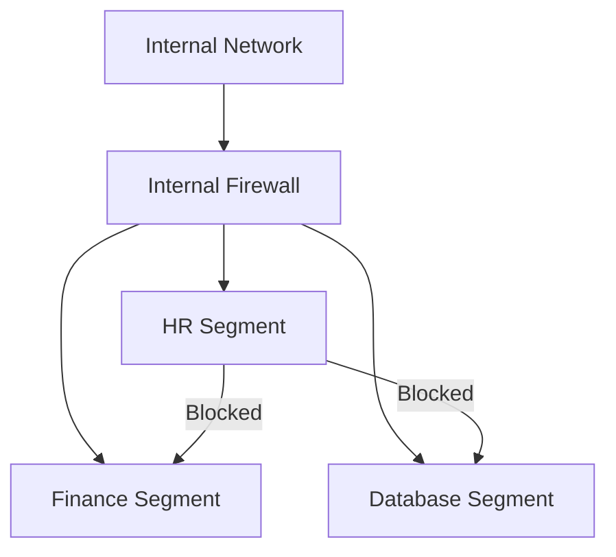
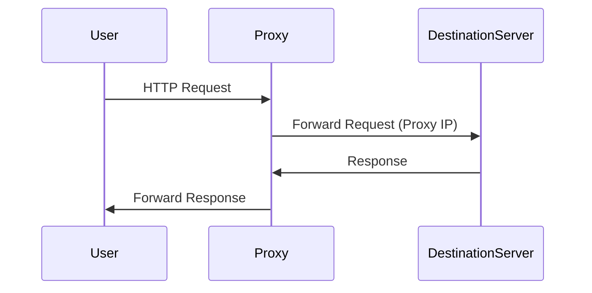
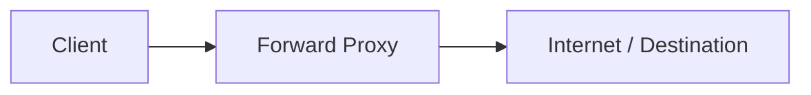
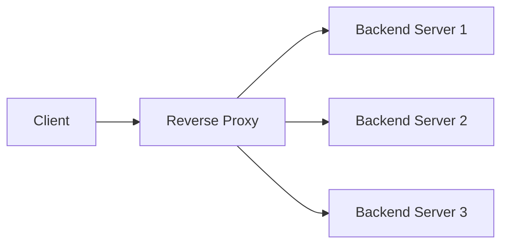
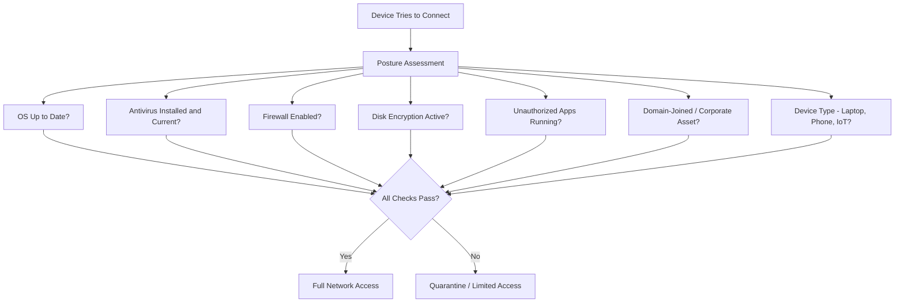
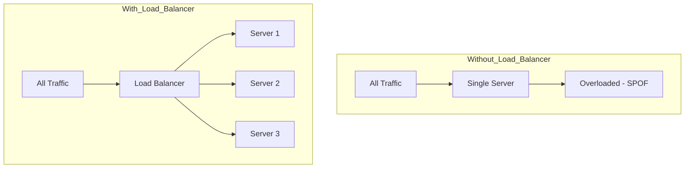
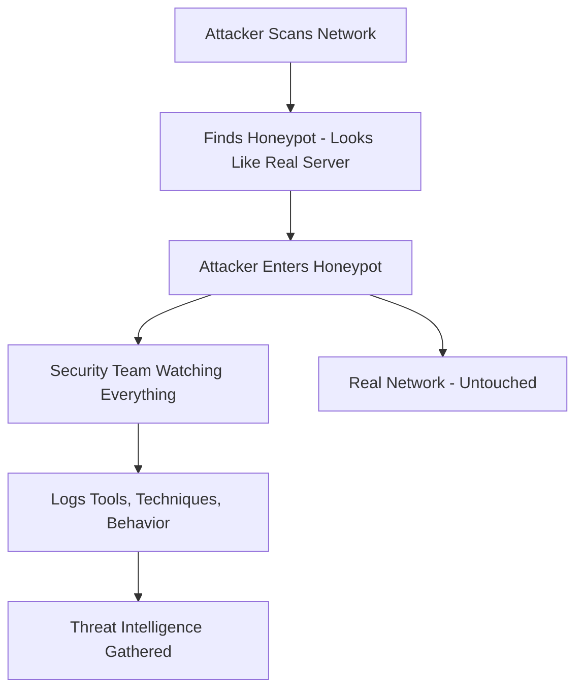
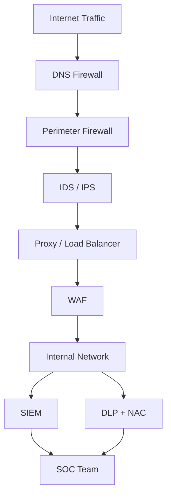

> **الهدف من الـ Section ده:**  
> هتعرف أهم الأجهزة اللي بتحمي الـ Network، وكل جهاز بيشتغل إزاي وبيتعامل مع الـ Traffic بطريقة مختلفة. هتفهم دور الـ Firewall، والـ Honeypot، وغيرهم، وفي النهاية هتقدر تبص على أي Network Architecture وتعرف وظيفة كل Layer بتحمي إيه.


## Table of Contents

[Why Network Security Devices Exist](#why-network-security-devices-exist)
[Firewalls: The Core Guardian](#firewalls-the-core-guardian)
   - [Firewall Locations](#firewall-locations)
   - [Firewall Benefits vs Shortcomings](#firewall-benefits-vs-shortcomings)
[Proxy Server](#proxy-server)
   - [Why Organizations Use Proxies](#why-organizations-use-proxies)
   - [Types of Proxies](#types-of-proxies)
[Proxy vs Firewall vs WAF](#proxy-vs-firewall-vs-waf)
[Network Access Control (NAC)](#network-access-control-nac)
[Load Balancer](#load-balancer)
[Honeypot](#7-honeypot)
[How They All Fit Together](#how-they-all-fit-together)
[Summary](#summary)

---

## Why Network Security Devices Exist

خلي بالك من الـ analogy دي وهي مهمة جداً لأنها بتوضح الـ core problem في الـ security:

تخيل إنك عندك محل تجاري. لازم تعرض البضاعة للناس عشان يشتروا — يعني لازم في accessibility. لكن لو سبت كل حاجة مكشوفة من غير حماية، الناس هتسرق. مش منطقي إنك تقفل المحل خالص عشان محدش يسرق، لأن كده محدش هيشتري كمان.

نفس الفكرة تماماً على الـ Network. لو عندك **Game Server** أو **Web Application**:
- لازم يكون **publicly accessible** عشان الـ users يوصلوا
- في نفس الوقت، الـ attackers ممكن يحاولوا يخترقوه

**الـ Golden Rule في Security:**

> [!IMPORTANT]
> Security is about finding the right balance between **trust** and **restriction**. لو اتثقت في محدش — الـ system هيكون secure بس unusable. لو اتثقت في كل حد — الـ system هيتـ compromise.

الأجهزة دي بالظبط هي اللي بتعمل الـ balance ده — بتسمح لـ legitimate users يوصلوا وبتبلوك الـ attackers.

أشهر الـ **Network Security Devices**:

| Device | الدور |
|--------|-------|
| **Firewall** | بيـ monitor ويـ control الـ traffic اللي جاي ورايح بناءً على rules |
| **IDS** (Intrusion Detection System) | بيكتشف الـ attacks والـ suspicious activity |
| **IPS** (Intrusion Prevention System) | زي الـ IDS بس بيـ block الـ attack أوتوماتيك |
| **WAF** (Web Application Firewall) | بيحمي الـ websites والـ web apps تحديداً |
| **VPN Gateway** | بيخلي الـ users يتوصلوا بشكل encrypted من الـ internet |
| **Proxy** | وسيط بين الـ user والـ internet |

---

## Firewalls: The Core Guardian

الـ **Firewall** هو أهم جهاز في الـ network security. في جوهره هو **routing device** بيـ inspect الـ network traffic وبيطبق عليه **predefined rule set** يقرر هيسمح أو يبلوك الـ traffic ده.

```
[Incoming Packet] --> [Firewall] --> [Check Rules] --> Allow / Deny
```

### Firewall Locations

مش بس في مكان واحد — الـ Firewall ممكن يتحط في أماكن مختلفة في الـ network وكل مكان ليه هدف تاني.

#### Main Firewall (Perimeter Firewall) — Internet to Internal Network

ده الـ classic placement اللي الكل بيعرفه. الـ Firewall بيقعد بين الـ Internet والـ Internal Network.

**وظيفته:**
- يبلوك الـ attackers اللي جايين من الـ internet
- يسمح للـ users الداخليين يوصلوا للـ internet
- يتحكم في كل الـ inbound وـ outbound traffic



---

#### DMZ Firewall — Internet to Public Servers

لما عندك **Public Servers** زي Web Server أو Mail Server أو Game Server، مش هتحطهم جوا الـ Internal Network مباشرةً. بدل كده بتحطهم في منطقة اسمها **DMZ (Demilitarized Zone)**.

**ليه الـ DMZ؟**

> [!IMPORTANT]
> لو الـ Public Server اتـ hack، الـ Attacker مش هيقدر يوصل للـ Internal Network. الـ DMZ بيعمل **isolation** — يعزل الـ servers العامة عن الشبكة الداخلية.



---

#### Internal Segmentation Firewall — Inside the Network

الشركات الكبيرة بتحط Firewalls **جوا** الـ Internal Network نفسها عشان تفصل بين الأقسام المختلفة.

**وظيفته:**
- HR مش تقدر توصل لـ Finance Servers
- الـ Users مش يقدروا يوصلوا للـ Database مباشرةً
- لو Attacker دخل الـ network، مش هيقدر يتحرك بحرية — ده اللي بيتسمى **Limiting Lateral Movement**



> [!TIP]
> الـ concept بتاع **Lateral Movement** مهم جداً في الـ SOC. لما Attacker بيدخل على جهاز واحد وبيحاول ينتشر في الـ network ده اللي بيتسمى Lateral Movement. الـ Internal Firewalls بيقللوا قدرته على ده.

---

#### Firewall Placement Summary

| Location | الهدف |
|----------|-------|
| Internet to LAN | حماية الـ Internal Network من الإنترنت |
| Internet to DMZ | حماية الـ Public Servers |
| DMZ to LAN | حماية الـ Internal Network من الـ Compromised Servers |
| Inside LAN | Network Segmentation بين الأقسام |
| User to Server | حماية الـ Critical Servers من الـ Internal Users |

---

### Firewall Benefits vs Shortcomings

| Benefits | Shortcomings |
|----------|--------------|
| بيبلوك الـ unauthorized access | مش بيفهم الـ application-layer attacks (زي SQL Injection) بدون WAF |
| بيـ monitor وبيـ log الـ traffic | مش بيشوف الـ encrypted traffic جوا الـ HTTPS بدون SSL inspection |
| بيطبق الـ security policies بشكل centralized | Misconfigured rules ممكن تبلوك legitimate traffic |
| بيحمي الـ network perimeter | لو Attacker جوا الـ network أصلاً، الـ perimeter firewall مش بيفيد |
| بيعمل network segmentation | Single point of failure لو معفيش High Availability |

> [!WARNING]
> الـ Firewall مش الـ silver bullet. كتير من الـ attacks بتعدي الـ Firewall لأنها بتيجي على ports مفتوحة (زي port 80/443). عشان كده محتاج layers تانية زي IPS وـ WAF.

---

## Proxy Server

الـ **Proxy** ممكن بعض الـ security professionals يصنفوه كـ نوع من الـ Firewalls، وكمان بيتسمى **Application Gateway**.

الـ Proxy هو **intermediary server** — وسيط — بيقعد بين الـ Client (إنت) والـ Destination Server. بدل ما تتوصل بشكل مباشر، الـ request بتاعك بيروح للـ Proxy الأول، وهو بيعمله forward لـ الـ Destination Server نيابةً عنك.



### Why Organizations Use Proxies

| الوظيفة | الشرح |
|--------|-------|
| **Anonymity** | الـ Destination Server بيشوف IP الـ Proxy مش IP الـ User |
| **Access Control** | الشركات بتبلوك مواقع معينة على الـ employees |
| **Caching** | بيحتفظ بـ copies من الـ content المطلوب كتير عشان يسرع الـ access |
| **Filtering and Monitoring** | بيـ inspect الـ traffic الخارج والداخل |
| **SOC Visibility** | بيديك visibility على الـ URLs اللي الـ employees بيدخلوا عليها |

> [!NOTE]
> الـ SOC Team بتستخدم الـ Proxy Logs عشان تكتشف لو فيه employee بيوصل لـ suspicious domains أو لو فيه malware بيتواصل مع C2 servers.

---

### Types of Proxies

#### Forward Proxy

بيقعد **قدام الـ Client**. الـ Client هو اللي بيبعت الـ requests من خلاله.

**الاستخدامات:**
- Anonymity
- Filtering (بلوك مواقع)
- Bypassing restrictions



ده هو اللي الناس بتقصده لما بتقول "proxy" بشكل عام.

---

#### Reverse Proxy

بيقعد **قدام الـ Server**. الـ Clients مش عارفين هيوصلوا لأنهي backend server تحديداً.

**الاستخدامات:**
- Load Balancing
- SSL Termination
- Caching
- DDoS Protection



> [!TIP]
> أشهر الـ Reverse Proxies في الواقع هما **Nginx** و**HAProxy**. لو شفتهم في أي infrastructure، فاهم دلوقتي ليه موجودين.

---

#### Elite / High-Anonymity Proxy

بيخبي الـ IP بتاعك ومش بيوضح إنه proxy أصلاً. الـ destination server مش بيعرف إنك بتستخدم proxy.

---

## Proxy vs Firewall vs WAF

الفرق بينهم مهم جداً وبيتسأل كتير:

| Feature | Firewall | Proxy | WAF |
|---------|----------|-------|-----|
| **يعمل على** | Network / Transport Layer (L3/L4) | Application Layer (L7) | Application Layer (L7) — HTTP/S فقط |
| **بيشوف** | IPs, Ports, Protocols | URLs, Content, Users | HTTP Requests, Payloads |
| **بيحمي من** | Unauthorized connections | Malicious web content, data leakage | SQL Injection, XSS, CSRF |
| **الـ direction** | Inbound and Outbound | Mainly Outbound (Forward) | Inbound |
| **مثال** | pfSense, Cisco ASA | Squid Proxy, Nginx | Cloudflare WAF, ModSecurity |

> [!IMPORTANT]
> الثلاثة مش بديل عن بعض — كل واحد بيحمي layer مختلفة. في الـ real-world deployments بتلاقيهم الثلاثة موجودين مع بعض.

---

## Network Access Control (NAC)

الـ **NAC** هو security solution بيتحكم في **مين** والـ **devices** اللي مسموحلها تتوصل للـ network وـ **إيه** اللي مسموحلها توصله بعد الـ connection.

### المشكلة اللي الـ NAC بيحلها

في الـ Traditional Networks، لو عرفت password الـ Wi-Fi أو حشرت cable في الـ switch — أنت داخل. مفيش سؤال تاني.

الـ NAC بيغير ده بشكل جذري. مش بس بيسأل **"مين أنت؟"** — بيسأل كمان **"الجهاز بتاعك في إيه حالة؟"**

> [!IMPORTANT]
> Username صح مش كفاية لو الـ laptop مش معمله update أو مصاب بـ malware. الـ NAC بيعمل **Posture Assessment** — بيقيّم صحة الجهاز قبل ما يسمحله يدخل.

### What NAC Checks (Posture Assessment)



| الفحص | الهدف |
|-------|-------|
| OS Patch Level | الجهاز معمله update ضد الـ known vulnerabilities؟ |
| Antivirus Signatures | الـ AV شغال ومحدث؟ |
| Host Firewall | الـ firewall على الجهاز نفسه شغال؟ |
| Disk Encryption | الداتا محمية لو الجهاز اتسرق؟ |
| Unauthorized Apps | فيه software ممنوع شغال؟ |
| Domain-Joined | الجهاز ده managed asset أو غريب؟ |
| Device Type | Printer أو IoT ممكن ياخد access مختلف |

> [!TIP]
> الـ NAC مهم جداً في سيناريوهات زي **BYOD (Bring Your Own Device)** — لما الـ employees بيجيبوا أجهزتهم الشخصية للشغل. الـ NAC بيضمن إن الجهاز الشخصي ده مش هيعرض الشبكة للخطر.

---

## Load Balancer

الـ **Load Balancer** بيقعد قدام multiple servers وبيوزع الـ incoming traffic عليهم عشان محدش منهم يتحمل أكتر من طاقته.

### المشكلة اللي بيحلها



**SPOF = Single Point of Failure** — لو الـ server الواحد وقع، الـ service كلها وقعت. مع الـ Load Balancer لو server واحد وقع، الباقيين بيشتغلوا.

### وظائف الـ Load Balancer

| الوظيفة | الشرح |
|--------|-------|
| **Traffic Distribution** | بيوزع الـ requests على الـ servers |
| **High Availability** | لو server وقع، التاني يكمل |
| **Scalability** | تقدر تضيف servers وقت الـ high load |
| **SSL Termination** | بيعمل الـ HTTPS decryption هنا بدل على كل server |
| **Health Checks** | بيراقب الـ servers وبيبعت الـ traffic للـ healthy ones بس |
| **DDoS Mitigation** | بيوزع الـ attack traffic بدل ما كل حاجة تقع على server واحد |

> [!NOTE]
> الـ Load Balancer مش بس availability tool — هو كمان **security tool**. بيخبي عدد الـ backend servers وـ architecture بتاعتهم عن الـ attacker.

---

## Honeypot

الـ **Honeypot** هو من أذكى وأجمل tools في الـ cybersecurity. بدل ما تبلوك الـ attacker، **بتدعوه يدخل** — في بيئة وهمية مش هيقدر يعمل فيها ضرر حقيقي، لكن إنت بتتفرج على كل حاجة بيعملها.

### الفكرة الأساسية

> [!IMPORTANT]
> **The Core Logic:** لو محدش من الـ legitimate users المفروض يلمس الـ system ده، أي حد بيلمسه هو **threat by definition**.



### ليه الـ Honeypot مهم؟

| الفائدة | الشرح |
|--------|-------|
| **Early Detection** | أي access للـ honeypot = alert فوري |
| **Threat Intelligence** | بتعرف الـ attacker بيستخدم إيه من tools وـ techniques |
| **Deception** | بيضيع وقت الـ attacker وـ resources بتاعته |
| **Low False Positives** | أي حاجة بتحصل فيه مريبة 100% |
| **Research** | بتعرف أساليب الـ attack الجديدة |

> [!TIP]
> في الـ SOC، لو شفت alert من الـ Honeypot — خده بجدية تامة. مش فيه legitimate reason لحد يتواصل معاه. ده مش false positive.

---

## How They All Fit Together

مفيش جهاز واحد بيحمي كل حاجة. كل layer بتمسك اللي اللي قبلها فاته:



| Layer | الجهاز | بيحمي من |
|-------|--------|---------|
| 1 | **DNS Firewall** | Connections للـ bad domains قبل ما تبدأ |
| 2 | **Firewall** | Unauthorized network connections |
| 3 | **IDS/IPS** | Attack patterns على allowed ports |
| 4 | **Proxy / Load Balancer** | بيخبي الـ backend وبيوزع الـ load |
| 5 | **WAF** | SQL Injection, XSS وـ web attacks |
| 6 | **SIEM** | بيشوف كل حاجة وبيربط الـ events من كل الأجهزة |
| 7 | **DLP + NAC** | بيحمي من الداخل — data وـ devices |

> [!IMPORTANT]
> الـ concept ده بيتسمى **Defense in Depth** — طبقات دفاع متعددة، لو واحدة فشلت التانية موجودة. ده أساس أي security architecture محترمة.

---

## Summary

- **الـ Security دايماً عن balance** — مش zero access ومش full access، في النص فيه الـ balance الصح

- **الـ Firewall** هو الـ gatekeeper الأساسي للـ network، وبيتحط في أكتر من مكان (Perimeter, DMZ, Internal) وكل مكان ليه هدف

- **الـ DMZ** هي منطقة عازلة بتحط فيها الـ Public Servers عشان لو اتـ hack ميوصلوش للـ Internal Network

- **الـ Proxy** وسيط — بيخبي الـ identity ويعمل caching وـ filtering، وبيدي الـ SOC visibility على الـ web traffic

- **Forward Proxy** قدام الـ client | **Reverse Proxy** قدام الـ server

- **الـ NAC** مش بس بيسأل "مين أنت؟" — بيسأل "الجهاز بتاعك صالح؟" عن طريق الـ Posture Assessment

- **الـ Load Balancer** بيمنع الـ Single Point of Failure وبيوزع الـ traffic وبيخبي الـ backend architecture

- **الـ Honeypot** — أي حد بيلمسه هو attacker بالتعريف. بيديك intelligence بدون ما يعمل damage حقيقي

- **Defense in Depth** هو الـ strategy اللي بيجمعهم كلهم — طبقات دفاع متعددة، كل طبقة بتحمي من حاجة تانية
