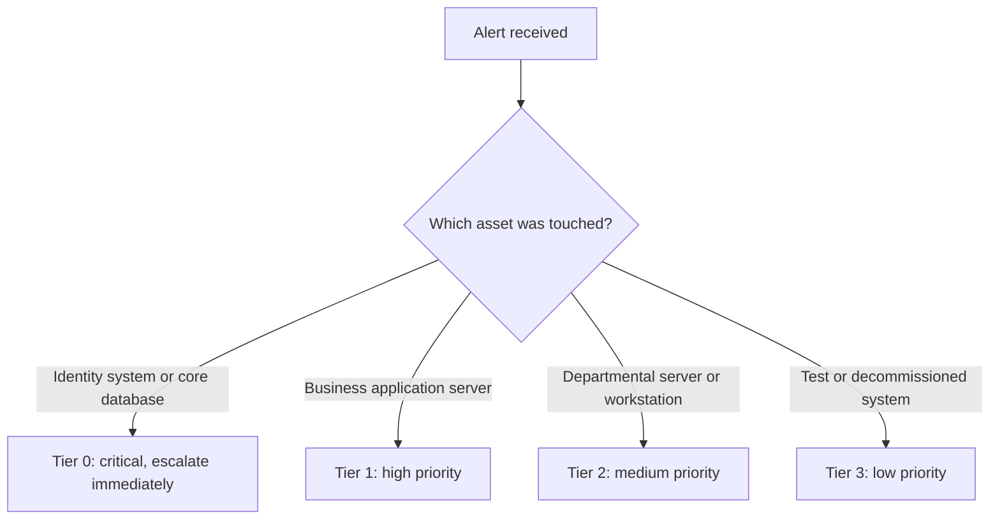
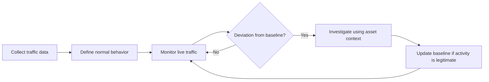
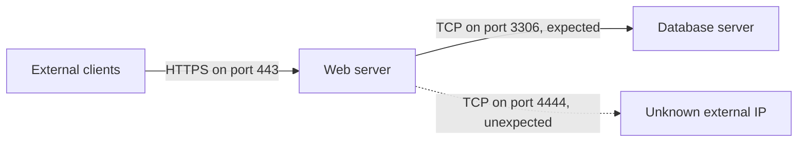

| Topic | Level | Reading Time | Prerequisites |
|---|---|---|---|
| Asset Awareness and Traffic Flow | Beginner | ~15 min | None |

  هتفهم إزاي تحدد إيه اللي لازم تحميه في أي شبكة، وإزاي تفرق بين الـ traffic الطبيعي والـ traffic المشبوه.


## Learning Objectives

By the end of this section, you will be able to:

- Define what an **asset** is and explain why identifying critical assets is the first step of network defense.
- Differentiate between standard user accounts and administrative accounts, and explain how each affects incident severity.
- Explain the role of a **CMDB** and of **asset criticality tiering** in alert prioritization.
- Describe what **communication flow** means and why a traffic **baseline** is essential for detection.
- Recognize a suspicious deviation from normal traffic, such as unexpected outbound connections from a server.

## Table of Contents

- [Learning Objectives](#learning-objectives)
- [Why Asset Awareness Matters](#why-asset-awareness-matters)
  - [You Cannot Defend What You Do Not Know](#you-cannot-defend-what-you-do-not-know)
  - [Not All Systems Are Equal](#not-all-systems-are-equal)
  - [Account Privilege and Incident Severity](#account-privilege-and-incident-severity)
- [Asset Inventory and the CMDB](#asset-inventory-and-the-cmdb)
  - [What Is a CMDB](#what-is-a-cmdb)
  - [What a Useful Asset Record Contains](#what-a-useful-asset-record-contains)
  - [Why Analysts Depend on the Inventory](#why-analysts-depend-on-the-inventory)
- [Alert Prioritization](#alert-prioritization)
  - [Credential Leaks and Dark Web Monitoring](#credential-leaks-and-dark-web-monitoring)
  - [The Value of the Target](#the-value-of-the-target)
  - [Asset Criticality Tiering](#asset-criticality-tiering)
- [Understanding Normal Traffic Flow](#understanding-normal-traffic-flow)
  - [Why Communication Flow Matters](#why-communication-flow-matters)
  - [Documenting Communication Flow](#documenting-communication-flow)
  - [Baselining Traffic](#baselining-traffic)
  - [Spotting Deviations From the Baseline](#spotting-deviations-from-the-baseline)
  - [Lateral Movement](#lateral-movement)
  - [Hands-On Inspection of Host Connections](#hands-on-inspection-of-host-connections)
- [Career Path Connections](#career-path-connections)
- [Key Terms Glossary](#key-terms-glossary)
- [Summary](#summary)

## Why Asset Awareness Matters

### You Cannot Defend What You Do Not Know

قبل ما تفكر في firewalls أو IDS أو أي أداة حماية، لازم تجاوب على سؤال بسيط: **إيه اللي عندي بالظبط، وإيه أهم حاجة فيه؟**

الـ **asset** هو أي حاجة ليها قيمة للمؤسسة وممكن تتأذى أو تتسرق. ده بيشمل:

- Servers و laptops و network devices (routers, switches, firewalls).
- Applications و databases.
- User accounts، سواء عادية أو administrative.
- Data نفسها (customer records, financial data, source code).

تخيل حارس أمن في مبنى كبير، بس مش عارف أنهي أوضة فيها الخزنة وأنهي أوضة فيها أدوات النظافة. لو حصل إنذار في أوضة، مش هيعرف يتصرف بسرعة أو بالأولوية الصح. نفس الفكرة بالظبط في الشبكات: من غير معرفة بالـ assets، كل alert بيتعامل معاه بنفس الدرجة، وده معناه إن الحاجات الخطيرة بتضيع وسط الضوضاء.

### Not All Systems Are Equal

مش كل الأنظمة ليها نفس الأهمية. الفرق بين أي نظامين بيتحدد بحجم الضرر لو اتعرضوا للاختراق.

| System | Typical Users | Data Handled | Impact if Compromised |
|---|---|---|---|
| File server used by three HR employees | 3 | Internal HR documents | Limited and contained, though not zero |
| Payment processing server | Thousands of customers | Card and transaction data | Financial loss, regulatory penalties, reputation damage |

الـ file server الصغير في الـ HR مهم طبعاً، لكن لو وقع، الضرر محدود. أما الـ payment processing server فاختراقه ممكن يوقف الشغل كله ويعرض المؤسسة لغرامات قانونية.

> [!IMPORTANT]
> The core skill is not detecting an alert. It is knowing how serious that alert is, based on what was touched.

### Account Privilege and Incident Severity

نفس المنطق بينطبق على الـ accounts. لازم تفرق بين نوعين:

- **Standard user account:** صلاحياته محدودة بشغل الموظف نفسه (email, shared folders, business apps).
- **Administrative account:** بيقدر يغير configurations ويضيف users ويدخل على systems كتير.

أخطر نوع هو الـ **Domain Administrator**، وهو account على مستوى الـ domain كله (غالباً في Active Directory). الـ **Domain Controller** هو الـ server اللي بيتحقق من هوية كل المستخدمين والأجهزة في الشبكة، والـ Domain Admin بيتحكم فيه.

| Leaked Account | Reach | Severity |
|---|---|---|
| Marketing employee | Marketing files, email, a few apps | Bad, but usually contained |
| Domain administrator | Potentially every system in the domain | Potentially full control of the entire network |

التشبيه المناسب: الـ standard account زي مفتاح أوضة واحدة، والـ Domain Admin زي الـ master key بتاع المبنى كله. ضياع المفتاحين مشكلة، لكن مش بنفس الخطورة.

> [!WARNING]
> If you cannot tell which accounts are administrative, you cannot judge how severe a compromised account is. This is one of the most common gaps in real incident response.

## Asset Inventory and the CMDB

### What Is a CMDB

الـ **CMDB (Configuration Management Database)** هو قاعدة بيانات بتسجل الـ assets بتاعة المؤسسة والعلاقات بينها. في الاستخدام العملي، بيشتغل كـ **asset inventory** بيتم من خلاله عمل **asset classification**، يعني تصنيف كل نظام حسب أهميته.

بمعنى بسيط: هو "دفتر السجل" اللي فيه كل جهاز وكل server، مين المسؤول عنه، وإيه أهميته.

### What a Useful Asset Record Contains

السجل المفيد للـ analyst بيجاوب على الأسئلة اللي بتتسأل وقت الـ incident: ده إيه؟ مين صاحبه؟ مهم قد إيه؟ مين المفروض يتصل بيه؟ ده مثال مبسط بصيغة YAML (الحقول توضيحية، وكل مؤسسة بتحدد الحقول الخاصة بيها):

```yaml
asset_id: SRV-DB-014
hostname: db-prod-01
type: Database server
environment: Production
owner: Finance IT team
criticality_tier: 0
data_classification: Confidential customer payment data
expected_inbound:
  - source: web-prod-01
    port: 3306
    protocol: TCP
```

لاحظ إن آخر حقل (`expected_inbound`) بيوثق **مين المفروض يكلم السيرفر ده**، وده بيربط الـ inventory بموضوع الـ traffic flow اللي هنشرحه بعد شوية.

### Why Analysts Depend on the Inventory

من غير inventory، الـ analyst بيضيع وقت يحقق في incident وهو مش عارف إن الجهاز المتأثر ده **test machine** ولا **production database**. الفرق بين الحالتين هو الفرق بين "نسجلها ونكمل" و"نصحي الفريق كله".

> [!WARNING]
> In practice, most organizations do not maintain their inventory properly. Records become outdated, shadow IT goes undocumented, and ownership fields are left blank. An inaccurate inventory can be as misleading as having none.

## Alert Prioritization

### Credential Leaks and Dark Web Monitoring

**Dark web monitoring tools** بتراقب مواقع الـ leaks وبتنبهك لما بيانات دخول تخص مؤسستك تظهر في **data dump** مسرّب.

افترض إن الـ leak فيه 50 account لموظفين عاديين و account واحد لـ IT administrator. المنطق بيقول إن الـ administrator account هو اللي يتعامل معاه **الأول**، رغم إنه واحد بس، لأن وصوله للـ systems أكبر بكتير من 50 account عادي مجتمعين.

### The Value of the Target

لازم كمان تسأل: المهاجم بيحاول يوصل لإيه؟

| Scenario | Risk Level | Response |
|---|---|---|
| Attacker scans the network and hits a decommissioned print server | Low | Log, review, and clean up the device |
| Attacker touches an SQL database that holds customer records | Critical | Immediate escalation |

نفس المهاجم ونفس الـ scan، لكن قيمة الهدف هي اللي بتغير الأولوية بالكامل.

### Asset Criticality Tiering

ولحل المشكلة دي بشكل منظم، كتير من الـ SOCs بتستخدم **asset criticality tiering**، وهو تصنيف الـ assets لمستويات (Tier 0, 1, 2, 3). الـ **Tier 0** عادةً بيشمل الـ domain controllers وأنظمة الـ identity والـ core databases.

الجدول ده توضيحي، لأن تعريف كل tier بيختلف من مؤسسة لمؤسسة:

| Tier | Typical Examples | Alert Handling |
|---|---|---|
| Tier 0 | Domain controllers, identity systems, core databases | Highest priority, immediate escalation |
| Tier 1 | Business-critical application servers | High priority |
| Tier 2 | Departmental servers, standard employee workstations | Medium priority |
| Tier 3 | Test systems, decommissioned or low-value devices | Low priority |

الـ flow التالي بيوضح إزاي الـ tier بيأثر على قرار الـ analyst:



> [!NOTE]
> The tiering model above is a simplified SOC-style illustration. Other frameworks use different schemes. For example, Microsoft's enterprise access model describes tiers for identity, servers, and workstations. Always follow the model your organization has defined.

## Understanding Normal Traffic Flow

### Why Communication Flow Matters

واحدة من أهم المهارات عند الـ SOC analyst هي فهم **communication flow**، يعني الـ traffic الطبيعي بيمشي إزاي في الشبكة. لازم تعرف:

- أنهي systems بتكلم أنهي servers.
- هل الـ external clients بيوصلوا للـ public-facing servers بس، ولا في حاجة تانية؟
- هل الموظفين اللي بيتصلوا من بره الشركة (remote work, VPN) بيتصرفوا بشكل طبيعي؟

زي حارس العمارة اللي بيعرف السكان وزوارهم المعتادين. أول ما يظهر شخص غريب بيدخل من باب الخدمة الساعة 3 الفجر، الحارس يلاحظ فوراً، لأنه عارف الوضع الطبيعي.

### Documenting Communication Flow

من المفروض إن الـ asset inventory يوثق ده: **مين بيوصل لإيه، وليه**. لكن زي ما قلنا، معظم المؤسسات مش بتحافظ على التوثيق ده صح، وده بيخلي شغل الـ analyst أصعب.

### Baselining Traffic

الحل هو الـ **baselining**، يعني تسجيل شكل الـ traffic الطبيعي بشكل منتظم. الـ **baseline** هو الصورة المرجعية اللي بتقارن بيها أي نشاط جديد.



> [!IMPORTANT]
> Without a baseline, analysts cannot tell the difference between normal business traffic and an attacker moving through the network. Detection depends on knowing what normal looks like first.

### Spotting Deviations From the Baseline

خد المثال ده. الـ web server عندنا بيكلم الـ database server على port `3306` (MySQL) وبس. فجأة بدأ يعمل اتصالات لـ IP خارجي مجهول على port `4444`.



ده **red flag كبير**، لأن:

- الـ web server مالوش سبب طبيعي يبدأ اتصالات outbound لعنوان مجهول.
- الـ port `4444` هو الـ default listener port في أمثلة Metasploit كتير، وبيتستخدم في الـ reverse shells.

| Observation | Baseline Says | Verdict |
|---|---|---|
| Web server to database on port 3306 | Expected | Normal |
| Web server to unknown external IP on port 4444 | Never seen before | Investigate immediately |

> [!NOTE]
> Port 4444 is a strong indicator but not proof by itself. Attackers can use any port, and legitimate software can occasionally use 4444. The real signal is that the connection is unexpected compared to the baseline.

### Lateral Movement

الـ **lateral movement** هو تحرك المهاجم من system مخترق لـ systems تانية جوه الشبكة، عادةً للوصول لأصول أعلى قيمة. من غير baseline، الـ lateral movement بيبان كأنه traffic عادي بين أجهزة داخلية.

مثال: موظف في Marketing جهازه فجأة بيحاول يوصل للـ file server بتاع Finance بالليل. لو الـ baseline بيقول إن ده عمره ما حصل، يبقى ده نشاط مشبوه يستاهل تحقيق.

> [!TIP]
> When you triage an alert, ask two questions in order: what is the value of the asset involved, and is this traffic normal for that asset? The first answers "how serious", the second answers "how suspicious".

### Hands-On Inspection of Host Connections

على أي Linux host تقدر تشوف الاتصالات الحالية بأداة `ss`. الأوامر دي بتساعدك تبني فكرة عن الـ traffic الطبيعي لجهاز معين:

```bash
# Show established TCP connections with the owning process
sudo ss -tnp state established

# Show listening TCP ports and the processes behind them
sudo ss -tlnp

# Show only connections to a specific destination port (example: MySQL)
ss -tn state established '( dport = :3306 )'
```

قارن الناتج بالـ baseline المتوقع. أي اتصال لعنوان خارجي غير معروف أو port غير مألوف يستاهل الفحص.

> [!TIP]
> Practice on your own lab machine. Run the commands during normal activity, save the output, and compare it after you install or run something new. This is the same idea as baselining, just at a smaller scale.

## Career Path Connections

| Career Path | How This Topic Applies |
|---|---|
| SOC Analyst | Uses asset context and traffic baselines to triage alerts and decide what to escalate |
| Penetration Tester | Identifies high-value targets and looks for lateral movement paths, the same way an attacker would |
| GRC | Asset inventory and classification are core requirements in frameworks such as the NIST Cybersecurity Framework and ISO 27001 |
| Cloud Security | Requires continuous inventory of cloud resources, since assets are created and destroyed dynamically |

## Key Terms Glossary

| Term | Definition |
|---|---|
| Asset | Anything of value to an organization, such as systems, devices, accounts, applications, and data |
| CMDB | Configuration Management Database, a database of assets and their relationships, commonly used as the asset inventory |
| Standard User Account | An account with limited permissions, scoped to a regular employee's job |
| Administrative Account | An account with elevated permissions that can change configurations and access many systems |
| Domain Controller | A server that authenticates users and devices in a Windows domain (Active Directory) |
| Dark Web Monitoring | A service that alerts an organization when its credentials or data appear in leaked datasets |
| Asset Criticality Tiering | A classification of assets into priority levels (Tier 0 to Tier 3) based on business and security importance |
| Communication Flow | The normal pattern of which systems talk to which, over which ports and protocols |
| Baseline | A recorded reference of normal behavior, used to detect deviations |
| Lateral Movement | An attacker's movement from one compromised system to other systems inside the network |
| Public-Facing Server | A server intentionally reachable from the internet, such as a website or mail server |

## Summary

- **Know your assets first:** لا يمكن حماية شبكة من غير معرفة الـ assets اللي فيها وأهميتها.
- **Not all systems are equal:** قيمة النظام بتتحدد بحجم الضرر لو اتخترق، مش بمجرد وجوده.
- **Account privilege drives severity:** تسريب Domain Admin أخطر بكتير من تسريب account موظف عادي.
- **The CMDB is the analyst's reference:** هو اللي بيفرق بين test machine و production database، لكن لازم يكون محدّث.
- **Prioritize by account and target value:** الـ administrator account في leak جماعي بيتعامل معاه الأول، والـ SQL database فيها customer records معناها incident حرج.
- **Tiering makes prioritization systematic:** الـ Tier 0 عادةً فيه domain controllers وأنظمة الـ identity والـ core databases.
- **Baselining is critical:** من غير baseline مش هتقدر تفرق بين business traffic وحركة مهاجم.
- **Unexpected outbound connections are red flags:** زي web server بيتصل بـ IP مجهول على port 4444.
- **Lateral movement hides in normal-looking traffic:** الـ baseline هو أداتك لكشفه.

