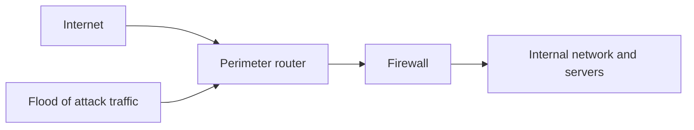
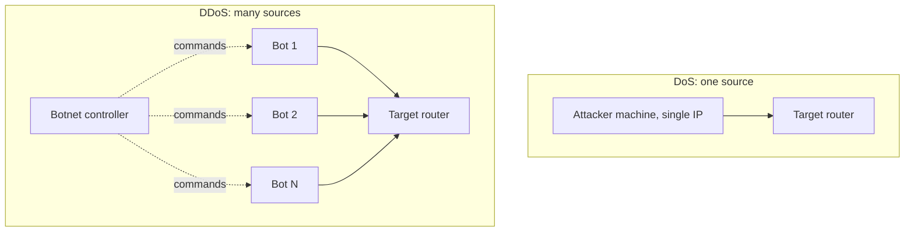
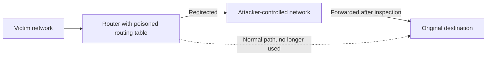
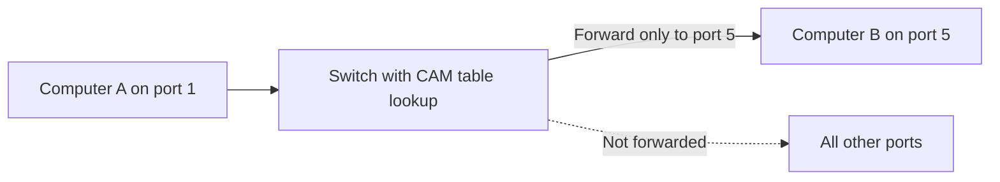
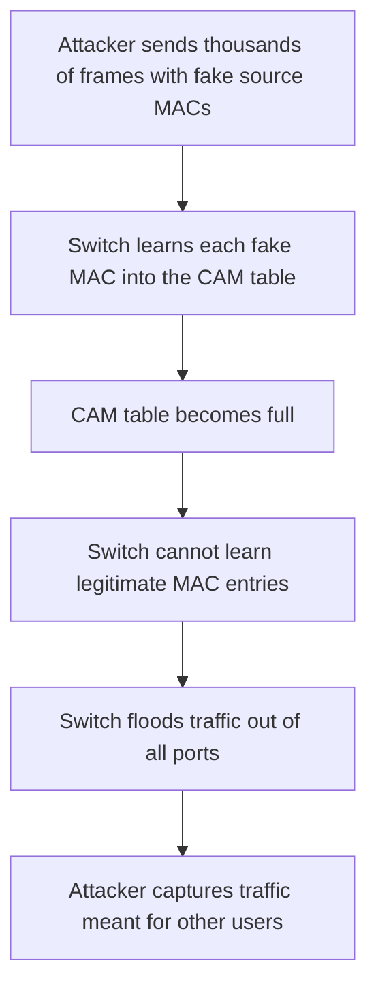
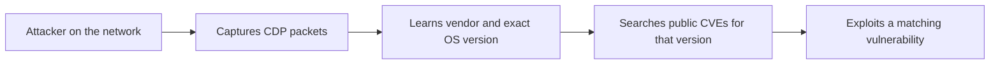

| Topic | Level | Reading Time | Prerequisites |
|---|---|---|---|
| Router and Switch Attacks | Intermediate | ~20 min | Asset Awareness and Traffic Flow, basic idea of what routers and switches do |

> **الهدف من الـ Section ده:**  
> هتفهم إزاي بيتم استهداف الـ routers والـ switches، وإيه الدفاعات الأساسية اللي بتقفل كل هجوم.


## Learning Objectives

By the end of this section, you will be able to:

- Explain why routers and switches are high-value targets that are often overlooked during security testing.
- Differentiate between **DoS** and **DDoS** attacks and describe how each one is mitigated.
- Describe how packet sniffing and routing table poisoning work against a router, including the idea behind **BGP hijacking**.
- Explain how a **MAC flooding** attack forces a switch to behave like a hub, and how **Port Security** stops it.
- Explain what **CDP** reveals to an attacker and why it should be disabled on untrusted ports.

## Table of Contents

- [Learning Objectives](#learning-objectives)
- [Why Network Infrastructure Is Overlooked](#why-network-infrastructure-is-overlooked)
  - [Servers Get the Attention](#servers-get-the-attention)
  - [Single Point of Failure](#single-point-of-failure)
- [Router Attacks](#router-attacks)
  - [Denial of Service Attacks on Routers](#denial-of-service-attacks-on-routers)
  - [DoS Versus DDoS](#dos-versus-ddos)
  - [The Mirai Botnet](#the-mirai-botnet)
  - [Planned Downtime Versus Attack Downtime](#planned-downtime-versus-attack-downtime)
  - [Mitigating DoS and DDoS](#mitigating-dos-and-ddos)
  - [Packet Sniffing on Routers](#packet-sniffing-on-routers)
  - [Routing Table Poisoning](#routing-table-poisoning)
  - [BGP Hijacking](#bgp-hijacking)
- [Switch Attacks](#switch-attacks)
  - [How Switches Normally Work](#how-switches-normally-work)
  - [MAC Flooding](#mac-flooding)
  - [Mitigating MAC Flooding with Port Security](#mitigating-mac-flooding-with-port-security)
  - [CDP Information Disclosure](#cdp-information-disclosure)
  - [Securing CDP](#securing-cdp)
- [Attack Comparison](#attack-comparison)
- [Career Path Connections](#career-path-connections)
- [Key Terms Glossary](#key-terms-glossary)
- [Summary](#summary)

## Why Network Infrastructure Is Overlooked

### Servers Get the Attention

في الـ penetration tests، معظم المؤسسات بتركز على الـ servers والـ applications، وبتتجاهل الـ network infrastructure devices زي الـ **routers** والـ **switches**. ده منطقي من ناحية إن الـ servers فيها الداتا، لكنه غلطة كبيرة.

الـ router هو الجهاز اللي بيوصل شبكتك بالشبكات التانية وبيقرر الـ packet يروح فين. والـ switch هو الجهاز اللي بيوصل الأجهزة جوه نفس الشبكة ببعض. تخيل الـ router زي بوابة المدينة اللي كل العربيات بتعدي منها، والـ switch زي موزع البريد جوه المبنى اللي بيعرف كل شقة فين.

لو اخترقت server واحد، بتتحكم في server واحد. لكن لو اخترقت الـ router، **بتأثر على الشبكة كلها**.

### Single Point of Failure

الـ router القديم (outdated) واللي عليه configuration غلط ممكن يبقى **single point of failure** لاتصال الشركة كلها، يعني نقطة واحدة لو وقعت، كل حاجة تقع معاها.

> [!IMPORTANT]
> Compromising a router affects the entire network, not just a single system. Network devices deserve the same security attention as servers.

## Router Attacks

### Denial of Service Attacks on Routers

هجوم الـ **DoS (Denial of Service)** بيهدف لإغراق الـ router بـ traffic أكتر من قدرته، فيعجز عن معالجة الـ traffic الشرعي. المصدر بيكون **جهاز واحد و IP address واحد**.

الـ availability بتاعة الـ router مهمة جداً، خصوصاً الـ **perimeter router**، وهو الـ router الموجود على حافة الشبكة (أول نقطة تواصل مع الإنترنت). لو اتضرب، المؤسسة كلها ممكن تفقد الإنترنت، مش server واحد بس.



| Attack Target | What Goes Down | Scope |
|---|---|---|
| Company public website only | The website | One service |
| Perimeter router | Every department, every server, every remote employee connection | The entire organization |

### DoS Versus DDoS

الـ **DDoS (Distributed Denial of Service)** هو نفس الفكرة، لكن المصدر **آلاف أو ملايين الـ IP addresses في نفس الوقت**، وغالباً بيتم باستخدام **botnet**، وهي مجموعة أجهزة مخترقة بتشتغل مع بعض تحت سيطرة المهاجم.



| Aspect | DoS | DDoS |
|---|---|---|
| Source | Single machine, single IP | Many compromised devices, many IPs |
| Blocking difficulty | Easier, block the one source | Much harder, no single source to block |
| Typical mitigation | ACL and ISP filtering | Specialized scrubbing services |

التشبيه: الـ DoS زي شخص واحد بيرن على تليفونك بشكل مستمر، تقدر تحظر رقمه. الـ DDoS زي مليون شخص بيرنوا عليك في نفس اللحظة، حظر رقم واحد مش هيفرق.

### The Mirai Botnet

مثال حقيقي مشهور هو الـ **Mirai botnet**. استخدم آلاف الـ IoT devices المخترقة (كاميرات، routers) لإطلاق DDoS attacks ضخمة. أشهرها الهجوم على **Dyn DNS في 2016**، وده أدى لتعطل مواقع كبيرة زي Twitter و Netflix لساعات.

> [!NOTE]
> Mirai spread mainly by scanning for IoT devices that still used default credentials. This is a good reminder that unmanaged devices are part of your attack surface too.

### Planned Downtime Versus Attack Downtime

فيه مفارقة مهمة: تطبيق الـ security patches على الـ router هو تقنياً **self-inflicted denial of service**، لأن الـ router لازم يعمل reboot ويفصل مؤقتاً.

مع ذلك، الـ patching ضروري، لأن الـ routers غير المحدّثة فيها vulnerabilities معروفة بيستغلها المهاجمين. وتكلفة الـ downtime ممكن تبقى ضخمة، وأحياناً بتوصل لملايين الدولارات حسب حجم المؤسسة.

| Approach | How It Reduces Impact |
|---|---|
| Maintenance windows | Patching during low-traffic hours, commonly nights and weekends |
| Redundant routers | A backup router takes over automatically, avoiding planned downtime |

> [!TIP]
> Large enterprises often use redundant routers with first-hop redundancy protocols such as HSRP or VRRP, so a patch or failure on one router does not cut connectivity.

### Mitigating DoS and DDoS

الـ DoS أسهل في الصد لأن كل الـ traffic الضار جاي من IP واحد:

- تحظر الـ IP ده باستخدام **ACL (Access Control List)**.
- تطلب من الـ **ISP (Internet Service Provider)** يفلتره على مستواه.

مثال على ACL على Cisco router (الـ IP هنا من الـ range المخصص للتوثيق):

```text
Router(config)# access-list 101 deny ip host 203.0.113.50 any
Router(config)# access-list 101 permit ip any any
Router(config)# interface GigabitEthernet0/0
Router(config-if)# ip access-group 101 in
```

أما الـ DDoS فأصعب بكتير لأن الـ traffic جاي من عدد ضخم من الـ IPs، فحظر IP واحد ملوش أثر. الحل عادةً بيحتاج خدمات متخصصة زي **traffic scrubbing centers**، وهي بتفلتر الـ traffic الضار قبل ما يوصل لشبكة الشركة. شركات زي **Cloudflare** و **Akamai** متخصصة في امتصاص وفلترة الـ DDoS الضخم قبل وصوله للـ servers الحقيقية.

> [!WARNING]
> An ACL on your own router cannot help if the internet link is already saturated, because the flood consumes bandwidth before it reaches the ACL. This is why upstream filtering by the ISP or a scrubbing provider matters. Also, attackers can spoof source IP addresses, so simple IP blocking is not a complete defense.

### Packet Sniffing on Routers

كل packet محتاج يتوجه لشبكة تانية **بيعدي من الـ router**. ده بيخلي الـ router من أقيم الأماكن اللي المهاجم يركب فيها **sniffer**، لأنه يقدر يلتقط كمية ضخمة من الـ traffic من مكان واحد بدل ما يستهدف الأجهزة واحد واحد.

لو مهاجم اخترق core router، ممكن يلتقط:

- Unencrypted login credentials.
- Session tokens.
- Sensitive files أثناء نقلها عبر الشبكة.

وده كله من نقطة واحدة. الحماية هنا هي **الـ encryption**: HTTPS و VPN tunnels و encrypted DNS. حتى لو المهاجم شم الـ traffic، الداتا المشفرة قيمتها ليه أقل بكتير.

> [!NOTE]
> Encryption protects the content, not everything. Metadata such as source and destination IP addresses, packet sizes, and timing can still be visible to a sniffer.

### Routing Table Poisoning

الـ **routing table** هو الجدول اللي بيقول للـ router يبعت الـ traffic فين حسب عنوان الوجهة. المهاجم ممكن **يسمم (poison)** الجدول ده، يعني يضيف routes مزيفة، عشان يوجه traffic معين عبر شبكة هو بيتحكم فيها.

بيتستخدم ده في حالتين:

- **Man-in-the-middle attack:** المهاجم يعترض الـ traffic، يقراه أو يعدل عليه، وبعدين يبعته للوجهة الأصلية، فالضحية مبتلاحظش أي حاجة غلط.
- **Traffic blackholing:** المهاجم يوجه الـ traffic لشبكة غير موجودة، فالـ traffic بيختفي، وبيتعطل الاتصال لأي حد معتمد عليه.



> [!IMPORTANT]
> Routing table poisoning is dangerous because the victim often sees no errors. The traffic still arrives, but it took a detour through the attacker.

### BGP Hijacking

النسخة الواقعية المشهورة من ده هي **BGP hijacking**. الـ **BGP (Border Gateway Protocol)** هو البروتوكول اللي بتستخدمه الشبكات الكبيرة (والـ ISPs) لتبادل معلومات الـ routing على مستوى الإنترنت. لو حد أعلن routes مزيفة، ممكن يجذب أجزاء كبيرة من traffic الإنترنت عبر servers بيتحكم فيها، وأحياناً بيأثر على شركات كبرى أو حتى دول كاملة.

أساليب الحماية الشائعة:

- Route filtering: قبول routes معينة بس من الجيران.
- Authentication للـ routing protocols.
- **RPKI**: نظام بيتحقق إن الجهة اللي بتعلن عن prefix معين مخولة فعلاً تعلن عنه.

> [!NOTE]
> Not every BGP incident is malicious. Some large outages were caused by accidental misconfigurations. The technical effect on traffic is similar either way.

## Switch Attacks

### How Switches Normally Work

الـ switch بيوجه الـ traffic بذكاء باستخدام **CAM table (Content Addressable Memory)**. ده سجل بيربط كل **MAC address** بالـ port المحدد اللي متوصل عليه. كده الـ switch بيبعت الـ traffic للـ port اللي فيه الجهاز المقصود بس، مش لكل الـ ports.

مثال: Computer A على port 1 عايز يبعت لـ Computer B على port 5. الـ switch يبص في الـ CAM table ويبعت الـ traffic من port 5 بس.



| MAC Address | Port |
|---|---|
| AAAA.AAAA.AAAA | 1 |
| BBBB.BBBB.BBBB | 5 |

التشبيه: الـ CAM table زي دفتر عند موزع البريد بيربط اسم كل ساكن برقم شقته، فبيوصل الجواب للشقة الصح بدل ما ينادي على العمارة كلها.

### MAC Flooding

في هجوم الـ **MAC flooding**، المهاجم بيغرق الـ switch بعدد ضخم من الـ MAC addresses المزيفة، فيملأ الـ CAM table بالكامل. الـ CAM table ذاكرتها محدودة، فلما تتملي، الـ switch مبقاش قادر يتابع أنهي MAC ليه أنهي port.

عندها الـ switch بيتصرف بأسلوب **fail open**، يعني بيبدأ يبعت الـ traffic لكل الـ ports (للـ traffic اللي مش عارف وجهته)، زي الـ **hub** القديم تماماً. وده بيسمح للمهاجم يلتقط traffic مش مقصود ليه، بما فيها داتا مستخدمين تانيين.



من الأدوات المعروفة اللي بتنفذ الهجوم ده **macof**، وهي جزء من **dsniff toolkit**، وبتولد آلاف الـ MAC addresses المزيفة في الثانية، فبتغرق الـ CAM table تقريباً فوراً.

> [!WARNING]
> Tools like macof must only be used in your own lab or with explicit written authorization. Running them on a network you do not own or manage is illegal and can disrupt real users.

> [!NOTE]
> The impact is usually limited to the VLAN where the flooding happens, and the attack needs the attacker to stay connected to the switch. Still, in a flat network with no segmentation, that can mean a lot of exposed traffic.

### Mitigating MAC Flooding with Port Security

الحل الأساسي هو **Port Security**. بتحدد عدد الـ MAC addresses المسموح بيه على port واحد، وممكن تقفل الـ port لو الحد اتعدى.

```text
Switch(config)# interface GigabitEthernet0/1
Switch(config-if)# switchport mode access
Switch(config-if)# switchport port-security
Switch(config-if)# switchport port-security maximum 2
Switch(config-if)# switchport port-security mac-address sticky
Switch(config-if)# switchport port-security violation shutdown
```

| Command | Purpose |
|---|---|
| `switchport port-security` | Enables Port Security on the interface |
| `maximum 2` | Allows at most two MAC addresses on this port |
| `mac-address sticky` | Learns the first MAC addresses seen and saves them |
| `violation shutdown` | Puts the port in err-disabled state when the limit is exceeded |

وللتحقق من الإعدادات:

```text
Switch# show port-security interface GigabitEthernet0/1
Switch# show mac address-table count
```

> [!TIP]
> Apply Port Security on access ports facing end users. A port that suddenly shows hundreds of MAC addresses is a strong sign of a flooding attempt, so alert on port-security violations in your monitoring.

### CDP Information Disclosure

الـ **CDP (Cisco Discovery Protocol)** بيستخدمه أجهزة Cisco عشان تكتشف وتتعرف على أجهزة Cisco التانية المتوصلة على نفس الشبكة أوتوماتيك. اتصمم للراحة، لأنه بيساعد الـ network administrators يرسموا خريطة البنية التحتية من غير configuration يدوي.

المشكلة إن نفس الراحة دي بتتحول لنقطة ضعف لو مهاجم دخل الشبكة. بالتقاط الـ CDP packets، المهاجم يقدر يعرف:

- الـ device vendor.
- إصدار الـ operating system بالظبط على الـ switch.
- في بعض الحالات المتعملة غلط، تفاصيل تخص الحسابات الإدارية.

معرفة إصدار الـ OS بالظبط قيمتها عالية جداً للمهاجم، لأنه يقدر يدور على **CVEs** (ثغرات معروفة علناً) خاصة بالإصدار ده بالتحديد ويستغلها مباشرة.



التشبيه: CDP زي لافتة معلقة على باب الغرفة مكتوب عليها نوع القفل وموديله بالظبط. مريحة للعمال، لكنها هدية للحرامي.

### Securing CDP

أفضل ممارسة هي **تعطيل CDP على الـ ports المواجهة لشبكات أو أجهزة غير موثوقة**، وإبقاؤه شغال بس على الروابط الداخلية الموثوقة بين أجهزة Cisco اللي محتاجاه فعلاً.

```text
! Disable CDP on a single interface facing an untrusted device
Switch(config)# interface GigabitEthernet0/2
Switch(config-if)# no cdp enable

! Disable CDP globally on the device
Switch(config)# no cdp run
```

ولمراجعة اللي CDP بيكشفه على جهازك:

```text
Switch# show cdp neighbors detail
```

> [!NOTE]
> LLDP is the vendor-neutral equivalent of CDP and carries similar information. The same principle applies: disable it on ports that face untrusted devices.

## Attack Comparison

| Attack | Target | Layer | Main Security Goal Affected | Primary Mitigation |
|---|---|---|---|---|
| DoS and DDoS | Router | Layer 3 and above | Availability | ACLs, ISP filtering, scrubbing services |
| Packet sniffing | Router | Layer 3 device | Confidentiality | Encryption (HTTPS, VPN, encrypted DNS) |
| Routing table poisoning | Router | Layer 3 | Integrity and availability | Routing authentication, route filtering, RPKI |
| MAC flooding | Switch | Layer 2 | Confidentiality | Port Security |
| CDP information disclosure | Switch | Layer 2 | Confidentiality | Disable CDP on untrusted ports |

## Career Path Connections

| Career Path | How This Topic Applies |
|---|---|
| SOC Analyst | Recognizes signs of DDoS, port-security violations, and unexpected routing changes in logs and alerts |
| Penetration Tester | Includes network devices in scope, enumerates CDP information, and tests for weak device configurations |
| GRC | Requires patch management, maintenance windows, and network device hardening standards |
| Cloud Security | Same concepts appear as DDoS protection services, route tables, and network security controls in cloud networking |

## Key Terms Glossary

| Term | Definition |
|---|---|
| Router | A device that forwards packets between different networks based on destination addresses |
| Switch | A device that connects devices within a network and forwards frames using MAC addresses |
| Perimeter Router | The router at the edge of the network, the first point of contact with the internet |
| Single Point of Failure | A component whose failure causes the entire system to fail |
| DoS | Denial of Service, an attack from a single source that overwhelms a target |
| DDoS | Distributed Denial of Service, the same attack launched from many sources at once |
| Botnet | A group of compromised devices controlled by an attacker |
| ACL | Access Control List, a set of rules that permit or deny traffic |
| ISP | Internet Service Provider, the company that provides internet connectivity |
| Traffic Scrubbing | Filtering malicious traffic out of a flood before it reaches the protected network |
| Redundant Router | A backup router that takes over automatically if the primary fails or is offline |
| Packet Sniffing | Capturing network traffic to inspect its contents |
| Routing Table | A table that tells a router where to send traffic for each destination |
| Routing Table Poisoning | Inserting false routes to redirect or disrupt traffic |
| Man-in-the-Middle | An attack where the attacker secretly intercepts and possibly alters communication |
| BGP | Border Gateway Protocol, the routing protocol used between networks on the internet |
| BGP Hijacking | Announcing false BGP routes to redirect internet traffic |
| CAM Table | A switch table mapping MAC addresses to physical ports |
| MAC Address | A hardware identifier assigned to a network interface |
| MAC Flooding | Filling a switch's CAM table with fake MAC addresses to force it to broadcast traffic |
| Fail Open | A failure mode where a device keeps passing traffic instead of blocking it |
| Hub | A simple device that repeats incoming traffic out of every port |
| macof | A tool in the dsniff toolkit that generates large numbers of fake MAC addresses |
| Port Security | A switch feature that limits and controls which MAC addresses can use a port |
| CDP | Cisco Discovery Protocol, used by Cisco devices to discover each other |
| CVE | Common Vulnerabilities and Exposures, a public identifier for a known vulnerability |

## Summary

- **Infrastructure is a target:** الـ routers والـ switches بتتجاهل كتير في الـ pentests، لكن اختراقها بيأثر على الشبكة كلها.
- **DoS versus DDoS:** الـ DoS من مصدر واحد وبيتصد بـ ACL أو فلترة الـ ISP، والـ DDoS من مصادر كتير ومحتاج scrubbing services زي Cloudflare و Akamai.
- **Mirai example:** استخدم IoT devices مخترقة لضرب Dyn DNS في 2016 وأوقع مواقع كبيرة لساعات.
- **Patching is a trade-off:** الـ patch على الـ router بيعمل downtime مخطط، فبيتعمل في maintenance windows، والـ redundant routers بتقلل الأثر.
- **Routers are sniffing targets:** كل traffic بين الشبكات بيعدي منهم، والـ encryption هو الدفاع الأساسي.
- **Routing table poisoning:** بيسمح بـ man-in-the-middle أو blackholing، و BGP hijacking هو النسخة الواقعية على مستوى الإنترنت.
- **MAC flooding:** بيملأ الـ CAM table فالـ switch بيتحول لـ fail open ويتصرف زي الـ hub، والدفاع هو Port Security.
- **CDP leaks information:** بيكشف الـ vendor وإصدار الـ OS، فيسهل على المهاجم يلاقي CVEs مناسبة، والحل تعطيله على الـ ports غير الموثوقة.

