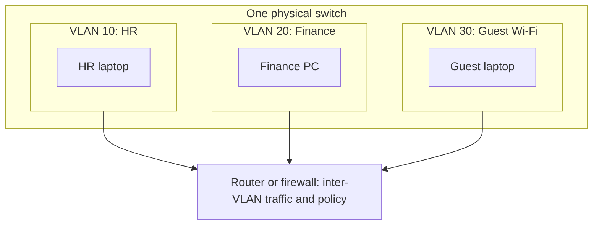
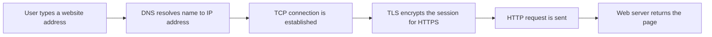
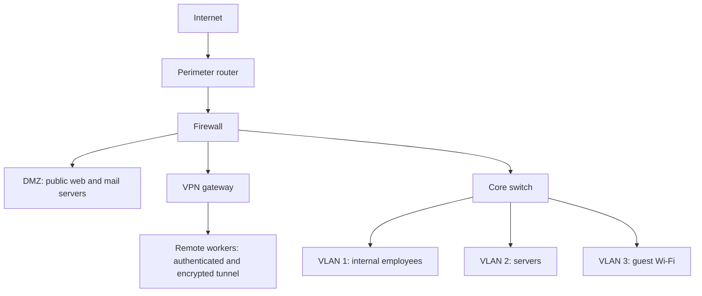
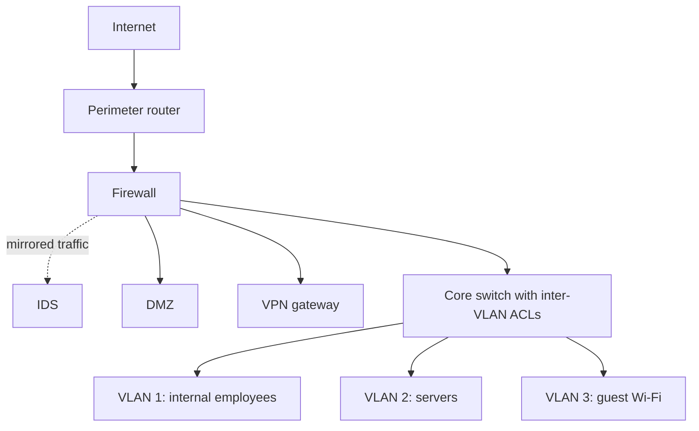

| Topic | Level | Reading Time | Prerequisites |
|---|---|---|---|
| VLANs, Protocols, and Secure Topology Design | Intermediate | ~25 min | Asset Awareness and Traffic Flow, Router and Switch Attacks |

> **الهدف من الـ Section ده:**  
>  هتفهم إيه هي الـ VLANs وليه مهمة أمنياً، وتراجع الـ protocols الأساسية، وتقدر تصمم شبكة آمنة لشركة صغيرة من الصفر.


## Learning Objectives

By the end of this section, you will be able to:

- Explain what a **VLAN** is and how it logically divides one physical network into isolated segments.
- Describe how VLANs limit **lateral movement** and why they are not a complete security control on their own.
- Explain what a network **protocol** is and map common protocols to their OSI layers.
- Identify the trust level and security requirement of each zone in a small company network.
- Design and justify a secure topology that uses a perimeter router, firewall, DMZ, VPN gateway, and separate VLANs.

## Table of Contents

- [Learning Objectives](#learning-objectives)
- [Virtual LANs and Network Segmentation](#virtual-lans-and-network-segmentation)
  - [What a VLAN Is](#what-a-vlan-is)
  - [Example of Segmentation](#example-of-segmentation)
  - [Configuring VLANs](#configuring-vlans)
- [VLANs and Security](#vlans-and-security)
  - [Limiting Lateral Movement](#limiting-lateral-movement)
  - [Different Policies for Different Teams](#different-policies-for-different-teams)
  - [VLAN Hopping](#vlan-hopping)
  - [Hardening VLANs](#hardening-vlans)
- [Network Protocols](#network-protocols)
  - [What Is a Network Protocol](#what-is-a-network-protocol)
  - [Protocols Working Together](#protocols-working-together)
  - [Protocols and the OSI Model](#protocols-and-the-osi-model)
  - [Common Protocols and Their Security Considerations](#common-protocols-and-their-security-considerations)
- [Secure Topology Design Exercise](#secure-topology-design-exercise)
  - [The Scenario](#the-scenario)
  - [Core Design Rules](#core-design-rules)
  - [Placing the Devices](#placing-the-devices)
  - [Simplified Topology Diagram](#simplified-topology-diagram)
  - [Traffic Policy Between Zones](#traffic-policy-between-zones)
  - [Going Beyond the Basic Design](#going-beyond-the-basic-design)
- [Career Path Connections](#career-path-connections)
- [Key Terms Glossary](#key-terms-glossary)
- [Summary](#summary)


## Virtual LANs and Network Segmentation

### What a VLAN Is

الـ **VLAN (Virtual LAN)** بيسمح بتقسيم شبكة فيزيائية واحدة لعدة segments منطقية ومعزولة عن بعض، حتى لو كل الأجهزة متوصلة على **نفس الـ switch الفيزيائي**.

الأجهزة في VLAN معينة **مش بتقدر تتواصل مباشرة** مع أجهزة في VLAN تانية، إلا لو الـ traffic اتعمله routing بينهم بشكل صريح.

تشبيه: تخيل مبنى واحد فيه شركات كتير. كلهم بيشتركوا في نفس المبنى (الـ switch)، لكن كل شركة ليها دور مقفول بيها ومحدش من شركة تانية يدخله من غير تصريح (الـ routing والـ firewall).

> [!NOTE]
> VLANs are typically created by network administrators for network management purposes, not primarily as a security measure. They do provide real security benefits, but that is a side effect of good network organization rather than their original goal.

### Example of Segmentation

الشركة ممكن تحط الـ HR في VLAN، والـ Finance في VLAN تانية، والـ Guest Wi-Fi في VLAN منفصلة تماماً. النتيجة إن laptop زائر مخترق **مش هيقدر يوصل مباشرة** لأنظمة الـ HR أو الـ Finance.



الرسمة بتوضح إن كل الأجهزة على switch واحد، لكن أي traffic بين الـ VLANs لازم يعدي على router أو firewall، وهناك بتتطبق الـ policies.

### Configuring VLANs

مثال على إعداد VLAN وتخصيص port لها على Cisco switch:

```text
Switch(config)# vlan 10
Switch(config-vlan)# name HR
Switch(config-vlan)# exit
Switch(config)# interface GigabitEthernet0/5
Switch(config-if)# switchport mode access
Switch(config-if)# switchport access vlan 10
```

للتحقق:

```text
Switch# show vlan brief
```

## VLANs and Security

### Limiting Lateral Movement

من غير VLANs، الشبكة بتبقى **flat network**، وكل جهاز فيها ممكن يتواصل مع كل جهاز تاني. لو مهاجم اخترق جهاز واحد، ممكن يحاول يوصل لأي حاجة تانية على الشبكة.

الـ VLANs بتقيد ده عن طريق تقسيم الـ traffic، فبتخلي الـ **lateral movement** (تحرك المهاجم من system مخترق لتاني) أصعب بشكل ملحوظ.

| Aspect | Flat Network | Segmented Network with VLANs |
|---|---|---|
| Device reachability | Any device can try to reach any other device | Only devices in the same VLAN, or through approved routes |
| Impact of one compromised machine | Attacker can attempt to reach almost everything | Attacker is contained within one segment |
| Monitoring | Hard to tell normal from suspicious traffic | Cross-VLAN traffic is a natural place to monitor and filter |

### Different Policies for Different Teams

الـ VLANs كمان بتسمح للـ administrators يطبقوا **security policies مختلفة** لكل فريق أو قسم حسب احتياجه. مثلاً الـ Finance VLAN ممكن يكون عليها firewall rules ومراقبة أشد من الـ VLAN العامة للموظفين، لأن أنظمة الـ Finance بتتعامل مع داتا أكتر حساسية.

ده بيرتبط مباشرة بالجزء الأول من السلسلة (Asset Awareness): كل ما كانت الـ assets في VLAN مصنفة حسب أهميتها، كان أسهل تطبق حماية متناسبة معاها.

### VLAN Hopping

> [!WARNING]
> VLANs alone are not a complete security control. Inter-VLAN routing, firewall rules between VLANs, and access control lists must still be configured properly. Otherwise an attacker can potentially hop between VLANs using **VLAN hopping** techniques.

الـ **VLAN hopping** هو تقنية بيقدر بيها المهاجم يوصل لـ traffic أو أجهزة في VLAN مش المفروض يوصل ليها. أشهر أسلوبين:

| Technique | How It Works | Root Cause |
|---|---|---|
| Switch spoofing | The attacker's device pretends to be a switch and negotiates a **trunk** link, gaining access to traffic of many VLANs | Ports left in dynamic negotiation mode (DTP) |
| Double tagging | The attacker crafts a frame with two VLAN tags. The first switch removes the outer tag and forwards the frame, and the inner tag sends it into another VLAN | Attacker's port is in the same VLAN as the trunk's native VLAN |

الـ **trunk port** هو port بيشيل traffic أكتر من VLAN بين switches. والـ **native VLAN** هي الـ VLAN اللي traffic بتاعها بيعدي على الـ trunk من غير tag.

> [!NOTE]
> Double tagging is generally a one-way attack. The attacker can send frames into the target VLAN but usually cannot receive the replies directly. It is still dangerous for delivering attacks and reaching hosts that were meant to be isolated.

### Hardening VLANs

الدفاعات الأساسية ضد الـ VLAN hopping ومشاكل الـ misconfiguration:

- تحديد كل port للمستخدمين صراحةً كـ access port، وإيقاف الـ dynamic trunk negotiation.
- استخدام native VLAN مخصصة وغير مستخدمة لأي أجهزة مستخدمين، وعدم استخدام VLAN 1 للـ traffic العادي.
- تحديد الـ VLANs المسموح بيها على كل trunk بدل ما يمرر الكل.
- إغلاق الـ ports غير المستخدمة وحطها في VLAN معزولة.
- ضبط الـ firewall rules والـ ACLs بين الـ VLANs، مش الاكتفاء بالفصل.

```text
! User-facing port: force access mode
Switch(config)# interface GigabitEthernet0/5
Switch(config-if)# switchport mode access
Switch(config-if)# switchport nonegotiate

! Trunk port: explicit and restricted
Switch(config)# interface GigabitEthernet0/24
Switch(config-if)# switchport mode trunk
Switch(config-if)# switchport trunk native vlan 999
Switch(config-if)# switchport trunk allowed vlan 10,20,30
Switch(config-if)# switchport nonegotiate

! Unused port: isolate and shut down
Switch(config)# interface GigabitEthernet0/10
Switch(config-if)# switchport mode access
Switch(config-if)# switchport access vlan 999
Switch(config-if)# shutdown
```

> [!TIP]
> Treat VLAN 999 in this example as a "parking" VLAN that has no gateway and no users. Any device that ends up there has nowhere to go, which is exactly the point.

## Network Protocols

### What Is a Network Protocol

الـ **network protocol** هو مجموعة قواعد ومعايير محددة بتحدد **إزاي الداتا بتتنسق (formatted) وتتنقل وتتستقبل** بين الأجهزة على الشبكة.

الـ protocols بتضمن إن أجهزة من شركات مختلفة وبأنظمة تشغيل مختلفة تقدر تفهم بعض وتتواصل صح. من غيرها، مفيش لغة مشتركة، وأي داتا من جهاز مش هتتفسر صح عند جهاز تاني. تخيل شخصين مش بيتكلموا نفس اللغة ومفيش مترجم بينهم.

### Protocols Working Together

لما بتكتب عنوان موقع في الـ browser، **عدة protocols بتشتغل مع بعض** ورا الكواليس:

- **DNS** بيترجم اسم الموقع لـ IP address.
- **TCP** بيضمن إن الداتا توصل بشكل موثوق وبالترتيب الصح.
- **HTTP** أو **HTTPS** بيحدد إزاي محتوى الصفحة بيتطلب ويتسلم.



> [!NOTE]
> HTTPS is simply HTTP carried inside a TLS-encrypted session. The application protocol is the same, but the content is protected from sniffing, which connects directly to the router sniffing risk covered in Part 2.

### Protocols and the OSI Model

الـ protocols عادةً بتشتغل على layers معينة من **OSI model** (زي Network layer أو Transport layer أو Application layer). معرفة الـ layer اللي البروتوكول بيشتغل عليها بتساعد الـ SOC analyst يفهم **أنهي جزء من الاتصال ممكن يتأثر** لو البروتوكول ده اتستغل.

| OSI Layer | Name | Example Protocols and Technologies | Related Attack From This Series |
|---|---|---|---|
| 7 | Application | HTTP, HTTPS, DNS, DHCP, SSH | Credential capture over unencrypted protocols |
| 4 | Transport | TCP, UDP | Flooding attacks that exhaust connections |
| 3 | Network | IP, ICMP, routing protocols such as BGP | Routing table poisoning, BGP hijacking |
| 2 | Data Link | Ethernet, ARP, CDP, 802.1Q VLAN tagging | MAC flooding, CDP disclosure, VLAN hopping |

> [!IMPORTANT]
> Knowing the layer tells you where to look. A problem at Layer 2 will not be fixed by a Layer 7 web filter, and a Layer 3 routing attack will not show up in an application log.

### Common Protocols and Their Security Considerations

| Protocol | Typical Port | Purpose | Security Consideration |
|---|---|---|---|
| DNS | 53 | Translates names to IP addresses | Spoofing and tampering; encrypted DNS and DNSSEC add protection |
| HTTP | 80 | Web traffic | Sent in plaintext, exposed to sniffing |
| HTTPS | 443 | Encrypted web traffic | Protects content in transit, does not hide destination metadata |
| SSH | 22 | Encrypted remote administration | Encrypted replacement for Telnet, still needs strong authentication |
| Telnet | 23 | Legacy remote administration | Plaintext, avoid it |
| MySQL | 3306 | Database access | Should be reachable only from the application servers that need it |

> [!TIP]
> Port numbers are conventions, not guarantees. Attackers can run services on any port, so a baseline of what normally runs where is more reliable than trusting the port number alone.

## Secure Topology Design Exercise

### The Scenario

الـ exercise ده بيجمع كل اللي اتعلمناه (VLANs, routers, switches, segmentation) في تصميم عملي واحد. المطلوب تصميم شبكة آمنة لشركة **50 موظف** عندها خمس zones، كل واحدة بمستوى ثقة ومتطلبات أمان مختلفة:

| Zone | Description | Security Requirement |
|---|---|---|
| Public Services | Website, mail server | Must be reachable from the internet |
| Internal Network | Employee workstations | Employees only, not reachable from outside |
| Servers | Important and sensitive data | Highest protection |
| Remote Workers | Employees connecting from outside the office | Must be authenticated and encrypted |
| Guest Wi-Fi | Untrusted visitors | Zero access to internal resources |

### Core Design Rules

قبل ما تحط أي جهاز، فيه أربع قواعد أساسية:

- **الـ internet connection يدخل من الـ perimeter router الأول.** ده أول نقطة تلامس بين شبكة الشركة والعالم الخارجي.
- **الـ firewall مباشرة ورا الـ perimeter router**، عشان يفلتر الـ traffic قبل ما يوصل لأي حاجة داخلية.
- **الـ public-facing services** (زي موقع الشركة أو الـ mail server) توضع في **DMZ (Demilitarized Zone)**، وهي segment منفصل معرض للإنترنت لكنه معزول عن الشبكة الداخلية. لو اتخترقت، المهاجم لسه مش قادر يوصل للـ internal servers مباشرة.
- **الـ internal network والـ servers والـ guest Wi-Fi** كل واحدة على VLAN منفصلة، وقواعد الـ firewall بتتحكم بالظبط في الـ traffic المسموح بينهم.

### Placing the Devices

خطوة بخطوة:

- **Internet to Perimeter Router to Firewall:** ده نقطة الدخول، والـ firewall هو أول خط فلترة.
- **Firewall to DMZ:** الخدمات العامة هنا، معزولة عن باقي الشبكة، فأي اختراق يفضل محصور.
- **Firewall to Core Switch to VLANs:** ورا الـ firewall، الـ core switch بيوصل عدة VLANs:
  - VLAN 1: Internal Employee Network.
  - VLAN 2: Servers (الأكتر حساسية، وعليها أشد firewall rules ومراقبة).
  - VLAN 3: Guest Wi-Fi (مسموح لها بالإنترنت بس، ولا access لـ VLAN 1 أو VLAN 2).
- **Remote Workers:** بيتصلوا عن طريق **VPN gateway** قريب من الـ firewall، فالـ traffic بتاعهم بيتشفر ويتعمله authentication قبل ما يوصل للشبكة الداخلية أصلاً.

> [!NOTE]
> The VLAN numbers follow the lecture exercise for clarity. In real deployments, VLAN 1 is the default VLAN on most switches, and best practice is to avoid using it for user traffic and to choose other VLAN IDs instead.

### Simplified Topology Diagram



اللي بتقوله الرسمة:

- الـ traffic من الإنترنت **لازم يعدي على الـ router والـ firewall** قبل ما يوصل لأي حاجة تانية.
- الـ DMZ معزولة، فالـ public services **مبتلمسش الـ internal VLANs مباشرة**.
- الـ remote workers **لازم يعملوا authentication عن طريق الـ VPN** قبل أي access داخلي.
- الـ Guest Wi-Fi منفصلة تماماً ومينفعش توصل لـ VLAN 1 أو VLAN 2 **تحت أي ظرف**.

> [!NOTE]
> The diagram follows the lecture layout. In practice, remote workers reach the VPN gateway across the internet, and the firewall controls that inbound connection before the tunnel is established.

### Traffic Policy Between Zones

الفصل بالـ VLANs لوحده مش كفاية، لازم policy واضحة. ده مثال مبسط لمصفوفة السماح والمنع، بمبدأ **default deny** (كل حاجة ممنوعة إلا اللي اتسمح بيه صراحةً):

| Source | Destination | Decision | Notes |
|---|---|---|---|
| Internet | DMZ | Allow selected ports only | For example web on 443 and mail on 25, nothing else |
| Internet | Internal VLAN and Servers VLAN | Deny | No direct inbound access |
| DMZ | Internal VLAN | Deny | Contains a compromise of a public server |
| DMZ | Servers VLAN | Deny by default | Allow only specific documented flows, if the business needs them |
| Internal VLAN | Servers VLAN | Allow required services only | Based on documented communication flow |
| Guest VLAN | Internet | Allow | Guests only need the internet |
| Guest VLAN | Internal VLAN and Servers VLAN | Deny | Zero access to internal resources |
| Remote workers over VPN | Internal VLAN | Allow after authentication | Encrypted and authenticated |
| Remote workers over VPN | Servers VLAN | Allow required services only | Least privilege |

وده شكل مبسط للقواعد بصيغة pseudo-rules توضيحية (مش syntax لجهاز معين):

```text
allow  guest_vlan       -> internet
deny   guest_vlan       -> internal_vlan
deny   guest_vlan       -> servers_vlan
deny   dmz              -> internal_vlan
allow  internal_vlan    -> servers_vlan  (documented services only)
deny   any              -> any           (default deny, log)
```

> [!IMPORTANT]
> Ordering matters in firewall rule sets. Specific rules go first and the default deny goes last. Also log the denied traffic, because repeated denies from one zone are useful detection signals for a SOC.

### Going Beyond the Basic Design

في النشر الفعلي، فيه إضافتين بيتعملوا عادةً:

- **IDS (Intrusion Detection System)** بيتحط غالباً ورا الـ firewall مباشرة، لمراقبة الـ traffic الداخل للشبكة الداخلية. الـ IDS عادةً بياخد نسخة من الـ traffic (بـ port mirroring أو network tap) عشان يحلله من غير ما يعطل الاتصال.
- **firewall أو ACL rule set منفصل بين الـ VLANs**، مش بس على الـ perimeter، للتحكم في الـ **east-west traffic**، وهو الـ traffic اللي بيتحرك جوه الشبكة الداخلية، مش بس الداخل والخارج من الإنترنت (وده اللي بيسمى north-south).



> [!TIP]
> Most real-world breaches involve an attacker who is already inside, moving between systems. East-west controls are what turn a single compromised laptop from a network-wide incident into a contained one.

## Career Path Connections

| Career Path | How This Topic Applies |
|---|---|
| SOC Analyst | Uses zone and VLAN knowledge to judge whether traffic between two systems is expected, and monitors east-west traffic |
| Penetration Tester | Tests whether segmentation actually holds, tries VLAN hopping, and looks for paths from the guest or DMZ zones into internal zones |
| GRC | Segmentation and documented network diagrams support compliance requirements, for example reducing the scope of systems that handle payment card data |
| Cloud Security | Cloud networks use the same ideas through virtual networks, subnets, and security groups |

## Key Terms Glossary

| Term | Definition |
|---|---|
| VLAN | Virtual LAN, a logical segment of a physical network isolated from other segments |
| Flat Network | A network with no segmentation, where any device can reach any other |
| Lateral Movement | An attacker's movement from one compromised system to others inside the network |
| VLAN Hopping | Techniques that let an attacker reach a VLAN they should not have access to |
| Trunk Port | A switch port that carries traffic for multiple VLANs |
| Native VLAN | The VLAN whose traffic crosses a trunk without a VLAN tag |
| Double Tagging | A VLAN hopping technique that uses two VLAN tags in one frame |
| Inter-VLAN Routing | Routing traffic between different VLANs, where policy can be enforced |
| Network Protocol | A set of rules defining how data is formatted, transmitted, and received |
| OSI Model | A seven-layer reference model describing how network communication is organized |
| DNS | Domain Name System, translates domain names into IP addresses |
| TCP | Transmission Control Protocol, provides reliable, ordered delivery |
| HTTPS | HTTP over TLS, providing encrypted web communication |
| Perimeter Router | The router at the network edge, connecting the company to the internet |
| Firewall | A device or software that filters traffic based on security rules |
| DMZ | Demilitarized Zone, a segment for public-facing services that is isolated from the internal network |
| Core Switch | The central switch that connects the main network segments and VLANs |
| VPN Gateway | A device that terminates VPN tunnels, providing encrypted and authenticated remote access |
| IDS | Intrusion Detection System, monitors traffic and alerts on suspicious activity |
| East-West Traffic | Traffic moving between systems inside the internal network |
| North-South Traffic | Traffic entering or leaving the network, such as to and from the internet |
| Default Deny | A policy that blocks everything unless it is explicitly allowed |

## Summary

- **VLANs segment logically:** بتقسم شبكة فيزيائية واحدة لـ segments معزولة، والـ traffic بينهم لازم يتعمله routing.
- **VLANs are for management first:** اتصممت للإدارة، لكن ليها فايدة أمنية كبيرة، خصوصاً في تقليل الـ lateral movement.
- **VLANs are not enough alone:** لازم firewall rules وACLs بين الـ VLANs، وإلا ممكن VLAN hopping (switch spoofing أو double tagging) يكسر العزل.
- **Harden the configuration:** access mode صريح، native VLAN مخصصة، allowed VLANs محددة على الـ trunks، والـ ports غير المستخدمة تتقفل.
- **Protocols are shared rules:** بيخلوا الأجهزة المختلفة تتفاهم، وبيشتغلوا مع بعض (DNS ثم TCP ثم HTTP/HTTPS).
- **OSI layer tells you where to look:** معرفة الـ layer بتساعد الـ analyst يعرف أنهي جزء من الاتصال اتأثر.
- **Secure design starts at the edge:** Internet ثم Perimeter Router ثم Firewall، وبعدها DMZ وVPN Gateway وCore Switch.
- **DMZ contains public services:** لو اتخترقت، المهاجم مش بيوصل للـ internal servers مباشرة.
- **Separate VLANs per trust level:** Internal وServers وGuest كل واحدة لوحدها، والـ Guest Wi-Fi ليها الإنترنت بس.
- **Remote workers use VPN:** الـ traffic بيتشفر ويتعمله authentication قبل الوصول للشبكة الداخلية.
- **Add IDS and east-west controls:** الـ IDS للمراقبة، وقواعد بين الـ VLANs عشان الحماية تبقى جوه الشبكة مش بس على الحدود.

