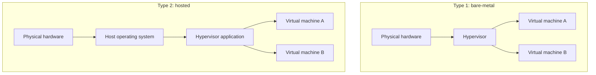
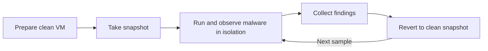
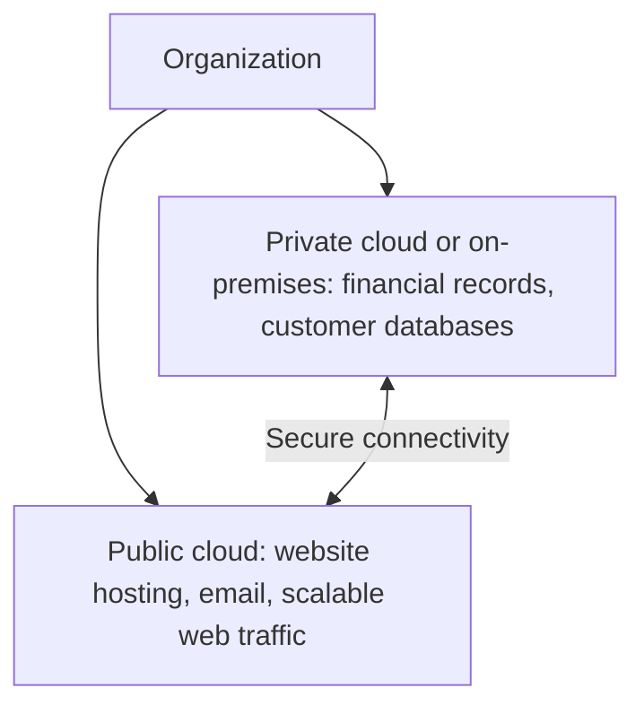

| Topic | Level | Reading Time | Prerequisites |
|---|---|---|---|
| Virtualization and Cloud Computing | Beginner | ~15 min | Basic idea of what an operating system is |


> **الهدف من الـ Section ده:**  
> هتفهم إيه هي الـ virtualization وإزاي بتستخدمها في مختبر الأمن، وتفرق بين أنواع الـ cloud وإيه مسؤوليتك الأمنية فيها.


## Learning Objectives

By the end of this section, you will be able to:

- Differentiate between Type 1 (bare-metal) and Type 2 (hosted) **hypervisors** and give examples of each.
- Explain what Kali Linux is and why security practitioners run it inside a virtual machine.
- Describe how virtual machines and **snapshots** make malware analysis safer, and what VM detection means.
- Compare private, public, and hybrid cloud deployment models.
- Explain the **Shared Responsibility Model** and why hybrid environments widen the attack surface.

## Table of Contents

- [Learning Objectives](#learning-objectives)
- [Virtualization Fundamentals](#virtualization-fundamentals)
  - [What Virtualization Is](#what-virtualization-is)
  - [Hypervisor Types](#hypervisor-types)
  - [Type 2 Hypervisors in This Course](#type-2-hypervisors-in-this-course)
- [Kali Linux for Security Practice](#kali-linux-for-security-practice)
  - [What Kali Linux Is](#what-kali-linux-is)
  - [Getting Kali Safely](#getting-kali-safely)
- [Virtualization for Malware Analysis](#virtualization-for-malware-analysis)
  - [Isolated and Contained Environments](#isolated-and-contained-environments)
  - [Snapshots](#snapshots)
  - [Basic Lab Safety](#basic-lab-safety)
  - [VM Detection by Malware](#vm-detection-by-malware)
- [Cloud Computing Deployment Models](#cloud-computing-deployment-models)
  - [Private Cloud](#private-cloud)
  - [Public Cloud](#public-cloud)
  - [Private Versus Public Comparison](#private-versus-public-comparison)
  - [Hybrid Cloud](#hybrid-cloud)
- [Cloud Security Considerations](#cloud-security-considerations)
  - [Split Attack Surface](#split-attack-surface)
  - [Shared Responsibility Model](#shared-responsibility-model)
  - [Logging Across Environments](#logging-across-environments)
  - [Common Cloud Misconfigurations](#common-cloud-misconfigurations)
- [Career Path Connections](#career-path-connections)
- [Key Terms Glossary](#key-terms-glossary)
- [Summary](#summary)

## Virtualization Fundamentals

### What Virtualization Is

الـ **virtualization** هي تقنية بتسمح بتشغيل أكتر من نظام تشغيل (operating system) على نفس الجهاز الفيزيائي، وكل نظام بيشتغل جوه **virtual machine (VM)** معزولة عن التانية. كل VM بتتصرف كأنها كمبيوتر كامل ليه CPU وذاكرة وdisk وnetwork card، لكنها في الحقيقة بتاخد حصتها من موارد الجهاز الحقيقي.

البرنامج المسؤول عن إنشاء الـ VMs وإدارتها اسمه **hypervisor**.

تشبيه: تخيل عمارة كبيرة (الجهاز الفيزيائي) اتقسمت لشقق (VMs). كل شقة ليها باب ومفتاح وسكانها، لكن كلهم بيشتركوا في نفس أساسات المبنى والمياه والكهرباء.

### Hypervisor Types

فيه نوعين من الـ hypervisors:

| Aspect | Type 1 (Bare-Metal) | Type 2 (Hosted) |
|---|---|---|
| Runs on | Directly on hardware, no underlying OS | On top of an existing operating system |
| Typical use | Data centers, servers, cloud infrastructure | Laptops and desktops, learning, testing, labs |
| Setup complexity | Higher | Lower |
| Examples | VMware ESXi, Microsoft Hyper-V, Xen, KVM | VMware Workstation, VirtualBox, Parallels |



> [!NOTE]
> KVM is built into the Linux kernel, and Hyper-V runs beneath the Windows management OS. Both are commonly classified as Type 1 even though they are installed alongside a general-purpose operating system. The key point is that the hypervisor works at the hardware level.

### Type 2 Hypervisors in This Course

الكورس بيركز على الـ **hosted hypervisors (Type 2)**، لأنها بتشتغل فوق نظام تشغيل عادي زي Windows أو macOS، فأسهل بكتير في الإعداد لأغراض التعلم. أمثلة: **VMware Workstation** و **VirtualBox** و **Parallels**.

> [!TIP]
> Before you start, check that hardware virtualization (Intel VT-x or AMD-V) is enabled in your computer's BIOS or UEFI settings. It is the most common reason a VM refuses to start or runs very slowly.

## Kali Linux for Security Practice

### What Kali Linux Is

**Kali Linux** هو Linux distribution متصمم خصيصاً للـ **penetration testing** والبحث الأمني. جاي معبأ مسبقاً بأدوات زي:

- **Nmap** لاكتشاف الأجهزة والـ ports المفتوحة على الشبكة.
- **Metasploit** لاختبار استغلال الثغرات في بيئة مصرح بيها.
- **Wireshark** لالتقاط وتحليل الـ network traffic.

بيتم صيانة Kali من **OffSec** (المعروفة سابقاً بـ Offensive Security)، وهو من أكتر الـ platforms استخداماً في صناعة الـ cybersecurity، سواء للتعلم أو لـ penetration testing engagements المحترفة.

في الكورس ده هيتم تشغيل **Kali Linux VM**، وده هيديك بيئة تجريب كاملة من غير ما تغير أي حاجة في جهازك الأساسي.

### Getting Kali Safely

نزل Kali من الموقع الرسمي بس، وتحقق من الـ checksum قبل ما تستخدمه، لأن نسخة معدلة من أداة أمنية هي بالظبط اللي مهاجم يحب يوزعها.

```bash
# Verify the integrity of a downloaded image (replace with your file name)
sha256sum kali-linux-image.iso
```

قارن الناتج بالـ hash المنشور في صفحة التحميل الرسمية. لازم يتطابقوا بالكامل.

> [!WARNING]
> Pre-built VM images often ship with well-known default credentials. Change the default password immediately, especially if the VM will ever be reachable from a network. This is the same weakness that let the Mirai botnet spread through IoT devices, covered in Part 2.

> [!IMPORTANT]
> Tools like Nmap and Metasploit must only be used against systems you own or have explicit written permission to test. A home lab is the right place to practice.

## Virtualization for Malware Analysis

### Isolated and Contained Environments

الـ VMs بتعمل بيئة **معزولة ومحتواة**، ودي بتسمح بتشغيل ودراسة الـ malware من غير ما تعرض الجهاز المضيف (host) أو الشبكة للخطر. لو الـ malware عمل ضرر، أو خرب ملفات، أو حاول ينتشر، فده كله بيفضل محصور جوه الـ VM.

### Snapshots

الـ **snapshot** هو لقطة محفوظة لحالة الـ VM في لحظة معينة. الـ analyst بياخد snapshot **قبل** تشغيل الـ malware، وبعد التحليل يرجع للـ snapshot ده، فأي ضرر حصل بيتلغي فوراً.



مثال على إدارة الـ snapshots في VirtualBox من الـ command line (اسم الـ VM هنا توضيحي):

```bash
# List the virtual machines on this host
VBoxManage list vms

# Take a snapshot of a clean analysis VM
VBoxManage snapshot "Win10-Analysis" take "clean-baseline"

# After the analysis, power off the VM and restore the snapshot
VBoxManage snapshot "Win10-Analysis" restore "clean-baseline"
```

> [!NOTE]
> Snapshots restore the VM's state, but they do not protect anything outside the VM. If the VM had network access or shared folders, malware could already have reached them. That is why the next section matters.

### Basic Lab Safety

العزل بيعتمد على الإعدادات الصح. ملاحظات أساسية:

| Setting | Recommended Practice | Reason |
|---|---|---|
| Network mode | Host-only or internal network, not bridged | Prevents malware from reaching your real network and the internet |
| Shared folders | Disabled | Prevents malware from touching host files |
| Clipboard and drag-and-drop | Disabled | Removes a data path between guest and host |
| Snapshots | Always take a clean one first | Enables quick recovery |
| Host software | Keep hypervisor and host OS updated | Reduces the chance of a VM escape vulnerability |

مثال على ضبط الـ network adapter لوضع host-only في VirtualBox (اسم الـ adapter بيختلف حسب النظام):

```bash
VBoxManage modifyvm "Win10-Analysis" --nic1 hostonly --hostonlyadapter1 vboxnet0
```

> [!WARNING]
> VM isolation is strong but not absolute. Vulnerabilities that allow code to escape from a VM to the host (called VM escapes) are rare but have existed. Never analyze real malware on a machine that holds important data, and only work with samples from trusted research sources.

### VM Detection by Malware

المشكلة إن **الـ malware المتقدم** أحياناً بيحتوي على تقنيات **VM detection**. بيفحص هل هو شغال جوه virtual machine، ولو اكتشف كده، بيرفض التنفيذ أو بيتصرف بشكل مختلف، عشان يهرب من التحليل من قبل الباحثين.

بيدور على مؤشرات زي:

- أسماء أجهزة وdrivers خاصة بالـ hypervisor.
- قيم معينة في الـ MAC address تخص شركات الـ virtualization.
- قلة الموارد المعتادة في الـ VMs (عدد cores قليل أو disk صغير).
- غياب علامات استخدام حقيقي للجهاز.

> [!NOTE]
> This is a cat-and-mouse game. Analysts respond by hardening their lab VMs to look more like real machines, or by using bare-metal analysis systems for samples that detect virtual environments.

## Cloud Computing Deployment Models

### Private Cloud

في الـ **Private Cloud**، المؤسسة نفسها **بتبني وتملك وتصون** كل البنية التحتية، سواء في مقرها أو في data center مخصص بتتحكم فيه بالكامل.

ده بيدي **أقصى تحكم** في الأمان والداتا، لكنه **مكلف جداً** بسبب الـ hardware والصيانة والموظفين ومتطلبات الأمن الفيزيائي.

### Public Cloud

في الـ **Public Cloud**، المؤسسة **بتأجر موارد الحوسبة** (servers, storage, databases) من مزود cloud تابع لطرف ثالث. من أمثلة المزودين:

- **Amazon Web Services (AWS)**
- **Microsoft Azure**
- **Google Cloud Platform (GCP)**

ده بيقلل التكاليف المبدئية بشكل كبير لأن المؤسسة مش محتاجة تشتري أو تصون hardware فيزيائي.

### Private Versus Public Comparison

| Aspect | Private Cloud | Public Cloud |
|---|---|---|
| Ownership | Organization builds, owns, and maintains everything | Resources are rented from a third-party provider |
| Control over security and data | Maximum | Shared with the provider |
| Upfront cost | Very high (hardware, staffing, physical security) | Low, no hardware to buy |
| Maintenance burden | On the organization | Mostly on the provider for the infrastructure |
| Examples | On-premises data center | AWS, Microsoft Azure, GCP |

### Hybrid Cloud

معظم المؤسسات **مبتختارش private بس أو public بس**. بتستخدم **hybrid cloud**، وهو يجمع الاتنين، فبيوازن بين توفير التكلفة في الـ public cloud وبين التحكم والأمان في الـ private infrastructure.

مثال: الشركة ممكن تحتفظ بالداتا شديدة الحساسية (زي السجلات المالية أو قواعد بيانات العملاء) على private cloud أو on-premises server لتحكم وامتثال (compliance) أعلى، وتستخدم الـ public cloud لأحمال العمل الأقل حساسية زي استضافة موقع أو تشغيل خدمات البريد أو التعامل مع traffic ويب متغير الحجم.



## Cloud Security Considerations

### Split Attack Surface

الـ hybrid model مهم جداً لفرق الأمن، لأن الـ **attack surface** بتاع المؤسسة بقى **متقسم على بيئتين**: on-premises و cloud. كل بيئة ليها security tools مختلفة، وأنظمة logging مختلفة، ونماذج مسؤولية مختلفة.

الـ attack surface هو مجموع كل النقاط اللي مهاجم ممكن يحاول يدخل منها أو يستغلها. كل ما البيئات زادت، لازم فريق الأمن يراقب أماكن أكتر بأدوات أكتر.

### Shared Responsibility Model

هنا بتظهر أهمية الـ **Shared Responsibility Model**: مزود الـ cloud بيأمن **البنية التحتية**، لكن المؤسسة لسه مسؤولة عن تأمين **داتاها وconfigurations وaccess controls** جوه بيئة الـ cloud.

تشبيه: صاحب العمارة مسؤول عن الأساسات والباب الرئيسي والحراسة العامة، لكن إنت المسؤول عن قفل باب شقتك وعن مين بتدي المفتاح.

توزيع المسؤولية بيتغير حسب نوع الخدمة:

| Service Model | Provider Typically Secures | Customer Typically Secures |
|---|---|---|
| IaaS (Infrastructure as a Service) | Physical data centers, hardware, hypervisor | Operating system, applications, data, network configuration, access control |
| PaaS (Platform as a Service) | Infrastructure and the platform runtime | Applications, data, access control |
| SaaS (Software as a Service) | Infrastructure, platform, and the application | Data, user accounts, access configuration |

> [!IMPORTANT]
> In every cloud service model, the customer remains responsible for their data and for who can access it. "It is in the cloud" never means "the provider secures everything".

### Logging Across Environments

الـ SOC لازم يجمع logs من البيئتين. كل مزود ليه أدوات خاصة:

| Provider | Example Activity Logging Service |
|---|---|
| AWS | AWS CloudTrail |
| Microsoft Azure | Azure Activity Log |
| Google Cloud | Cloud Audit Logs |

وبالربط مع الأجزاء السابقة: نفس مبدأ الـ **baselining** ضروري في الـ cloud. من غير ما تعرف الـ activity الطبيعي بتاع الـ cloud accounts والـ resources، مش هتقدر تكتشف الشاذ.

### Common Cloud Misconfigurations

المشاكل الأمنية في الـ cloud غالباً بتيجي من **configuration غلط** من العميل، مش من كسر في بنية المزود. أمثلة شائعة:

- Storage buckets متاحة للعامة بالغلط.
- صلاحيات زايدة عن اللزوم على الـ accounts والـ roles.
- Management interfaces معرضة للإنترنت من غير حماية كافية.
- غياب تفعيل الـ logging والـ monitoring.

> [!TIP]
> Apply the same asset awareness principles from Part 1 to the cloud. If cloud resources are not in your inventory, you cannot classify them, prioritize alerts about them, or secure them.

## Career Path Connections

| Career Path | How This Topic Applies |
|---|---|
| SOC Analyst | Monitors logs from both on-premises and cloud environments and understands where each asset lives |
| Penetration Tester | Builds attack labs with Kali in virtual machines and tests cloud configurations within authorized scope |
| Malware Analyst | Uses isolated VMs, snapshots, and hardened lab setups to study malicious software safely |
| GRC | Evaluates cloud providers, maps the Shared Responsibility Model to compliance controls, and decides what data can go to the public cloud |
| Cloud Security | Secures configurations, identities, and data across AWS, Azure, and GCP environments |

## Key Terms Glossary

| Term | Definition |
|---|---|
| Virtualization | Running multiple isolated virtual machines on one physical computer |
| Virtual Machine (VM) | A software-based computer with its own virtual CPU, memory, storage, and network |
| Hypervisor | Software that creates and manages virtual machines |
| Type 1 Hypervisor | A bare-metal hypervisor that runs directly on hardware |
| Type 2 Hypervisor | A hosted hypervisor that runs on top of an existing operating system |
| Kali Linux | A Linux distribution built for penetration testing and security research, maintained by OffSec |
| Snapshot | A saved state of a VM that can be restored later |
| VM Detection | Malware techniques that check whether the code is running inside a virtual machine |
| VM Escape | A vulnerability that lets code break out of a VM and affect the host |
| Private Cloud | Infrastructure built, owned, and maintained by the organization itself |
| Public Cloud | Computing resources rented from a third-party provider |
| Hybrid Cloud | A combination of private and public cloud environments |
| Attack Surface | The total set of points where an attacker could try to enter or exploit a system |
| Shared Responsibility Model | The division of security duties between the cloud provider and the customer |
| IaaS | Infrastructure as a Service, where the customer manages OS, applications, and data on rented infrastructure |
| PaaS | Platform as a Service, where the provider manages the runtime and the customer manages applications and data |
| SaaS | Software as a Service, where the provider manages the application and the customer manages data and access |

## Summary

- **Virtualization runs isolated systems:** كذا VM على جهاز واحد، والـ hypervisor هو اللي بيديرهم.
- **Two hypervisor types:** Type 1 (bare-metal) بيشتغل على الـ hardware مباشرة، وType 2 (hosted) بيشتغل فوق OS عادي وهو اللي بنستخدمه في الكورس.
- **Kali Linux is the practice platform:** distribution متخصصة في الـ pentesting فيها Nmap وMetasploit وWireshark، وبتتشغل في VM.
- **VMs make malware analysis safer:** العزل بيحصر الضرر، والـ snapshot بيرجع الحالة الأصلية فوراً، بشرط ضبط الـ network والـ shared folders صح.
- **Malware can detect VMs:** بعض الـ malware المتقدم بيرفض يشتغل أو بيتصرف بشكل مختلف لو اكتشف إنه في VM.
- **Private cloud gives control, public cloud gives savings:** الأولى مكلفة وبتديك تحكم كامل، والتانية بتقلل التكلفة المبدئية.
- **Most organizations use hybrid cloud:** الداتا الحساسة على private، والأحمال الأقل حساسية على public.
- **Hybrid splits the attack surface:** بيئتين بأدوات وlogs ونماذج مسؤولية مختلفة، وده بيزود شغل فريق الأمن.
- **Shared Responsibility Model:** المزود بيأمن البنية التحتية، والمؤسسة مسؤولة عن الداتا والـ configurations والـ access controls.


