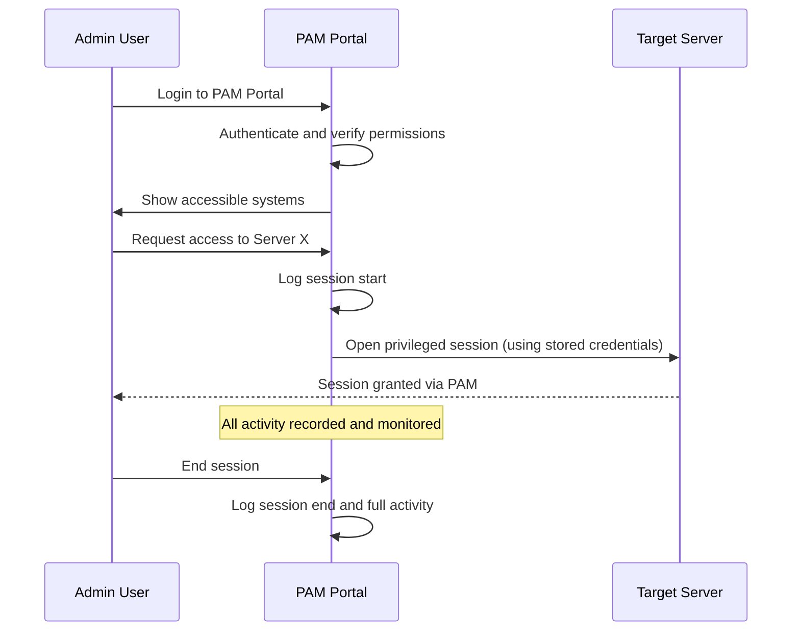
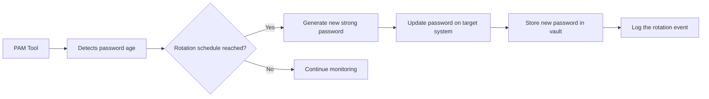
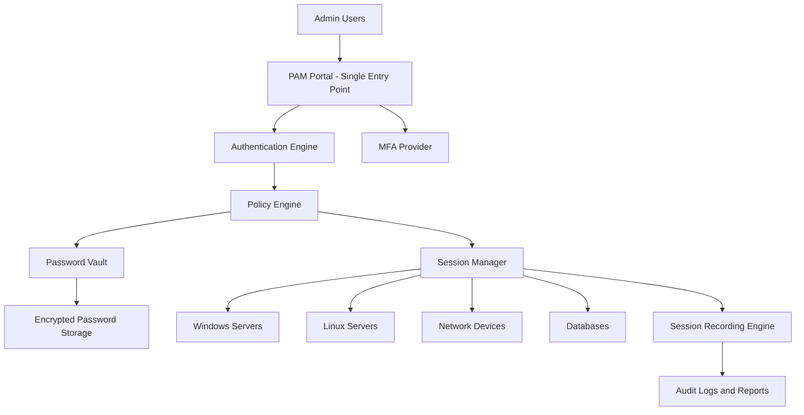

> **الهدف من الـ Section ده:**  
> هتفهم إيه هي الـ Privileged Accounts، ليه هي أكتر حاجة بتخوف الـ Security Teams في أي Organization، وإزاي الـ PAM Tools بتتحكم فيها وبتحميها من الاستغلال.
---

## Table of Contents

- [What is a Privileged Account?](#what-is-a-privileged-account)
- [What Can a Privileged Account Do?](#what-can-a-privileged-account-do)
- [Why Are Privileged Accounts a High-Value Target?](#why-are-privileged-accounts-a-high-value-target)
- [What is PAM?](#what-is-pam)
- [How PAM Tools Work in Real Life](#how-pam-tools-work-in-real-life)
- [Key Features of PAM Tools](#key-features-of-pam-tools)
- [PAM Architecture Overview](#pam-architecture-overview)
- [Summary](#summary)

---

## What is a Privileged Account?

الـ **Privileged Account** هو أي Account عنده **Elevated Permissions** — يعني صلاحيات أعلى من الـ Normal User العادي.

أشهر الأمثلة:
- **Windows**: حساب الـ `Administrator`
- **Linux/Unix**: حساب الـ `root`
- **Databases**: حساب الـ `sa` في SQL Server أو `DBA` في Oracle
- **Network Devices**: الـ `enable` mode في Cisco أو الـ `admin` في الـ Firewall

> [!IMPORTANT]
> الـ Privileged Accounts هي اللي بيسميها الـ Security Professionals بـ **"Keys to the Kingdom"** — لأن اللي بيمتلكها ممكن يعمل أي حاجة تقريباً على الـ System.

فكّر في الأمر بالشكل ده:
- الـ Normal User = موظف عنده كارت دخول للأدوار بتاعته بس.
- الـ Privileged Account = مدير الأمن اللي عنده Master Key يفتح كل الأبواب في المبنى.

---

## What Can a Privileged Account Do?

الـ Privileged Account مش بس "Account تاني" — ده Account بيقدر يعمل أشياء حساسة جداً:

| الصلاحية | التفاصيل |
|---|---|
| **Install / Remove Software** | تركيب أو إزالة أي برنامج على الـ System |
| **Change System Settings** | تعديل الـ Security Policies، الـ Firewall Rules، الـ Audit Logs |
| **Manage Users** | إنشاء / تعديل / حذف أي User Account في الـ Organization |
| **Access Sensitive Data** | قراءة الـ Logs، الـ Configs، قواعد البيانات السرية |
| **Control Other Systems** | الوصول والتحكم في Servers وأجهزة تانية على الشبكة |

> [!WARNING]
> لو Attacker استطاع يسيطر على Privileged Account واحد بس، ممكن يعمل **Full Compromise** للـ Organization بالكامل — يسرق البيانات، يحذف الـ Backups، ويركّب Ransomware.

---

## Why Are Privileged Accounts a High-Value Target?

الـ Organizations بتهتم بالـ Privileged Accounts أكتر من أي نوع تاني من الـ Accounts لأسباب واضحة:

```
Normal User Account  →  محدود الضرر لو اتاخد
Privileged Account   →  كارثة لو اتاخد
```

الـ Attackers بيعرفوا ده كويس، وعشان كده أكتر الـ Attack Techniques المتقدمة زي الـ **Pass-the-Hash**، الـ **Kerberoasting**، وهجمات الـ **Lateral Movement** كلها بتهدف في النهاية إنها توصل لـ Privileged Account.

> [!NOTE]
> في إحصاءات الـ Cybersecurity، أغلب الـ Data Breaches الكبيرة اتم فيها **Compromise لـ Privileged Account** في مرحلة من المراحل.

---

## What is PAM?

**PAM = Privileged Access Management**

هو مجموعة من الـ **Tools، Policies، وProcesses** اللي هدفها:
1. التحكم في **مين يقدر يوصل** للـ Privileged Accounts.
2. **مراقبة ومتابعة** كل حاجة بتتعمل بأي Privileged Account.
3. **حماية وتأمين** الـ Credentials بتاعة الـ Privileged Accounts.

> [!IMPORTANT]
> الـ PAM مش مجرد Software — هو **Framework** كامل بيشمل الـ Technology + الـ Policy + الـ Process. لكن لما الناس بتقول "PAM Tool" بيقصدوا الـ Software المتخصص في إدارة الـ Privileged Access.

---

## How PAM Tools Work in Real Life

خليني أشرح لك إزاي بيشتغل الـ PAM Tool في الواقع:

### الطريقة القديمة (بدون PAM):

```
Admin يحتاج يدخل على Server
       ↓
يفتح RDP / SSH مباشرة للـ Server
       ↓
يدخل بـ Username + Password (موجودة في دماغه أو في ورقة!)
       ↓
لا مراقبة، لا Logging كامل، لا Control
```

### الطريقة الحديثة (مع PAM):

```
Admin يحتاج يدخل على Server
       ↓
يفتح PAM Portal بس (Single Point of Entry)
       ↓
PAM Tool بيعمل Authentication وبيتحقق من صلاحياته
       ↓
PAM بيفتح الـ Session على الـ Server بدل الـ Admin مباشرة
       ↓
كل حاجة بتتسجل وبتتراقب في الـ PAM Tool
```

> [!TIP]
> فكّر في الـ PAM Tool كـ **Security Guard + Reception Desk** في مبنى كبير. مش بتدخل الـ Server Room مباشرة — بتعدي الأول من الـ Guard اللي بيسجل اسمك، ووقت دخولك، وإيه اللي عملته جوه.

### مخطط الـ PAM Workflow:



---

## Key Features of PAM Tools

الـ PAM Tools مش بس Logging فقط — ليها Features كتير بتديها قوتها الحقيقية:

### Password Management & Vaulting

الـ PAM Tool بيعمل **Secure Vault** لتخزين الـ Passwords:

- **Password لا تتخزنش على الـ Computer** بتاع الـ Admin أبداً — بتتخزن في الـ PAM Vault المشفر.
- الـ PAM Tool ممكن **يولّد Passwords قوية تلقائياً** للـ Privileged Accounts.
- الـ Admin نفسه ممكن ما يشوفش الـ Password الحقيقية — الـ PAM بيعمل الـ Connection بدله.

> [!IMPORTANT]
> الفكرة الجوهرية دي اسمها **"Zero Knowledge"** أو **"Password Abstraction"** — الـ Admin بيوصل للـ Server من غير ما يعرف الـ Password الحقيقية، والـ PAM بيعمل ده بدله في الخفاء.

### Session Recording & Monitoring

```
كل Privileged Session بيتسجل بالكامل:
  ✓ كل Command اتكتب
  ✓ كل File اتفتح أو اتحذف
  ✓ كل تعديل على الـ System
  ✓ Screen Recording للـ GUI Sessions
  ✓ Timestamps دقيقة على كل action
```

الـ Recording ده بيفيد في:
- **Forensics**: لو حصل Incident، تقدر ترجع وتشوف بالظبط إيه اللي حصل.
- **Compliance**: كتير من الـ Regulations زي PCI-DSS و ISO 27001 بتطلب Audit Trail للـ Privileged Access.
- **Insider Threat Detection**: لو Admin عمل حاجة مشبوهة، الـ Recording موجود.

### Access Control & Policies

الـ PAM Tool بيقدر يطبق **Strict Policies** على الـ Privileged Access:

| Policy | مثال |
|---|---|
| **Device-based Access** | Admin X يقدر يدخل على Server Y بس من جهاز معين Approved |
| **Time-based Access** | الـ Access متاح بس من 9 صباحاً لـ 6 مساءً |
| **Just-in-Time Access** | الـ Permissions بتتدي للـ Admin بس لما يطلبها وبتتشال تاني بعد ما يخلص |
| **MFA Enforcement** | لازم يعمل Multi-Factor Authentication قبل ما يوصل لأي Privileged Session |
| **Dual Control** | بعض الأنظمة الحساسة محتاجة موافقة أكتر من شخص |

### Password Rotation

الـ PAM Tool بيـ**يغير الـ Passwords تلقائياً** على فترات منتظمة:



ده بيحقق:
- **Compliance** مع الـ Security Standards اللي بتشترط Password Rotation دورية.
- **Limit the damage** لو Password اتسرق — هيتغير قريباً تلقائياً.
- **Password History Tracking** — الـ PAM بيحتفظ بسجل كامل للتغييرات.

> [!NOTE]
> بعض الـ PAM Tools بتغير الـ Password تلقائياً **فور ما الـ Session ينتهي** — يعني كل مرة حد بيخرج من الـ Session، الـ Password بيتغير. ده بيضمن إن حد حاول يستخدم الـ Password القديمة ما يقدرش.

---

## PAM Architecture Overview



---

## Summary

### النقاط الأساسية اللي لازم تفضل في دماغك:

- **الـ Privileged Account** هو أي Account عنده صلاحيات عالية زي `Administrator` في Windows أو `root` في Linux — ده الـ "مفتاح المملكة" اللي المهاجمين بيتصيدوه.

- **الـ Privileged Accounts** تقدر تعمل أخطر الأشياء على الـ System: تنصيب/حذف Software، تغيير الـ Security Settings، إدارة الـ Users، والوصول للبيانات الحساسة.

- **الـ PAM (Privileged Access Management)** هو الـ Framework والأدوات اللي بتتحكم في الوصول لـ Privileged Accounts وبتحميها.

- **الـ PAM Tool** بيشتغل كـ **Single Point of Entry** — بدل ما كل Admin يدخل على كل Server بشكل مستقل، الكل بيدخل من خلال الـ PAM Portal اللي بيتحكم ويسجل كل حاجة.

- **أهم Features الـ PAM**:
  - **Password Vaulting**: الـ Passwords مش موجودة على أجهزة الـ Admins، مخزنة في Vault مشفر.
  - **Session Recording**: كل حاجة بتتعمل في أي Privileged Session بتتسجل بالكامل.
  - **Access Policies**: ممكن تحدد مين يوصل، من أين، وإمتى.
  - **Automatic Password Rotation**: الـ Passwords بتتغير تلقائياً على فترات منتظمة.

- **Zero Knowledge Access** هو أحد أقوى مزايا الـ PAM — الـ Admin ممكن يوصل للـ Server من غير ما يعرف الـ Password الحقيقية أصلاً.

> [!IMPORTANT]
> الـ PAM مش Luxury — ده **ضرورة أمنية** لأي Organization عندها Infrastructure. الـ Regulators زي PCI-DSS وISO 27001 وNIST بيطلبوا Privileged Access Management كجزء من الـ Compliance Requirements.
