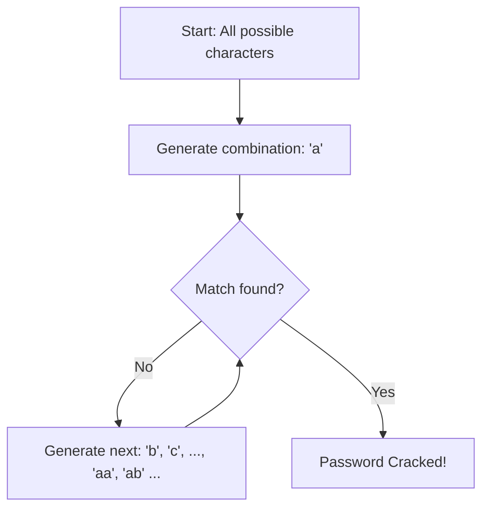
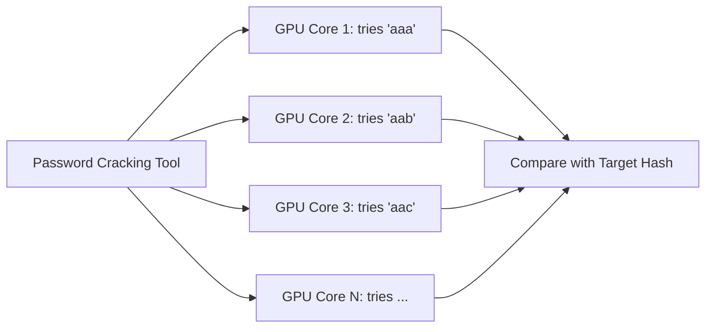
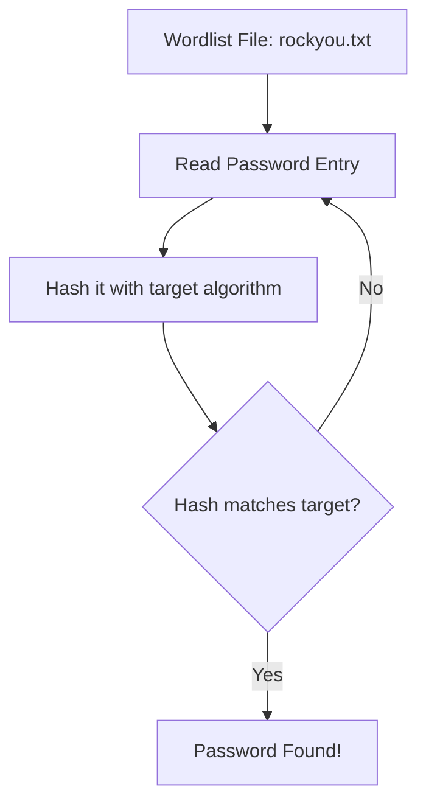
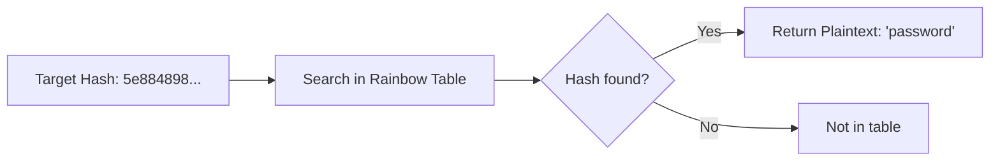
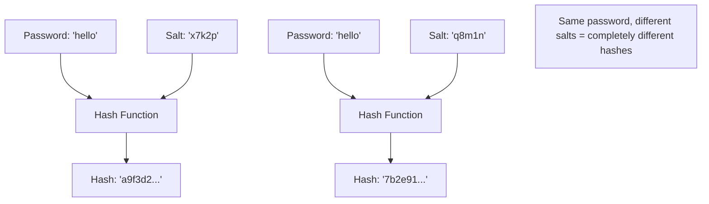
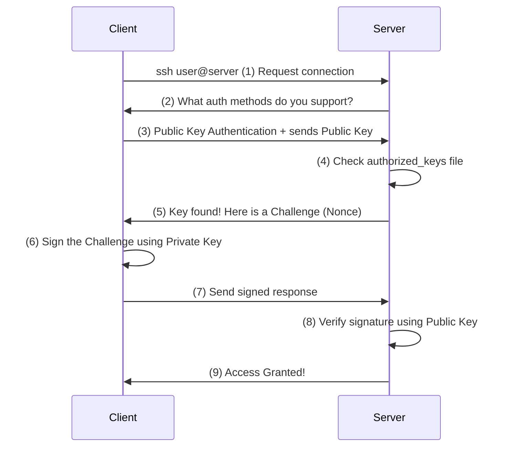
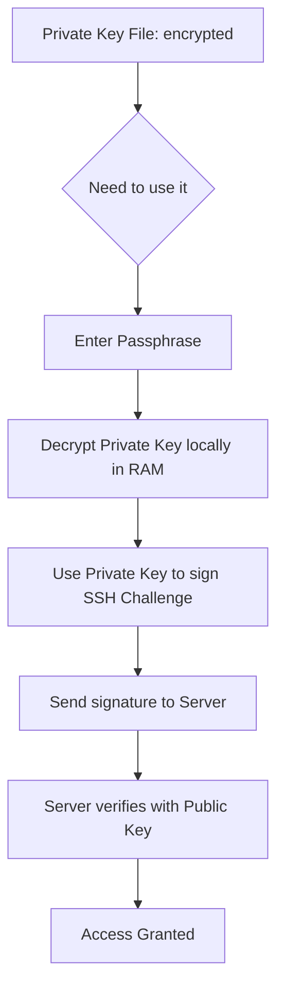
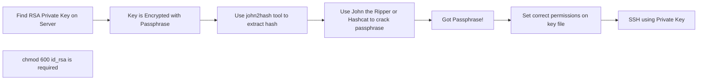
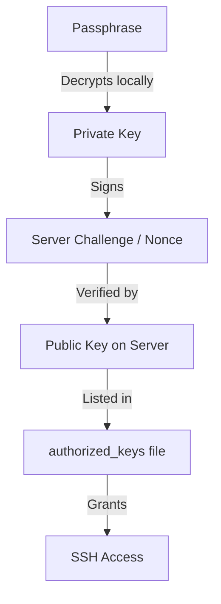

> **الهدف من الـ Section ده:**  
> هتفهم إزاي الـ Attackers بيكسروا الـ Passwords باستخدام طرق مختلفة زي الـ Brute Force والـ Dictionary والـ Rainbow Tables، وكمان هتعرف إزاي الـ SSH Authentication بيشتغل بالـ Private Key وليه الـ Passphrase مش بس كلمة مرور.

---

## Table of Contents

- [Password Cracking — المقدمة](#password-cracking--المقدمة)
- [Brute Force Attack](#brute-force-attack)
- [Dictionary Attack](#dictionary-attack)
- [Hybrid Attack](#hybrid-attack)
- [Pre-Computed Attacks & Rainbow Tables](#pre-computed-attacks--rainbow-tables)
- [مقارنة بين أنواع الهجمات](#مقارنة-بين-أنواع-الهجمات)
- [Password Cracking Lab — الأدوات والأوامر](#password-cracking-lab--الأدوات-والأوامر)
- [SSH Login Using Private Key — كيف يعمل؟](#ssh-login-using-private-key--كيف-يعمل)
- [الـ Passphrase وعلاقتها بالـ Private Key](#الـ-passphrase-وعلاقتها-بالـ-private-key)
- [Summary](#Summary)

---

## Password Cracking — المقدمة

الـ **Password Cracking** هو محاولة استعادة أو تخمين كلمة مرور مجهولة، سواء كانت مخزنة كـ **Hash** أو محمية بتشفير. في الـ Cybersecurity، الـ Attacker بيستخدم هذا الأسلوب عشان يحاول يخترق حسابات المستخدمين أو يصل لأنظمة محمية.

في الواقع العملي، الـ Passwords مش بتتخزن كـ Plaintext في قواعد البيانات. بدلاً من ذلك، بيتخزن الـ **Hash** بتاعها — وهو ناتج تمرير كلمة المرور من خلال **Hash Function** زي `SHA-256` أو `bcrypt`. لما بتجرب تكسر الـ Password، أنت في الواقع بتحاول إيجاد الـ Plaintext اللي لما تمررها من نفس الـ Hash Function هتطلع نفس الـ Hash.

```
Password → [Hash Function] → Hash Value
"hello"  →   SHA-256      → "2cf24dba..."
```

> [!IMPORTANT]
> الـ Hash Function اتجاه واحد — مش ممكن ترجع منها للـ Plaintext مباشرةً. الـ Cracking بيعتمد على التخمين والمقارنة، مش على عكس الـ Hash.

---

## Brute Force Attack

### إيه هو الـ Brute Force؟

الـ **Brute Force** هو أقوى وأبطأ طريقة في نفس الوقت. الفكرة بسيطة جداً: جرّب كل تركيبة ممكنة من الأحرف والأرقام والرموز حتى تلاقي الـ Password الصح.

تخيّل إنك عندك قفل رقمي من 4 أرقام — بتجرب من `0000` لحد `9999` واحدة واحدة. ده هو نفس المبدأ بالظبط.



### مميزات وعيوب الـ Brute Force

| الجانب | التفاصيل |
|--------|----------|
| **الفعالية** | 100% مضمون يكسر أي Password لو أُعطي وقت كافي |
| **السرعة** | بطيء جداً على الـ Passwords الطويلة والمعقدة |
| **الاعتماد على Hardware** | كلما كان الـ Hardware أقوى، كلما كانت السرعة أعلى |
| **GPU Acceleration** | الأدوات الحديثة بتستخدم آلاف الـ GPU Cores بالتوازي |
| **Quantum Computing** | مع الـ Quantum Computers، حتى أعقد الـ Passwords ممكن تتكسر في ثواني |

### ليه الـ GPU مهم جداً؟

الـ **CPU** العادي عنده عدد محدود من الـ Cores (8 أو 16 مثلاً). أما الـ **GPU** فممكن يحتوي على آلاف الـ Cores الصغيرة المصممة للعمل بالتوازي. الأدوات زي **Hashcat** بتستغل ده عشان تعمل **Parallel Processing** — كل Core بتجرب تركيبة مختلفة في نفس اللحظة.



> [!WARNING]
> رغم أن الـ Brute Force مضمون 100%، إلا أن كسر Password من 12 حرف متنوع (أحرف + أرقام + رموز) ممكن يأخذ **آلاف السنين** حتى مع أحدث الـ GPUs. لهذا السبب الـ Password الطويل والمعقد هو أفضل دفاع.

---

## Dictionary Attack

### إيه هو الـ Dictionary Attack؟

بدل ما تجرب كل تركيبة ممكنة، الـ **Dictionary Attack** بيحاول يكون أذكى: بيستخدم قائمة جاهزة من الـ Passwords الشائعة أو المحتملة — اسمها **Wordlist**.

الـ Wordlist ملف نصي عادي فيه مئات الآلاف أو الملايين من الـ Passwords، مثل:

```
123456
password
admin
iloveyou
letmein
qwerty
```

### الـ Wordlists على GitHub

في repositories ضخمة على GitHub متخصصة في الـ Wordlists، أشهرها:
- **rockyou.txt** — فيها أكتر من 14 مليون Password مسرّبة من خرق بيانات قديم
- **SecLists** — مجموعة ضخمة تشمل Passwords ومسارات Directories وغيرهم

> [!NOTE]
> الـ Dictionary Attack سريع جداً مقارنةً بالـ Brute Force، لأنه بيجرب عدد محدود من الاحتمالات. لكن فعاليته محدودة — لو الـ Password مش في الـ Wordlist، هيفشل.

### ليه الناس بتقع في الفخ ده؟

الدراسات بتثبت إن الغالبية العظمى من الناس بيستخدموا Passwords ضعيفة وشائعة. لو الـ Password موجود في الـ Wordlist، هيتكسر في ثواني.



---

## Hybrid Attack

### إيه هو الـ Hybrid Attack؟

الـ **Hybrid Attack** هو تطوير للـ Dictionary Attack. كتير من الناس بيفكر إنه ذكي لما بيعدّل الـ Password بتاعه بتغيير بسيط، زي:

- `catlover` ← Dictionary Password عادي، سهل يتكسر
- `catl0ver` ← نفس الكلمة بس الـ `o` اتحولت لـ `0` (صفر)
- `catlover123` ← نفس الكلمة بس بأرقام في الآخر
- `C@tl0ver!` ← نفس الكلمة بتعديلات متعددة

الـ Hybrid Attack بيعمل ده أوتوماتيكياً — بيأخذ كلمات الـ Wordlist وبيطبق عليها **Mutation Rules** ليولّد تنويعات.

```mermaid
graph TD
    A[Wordlist Entry: catlover] --> B[Apply Rules]
    B --> C1[catlover123]
    B --> C2[catl0ver]
    B --> C3[C@tlover]
    B --> C4[CATLOVER]
    B --> C5[catlover!]
    C1 --> D[Hash and Compare]
    C2 --> D
    C3 --> D
    C4 --> D
    C5 --> D
    D --> E{Match?}
    E -- Yes --> F[Cracked!]
    E -- No --> G[Next entry]
```

> [!TIP]
> الـ Hybrid Attack هو السبب إن مجرد إضافة رقم أو رمز في نهاية كلمة بسيطة مش كافي لحماية الـ Password. الـ Attackers بيعرفوا هذه الأنماط.

### الـ Mutation Rules الشائعة

| التعديل | مثال |
|---------|------|
| حروف كبيرة في البداية | `password` → `Password` |
| استبدال حروف بأرقام (Leet Speak) | `o` → `0`، `e` → `3`، `a` → `@` |
| إضافة أرقام في النهاية | `pass` → `pass123` |
| إضافة رموز في النهاية | `pass` → `pass!` |
| تكرار الكلمة | `pass` → `passpass` |

---

## Pre-Computed Attacks & Rainbow Tables

### إيه هي الـ Rainbow Tables؟

الـ **Pre-Computed Attack** بيعتمد على فكرة ذكية: بدل ما تحسب الـ Hash في وقت الهجوم، ليه مش تحسبه مسبقاً وتخزنه؟

الـ **Rainbow Table** هي جدول ضخم بيحتوي على:
- الـ Plaintext Password
- الـ Hash الناتج عنها

```
Plaintext      |  SHA-256 Hash
----------------|------------------------------------------
password        | 5e884898da2...
123456          | 8d969eef6ec...
admin           | 8c6976e5b54...
iloveyou        | e4ad93ca07a...
```

### كيف يعمل الهجوم؟

لما تحصل على الـ Hash المستهدف، بدل ما تحسب كل شيء من الأول، بتعمل **Lookup** بسيط في الجدول:



> [!IMPORTANT]
> الـ Trade-off هنا هو: **Storage مقابل Speed**. الـ Rainbow Tables ممكن تكون بالـ Terabytes، لكن الكسر بيحصل في ثواني بدل ساعات.

### الـ Salt — الحل ضد Rainbow Tables

الـ **Salt** هو قيمة عشوائية (Random String) بتتضاف للـ Password قبل عملية الـ Hashing. كل مستخدم عنده **Salt فريد ومختلف**.

```
password + Salt1 → Hash_A  (للمستخدم 1)
password + Salt2 → Hash_B  (للمستخدم 2)
```

رغم إن الاتنين بيستخدموا نفس الـ Password (`password`)، الـ Hash الناتج مختلف تماماً! ده بيعني إن الـ Rainbow Table الجاهزة **مش هتفيد**، لأنها اتحسبت بدون الـ Salt.



> [!NOTE]
> كل الـ Modern Hashing Algorithms الجيدة زي `bcrypt` و`Argon2` بتستخدم الـ Salting تلقائياً. الـ MD5 و SHA-1 بدون Salt هم الـ Vulnerable.

---

## مقارنة بين أنواع الهجمات

| نوع الهجوم | السرعة | الفعالية | الاستخدام الأمثل |
|------------|--------|----------|-----------------|
| **Brute Force** | بطيء جداً | 100% مضمون | Passwords قصيرة |
| **Dictionary Attack** | سريع جداً | محدودة بالـ Wordlist | Passwords شائعة وضعيفة |
| **Hybrid Attack** | سريع نسبياً | أفضل من Dictionary | Passwords معدّلة بسيطة |
| **Rainbow Table** | فوري تقريباً | فعّال جداً | Hashes بدون Salt |

---

## Password Cracking Lab — الأدوات والأوامر

### Gobuster — Directory Brute Forcing

الـ **Gobuster** أداة بتستخدم الـ Brute Force لاكتشاف الـ Directories والـ Files المخفية على الـ Web Servers. بتدي ليها Wordlist وهي بتجرب كل مسار:

```bash
gobuster dir -u http://target.com -w /usr/share/wordlists/dirb/common.txt
```

- `-u` : الـ URL المستهدف
- `-w` : مسار الـ Wordlist
- `dir` : وضع البحث عن الـ Directories

### الـ Heredoc — كتابة ملف من الـ Terminal

الأمر اللي اتذكر في الـ Lab:

```bash
cat > encrypted_key.pem << 'EOF'
[محتوى الملف هنا]
EOF
```

**شرح كل جزء:**

| الجزء | المعنى |
|-------|--------|
| `cat >` | `cat` بوضع الكتابة — بيكتب في ملف بدل ما يقرأ |
| `encrypted_key.pem` | اسم الملف المراد إنشاؤه، امتداده `.pem` |
| `.pem` | **Privacy Enhanced Mail** — صيغة ملفات المفاتيح والشهادات |
| `<< 'EOF'` | **Heredoc** — بيسمح بإدخال عدة سطور كـ Input |
| `EOF` | مجرد **Delimiter** — بيحدد بداية ونهاية المحتوى |

> [!TIP]
> الـ `EOF` ملوش معنى خاص في نفسه — ممكن تستبدله بأي كلمة زي `END` أو `DONE` أو `STOP`. المهم إنها نفس الكلمة في الأول والآخر.

---

## SSH Login Using Private Key — كيف يعمل؟

### المبدأ الأساسي للـ SSH Key Authentication

الـ SSH بيدعم طريقتين للـ Authentication:
1. **Password Authentication** — كلمة مرور عادية
2. **Public Key Authentication** — استخدام زوج المفاتيح (Private + Public Key)

الـ **Public Key Authentication** أكثر أماناً بكثير، وده هو المبدأ اللي هنشرحه.

### الـ Authorized Keys File

على كل Server SSH، في ملف مهم جداً:

```
~/.ssh/authorized_keys
```

الملف ده بيحتوي على **Public Keys** للمستخدمين المسموح لهم بالدخول. كل سطر = Public Key لمستخدم مصرح له.

### خطوات الـ SSH Authentication بالـ Key — خطوة خطوة



**شرح مفصل لكل خطوة:**

**الخطوة 1 — طلب الاتصال:**
```bash
ssh john@192.168.1.10
```
الـ Client بيطلب الاتصال بالـ Server.

**الخطوة 2 و 3 — التفاوض على الـ Auth Method:**  
الـ Server بيسأل عن أنواع الـ Authentication المدعومة، والـ Client بيرد بإنه يدعم الـ Public Key ويبعت مفتاحه العام.

**الخطوة 4 — التحقق من الـ authorized_keys:**  
الـ Server بيبحث عن الـ Public Key في ملف `~/.ssh/authorized_keys`. لو ملقهوش → يرفض الاتصال فوراً.

**الخطوة 5 — الـ Challenge (Nonce):**  
لو الـ Key موجود، الـ Server بيولّد رقم عشوائي (الـ Challenge أو الـ Nonce) ويبعته للـ Client.

> [!NOTE]
> الـ **Nonce** = **N**umber used **once** — رقم عشوائي يُستخدم مرة واحدة فقط لمنع الـ Replay Attacks.

**الخطوة 6 — التوقيع بالـ Private Key:**  
الـ Client بيوقّع الـ Challenge باستخدام الـ Private Key بتاعه. العملية دي بتثبت إنه فعلاً صاحب الـ Private Key.

**الخطوة 7 و 8 — التحقق من التوقيع:**  
الـ Server بياخد التوقيع ويتحقق منه باستخدام الـ Public Key. لو صح → الدخول مسموح.

---

## الـ Passphrase وعلاقتها بالـ Private Key

### ليه بنحتاج Passphrase؟

الـ **Private Key** هو المفتاح الأساسي للـ Authentication. لو حد حصل عليه — يقدر يدخل على أي Server بيثق في الـ Public Key المقابل له!

لحماية الـ Private Key لو وقع في إيد غلط، بنعمل **Encryption للملف نفسه** باستخدام **Passphrase** (كلمة مرور).



### الـ Passphrase مش بتصحّح على الـ Server!

> [!IMPORTANT]
> الـ Passphrase **مش بتتبعت للـ Server** أبداً. هي بتُستخدم **محلياً فقط** على الـ Client عشان تفكّ تشفير الـ Private Key من الملف المشفر. الـ Server ملوش أي علم بالـ Passphrase.

| الـ Passphrase | الـ Private Key |
|----------------|----------------|
| بتفك تشفير الملف **محلياً** | بيوقّع الـ Challenge المرسل من الـ Server |
| مش بتتبعت على الشبكة | بيثبت هوية الـ Client للـ Server |
| بتحمي الملف لو اتسرق | لو اتسرق بدون Passphrase = كارثة |

### سيناريو الـ Lab: كسر الـ Passphrase

في الـ Lab وجدنا **RSA Private Key** مشفر. عشان نستخدمه في الـ SSH Authentication:



**خطوة مهمة — ضبط الـ Permissions:**

```bash
chmod 600 encrypted_key.pem
ssh -i encrypted_key.pem john@target-server
```

> [!WARNING]
> الـ SSH بيرفض استخدام الـ Private Key لو الـ Permissions مش صح. الملف لازم يكون **قابل للقراءة من المستخدم الحالي فقط** (`600`). لو أي شخص تاني عنده صلاحية قراءته، الـ SSH بيرفض الـ Key ويديك خطأ.

### ملخص العلاقة بين المفاهيم



---

## Summary

### النقاط الرئيسية من الـ Section ده:

**أنواع هجمات الـ Password Cracking:**

- **Brute Force** — أقوى طريقة، 100% مضمونة، لكن بطيئة. السرعة بتعتمد على الـ Hardware والـ GPU Acceleration.
- **Dictionary Attack** — سريع جداً لكن محدود بالـ Wordlist. فعّال جداً ضد الـ Passwords الضعيفة والشائعة.
- **Hybrid Attack** — يجمع بين الـ Dictionary والـ Mutation Rules لكسر الـ Passwords "المعدّلة" اللي الناس بتفتكر إنها قوية.
- **Pre-Computed / Rainbow Table** — كسر فوري تقريباً باستخدام جداول محسوبة مسبقاً. الـ **Salt** هو الدفاع الأساسي ضده.

**الـ SSH Key Authentication:**

- الـ Public Key بيتخزن على الـ Server في `~/.ssh/authorized_keys`.
- الـ Server بيبعت **Challenge (Nonce)**، والـ Client بيوقّعه بالـ **Private Key**.
- الـ Server بيتحقق من التوقيع بالـ **Public Key**.
- الـ **Passphrase** بتفك تشفير الـ Private Key **محلياً فقط** — مش بتتبعت للـ Server.
- مفيش جدوى من الـ Private Key لو هو مشفر وأنت مش عارف الـ Passphrase.
- الـ `chmod 600` على ملف الـ Key شرط أساسي عشان الـ SSH يقبل استخدامه.

> [!IMPORTANT]
> الفهم الصح للفرق بين الـ Passphrase والـ Password هو من أهم النقاط. الـ Passphrase مش Authentication للـ Server — هي فقط "مفتاح المفتاح" اللي بيفتح الـ Private Key المشفر على جهازك.
