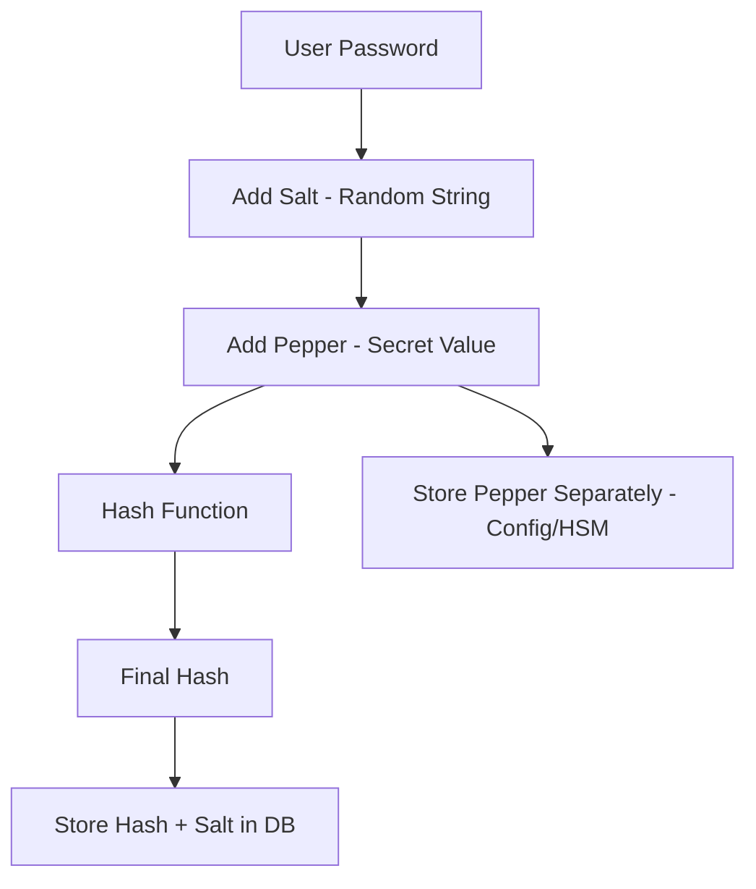
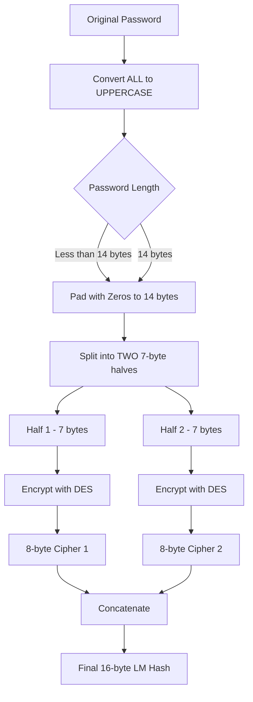
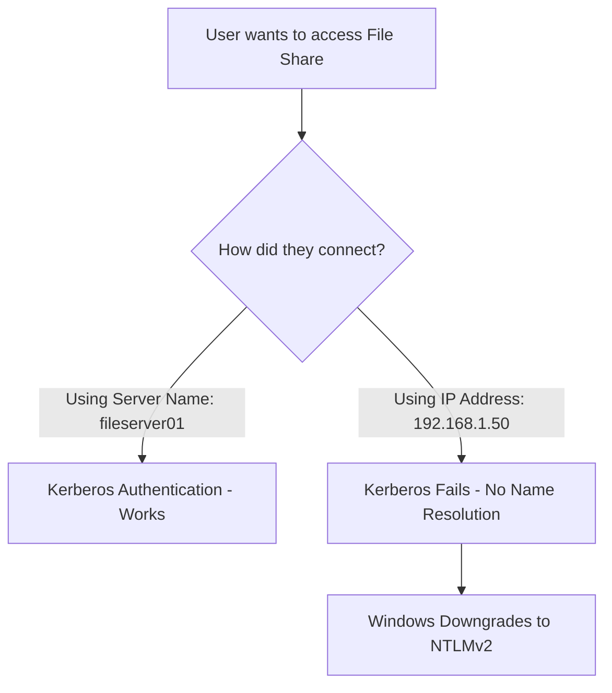
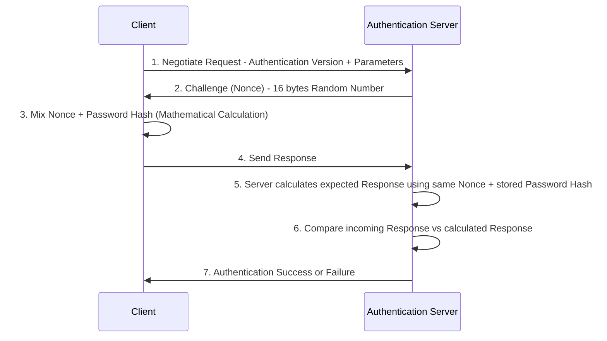

> **الهدف من الـ Section ده:**  
> هتفهم إزاي الـ Passwords بيتخزنوا بأمان من غير ما يتحفظوا كـ Plain Text، وهتعرف الفرق بين الـ Algorithms المختلفة زي LM و NTLM و NTLMv2، وهتفهم ليه الـ Salting والـ Peppering مهمين لحماية الـ Passwords من الـ Attackers.

---


## Table of Contents

- [ليه مش بنخزن الـ Passwords كـ Plain Text؟](#ليه-مش-بنخزن-الـ-passwords-كـ-plain-text)
- [Password Hashing — الفكرة الأساسية](#password-hashing--الفكرة-الأساسية)
- [Salting و Peppering](#salting-و-peppering)
- [LM Hash — الجيل الأول](#lm-hash--الجيل-الأول)
- [NTLM Hash — الجيل التاني](#ntlm-hash--الجيل-التاني)
- [NTLMv2 — الجيل الأحدث](#ntlmv2--الجيل-الأحدث)
- [Kerberos vs NTLMv2 - When to Use Each](#kerberos-vs-ntlmv2---when-to-use-each)
- [NTLMv2 Authentication Mechanism](#ntlmv2-authentication-mechanism)
- [Summary](#summary)

---

## ليه مش بنخزن الـ Passwords كـ Plain Text؟

تخيل إنك شغال على System وفجأة اتعملت Breach — يعني Attacker وصل للـ Database أو الـ Files الخاصة بالـ System. لو الـ Passwords كانت متخزنة كـ Plain Text، الـ Attacker هياخد كل حاجة في ثانية واحدة، مش بس على السيستم ده، لكن هيجرب نفس الـ Passwords على كل Service تانية.

> [!IMPORTANT]
> المفهوم الأساسي هنا هو **Assume Breach** — يعني دايمًا افترض إن الـ System هيتاختر في يوم من الأيام، وابني دفاعك على أساس ده. الـ Password Storage الصح بيمنع الـ Attacker من الـ **Lateral Movement** — يعني الانتقال من System للـ System التاني.

---

## Password Hashing — الفكرة الأساسية

بدل ما نخزن الـ Password كما هو، بنعمله **Hash** — وهي عملية رياضية بتحول الـ Password لـ Fixed-length String مش ممكن تطلع منها الـ Original Password (One-Way Function).

```
Password: "MyPassword123"
    ↓  (Hash Function)
Hash: "a7b3f92c1d4e..."
```

**على Windows**، الـ Password Hashes بتتخزن في ملف اسمه:

```
C:\Windows\System32\config\SAM
```

ده الـ **SAM Database** — اختصار لـ **Security Account Manager**. الـ Original Password مش بيتحفظ أبدًا، بس الـ Hash بيتحفظ.

> [!NOTE]
> الـ SAM Database بيكون Locked ومش متاح للقراءة وانت شغال على Windows عشان يحميه من الـ Attackers، بس في Offline Attacks ممكن يتوصله.

---

## Salting و Peppering

### المشكلة — نفس الـ Password = نفس الـ Hash

تخيل إن عندك 1000 User وكلهم بيستخدموا نفس الـ Password الضعيف زي `password123`. النتيجة إن الـ 1000 Hash هتكون **متطابقة تمامًا** في الـ Database.

لو Attacker كسر واحدة — كسر الـ 1000 في نفس الوقت.

```
User A: password123 → 482c811da5d5b4bc6d497ffa98491e38
User B: password123 → 482c811da5d5b4bc6d497ffa98491e38
User C: password123 → 482c811da5d5b4bc6d497ffa98491e38
```

### الحل الأول — Salt

الـ **Salt** هو Random String بيتضاف على الـ Password قبل الـ Hashing، فبالتالي حتى لو الـ Password واحد، الـ Hash بيطلع مختلف لكل User.

```
User A: password123 + xK9mQ2 (Salt) → Hash A
User B: password123 + pL7nR5 (Salt) → Hash B  ← مختلف تمامًا!
User C: password123 + wZ3vT8 (Salt) → Hash C  ← مختلف كمان!
```

الـ Salt بيتحفظ جنب الـ Hash في الـ Database — يعني لو Attacker سرق الـ Database، هياخد الـ Salt معاه.

> [!WARNING]
> الـ Salt مش **Secret** — بيتخزن مع الـ Hash في الـ Database وممكن يُسرق. دوره إنه بيعطل الـ **Rainbow Table Attacks** بس، مش بيمنع الـ Brute Force لو الـ Password ضعيف.

### الحل الثاني — Pepper

الـ **Pepper** هو Salt بس بيتخزن في مكان **سري منفصل** عن الـ Database — مش جنب الـ Hash.

| Feature | Salt | Pepper |
|---|---|---|
| مكان التخزين | جنب الـ Hash في الـ Database | في مكان سري منفصل (مثلاً Config File أو HSM) |
| هل ممكن يُسرق مع الـ DB؟ | نعم | لا |
| هدفه | يمنع Rainbow Table Attacks | طبقة حماية إضافية |



> [!TIP]
> الـ **Pepper** بيضيف طبقة حماية ممتازة لأنه حتى لو الـ Attacker سرق الـ Database كلها بـ Salts وكل حاجة، مش هيقدر يكسر الـ Hashes من غير ما يعرف الـ Pepper.

---

## LM Hash — الجيل الأول

### ما هو LM Hash؟

الـ **LM Hash** (اختصار لـ **LAN Manager Hash**) هو أول Algorithm عملته Microsoft لتخزين الـ Passwords، وظهر سنة **1980**.

### خطوات الـ LM Hashing Algorithm



### نقاط الضعف في LM Hash

| الضعف | التفاصيل |
|---|---|
| **Case Insensitive** | الـ Algorithm بتحول كل حاجة لـ UPPERCASE قبل الـ Hashing، يعني `MyPass` و `MYPASS` و `mypass` كلهم نفس الـ Hash |
| **Password Limit** | الـ Password محدود بـ 14 Character |
| **Split Design** | تقسيم الـ Password لجزأين بيخلي الـ Attacker يكسر كل جزء لوحده بدل ما يكسر الـ Password كله |
| **Weak Encryption** | بيستخدم DES وهو Encryption قديم وضعيف جدًا |
| **Computational Power** | اتصمم سنة 1980 والـ Computational Power كانت محدودة، النهارده بالـ GPUs ممكن يتكسر في ثواني |

> [!WARNING]
> الـ **LM Hash مكسور تمامًا** من الناحية الأمنية. لو لاقيت System لسه بيستخدمه، ده Red Flag كبير جدًا. Microsoft نفسها وقفت دعمه من زمان.

---

## NTLM Hash — الجيل التاني

### ما هو NTLM؟

الـ **NTLM** (اختصار لـ **New Technology LAN Manager**) جه كـ Successor للـ LM Hash عشان يحل مشاكله.

### التحسينات في NTLM

- بيستخدم **MD4** بدل DES — وهو Algorithm أقوى بكتير
- **Case Sensitive** — يعني `MyPass` و `mypass` بقوا مختلفين
- الـ Password مش محدود بـ 14 Character زي الـ LM

### ضعف NTLMv1

> [!WARNING]
> رغم التحسينات دي، الـ **NTLMv1** لسه vulnerable لـ **Rainbow Table Attacks** — وهي عبارة عن Precomputed Tables فيها Hashes لملايين الـ Passwords الشائعة، الـ Attacker بيقارن الـ Hash المسروق بالـ Table ولو لاقاه بيعرف الـ Password على طول.

---

## NTLMv2 — الجيل الأحدث

عشان يحل مشكلة الـ Rainbow Table Attacks في NTLMv1، Microsoft عملت **NTLMv2** وهو أقوى بكتير.

### NTLMv2 مش بس Hashing — ده Authentication Protocol

الفرق المهم إن NTLMv2 مش بس بيخزن الـ Password بشكل أأمن، ده **Authentication Mechanism** كامل بيستخدم الـ Hash في عملية المصادقة نفسها.

> [!NOTE]
> في معظم الـ Organizations النهارده، الـ Authentication في الـ Active Directory بيكون عن طريق **Kerberos** وهو أأمن من NTLM. الـ NTLMv2 بيتستخدم كـ Fallback لما Kerberos مش ممكن.

---

## Kerberos vs NTLMv2 - When to Use Each

### ليه Kerberos أحسن؟

الـ **Kerberos** هو الـ Default Authentication Protocol في الـ Active Directory، وهو أأمن من NTLM لأسباب كتير (Mutual Authentication، Ticket-based، إلخ). الـ Server المسؤول عنه في الـ AD هو الـ **Domain Controller**.

### متى بيفشل Kerberos؟

الـ Kerberos بيعتمد على **Names** (Hostnames) مش على الـ IP Addresses.



**مثال عملي:** عندك File Server اسمه `fileserver01` وـ IP بتاعه `192.168.1.50`.

- لو User كتب `\\fileserver01\share` → **Kerberos** بيشتغل عادي
- لو User كتب `\\192.168.1.50\share` → **Windows يعمل Downgrade لـ NTLMv2** لأن Kerberos محتاج اسم مش IP

> [!IMPORTANT]
> الـ **Downgrade للـ NTLMv2** ده نقطة ضعف معروفة. الـ Attackers ممكن يعملوا **NTLM Relay Attacks** أو **Credential Capture** لما الـ Authentication بيحصل عن طريق IP Address بدل الـ Hostname.

---

## NTLMv2 Authentication Mechanism
### الخطوات بالتفصيل



### شرح كل خطوة

**الخطوة 1 — Negotiate:**
الـ Client بيبعت **Negotiate Packet** للـ Authentication Server بيقوله فيه إيه الـ Version اللي عايز يستخدمها والـ Parameters الإضافية.

**الخطوة 2 — Challenge (Nonce):**
الـ Server بيرد بـ **Challenge** — ده عبارة عن **Random Number بحجم 16 Bytes** وكل مرة بيكون مختلف. ليه Random؟ عشان يمنع **Replay Attacks** — لو Attacker Captured الـ Response مش هينفعه لأن الـ Challenge مختلف في كل مرة.

**الخطوة 3 — Response Calculation:**
الـ Client بياخد الـ **Nonce** ويعمله Mix مع الـ **Password Hash** بتاعه عن طريق حسابات رياضية معينة يطلع منها الـ **Response**.

```
Response = f(Password Hash, Nonce, ...)
```

**الخطوة 4 — Send Response:**
الـ Client بيبعت الـ Response للـ Server.

**الخطوة 5 & 6 — Server Verification:**
الـ Server عنده Password Hash بتاع الـ User محفوظ عنده. هو بيعمل نفس الـ Calculation بنفس الـ Nonce، لو الـ Result اللي طلع مطابق للـ Response اللي جه من الـ Client → **Authentication Successful**.

> [!NOTE]
> لاحظ إن الـ Actual Password مش بيتبعت على الـ Network أبدًا — بس الـ Hash والـ Response. ده بيحمي من الـ Eavesdropping.

> [!TIP]
> الـ Nonce (Challenge) المختلف في كل مرة ده اللي بيفرق NTLMv2 عن النسخ السابقة ويمنع الـ **Pass-the-Hash** و **Replay Attacks** بشكل أكبر.

### مقارنة الـ Hashing Algorithms

| Feature | LM Hash | NTLMv1 | NTLMv2 |
|---|---|---|---|
| **Year** | 1980 | 1993 | 1998 |
| **Algorithm** | DES | MD4 | HMAC-MD5 |
| **Case Sensitive** | No | Yes | Yes |
| **Max Password Length** | 14 chars | Unlimited | Unlimited |
| **Salted** | No | No | Yes (Nonce-based) |
| **Vulnerable to Rainbow Table** | Yes | Yes | Harder |
| **Status** | Deprecated | Deprecated | Still used as fallback |

---

## Summary

### النقاط الأساسية اللي لازم تاخدها معاك:

- **Plain Text Storage ممنوع تمامًا** — الـ Passwords دايمًا بتتحول لـ Hashes قبل ما تتخزن. على Windows بيتخزنوا في `C:\Windows\System32\config\SAM`.

- **Salt** هو Random String بيتضاف على الـ Password قبل الـ Hashing عشان يمنع إن نفس الـ Password يطلع نفس الـ Hash لناس مختلفة. بيتخزن جنب الـ Hash.

- **Pepper** هو زي الـ Salt بس بيتخزن في مكان سري منفصل — بيضيف طبقة حماية إضافية لأن مش ممكن يتسرق مع الـ Database وحدها.

- **LM Hash** — أول Algorithm لـ Microsoft (1980)، ضعيف جدًا لأسباب كتير: Case Insensitive، بيستخدم DES، بيقسم الـ Password لجزأين. متروك تمامًا.

- **NTLMv1** — أحسن من LM: Case Sensitive ومش محدود بـ 14 Character، بس لسه vulnerable لـ Rainbow Table Attacks.

- **NTLMv2** — الأقوى: بيستخدم Nonce (Random Challenge) في كل Authentication عشان يمنع الـ Replay Attacks وبيعقد الـ Cracking.

- **Kerberos** هو الـ Default والأأمن في الـ Active Directory. لما بيفشل (زي لما User يستخدم IP بدل الـ Hostname)، Windows بيعمل **Downgrade لـ NTLMv2** — وده ممكن يكون Attack Vector.

- آلية NTLMv2 بتعتمد على: **Negotiate → Challenge → Response** ومش بيتبعت الـ Password على الـ Network أبدًا.
