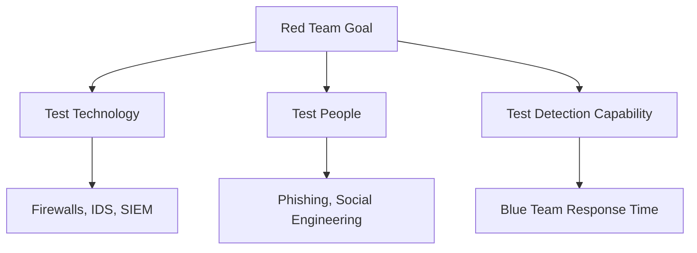
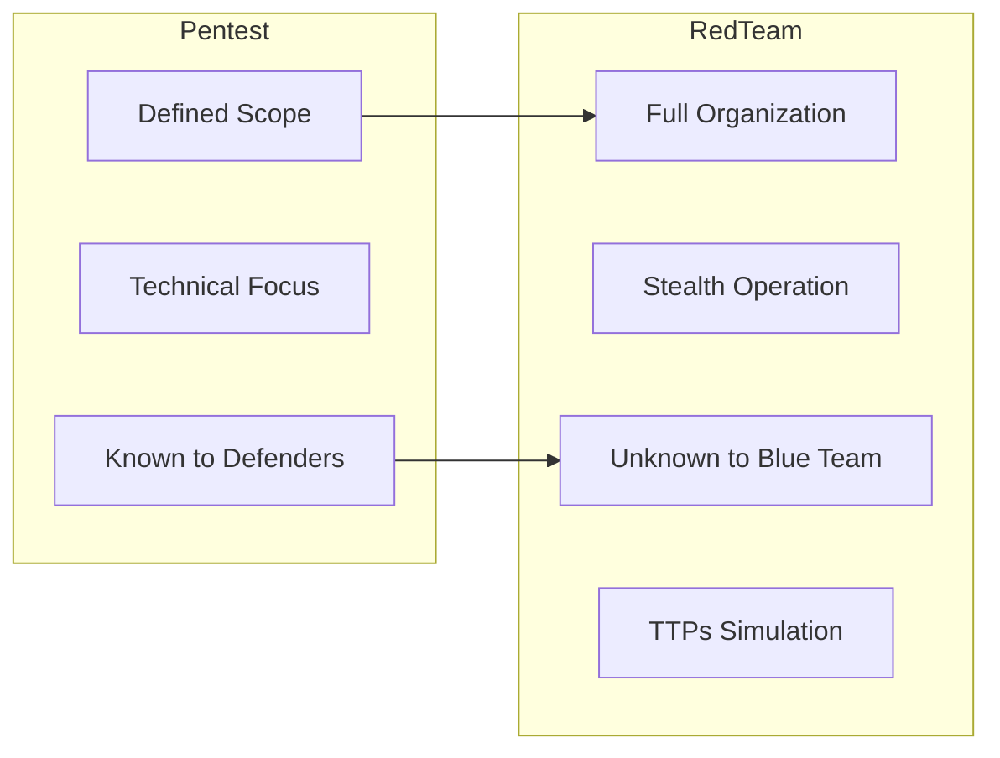
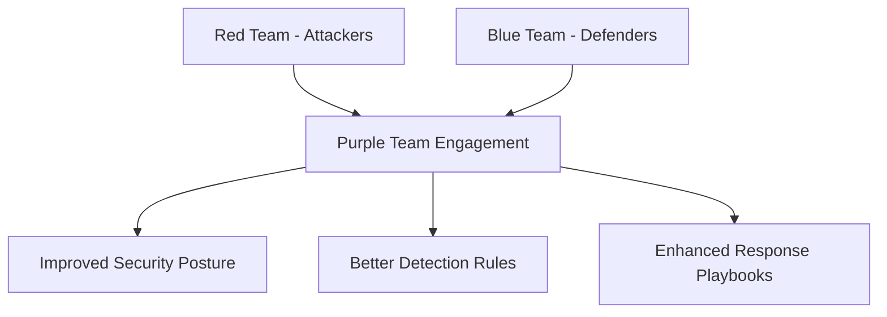
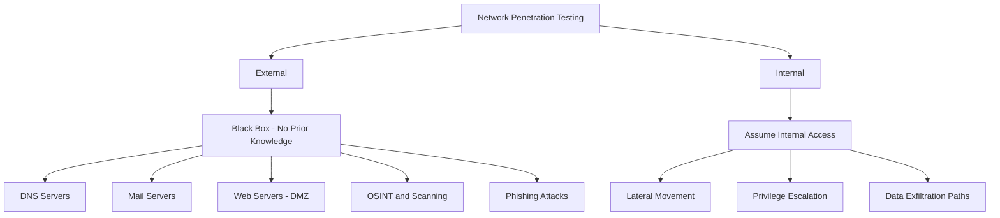
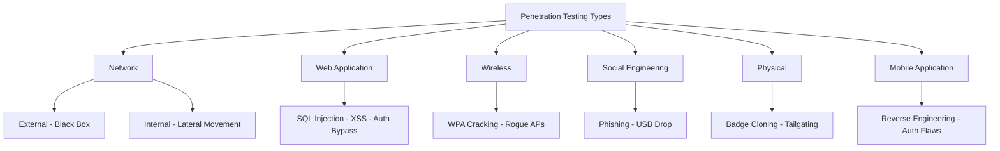
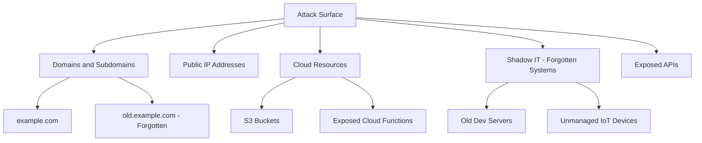
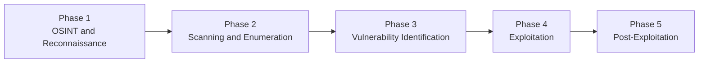
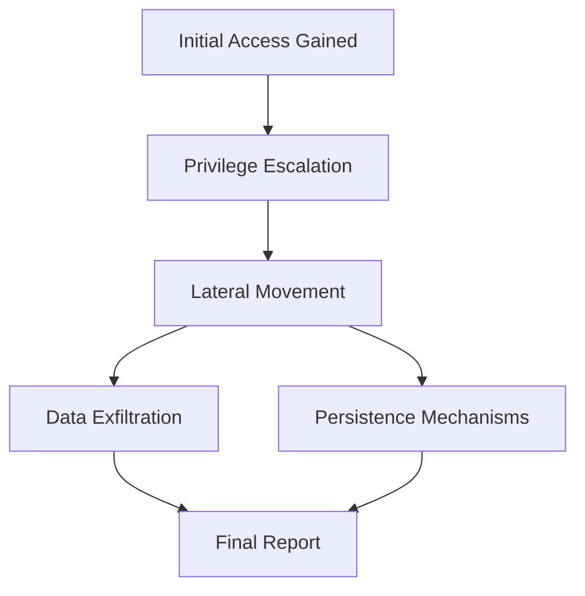

> **الهدف من الـ Section ده:**  
> هتفهم إيه معنى الـ Penetration Testing وإزاي بيختلف عن الـ Vulnerability Assessment، وهتعرف الفرق بين الـ Red Team والـ Blue Team والـ Purple Team، وإيه أنواع الـ Pentesting المختلفة، وإزاي بتتعمل من أول خطوة لآخر خطوة — كل ده من منظور SOC Analyst وـ Security Professional.

---


## Table of Contents

- [What is Penetration Testing?](#what-is-penetration-testing)
- [Vulnerability Assessment vs Penetration Testing](#vulnerability-assessment-vs-penetration-testing)
- [Red Teaming](#red-teaming)
- [Red Teaming vs Penetration Testing](#red-teaming-vs-penetration-testing)
- [Purple Team](#purple-team)
- [Types of Penetration Testing](#types-of-penetration-testing)
- [Attack Surface Management (ASM)](#attack-surface-management-asm)
- [Penetration Testing Phases](#penetration-testing-phases)
- [Summary](#summary)

---

## What is Penetration Testing?

الـ **Penetration Testing** (أو اختصاراً الـ **Pentest**) هو هجوم سيبراني محاكَى ومصرَّح بيه بشكل رسمي، بيتعمل على نظام أو شبكة أو تطبيق أو منظمة كاملة — الهدف منه إنك تلاقي الـ Vulnerabilities قبل ما المهاجم الحقيقي يلاقيها.

### الفكرة الأساسية

التفكير والتصرف **بنفس طريقة المهاجم** عشان تكتشف نقاط الضعف، وتوضح:
- إزاي ممكن يُساء استخدام الـ Vulnerability دي.
- إيه هو الـ **Impact** لو حصل الـ Exploit ده.
- إزاي تلتزم بالـ **Compliance Requirements**.

> [!IMPORTANT]
> الـ Pentest مش بس يشوف الـ Vulnerability — ده بيحاول **يعملها Exploit فعلاً**. ده الفرق الجوهري بينه وبين الـ Vulnerability Scanner.

```
Normal Vulnerability Scan:
"Port 445 is open" → Report

Penetration Test:
"Port 445 is open" → Try to exploit SMB → Gain Access → Escalate Privileges → Move Laterally → Full Report
```

---

## Vulnerability Assessment vs Penetration Testing

الـ **Vulnerability Assessment** (أو Vulnerability Scanner) هو أداة بتقولك "إيه المشاكل الموجودة" — لكنه **مش بيحاول يستغلها**.

الـ **Penetration Tester** بياخد نفس المعلومة دي وبيعمل بيها حاجات تانية تماماً:

| الخطوة | Vulnerability Assessment | Penetration Testing |
|--------|--------------------------|---------------------|
| اكتشاف المشكلة | ✅ نعم | ✅ نعم |
| محاولة الـ Exploit | ❌ لأ | ✅ نعم |
| الوصول للنظام | ❌ لأ | ✅ نعم |
| رفع الصلاحيات | ❌ لأ | ✅ نعم |
| التحرك داخل الشبكة | ❌ لأ | ✅ نعم |

**مثال عملي:**
لو الـ Scanner لاقى إن **Port 445** مفتوح:
- الـ Vulnerability Scanner هيقول: "SMB Port مفتوح — خطر محتمل"
- الـ Pentester هيحاول: Exploit SMB → Gain Access → Escalate Privileges → Lateral Movement

> [!NOTE]
> في بيئات الأعمال الحقيقية، الاتنين (Assessment + Pentest) بيتقدموا في النهاية كـ **Report** مفصّل بيشرح الـ Findings والـ Recommendations.

---

## Red Teaming

الـ **Red Teaming** هو محاكاة كاملة لمهاجم حقيقي (Adversary Simulation) — أشمل وأعمق بكتير من الـ Pentest العادي.

### الـ Red Team بيعمل إيه؟

بيحاكي الـ **TTPs** (Tactics, Techniques, and Procedures) بتاعة المهاجمين الحقيقيين — نفس اللي شفناهم في الـ **MITRE ATT&CK Framework**.



### أهم ميزة في الـ Red Teaming

> [!IMPORTANT]
> الـ Red Team بيعمل نفس الـ TTPs بتاعة المهاجمين الحقيقيين **على Infrastructure حقيقي وشغال (Live Production)** — والـ **Blue Team مش عارف** إن فيه تمرين بيحصل. ده اللي بيخلي الاختبار حقيقي ومفيد.

---

## Red Teaming vs Penetration Testing

### Penetration Testing — الهدف والنطاق

- **الهدف:** لاقي الـ Vulnerabilities التقنية قبل المهاجمين الحقيقيين.
- **الـ Scope:** محدود ومتفق عليه (مثلاً: Web App بس، أو Network داخلية بس).
- **فريق الأمن** غالباً **عارف** إن فيه Pentest بيتعمل.

**مثال:**
شركة بنكية عينت Pentesters يختبروا تطبيق الـ Online Banking بتاعها. الـ Pentesters لاقوا:
- **SQL Injection**
- **Broken Authentication**
- **Misconfigurations**

كل ده اتوثّق في **Technical Report** فيه خطوات الـ Remediation.

---

### Red Teaming — الهدف والنطاق

- **الهدف:** اختبار الـ Security Posture الكلي للمنظمة (تكنولوجيا + بشر + قدرة اكتشاف).
- **الـ Scope:** أوسع بكتير — ممكن يشمل الشركة كلها.
- **الـ Blue Team** في الغالب **مش عارف** إن فيه تمرين.

**مثال:** الـ Red Team ممكن يبعت **Phishing Emails** للموظفين عشان يختبر:
1. مدى وعي الموظفين.
2. قدرة الـ Security Tools على اكتشاف الـ Phishing.
3. سرعة استجابة الـ Blue Team لو اكتشفوه.

---

### مقارنة شاملة

| الجانب | Penetration Testing | Red Teaming |
|--------|---------------------|-------------|
| **الهدف** | إيجاد الـ Vulnerabilities | محاكاة مهاجم حقيقي |
| **الـ Scope** | أنظمة محددة | المنظمة كلها |
| **المدة** | أيام لأسابيع | أسابيع لأشهر |
| **التركيز** | العيوب التقنية | الاكتشاف والاستجابة |
| **هل فريق الأمن عارف؟** | في الغالب نعم | في الغالب لأ |
| **الأساليب** | Exploitation | Social Engineering, Phishing, Lateral Movement |



---

## Purple Team

الـ **Purple Team** هو التعاون المشترك بين الـ **Red Team** والـ **Blue Team** لتحسين الـ Security بشكل كلي.



### الفرق عن الـ Red Teaming العادي

| | Red Team Exercise | Purple Team Engagement |
|--|------------------|------------------------|
| **الـ Blue Team عارف؟** | لأ (Blind) | نعم (Fully Known) |
| **التعاون** | منفصلين | شغالين مع بعض |
| **الهدف الأساسي** | اختبار الاكتشاف | تحسين الـ Detection والـ Response معاً |

> [!TIP]
> الـ Purple Team مثالي لما المنظمة عايزة تحسن الـ Detection Rules بتاعتها في الـ SIEM أو تطور الـ Playbooks — لأن الـ Red وـ Blue شغالين مع بعض بشكل مباشر.

---

## Types of Penetration Testing

### 1. Network Penetration Testing

الـ Network Pentest بيتقسم لنوعين أساسيين:



#### External Network Penetration Testing

- الـ Target بيتعامل معاه كـ **Black Box** — الـ Pentester مش عنده معلومات مسبقة.
- بيحاكي بالظبط إزاي المهاجم الحقيقي هيشوف المنظمة من بره.
- بيستهدف الأنظمة الظاهرة للإنترنت: **DNS, Mail, Web Servers**.
- ممكن يشمل **Phishing Attacks** كوسيلة للوصول.
- بيعتمد بشكل كبير على: **OSINT** و **Scanning**.

#### Internal Network Penetration Testing

- بيحاكي سيناريو إن المهاجم **عنده وصول داخلي مسبق** — سواء موظف داخلي أو حد اشترى Initial Access من الـ Dark Web.
- الهدف: يعرف المهاجم يعمل إيه بعد ما يدخل، وإزاي يتحرك Laterally.

**ما بيشمله الـ Network Pentest:**

| المكون | السبب |
|--------|--------|
| **Firewalls** | هل القواعد مضبوطة صح؟ |
| **Routers** | هل فيه Misconfigurations؟ |
| **VPN** | هل التشفير والـ Authentication آمنين؟ |
| **DMZ Servers** | هل الأنظمة الظاهرة محمية كفاية؟ |

---

### 2. Web Application Penetration Testing

بيركز تحديداً على تطبيقات الويب وقواعد البيانات.

**أشهر الـ Vulnerabilities المختبَرة:**

| الـ Vulnerability | الوصف |
|-------------------|-------|
| **SQL Injection** | حقن أكواد SQL في الـ Input Fields |
| **Cross-Site Scripting (XSS)** | تنفيذ JavaScript في براوزر المستخدم |
| **Authentication Bypass** | تجاوز الـ Login بدون بيانات صحيحة |
| **File Upload Vulnerabilities** | رفع ملفات ضارة للـ Server |
| **Session Hijacking** | سرقة الـ Session Token بعد الـ Login |

> [!WARNING]
> الـ Web App Pentest مش بس بيشوف إذا كان في SQL Injection — ده بيحاول يستغلها فعلاً عشان يعرف الـ Impact الحقيقي.

---

### 3. Wireless Penetration Testing

بيركز على أمان شبكات الـ Wi-Fi.

**ما بيختبره:**
- **Weak Encryption** — هل التشفير ضعيف؟
- **Rogue Access Points** — هل فيه Access Points مزيفة؟
- **WPA Cracking** — هل ممكن يكسر الـ WPA Password؟

---

### 4. Social Engineering Testing

بيستهدف الضعف البشري مش التقني.

**الأساليب:**
- **Phishing Emails** — إيميلات وهمية
- **USB Drop Attacks** — USB drives مزيفة فيها Malware تتحط في الشركة

> [!NOTE]
> الـ Social Engineering Testing جزء مهم من الـ Red Teaming — لأن أكتر الهجمات الحقيقية بتبدأ بـ Human Error مش Technical Vulnerability.

---

### 5. Physical Penetration Testing

بيختبر الأمان المادي للمبنى والأصول.

**ما بيختبره:**
- **Access Control Systems** — هل البوابات والأقفال محكمة؟
- **Badge Cloning** — هل ممكن يُنسَخ البطاقة الأمنية؟
- **Tailgating** — هل ممكن حد يدخل ورا موظف من غير ما يتشاف؟

---

### 6. Mobile Application Testing

بيختبر تطبيقات الـ iOS و Android.

**ما بيختبره:**
- **Authentication Flaws** — ثغرات في الـ Login
- **Reverse Engineering** — تفكيك التطبيق عشان يفهم منطقه الداخلي

---

### ملخص أنواع الـ Pentesting



---

## Attack Surface Management (ASM)

الـ **Attack Surface Management** هو عملية **مستمرة** لاكتشاف ومراقبة وتأمين كل الأصول اللي ممكن المهاجم يوصلها.

### السؤال الجوهري للـ ASM

> **إيه الأصول اللي منظمتك بتعرضها للإنترنت وممكن المهاجم يشوفها ويستهدفها؟**

### إيه اللي بيشمله الـ Attack Surface؟



| نوع الأصل | مثال | الخطر |
|-----------|------|-------|
| **Domains/Subdomains** | `old.company.com` | ممكن يكون قديم ومش محدَّث |
| **Public IP Addresses** | سيرفرات ظاهرة للإنترنت | Open Ports قابلة للاستغلال |
| **Cloud Resources** | S3 Buckets مش محمية | Data Exposure |
| **Shadow IT** | سيرفر Dev قديم ومنسي | لا Patches ولا Monitoring |

> [!IMPORTANT]
> الـ **Attack Surface** هو مجموع كل نقاط الدخول الممكنة اللي المهاجم يقدر يستخدمها للوصول لنظامك. كل ما الـ Attack Surface أكبر، كل ما الخطر أكبر.

> [!TIP]
> الـ ASM مش بيتعمل مرة واحدة — ده **عملية مستمرة** (Continuous Process) لأن الـ Infrastructure بيتغير باستمرار: بيتضاف Subdomains جديدة، Cloud Resources بتتعمل، Developers بيعملوا Shadow IT من غير علم فريق الأمن.

---

## Penetration Testing Phases

الـ Pentest بيمشي في خطوات منهجية ومرتبة:



### Phase 1: OSINT and Reconnaissance

جمع معلومات عن الـ Target من مصادر مفتوحة **من غير أي تفاعل مباشر** مع الأنظمة.

**الأدوات والأساليب:**
- البحث في Google وـ Shodan وـ LinkedIn
- جمع Subdomains وـ Email Addresses
- تحليل الـ WHOIS وـ DNS Records

> [!NOTE]
> الـ Reconnaissance هي المرحلة الأهم — كل المعلومات المجموعة هنا بتبني عليها كل خطوة جاية.

---

### Phase 2: Scanning and Enumeration

التفاعل المباشر مع الـ Target عشان تعرف إيه الأنظمة الشغالة وإيه الخدمات المتاحة.

**الأدوات:**
```bash
# Network Scanning
nmap -sV -sC -p- target.com

# Enumerate web directories
gobuster dir -u http://target.com -w wordlist.txt

# Enumerate subdomains
subfinder -d target.com
```

---

### Phase 3: Vulnerability Identification

تحديد الـ Vulnerabilities في الأنظمة والخدمات اللي اتعرفنا عليها في المرحلة السابقة.

**الأدوات:**
- **Nessus** أو **OpenVAS** للـ Vulnerability Scanning
- التحقق اليدوي من الـ CVEs المرتبطة بالـ Versions الظاهرة

---

### Phase 4: Exploitation

محاولة استغلال الـ Vulnerabilities اللي اتحددت عشان نثبت إنها حقيقية وإنها قابلة للاستغلال.

**الأدوات:**
```bash
# Metasploit Framework
msfconsole
use exploit/windows/smb/ms17_010_eternalblue
set RHOSTS target.com
run
```

> [!WARNING]
> الـ Exploitation لازم يكون **بإذن مكتوب ورسمي** من المنظمة. أي Exploit من غير إذن = **جريمة**.

---

### Phase 5: Post-Exploitation

بعد ما تدخل النظام، إيه اللي تعمله المهاجم؟

**الأهداف:**
- **Privilege Escalation** — رفع الصلاحيات
- **Lateral Movement** — التحرك لأنظمة تانية
- **Data Exfiltration** — استخراج بيانات حساسة
- **Persistence** — الحفاظ على الوصول لفترة أطول



---

## Summary

### النقاط الأساسية اللي لازم تفتكرها:

- **Penetration Testing** هو هجوم محاكَى ومصرَّح بيه الهدف منه إيجاد الـ Vulnerabilities قبل المهاجمين الحقيقيين — والفرق الجوهري عن الـ Vulnerability Scanner إنه بيحاول **يعمل Exploit فعلاً**.

- **Vulnerability Assessment** يقولك "فيه مشكلة"، الـ **Pentest** يثبتلك "المشكلة دي خطيرة وممكن تُستغل كده".

- **Red Teaming** أشمل من الـ Pentest — بيحاكي مهاجم حقيقي بنفس الـ TTPs، على Infrastructure حقيقي، والـ Blue Team مش عارف، والـ Scope يشمل المنظمة كلها (تكنولوجيا + بشر + قدرة اكتشاف).

- **Purple Team** = Red + Blue شغالين مع بعض لتحسين الـ Detection والـ Response بشكل تعاوني.

- **أنواع الـ Pentest:** Network (External/Internal)، Web Application، Wireless، Social Engineering، Physical، Mobile.

- **ASM** هو عملية مستمرة لمعرفة إيه اللي منظمتك بتعرضه للإنترنت — Domains، IPs، Cloud Resources، Shadow IT.

- **مراحل الـ Pentest:** OSINT → Scanning → Vulnerability ID → Exploitation → Post-Exploitation.

> [!IMPORTANT]
> كـ SOC Analyst، فهمك لمنهجية الـ Penetration Testing بيساعدك تفهم **إزاي بيفكر المهاجم**، وبالتالي تكون أقدر على اكتشاف الهجمات ومنعها.
