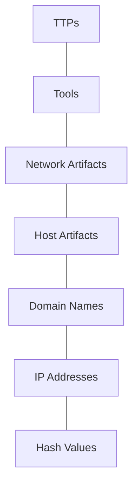
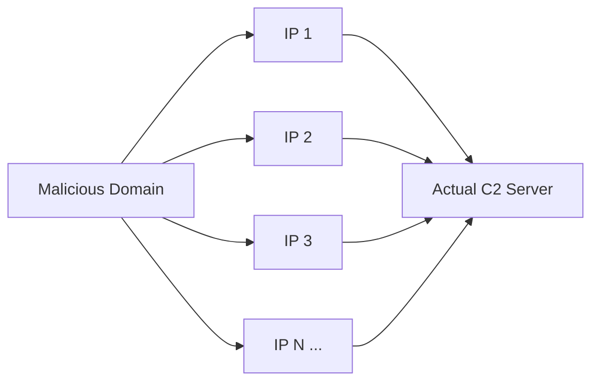
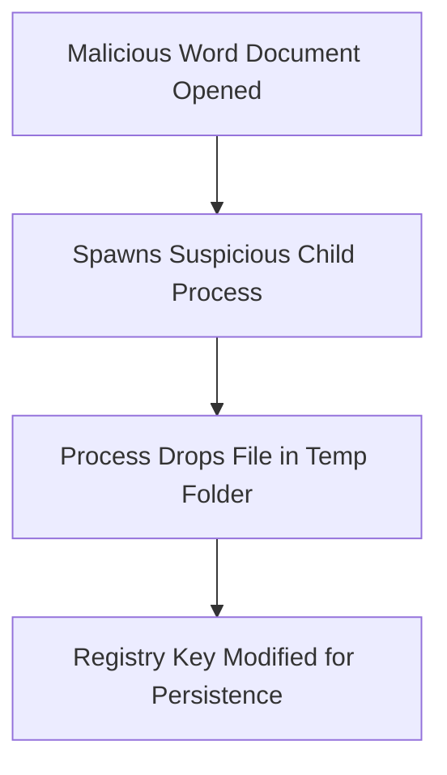
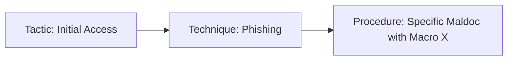

> الهدف من الـ Section ده
> هتفهم إيه هو ال **Pyramid of Pain**، وإزاي كل نوع من الـ Indicators (من الـ Hash البسيط لحد الـ TTPs المعقدة) بيأثر بشكل مختلف على الـ Attacker لما تكتشفه، وإزاي كـ SOC Analyst تقدر تستخدم الهرم ده عشان تحدد فين تركّز جهدك في الـ Detection عشان تبقى أكتر إزعاج (Pain) للمهاجم.


## Table of Contents

- [What is the Pyramid of Pain?](#what-is-the-pyramid-of-pain)
- [Level 1: Hash Values](#level-1-hash-values)
- [Level 2: IP Addresses](#level-2-ip-addresses)
- [Level 3: Domain Names](#level-3-domain-names)
- [Level 4: Host Artifacts](#level-4-host-artifacts)
- [Level 5: Network Artifacts](#level-5-network-artifacts)
- [Level 6: Tools](#level-6-tools)
- [Level 7: TTPs (Tactics, Techniques & Procedures)](#level-7-ttps-tactics-techniques--procedures)
- [Summary Comparison Table](#summary-comparison-table)
- [Summary](#summary)

---

## What is the Pyramid of Pain?

الـ **Pyramid of Pain** هو Model اتعمل بمعرفة **David Bianco**، وبيوضح العلاقة بين أنواع الـ **Indicators of Compromise (IOCs)** اللي ممكن تكتشفها كـ Defender، ومدى الـ "ألم" (Pain) اللي هتسببه للـ Attacker لو قدرت تكتشف وتحجب الـ Indicator ده.

الفكرة الأساسية: مش كل الـ IOCs ليهم نفس القيمة. لو اكتشفت IP Address واتش، الـ Attacker هيغيّره في ثواني. لكن لو اكتشفت الـ **TTPs** بتاعته (يعني الأسلوب اللي بيشتغل بيه)، هيبقى مضطر يعيد بناء طريقة هجومه بالكامل — وده بياخد منه وقت وفلوس ومجهود حقيقي.



> [!IMPORTANT]
> كل ما اتصعدت لفوق في الهرم، كل ما كان الاكتشاف أصعب عليك كـ Defender، لكن في نفس الوقت كل ما كان أكتر إيلاماً (Painful) للـ Attacker. الهدف الاستراتيجي لأي SOC ناضج إنه ميقفش عند القاعدة (Hashes و IPs) لوحدها، لازم يطلع لفوق.

الهرم اتلوّن تقليدياً بالألوان دي من القاعدة للقمة:

| اللون | المستوى | درجة الألم على الـ Attacker |
|---|---|---|
| Green | Hash Values | Trivial — تافه |
| Green | IP Addresses | Easy — سهل |
| Teal | Domain Names | Simple — بسيط |
| Yellow | Host Artifacts | Annoying — مزعج |
| Yellow | Network Artifacts | Annoying — مزعج |
| Orange | Tools | Challenging — صعب |
| Red | TTPs | Tough! — قاسي جداً |

> [!TIP]
> لما تشتغل Threat Hunting أو تكتب Detection Rule جديدة، اسأل نفسك دايماً: "أنا بكتشف إيه دلوقتي؟ هل ده Hash بس، ولا أنا بكشف الـ Behavior الحقيقي بتاع الـ Attacker؟" كل ما اتصعدت في الهرم كل ما الـ Detection بتاعك بقى أكتر مقاومة للتغيير من الطرف التاني.

---

## Level 1: Hash Values

### إيه هو الـ Hash Value؟

الـ Hash Value هو رقم بطول ثابت بيتولّد من تشغيل ملف معين على خوارزمية Hashing معينة، وبيستخدم عشان "يبصم" الملف ده بشكل فريد (Unique Identifier). أشهر الخوارزميات:

| Algorithm | Year | Bit Length | Hex Digits | الحالة الأمنية |
|---|---|---|---|---|
| MD5 | 1992 | 128-bit | 32 | غير آمن، عرضة لـ Collision Attacks (RFC 6151) |
| SHA-1 | 1995 | 160-bit | 40 | اتعمله Deprecate من NIST سنة 2011، اتمنع استخدامه في Digital Signatures آخر 2013 |
| SHA-2 (SHA-256) | 2001 | 256-bit | 64 | الموصى بيه حالياً (NIST/NSA) |

> [!NOTE]
> "Collision" يعني إنك تلاقي ملفين مختلفين تماماً بس بنفس الـ Hash Value. لو ده حصل، الخوارزمية بقت غير موثوقة لأنك مش هتقدر تتأكد إن الملف فعلاً هو نفسه.

### ليه الـ Hash في قاع الهرم؟

من منظور **SOC Analyst**، الـ Hash هو أسهل IOC تستخدمه — تقدر تـ Lookup الـ Hash على أدوات زي **VirusTotal** أو **Metadefender Cloud - OPSWAT** وتعرف فوراً لو الملف معروف إنه Malicious.

المشكلة إن أي تعديل بسيط جداً في الملف — حتى لو حرف واحد إتضاف في الآخر — بيغيّر الـ Hash بالكامل. يعني الـ Attacker ممكن "يهرب" من الـ Detection بأقل مجهود ممكن.

```powershell
# قبل التعديل
PS C:\Users\THM\Downloads> Get-FileHash .\OpenVPN_2.5.1_I601_amd64.msi -Algorithm MD5
Algorithm Hash                             Path
_________ ____                             ____
MD5       D1A008E3A606F24590A02B853E955CF7  ...OpenVPN_2.5.1_I601_amd64.msi

# الـ Attacker بيضيف سطر بسيط جداً للملف
PS C:\Users\THM\Downloads> echo "AppendTheHash" >> .\OpenVPN_2.5.1_I601_amd64.msi

# بعد التعديل - الـ Hash اتغيّر بالكامل
PS C:\Users\THM\Downloads> Get-FileHash .\OpenVPN_2.5.1_I601_amd64.msi -Algorithm MD5
Algorithm Hash                             Path
_________ ____                             ____
MD5       9D52B46F5DE41B73418F8E0DACEC5E9F  ...OpenVPN_2.5.1_I601_amd64.msi
```

> [!WARNING]
> متعتمدش بس على File Hashes كـ IOC الأساسي بتاعك في الـ Threat Hunting. مع كثرة الـ Variants من نفس الـ Malware Family، الاعتماد على الـ Hash لوحده هيخليك دايماً ورا الـ Attacker بخطوة، لأنه بيقدر يغيّره في ثانية.

### مصادر مفيدة لـ Hash Lookup

- **VirusTotal** — بيدّيك الـ Filename كمان جنب الـ Hash، وغالباً بيظهرلك أسماء زي `m_croetian.wnry` كمثال على ملف Ransomware.
- **Metadefender Cloud - OPSWAT**
- **The DFIR Report** و **Trellix Threat Research Blogs** — تقارير حقيقية بتحط الـ Hashes بتاعة العينات في الآخر.

---

## Level 2: IP Addresses

الـ IP Address هو العنوان اللي بيحدد أي جهاز على الشبكة — من جهاز الـ Desktop العادي لحد كاميرات الـ CCTV. في سياق الـ Pyramid of Pain، إحنا بنشوف الـ IP كـ Indicator يقدر يدلنا على نشاط الـ Attacker (مثلاً Server بيستضيف C2).

### ليه لسه سهل على الـ Attacker يغيّره؟

التكتيك الدفاعي الشائع هو الـ **Blocking/Dropping** للـ IP عند الـ Firewall أو الـ Perimeter. بس ده مش حل نهائي، لأن أي مهاجم متمرس بيقدر يحجز IP جديد ويكمل شغله بسهولة.

> [!IMPORTANT]
> الـ Attackers المحترفين بيستخدموا تقنية اسمها **Fast Flux**. دي تقنية DNS بيستخدمها الـ Botnets عشان يخبوا أنشطة الـ Phishing أو Web Proxying أو Malware Delivery خلف Compromised Hosts شغالة كـ Proxies. الفكرة إن دومين واحد بيترابط بعدد كبير من الـ IPs اللي بتتغيّر باستمرار، وده بيخلي تتبع وحجب الـ C2 Server صعب جداً.



> [!WARNING]
> أي IP Address بتشوفه في تقرير Malware Analysis أو Threat Intel (زي تقارير any.run) متتفاعلش معاه أبداً بشكل مباشر (متفتحوش في المتصفح، متعملوش Ping أو Connect). ده Indicator لغرض التحليل والـ Blocking بس، مش للتجربة.

### Detection Tip

من منظور SOC، تقدر تستخدم منصات الـ Sandboxing زي **any.run** عشان تشوف الـ Network Connections اللي الـ Sample بيعملها أثناء الـ Detonation (لحظة تشغيل العينة في بيئة معزولة):

| Tab | بيوضحلك إيه |
|---|---|
| HTTP Requests | الموارد اللي اتطلبت من Web Server (Dropper, Callback) |
| Connections | أي اتصالات اتعملت (C2 Traffic, FTP Upload/Download) |
| DNS Requests | الـ Domains اللي اتسألت — Malware غالباً بيعمل DNS Request الأول عشان يتأكد إنه متصل بالإنترنت وإنه مش جوه Sandbox |

---

## Level 3: Domain Names

الانتقال من اللون الأخضر للـ Teal بيعكس إن الـ Domain Name أصعب شوية على الـ Attacker إنه يغيّره مقارنة بالـ IP، لأنه محتاج يشتري الدومين، يسجله، ويعدّل DNS Records — خطوات بتاخد وقت وفلوس.

> [!NOTE]
> الـ Domain Name بيتكون من Domain + Top-Level Domain (زي `evilcorp.com`)، أو ممكن يكون فيه Sub-domain كمان (زي `tryhackme.evilcorp.com`). تفاصيل الـ DNS نفسه هتلاقيها في مادة منفصلة عن الـ DNS.

بس للأسف، كتير من مزودين الـ DNS عندهم معايير ضعيفة وبيوفروا APIs بتسهّل على الـ Attacker إنه يغيّر الدومين بسرعة أكبر من المتوقع.

### Punycode Attack

ده من أخطر الأساليب اللي بتستخدم في الـ Domain Spoofing. الفكرة إن:

> [!IMPORTANT]
> **Punycode** هي طريقة لتحويل كلمات مكتوبة بحروف مش ASCII (زي حروف بـ Unicode) لصيغة ASCII قابلة للترميز. الـ Attacker بيستغل كده إنه يسجل دومين شكله طبق الأصل من دومين حقيقي، باستخدام حروف Unicode تشبه بصرياً الحروف اللاتينية.

مثال: الـ Attacker بيسجل `adıdas.de` (بحرف الـ "ı" التركي بدل الـ "i" العادي)، واللي فعلياً بيترجم لـ:

```
http://xn--addas-o4a.de/
```

الموقع بيبان للمستخدم العادي بالظبط زي `adidas.de` الحقيقي، لكنه في الحقيقة دومين تاني تماماً.

> [!TIP]
> المتصفحات الحديثة (Chrome, Edge, Safari, IE) بقت كويسة في إنها تترجم الحروف المشفّرة دي وتوريك الـ Punycode الكامل في شريط العنوان بدل الشكل المضلِّل — لكن ده مش ضمان كافي، الـ Detection الحقيقي بيكون من خلال الـ Proxy Logs أو Web Server Logs.

### URL Shorteners كأداة إخفاء

الـ Attackers كمان بيستخدموا خدمات اختصار الروابط عشان يخبوا الدومين الخبيث:

```
bit.ly | goo.gl | ow.ly | s.id | smarturl.it | tiny.pl | tinyurl.com | x.co
```

> [!TIP]
> تقدر تكشف الرابط الحقيقي ورا أغلب الـ Shorteners دي عن طريق إضافة علامة `+` في آخر الرابط المختصر قبل ما تفتحه — ده بيوريك صفحة الـ Preview بدل ما يحوّلك مباشرة.

---

## Level 4: Host Artifacts

دخلنا منطقة الـ **Yellow Zone**. هنا الـ Attacker بيبدأ يحس بإزعاج حقيقي، لأنه لو الـ Detection بتاعك قوي على المستوى ده، هيضطر يرجع يعدّل في أدواته وأسلوبه — وده وقت ومجهود حقيقي مش بس تغيير IP أو Domain.

الـ Host Artifacts هي أي آثار بيسيبها الـ Attacker على الجهاز المُصاب نفسه:

- **Registry values** اتعدّلت أو اتضافت
- **Suspicious process execution** (مثلاً Word بيشغّل PowerShell فجأة)
- **Dropped files** بواسطة الـ Malicious Application
- أي حاجة Exclusive للـ Threat ده تحديداً



> [!IMPORTANT]
> مثال كلاسيكي: مستند Word بيفتح وفجأة بيشغّل `powershell.exe` أو `cmd.exe` كـ Child Process. ده Pattern معروف لمعظم الـ Maldoc Attacks، وده Detection ممتاز تقدر تعمله على مستوى الـ EDR من خلال مراقبة الـ Parent-Child Process Relationships.

**خريطة MITRE ATT&CK المرتبطة:**

| Technique | ID |
|---|---|
| Phishing (Maldoc Delivery) | T1566 |
| Command and Scripting Interpreter (PowerShell) | T1059.001 |
| Boot or Logon Autostart Execution (Registry Run Keys) | T1547.001 |

---

## Level 5: Network Artifacts

برضه في الـ Yellow Zone، بس بنشوف هنا آثار على مستوى الـ **Traffic** مش على الـ Host. لو قدرت تكتشف وترد على التهديد على المستوى ده، الـ Attacker هيحتاج وقت أطول عشان يرجع يعدّل تكتيكاته أو أدواته — وده بيدّيك Window أوسع للـ Detection والـ Response.

أمثلة على Network Artifacts:

- **User-Agent String** غريب أو مش متعارف عليه في بيئتك
- معلومات **C2** (Command and Control)
- **URI Patterns** متكررة في طلبات HTTP POST

> [!NOTE]
> الـ User-Agent معرّف في **RFC 2616** كـ Request-Header Field بيحمل معلومات عن البرنامج اللي بيبعت الـ Request. الـ Malware Authors أحياناً بيستخدموا User-Agent ثابت ومميز في كل عينة من الأداة بتاعتهم — وده نقطة ضعف تقدر تستغلها كـ Defender.

### إزاي تكتشف Network Artifacts؟

من خلال تحليل ملفات **PCAP** باستخدام أدوات زي **Wireshark** أو **TShark**، أو من خلال **IDS Alerts** من أدوات زي **Snort**.

```bash
# استخراج الـ Host والـ User-Agent من كل HTTP Request جوه ملف PCAP
tshark -Y http.request -T fields -e http.host -e http.user_agent -r analysis_file.pcap
```

الأمر ده بيدّيك جدول بسيط فيه كل الـ Hosts اللي اتعملها Request مع الـ User-Agent المستخدم — ده مفيد جداً لو عايز تطابق العينة دي مع Trojan معروف زي **Emotet** بناءً على الـ User-Agent String المميز بتاعه.

> [!TIP]
> لو لقيت User-Agent غريب بيتكرر على كذا Host في بيئتك، ده Signal قوي إنك ممكن تبني عليه **Detection Rule** (في Snort/Suricata مثلاً) تحجب أو تنبّه على أي Traffic بنفس الـ Pattern.

**خريطة MITRE ATT&CK المرتبطة:**

| Technique | ID |
|---|---|
| Application Layer Protocol (Web Protocols / C2) | T1071.001 |
| Non-Standard Port | T1571 |

---

## Level 6: Tools

وصلنا للـ **Orange Zone**. هنا فعلياً الموضوع بقى تحدّي حقيقي للـ Attacker. لو كشفت الأداة نفسها (مش بس نتيجة استخدامها)، الـ Attacker مش بس هيحتاج يغيّر إعدادات — هيحتاج يبني أداة جديدة من الصفر أو يدور على بديل، وده ممكن يكلفه فلوس وتدريب ووقت طويل.

الـ "Tools" هنا بتشمل:

- **Maldocs** (Malicious Macro Documents) لاستخدامها في الـ Spearphishing
- **Backdoors** لإنشاء C2
- ملفات **.EXE / .DLL** مخصصة
- **Payloads**
- **Password Crackers**

> [!IMPORTANT]
> مثال: Trojan بيسقّط ملف اسمه `Stealer.exe` في مجلد الـ Temp ثم بيشغّله. لو قدرت تكشف الأداة دي بالـ Signature بتاعتها — مش بس الـ Hash بتاعها — يبقى أي نسخة معدّلة منها هتتكشف برضه.

### أسلحتك ضد الـ Attacker على المستوى ده

| الأداة/المصدر | الاستخدام |
|---|---|
| **YARA Rules** | كتابة قواعد بتطابق Patterns جوه الكود نفسه، مش بس الـ Hash |
| **Antivirus Signatures** | كشف الأداة بناءً على سلوكها أو بنيتها |
| **MalwareBazaar** و **Malshare** | مصادر لعينات Malware ومعلومات Feeds للـ Threat Hunting |
| **SOC Prime Threat Detection Marketplace** | قواعد Detection جاهزة بتغطي آخر CVEs المستغَلة فعلياً |
| **SSDeep (Fuzzy Hashing)** | يقدر يطابق ملفين عندهم اختلافات بسيطة بناءً على تشابه الـ Hash، مش تطابق تام |

> [!TIP]
> الـ **Fuzzy Hashing** (زي SSDeep) هو الحل لمشكلة الـ Hash التقليدي اللي بيتغيّر مع أي تعديل بسيط. هو بيعمل Similarity Analysis، يعني لو الـ Attacker عدّل نسبة بسيطة من الأداة، لسه تقدر تربطها بالعينة الأصلية.

**خريطة MITRE ATT&CK المرتبطة:**

| Technique | ID |
|---|---|
| Obfuscated Files or Information | T1027 |
| Ingress Tool Transfer | T1105 |

---

## Level 7: TTPs (Tactics, Techniques & Procedures)

وصلنا لقمة الهرم — الـ **Red Zone**. ده أقصى درجة ألم تقدر تسببها للـ Attacker.

**TTPs** = **Tactics, Techniques & Procedures**، وده بالظبط الفلسفة اللي بُني عليها كل **MITRE ATT&CK Matrix**. هنا إحنا مش بنكشف أداة أو IP أو Hash، إحنا بنكشف **أسلوب** الـ Attacker نفسه — إزاي بيفكر، إزاي بيتحرك من مرحلة لمرحلة، من الـ Initial Access لحد الـ Exfiltration.



> [!IMPORTANT]
> الفرق بين الـ Tactic والـ Technique والـ Procedure:
> - **Tactic** = الهدف (ليه بيعمل كده؟) — زي Initial Access أو Persistence
> - **Technique** = الطريقة العامة (إزاي بيوصل للهدف؟) — زي Phishing
> - **Procedure** = التفاصيل الدقيقة لتطبيق الـ Technique عند Attacker معين

### مثال عملي: Pass-the-Hash Detection

لو قدرت تكشف هجوم **Pass-the-Hash** من خلال **Windows Event Log Monitoring**، تقدر توصل للـ Host المُصاب بسرعة جداً وتمنع الـ **Lateral Movement** جوه شبكتك — وده مش مجرد حجب أداة أو IP، ده قطع للأسلوب الكامل اللي الـ Attacker بيعتمد عليه.

> [!WARNING]
> لما تكتشف TTP حقيقية وترد عليها بسرعة، الـ Attacker بيقف قدام خيارين بس:
> 1. يرجع يعمل Research وتدريب إضافي ويعيد بناء أسلوب هجومه بالكامل (مكلّف جداً).
> 2. يسيب الهدف ده تماماً ويدور على ضحية تانية أسهل.
>
> الخيار التاني غالباً أوفر له — وده بالظبط الهدف اللي إحنا عايزينه كـ Defenders.

**خريطة MITRE ATT&CK المرتبطة:**

| Technique | ID |
|---|---|
| Pass the Hash | T1550.002 |
| Lateral Movement (Tactic) | TA0008 |
| Valid Accounts | T1078 |

---

## Summary Comparison Table

| Level | Indicator Type | اللون | صعوبة التغيير على الـ Attacker | أداة Detection نموذجية |
|---|---|---|---|---|
| 1 | Hash Values | Green | Trivial | VirusTotal, Metadefender |
| 2 | IP Addresses | Green | Easy | Firewall Logs, any.run |
| 3 | Domain Names | Teal | Simple | Proxy/Web Server Logs |
| 4 | Host Artifacts | Yellow | Annoying | EDR, Sysmon |
| 5 | Network Artifacts | Yellow | Annoying | Wireshark, TShark, Snort |
| 6 | Tools | Orange | Challenging | YARA, SSDeep, AV Signatures |
| 7 | TTPs | Red | Tough! | MITRE ATT&CK Mapping, SIEM Correlation Rules |

---

## Summary

- الـ **Pyramid of Pain** بيوضح إن مش كل الـ IOCs متساوية في القيمة — كل ما طلعت لفوق في الهرم، كل ما سبّبت ألم أكبر للـ Attacker لما تكتشف وتحجب الـ Indicator.
- **Hashes** و **IP Addresses** (القاعدة) سهل جداً على الـ Attacker إنه يغيّرها — تعديل بايت واحد بيغيّر الـ Hash بالكامل، وتغيير IP ممكن يحصل في ثواني خصوصاً مع تقنيات زي **Fast Flux**.
- **Domain Names** أصعب شوية بسبب تكلفة الشراء والتسجيل، لكن لسه ممكن تتغيّر، وممكن كمان تتقنّع باستخدام **Punycode Attacks** أو **URL Shorteners**.
- **Host Artifacts** و **Network Artifacts** (الـ Yellow Zone) بتمثل نقطة تحوّل حقيقية — اكتشافها بيرغم الـ Attacker إنه يرجع ويعدّل في أسلوب عمله، مش بس Infrastructure بسيطة.
- **Tools** (Orange Zone) لما تتكشف، الـ Attacker بيحتاج يبني أو يدور على أداة بديلة بالكامل — استثمار وقت وفلوس حقيقي.
- **TTPs** (Red Zone) هي قمة الهرم، وكشفها بيمثل أقصى درجة ألم — لأنك بتكشف **أسلوب** الـ Attacker مش مجرد أداة أو عنوان، وده بيخليه يفضّل يسيبك ويدور على هدف تاني.
- كـ **SOC Analyst**، استراتيجيتك الصح إنك متكتفيش بالـ Detection على مستوى الـ Hashes والـ IPs بس، لازم تستثمر في **Behavioral Detection** و **MITRE ATT&CK Mapping** عشان توصل لأعلى مستوى ممكن من الـ Pyramid.

