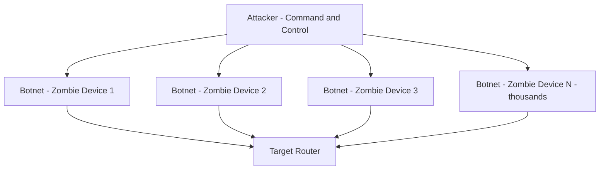
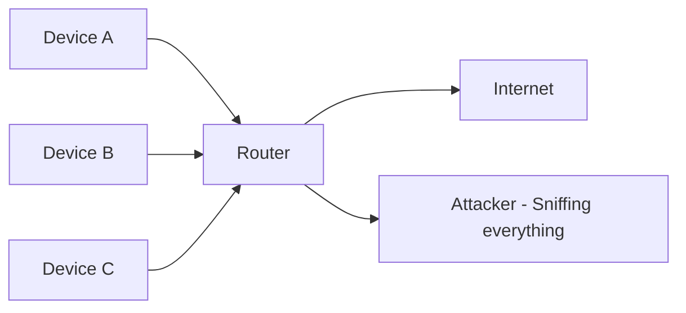
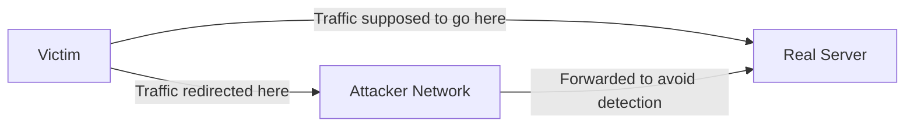
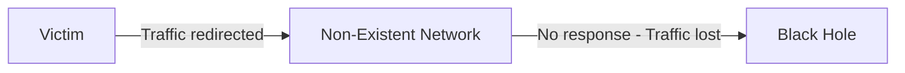
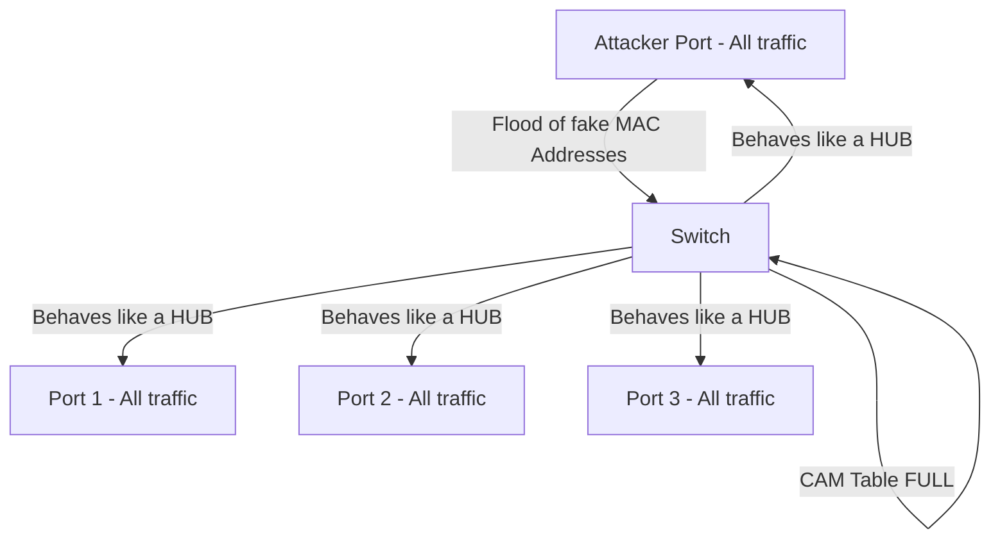
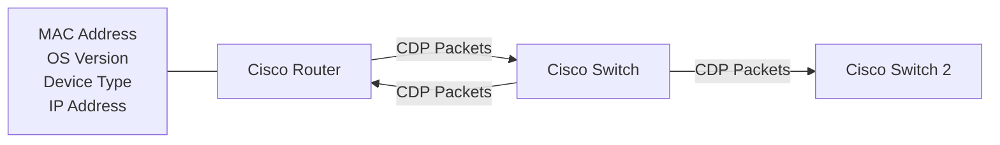
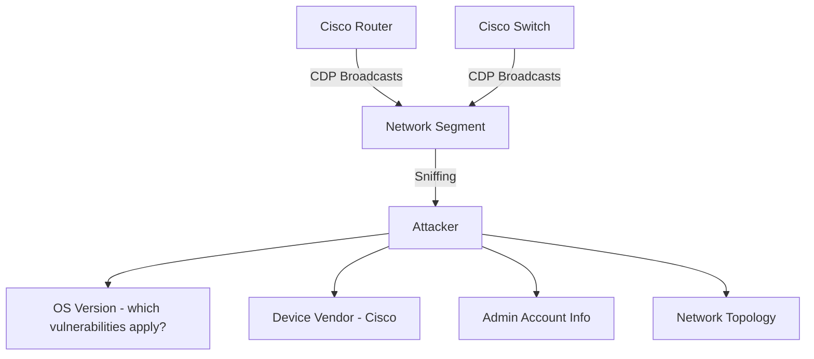

> **الهدف من الـ Section ده:**  
> هتفهم إزاي الـ Attackers بيستغلوا أجهزة الـ Routers والـ Switches اللي كتير من الشركات بتتجاهل تأمينها، وإيه الـ Attacks المختلفة زي الـ DoS وDoS وMAC Flooding وCDP Attacks، وإزاي تقدر كـ Defender تحمي الشبكة من الاتجاه ده.

---


## Table of Contents

- [Router Attacks](#router-attacks)
  - [DoS and DDoS Attacks](#dos-and-ddos-attacks)
  - [Packet Sniffing on Routers](#packet-sniffing-on-routers)
  - [Routing Table Poisoning](#routing-table-poisoning)
- [Switch Attacks](#switch-attacks)
  - [MAC Flooding](#mac-flooding)
  - [CDP Information Disclosure Attack](#cdp-information-disclosure-attack)
- [Summary](#summary)

---

## Router Attacks

### لماذا الـ Routers هدف مغري للـ Attackers؟

في معظم المؤسسات والشركات، الـ Security Team بتركز على حماية الـ Servers والـ Endpoints، وبتتجاهل أجهزة زي الـ Routers والـ Switches. ده بيخليها **نقطة ضعف خطيرة جداً**.

الـ Router مش مجرد جهاز بيوصّل الشبكات ببعض — هو **النقطة المحورية** اللي كل الـ Traffic بيمر منها. لو اتضرب الـ Router، كل حاجة وراه بتتأثر.

```
[Internet] ──► [Perimeter Router] ──► [Internal Network]
                     ▲
              اللو اتضرب هنا
              كل الشركة تقع
```

---

### DoS and DDoS Attacks

#### ما هو الـ DoS Attack؟

الـ **DoS (Denial of Service)** هو هجوم بيتعمل من **جهاز واحد وـ IP address واحد** بهدف إنه يوقف أو يعطل الـ Router ويمنعه من الشغل الطبيعي.

> [!IMPORTANT]
> الـ Router Availability مش مجرد حاجة تقنية — هي حاجة **تجارية حيوية**. لو الـ Perimeter Router وقع، ممكن تتوقف كل الشركة عن الشغل وتخسر ملايين الدولارات.

**مثال عملي:**

```
لو الـ Attacker هاجم خدمة واحدة زي الـ Web Server:
    ✔ الخدمة دي بتوقف
    ✔ باقي الخدمات بتفضل شغالة

لو الـ Attacker هاجم الـ Perimeter Router:
    ✗ كل الشبكة بتوقف
    ✗ Internet Connectivity بيتقطع بالكامل
    ✗ خسائر مالية ضخمة
```

> [!TIP]
> حتى الـ OS Updates اللي بتتعمل على الـ Routers هي technically "planned self-inflicted DoS" — لأنها بتعمل Downtime مؤقت. ده بيوضح إن حتى الـ Updates الضرورية ليها تكلفة.

#### كيف تتصدى للـ DoS؟

الـ DoS سهل نسبياً يتصدله لأنه بييجي من **مصدر واحد**:

| الطريقة | الشرح |
|---|---|
| **ACLs (Access Control Lists)** | بتحجب الـ IP address المهاجم مباشرةً على الـ Router |
| **ISP-Level Filtering** | بتطلب من مزود الخدمة (زي WE أو Orange) إنه يحجب الـ Traffic قبل ما يوصل ليك |

---

#### ما هو الـ DDoS Attack؟

الـ **DDoS (Distributed Denial of Service)** هو نفس الفكرة لكن بيتعمل من **آلاف أو ملايين من الـ IP Addresses في نفس الوقت**.



> [!WARNING]
> الـ DDoS صعب جداً يتصدله مقارنة بالـ DoS لأن ما تقدرش تحجب ملايين الـ IP addresses في نفس الوقت من غير ما تحجب Legitimate Users معاهم.

**الفرق الجوهري:**

| | DoS | DDoS |
|---|---|---|
| **المصدر** | جهاز واحد، IP واحد | آلاف/ملايين أجهزة وـ IPs |
| **صعوبة التصدي** | سهل نسبياً | صعب جداً |
| **طريقة التصدي** | ACLs / ISP Filtering | Anti-DDoS Services, Traffic Scrubbing |
| **الأضرار** | محدودة | ضخمة جداً |

---

### Packet Sniffing on Routers

#### ليه الـ Router هو أفضل مكان للـ Sniffing؟

الـ **Packet Sniffing** هو إنك تعترض وتقرأ الـ Packets اللي بتعدي على الشبكة.



**الإجابة بسيطة:** كل Packet محتاج يتعمله Routing بيمر من خلال الـ Router. يعني الـ Router شايف **كل** الـ Traffic في الشبكة.

> [!IMPORTANT]
> لو قدر الـ Attacker يوصل للـ Router ويعمل Sniffing عليه، هو بيشوف كل البيانات اللي بتعدي على الشبكة — passwords، emails، files، كل حاجة. عشان كده اختيار الـ Router كـ Monitoring Point هو أهم قرار في الـ Network Security.

---

### Routing Table Poisoning

#### ما هو الـ Routing Table؟

الـ **Routing Table** هو جدول موجود في كل Router بيحدد "الباكت دي هتروح فين؟" — زي خريطة الطريق بالنسبة للـ Router.

#### إزاي بيتعمل الـ Poisoning؟

الـ Attacker بيتلاعب في الـ Routing Table عشان يغير مسار الـ Traffic. في سيناريوهين خطيرين:

**السيناريو الأول — Man-in-the-Middle Attack:**



الـ Attacker بيعمل Reroute للـ Traffic لشبكته الخاصة، بيقرأ البيانات، وبعدين بيبعتها للـ Destination الأصلي عشان الضحية ما تحسش بحاجة.

**السيناريو الثاني — Network Disruption:**



الـ Attacker بيعمل Reroute للـ Traffic لـ Network مش موجودة خالص، فالـ Packets بتضيع وعمليات الشبكة بتتجمد.

> [!WARNING]
> الـ Routing Table Poisoning ممكن يأثر على كل الـ Traffic في الشبكة من غير ما حد يحس بحاجة في البداية — لأن الـ Traffic ممكن يفضل شغال ظاهرياً مع إنه اتسرق كله.

---

## Switch Attacks

### MAC Flooding

#### مراجعة سريعة: إزاي الـ Switch بيشتغل؟

الـ Switch بيستخدم **CAM Table (Content Addressable Memory)** عشان يعرف يبعت كل Packet للـ Port الصح:

```
CAM Table مثال:
┌─────────────────────┬──────────────┐
│ MAC Address          │ Switch Port  │
├─────────────────────┼──────────────┤
│ AA:BB:CC:DD:EE:01   │ Port 1       │
│ AA:BB:CC:DD:EE:02   │ Port 2       │
│ AA:BB:CC:DD:EE:03   │ Port 3       │
└─────────────────────┴──────────────┘
```

لما يييجي Packet لـ MAC Address موجود في الجدول، الـ Switch بيبعته على الـ Port المحدد بس — مش على كل الـ Ports.

#### إزاي بيتعمل الـ MAC Flooding؟

الـ Attacker بيبعت آلاف الـ Packets بـ MAC Addresses وهمية بشكل سريع جداً عشان يملأ الـ CAM Table:



**ما الذي يحدث بعدها؟**

لما الـ CAM Table تتملى، الـ Switch مش عارف يبعت الـ Traffic لـ Port محدد، فبيعمل **Flooding** — يعني بيبعت كل Packet على كل الـ Ports، وده بالظبط زي ما الـ Hub بيعمل.

> [!IMPORTANT]
> الفرق الجوهري بين الـ Switch والـ Hub هو إن الـ Switch بيعزل الـ Traffic — كل جهاز بيشوف بسه الـ Traffic المخصص ليه. لما الـ Switch يتحول لـ Hub، كل الأجهزة بتشوف كل الـ Traffic وده خطر أمني ضخم.

**نتيجة الهجوم:**
- الـ Attacker بيقدر يعمل **Passive Sniffing** على كل الـ Traffic اللي مش مخصص ليه
- كل الشبكة بتتأثر بالـ Performance

> [!TIP]
> الحل هو تفعيل **Port Security** على الـ Switch — وهي Feature بتحدد عدد الـ MAC Addresses المسموح بيها لكل Port، وبالتالي بتمنع الـ Flooding.

---

### CDP Information Disclosure Attack

#### ما هو الـ CDP؟

الـ **CDP (Cisco Discovery Protocol)** هو بروتوكول خاص بـ Cisco بيسمح للأجهزة الـ Cisco تتعرف على بعض وتشارك معلوماتها.



الـ CDP بيشارك معلومات زي:
- نوع الجهاز (Router / Switch)
- الـ OS Version (IOS Version)
- الـ IP Addresses
- معلومات الـ Management

#### كيف يستغل الـ Attacker الـ CDP؟

الـ CDP بيبعت الـ Packets دي على الشبكة بشكل مستمر، وده بيخلي الـ Attacker يقدر يعمل **Passive Sniffing** عليها من غير ما يعمل أي حاجة نشيطة.



> [!WARNING]
> معرفة الـ OS Version هي المعلومة الأخطر — لأنها بتسمح للـ Attacker يعرف **إيه الـ CVEs والـ Vulnerabilities** المنطبقة على الجهاز ده بالظبط، وبالتالي يختار الـ Exploit المناسب.

**ما يمكن للـ Attacker تعلمه من الـ CDP:**

| المعلومة | الاستخدام المحتمل |
|---|---|
| **OS Version** | تحديد الـ Vulnerabilities القابلة للاستغلال |
| **Device Vendor** | تحديد الـ Exploits الخاصة بـ Cisco |
| **Admin Account Info** | محاولة الـ Credential Attacks |
| **Network Topology** | فهم بنية الشبكة وتخطيط الهجوم |
| **IP Addresses** | استهداف أجهزة بعينها |

> [!TIP]
> الحل هو **تعطيل الـ CDP** على الـ Ports الموجهة للخارج أو على أي Port مش محتاج يكون فيه CDP. في Cisco، الأمر هو `no cdp enable` على الـ Interface.

```
! تعطيل CDP على Interface معين
Router(config)# interface GigabitEthernet0/0
Router(config-if)# no cdp enable
```

---

## Summary

### ملخص الـ Router Attacks

- **DoS Attack:** هجوم من مصدر واحد بيحاول يوقف الـ Router — سهل التصدي ليه بـ ACLs أو ISP Filtering.
- **DDoS Attack:** هجوم من ملايين المصادر في نفس الوقت — صعب التصدي ليه ومدمر جداً خصوصاً لو ضرب الـ Perimeter Router.
- **Packet Sniffing:** الـ Router هو أفضل نقطة Sniffing لأن كل الـ Traffic بيمر منه — اختراقه يعني سرقة كل البيانات.
- **Routing Table Poisoning:** التلاعب في جدول التوجيه لتحويل الـ Traffic لشبكة الـ Attacker (MITM) أو لشبكة غير موجودة (Disruption).

### ملخص الـ Switch Attacks

- **MAC Flooding:** إغراق الـ CAM Table بـ MAC Addresses وهمية عشان الـ Switch يتحول لـ Hub ويبدأ يبعت كل حاجة على كل الـ Ports.
- **CDP Information Disclosure:** استغلال الـ CDP Broadcasts لجمع معلومات حساسة عن أجهزة الشبكة زي الـ OS Version والـ Admin Accounts.

> [!IMPORTANT]
> الدرس الأساسي: أجهزة الشبكة زي الـ Routers والـ Switches مش مجرد أجهزة توصيل — هي أهداف استراتيجية للـ Attackers. تأمينها، تحديث الـ OS بتاعها بانتظام، وتقييد الـ Protocols غير الضرورية زي الـ CDP هي خطوات أساسية في أي برنامج Cybersecurity ناجح.

> [!NOTE]
> لو اشتغلت كـ Penetration Tester أو كـ Security Analyst، فهمك للـ Attacks دي هيخليك تعرف تشوف الشبكة بعين الـ Attacker وتلاقي نقاط الضعف قبل ما حد يستغلها.
