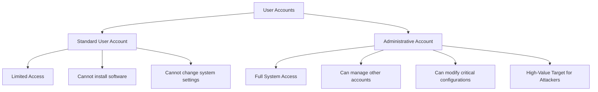
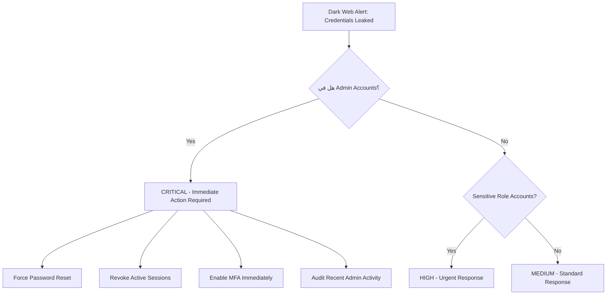
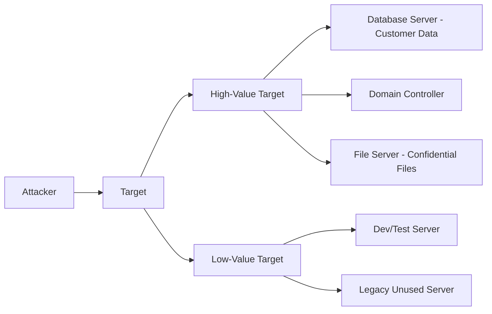
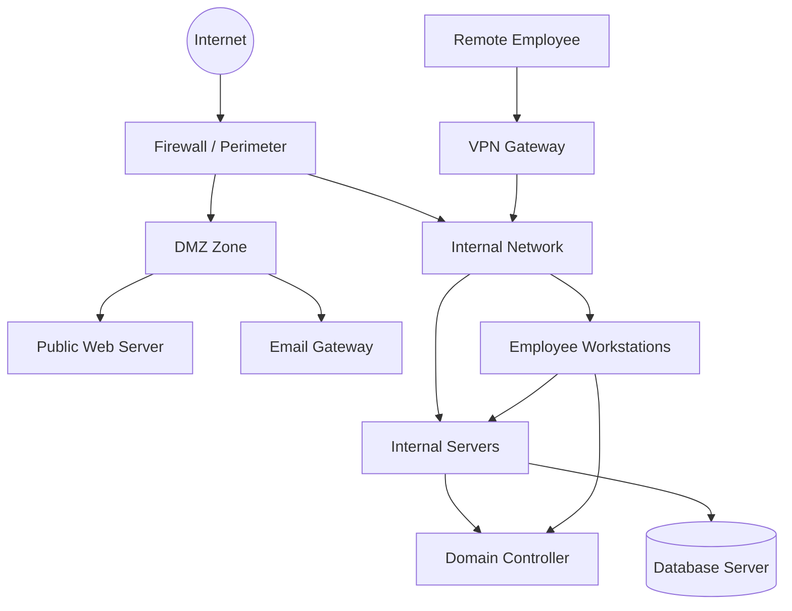
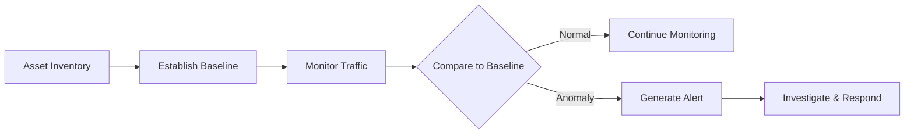

> **الهدف من الـ Section ده:**  
> هتفهم إيه اللي بتحميه كـ SOC Analyst، وليه لازم تعرف الـ Assets الحساسة في المؤسسة، وإزاي تقيّم خطورة أي Incident بناءً على اللي اتاثر — وده أساس شغلك في الـ Security Operations.
---

## Table of Contents

1. [What Are You Protecting?](#1-what-are-you-protecting)
   - [Critical Assets & Their Importance](#11-critical-assets--their-importance)
   - [Assessing the Severity of an Incident](#12-assessing-the-severity-of-an-incident)
   - [User Accounts: Administrative vs. Standard](#13-user-accounts-administrative-vs-standard)
   - [Dark Web Credential Exposure](#14-dark-web-credential-exposure)
   - [Understanding What the Attacker Wants](#15-understanding-what-the-attacker-wants)
2. [Communication Flow](#2-communication-flow)
   - [Why Communication Flow Matters](#21-why-communication-flow-matters)
   - [Types of Communication in an Organization](#22-types-of-communication-in-an-organization)
   - [Asset Inventory & Baseline](#23-asset-inventory--baseline)
3. [Summary](#3-summary)

---

## 1. What Are You Protecting?

### 1.1 Critical Assets & Their Importance

أول سؤال لازم يكون عندك كـ SOC Analyst هو: **إيه اللي بتحميه؟**

مش كل حاجة في الشبكة ليها نفس الأهمية. في أصول (Assets) ليها قيمة عالية جداً، وفي تانية ممكن تتأثر من غير ما تحس بكارثة كبيرة. الـ **Critical Assets** هي اللي لو اتعملت فيها Compromise، ممكن يأثر على المؤسسة بشكل جوهري — سواء مادياً أو تشغيلياً أو من ناحية السمعة.

> [!IMPORTANT]
> معرفتك بالـ Critical Assets مش بس بتساعدك تحمي الشبكة — هي اللي بتخليك تعرف **هل حصل Breach فعلاً ولا لأ**، وإيه مدى خطورته. من غير الفهم ده، الـ Alerts هتكون مجرد ضوضاء بدون سياق.

**مثال عملي:**
تخيل إن عندك 500 Alert في اليوم — لو ما عندكش فهم بالـ Assets، مش هتعرف تفرق بين Alert عادي وواحد بيقولك إن حد دخل على الـ Database اللي فيها بيانات العملاء.

---

### 1.2 Assessing the Severity of an Incident

لما بتحصل Incident، بتحتاج تقيّم **Severity** — يعني مدى الخطورة. وده بيتوقف مباشرة على نوع الـ Asset اللي اتأثرت.

```
Severity = f(Asset Criticality + Data Sensitivity + Blast Radius)
```

| Asset Type | Example | Severity Level |
|---|---|---|
| Database Server (Sensitive Data) | Customer PII / Financial Records | Critical |
| Domain Controller | Active Directory | Critical |
| Email Server | Internal Communications | High |
| Web Server (Public) | Company Website | Medium |
| Standard Workstation | Employee PC | Low to Medium |
| Low-Value Server | Test/Dev Server | Low |

> [!NOTE]
> الـ "Blast Radius" هو مدى التأثير اللي ممكن ينتشر من نقطة الاختراق. مثلاً لو اتكسر Domain Controller، الـ Blast Radius بيكون ضخم جداً لأنه بيتحكم في كل حاجة في الـ Network.

**إزاي بتحدد الـ Critical Assets؟**
- الـ Assets اللي بتخزن **Sensitive Data** (بيانات عملاء، معلومات مالية، IP)
- الـ Assets اللي لو وقفت بتوقف العمل (Mission-Critical Systems)
- الـ Assets اللي بتتحكم في غيرها (مثل Domain Controllers, Firewalls, SIEM)

---

### 1.3 User Accounts: Administrative vs. Standard

من أكتر الأمثلة وضوحاً على أهمية معرفة الـ Assets هو الفرق بين نوعين من الـ Accounts:



> [!WARNING]
> لو ما فهمتش الفرق بين الـ Admin Account والـ Standard Account، مش هتقدر تحدد أنهي Account هو الأخطر لو اتعمل فيه Compromise. وده خطأ فادح في أي Incident Response.

**ليه الـ Admin Accounts أكتر خطورة؟**
- بيقدر يعمل **Lateral Movement** — ينتشر في الشبكة من جهاز لجهاز
- بيقدر يعمل **Privilege Escalation** لحسابات تانية
- بيقدر يغير أو يحذف Logs عشان يخفي أثره
- بيقدر يثبّت Backdoors أو Malware على مستوى الـ System

---

### 1.4 Dark Web Credential Exposure

في Security Solutions بتراقب الـ **Dark Web** وبتنبهك لما Credentials من المؤسسة بتظهر هناك — يعني حد باع أو نشر بيانات دخول موظفين بتاعتك.

**السيناريو:**
```
Dark Web Alert: 50 Employee Credentials Leaked
```

السؤال الأول اللي المفروض تسأله:

> [!IMPORTANT]
> **هل في Admin Accounts ضمن الـ Credentials دي؟**
> ده هو السؤال الحاسم. لو آه، المشكلة بقت Critical على الفور بغض النظر عن عدد الـ Accounts التانية المكشوفة.

**ترتيب الأولويات لما يحصل Credential Leak:**



---

### 1.5 Understanding What the Attacker Wants

مش بس مهم تعرف إيه عندك — مهم كمان تفكر زي الـ Attacker وتفهم **هو عايز إيه**.

**السؤال الجوهري:** هل الـ Attacker بيحاول يوصل لـ Database Server حساس، ولا بس لقي Server مش عنده قيمة كبيرة؟



| الـ Target | الـ Attacker's Goal المحتمل | الـ Response المطلوب |
|---|---|---|
| Database Server | سرقة البيانات / Ransomware | Critical - Full IR Activation |
| Domain Controller | Takeover كامل للشبكة | Critical - Isolate Immediately |
| Email Server | Phishing داخلي / جمع معلومات | High |
| Low-Value Server | Pivot Point للوصول لحاجة تانية | Medium - Monitor Closely |

> [!TIP]
> لو لقيت Attacker في Low-Value Server، متستهونش بيه — غالباً بيستخدمه كـ **Pivot Point** أو **Staging Area** للوصول لحاجة أهم. الخطوة التالية ليه هي الأخطر.

---

## 2. Communication Flow

### 2.1 Why Communication Flow Matters

الـ **Communication Flow** هو من أهم الحاجات اللي لازم تفهمها عشان تنجح كـ SOC Analyst — لأنك مش بس لازم تعرف الـ Assets، لازم كمان تعرف **مين بيكلم مين وإزاي**.

> [!IMPORTANT]
> الـ Communication Flow هو الأساس اللي بتبني عليه الـ **Baseline** بتاعك. أي حاجة بتحصل خارج النمط الطبيعي هي **Anomaly** — وده هو اللي المفروض يلفت نظرك.

**مثال بسيط:**
- موظف في الـ HR بيتوصل بـ Database بتاعة الـ Finance من الـ 3 الصبح — ده Normal ولا Suspicious؟
- Web Server بيتكلم مع Domain Controller على Port غريب — ده طبيعي ولا لا؟

من غير ما تفهم الـ Communication Flow الطبيعي، مش هتقدر تجاوب على الأسئلة دي.

---

### 2.2 Types of Communication in an Organization

في أنواع مختلفة من الـ Communication اللي لازم تفهمها:



**أنواع الـ Communication اللي تهمك:**

| النوع | الوصف | ليه مهم؟ |
|---|---|---|
| Client to Server | موظف بيوصل لـ Internal Server | تعرف مين المفروض يوصل لإيه |
| Server to Server | سيرفر بيكلم سيرفر تاني | أي اتصال غريب بين Servers مريب |
| Internal to Internet | موظف بيخرج للإنترنت | Data Exfiltration ممكن يحصل هنا |
| Internet to Internal | طلبات من برة للداخل | Attack Entry Point الأكتر شيوعاً |
| Remote Access (VPN) | موظف من بره بيتصل بالشبكة | لازم تتحقق إن الـ Authentication صح |

---

### 2.3 Asset Inventory & Baseline

عشان تقدر تحكم على أي Communication إنه **Normal أو Suspicious**، محتاج حاجتين:

**أولاً: Asset Inventory**
- قائمة بكل الـ Assets في المؤسسة
- مين بيستخدم إيه وليه
- إيه الـ Normal Behavior لكل Asset

**ثانياً: Baseline**
- النمط الطبيعي للـ Traffic في الشبكة
- الأوقات الطبيعية للـ Access
- الـ Protocols والـ Ports المستخدمة بشكل طبيعي



> [!WARNING]
> **الواقع المُحزن:** في أغلب المؤسسات، الـ Asset Inventory مش موجود أو غير محدّث. ده بيخلي شغل الـ SOC Analyst صعب جداً — لأنك بتحاول تحدد الـ Anomalies من غير ما عندك Baseline واضح. لو واجهت الوضع ده، **خد notes وابدأ تبني الـ Inventory بنفسك** من خلال الـ Monitoring.

> [!TIP]
> لو ما لقيتش Asset Inventory موجود، ابدأ بالـ Network Discovery Tools زي **Nmap** أو **Nessus** عشان تعمل Passive Inventory للشبكة. وكمان الـ SIEM بيساعدك تبني صورة عن الـ Communication Patterns بمرور الوقت.

**إزاي تبني Baseline من الصفر:**

1. **Network Traffic Analysis** — راقب الـ Traffic لفترة (أسبوعين مثلاً) وسجّل الأنماط الطبيعية
2. **Log Collection** — اجمع الـ Logs من كل الـ Systems (Firewalls, Servers, Endpoints)
3. **User Behavior Analysis** — افهم العادات الطبيعية لكل User أو User Group
4. **Document Everything** — سجّل كل ملاحظة، حتى اللي تبان بسيطة

---

## 3. Summary

### الخلاصة

**ما اتعلمناه في الـ Section ده:**

- 🔐 **معرفة الـ Assets الحساسة** هي الأساس — من غيرها، الـ Alerts بتكون ضوضاء بدون معنى. لازم تعرف إيه اللي بتحميه قبل ما تقدر تحميه فعلاً.

- ⚖️ **تقييم الـ Severity** بيعتمد على نوع الـ Asset اللي اتأثر — مش كل Incident خطير، ومش كل Incident بسيط. الـ Asset Criticality هي اللي بتحدد ردة فعلك.

- 👤 **الفرق بين Admin و Standard Accounts** حاسم جداً — الـ Admin Account لو اتعمل فيه Compromise، الأولوية بتكون Immediate وفورية بغض النظر عن أي ظروف.

- 🌐 **Dark Web Monitoring** أداة مهمة — لو Credentials اتسرّبت، السؤال الأول هو: هل في Admin Accounts ضمنهم؟

- 🔍 **فهم نية الـ Attacker** بيساعدك تقيّم التهديد صح — هل هو بيحاول يوصل لحاجة مهمة؟ ولا بيستخدم Server بسيط كـ Pivot Point؟

- 🌊 **الـ Communication Flow** هو العمود الفقري للـ Detection — أي حاجة خارج الـ Normal Pattern هي Anomaly تستحق التحقيق.

- 📋 **Asset Inventory و Baseline** هم الأدوات اللي بتبني عليها كل قراراتك — وغيابهم في المؤسسة مشكلة حقيقية لازم تتعامل معاها بجدية وتبدأ تبنيهم بنفسك.

> [!IMPORTANT]
> الـ SOC Analyst الناجح مش بس بيشوف الـ Alerts — هو بيفهم السياق. والسياق ده جاي من فهمك للـ Assets والـ Communication Flow والـ Baseline. من غير الثلاثة دول، أنت بتشتغل في الظلام.
