> **الهدف من الـ Section ده:**  
>  هتتعلم إزاي تصمم شبكة آمنة لشركة صغيرة من الصفر — هتعرف تحدد فين تحط كل Device أمني، وإزاي تفصل بين الـ Networks المختلفة، وتحمي الـ Data الحساسة من الـ Attackers سواء من برة أو من جوه الشبكة.
---

# Secure Network Design for Small Business (50 Employees)

## Table of Contents

- [Introduction — ليه محتاجين Network Security?](#introduction)
- [Understanding the Network Requirements](#network-requirements)
- [Security Devices — الأجهزة الأمنية المطلوبة](#security-devices)
- [Network Segmentation — تقسيم الشبكة](#network-segmentation)
- [Full Network Topology Diagram](#topology-diagram)
- [Zone-by-Zone Deep Dive](#zone-deep-dive)
   - [Internet Edge Zone](#internet-edge)
   - [DMZ — Demilitarized Zone](#dmz-zone)
   - [Internal Employee Network](#internal-network)
   - [Server Zone](#server-zone)
   - [Guest WiFi Zone](#guest-wifi)
   - [Remote Workers](#remote-workers)
- [Security Devices Placement Summary](#placement-summary)
- [Traffic Flow Analysis](#traffic-flow)
- [Summary](#summary)

---

## introduction

تخيل إن الشبكة زي البيت — محتاج أبواب وشبابيك وكاميرات مراقبة. مش كل الناس المفروض يدخلوا كل أوضة، وفيه أوضة فيها حاجات تمانها عالي (زي خزنة الفلوس) محتاجة حماية أكتر.

الشركة اللي عندنا فيها **50 موظف** ومحتاجين يوفروا:

| الاحتياج | المعنى العملي |
|---|---|
| **Public Services** | مواقع أو APIs الناس من الإنترنت بتوصلها |
| **Internal Network** | شبكة الموظفين الداخلية — مش لأي حد تاني |
| **Servers** | فيها Data حساسة محتاجة أعلى درجات الحماية |
| **Remote Workers** | موظفين بيشتغلوا من البيت ومحتاجين يوصلوا للشبكة |
| **Guest WiFi** | زوار أو عملاء محتاجين إنترنت بس مش شبكتنا الداخلية |

---

## network-requirements

قبل ما نبدأ نصمم، لازم نفهم الـ **Threats** اللي بنحارب:

```
من برة (External Threats):
  - Hackers من الإنترنت يحاولوا يخترقوا الـ Servers
  - DDoS Attacks على الـ Public Services
  - Man-in-the-Middle على الـ Remote Workers

من جوه (Internal Threats):
  - موظف يحاول يوصل لـ Data مش من حقه
  - ضيف على الـ Guest WiFi يحاول يدخل الشبكة الداخلية
  - Malware انتشر جوه الشبكة
```

> [!IMPORTANT]
> مبدأ **"Zero Trust"** بيقول: متثقش في أي حد تلقائيًا — حتى لو كان جوه الشبكة. كل Device وكل User لازم يتحقق منه قبل ما يوصل لأي Resource.

---

## security-devices

دي الأجهزة اللي هنستخدمها في التصميم:

### 🔥 Firewall
الجدار الناري — بيفحص كل الـ Traffic الداخل والخارج وبيقرر يسمحله يعدي أو لأ، بناءً على **Rules** إنت بتحددها.

```
Firewall Rule Example:
  ALLOW  TCP  from ANY         to DMZ:80,443   (HTTP/HTTPS للعامة)
  ALLOW  TCP  from Internal    to Servers:3306 (MySQL للموظفين بس)
  DENY   ALL  from Guest_WiFi  to Internal     (الـ Guest مش يدخل الداخلي)
  DENY   ALL  from ANY         to Servers      (default: امنع كل حاجة)
```

### 🛡️ IDS / IPS (Intrusion Detection/Prevention System)
- **IDS** = يكشف الهجوم ويبعت Alert
- **IPS** = يكشف الهجوم ويوقفه تلقائيًا

> [!NOTE]
> الـ IDS زي الكاميرا — بتسجل وتبلّغ. الـ IPS زي الحارس — بيتصرف فورًا. في شركة صغيرة، غالبًا الـ IPS مدمج جوه الـ Firewall الحديث (Next-Gen Firewall).

### 🌐 Router
بيوجّه الـ Traffic بين الشبكات المختلفة وبين الشبكة والإنترنت.

### 🔀 Switch
بيوصل الأجهزة ببعض جوه نفس الشبكة. الـ **Managed Switch** بيسمح بعمل **VLANs** لتقسيم الشبكة منطقيًا.

### 📡 Wireless Access Point (WAP)
بيوفر الـ WiFi — محتاجين نفصل بين الـ Employee WiFi والـ Guest WiFi.

### 🔐 VPN Gateway
بيسمح للـ Remote Workers يتصلوا بالشبكة الداخلية بشكل آمن ومشفر.

### ⚖️ Load Balancer *(اختياري للـ Public Services)*
لو عندنا أكتر من Server للـ Public Services، الـ Load Balancer بيوزع الـ Traffic عليهم.

---

## 4. Network Segmentation — تقسيم الشبكة {#network-segmentation}

أهم مبدأ في الـ Network Security هو الـ **Segmentation** — تقسيم الشبكة لـ Zones منفصلة. لو Hacker دخل Zone واحدة، مش هيقدر يتحرك لباقي الشبكة بسهولة.

```
الـ Zones اللي هنعملها:
  ┌─────────────────────────────────────┐
  │         INTERNET (Untrusted)        │
  └─────────────────────────────────────┘
              ↕ (Firewall 1)
  ┌─────────────────────────────────────┐
  │     DMZ — Demilitarized Zone        │
  │   (Web Server, Mail Server, etc.)   │
  └─────────────────────────────────────┘
              ↕ (Firewall 2)
  ┌──────────────┬──────────────────────┐
  │ Internal LAN │    Server Zone       │
  │  (Employees) │  (Database, Files)   │
  └──────────────┴──────────────────────┘
  ┌──────────────┬──────────────────────┐
  │  Guest WiFi  │   VPN (Remote)       │
  └──────────────┴──────────────────────┘
```

> [!WARNING]
> **لا تحطش الـ Servers في نفس الـ Segment بتاع الموظفين!** لو Malware وصل لجهاز موظف، هيوصل للـ Servers على طول. الـ Segmentation بيمنع الـ Lateral Movement.

---

## 5. Full Network Topology Diagram {#topology-diagram}

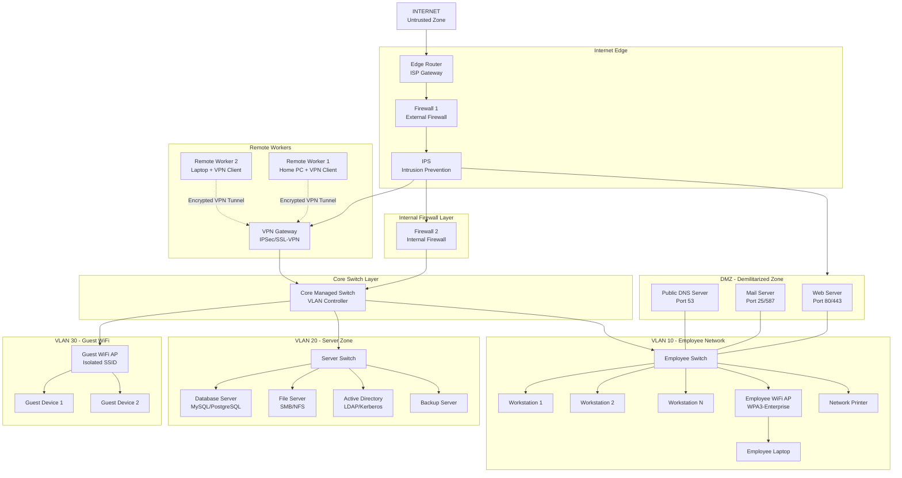

> [!NOTE]
> الـ Dashed Lines في الـ Diagram بتمثل الـ **Encrypted VPN Tunnels** — الـ Remote Workers بيتصلوا عبر الإنترنت بس الـ Connection مشفر بالكامل.

---

## 6. Zone-by-Zone Deep Dive {#zone-deep-dive}

### Internet Edge Zone {#internet-edge}

ده أول خط دفاع — نقطة الدخول الوحيدة من الإنترنت.

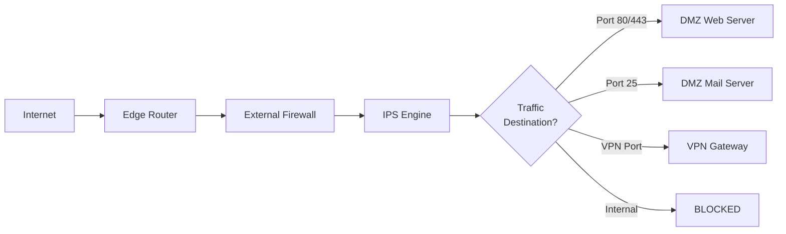

**الـ Edge Router** بيعمل:
- **NAT** (Network Address Translation) — بيخبّي الـ Internal IP Addresses
- **Basic ACLs** — يمنع الـ Traffic الواضح إنه ضار
- **BGP/OSPF** routing مع الـ ISP

**الـ External Firewall** بيعمل:
- يفتح بس الـ Ports المطلوبة (80, 443, 25, VPN Port)
- يمنع أي حاجة تانية
- **Stateful Inspection** — يتابع حالة كل Connection

**الـ IPS** بيعمل:
- يكشف الـ Attack Signatures
- يوقف الـ DDoS و SQL Injection وغيرهم
- يسجل كل الأحداث في الـ Logs

---

### DMZ — Demilitarized Zone {#dmz-zone}

الـ DMZ هي منطقة "محايدة" — مش من الإنترنت ومش من الشبكة الداخلية تمامًا. الـ Public Services بتتحط هنا.

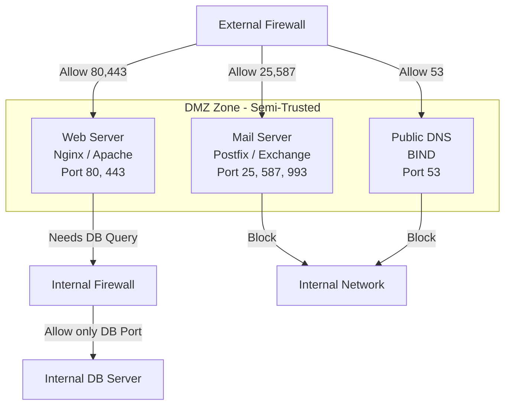

> [!IMPORTANT]
> **قاعدة الـ DMZ:** الـ Servers في الـ DMZ مسموحلهم يتكلموا مع الإنترنت، ومسموحلهم يطلبوا Data من الـ Internal Servers (زي الـ Database) لكن **عن طريق Firewall Rule محدد جدًا**. الـ DMZ Servers مش المفروض يقدروا يبدأوا Connection جديد للشبكة الداخلية من غير إذن.

**ليه الـ DMZ مهمة؟**

لو Hacker اخترق الـ Web Server في الـ DMZ، مش هيقدر يتحرك للشبكة الداخلية لأن في **Firewall تاني** (Firewall 2) بيمنعه.

---

### Internal Employee Network {#internal-network}

شبكة الموظفين على **VLAN 10** — معزولة عن الـ Guest WiFi وعن الـ Servers.

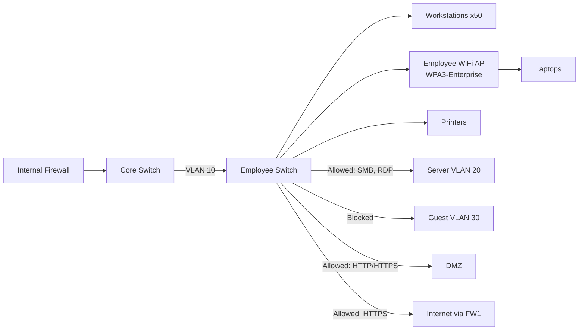

**إعدادات مهمة للـ Employee Network:**

| الإعداد | القيمة | السبب |
|---|---|---|
| **DHCP Range** | 192.168.10.10 – 192.168.10.200 | تخصيص IPs تلقائي |
| **Gateway** | 192.168.10.1 | الـ Core Switch |
| **DNS** | Internal AD DNS | يحوّل للـ Public DNS لو محتاج |
| **WiFi Auth** | WPA3-Enterprise (802.1X) | Authentication عن طريق الـ AD |
| **Network Access Control** | مفعّل | بيتأكد إن الجهاز سليم قبل ما يدخل |

> [!TIP]
> استخدم **802.1X Authentication** على الـ Employee WiFi — ده معناه إن كل موظف بيتوثق بـ Username وPassword بتاعه من الـ Active Directory، مش بـ Password مشترك. لو موظف اتفصل، تلغي اكونته وعلى طول مش هيقدر يتصل.

---

### Server Zone {#server-zone}

أحرص نقطة في الشبكة — فيها أهم البيانات.

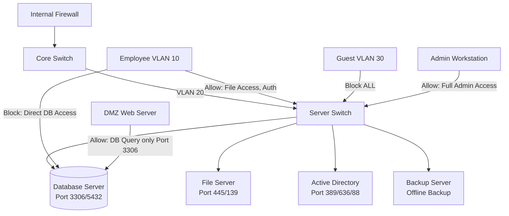

**ليه الـ Servers في VLAN منفصلة؟**

- **Least Privilege**: كل حاجة ممنوعة الأصل إلا اللي مسموح بيها صراحة
- **Breach Containment**: لو موظف اتاخترق جهازه، الـ Attacker مش هيوصل للـ DB مباشرة
- **Monitoring**: سهل تراقب كل الـ Traffic الداخل والخارج من الـ Servers

> [!WARNING]
> **مش المفروض أي موظف عادي يوصل للـ Database Server مباشرة.** الـ DB بتستقبل Queries بس من الـ Application Server (أو الـ Web Server في الـ DMZ). حتى الـ Developers لازم يستخدموا Bastion Host أو Jump Server للوصول الإداري.

---

### Guest WiFi Zone {#guest-wifi}

الضيوف والعملاء محتاجين إنترنت — بس مش شبكتنا الداخلية.

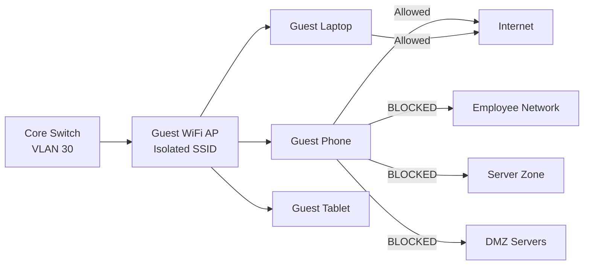

**إعدادات الـ Guest WiFi:**

```
SSID Name:    "CompanyName-Guest"
Security:     WPA2/WPA3-Personal (password يتغير كل أسبوع)
VLAN:         VLAN 30 (معزول تمامًا)
DHCP Range:   192.168.30.10 – 192.168.30.100
Gateway:      192.168.30.1
Firewall:     Allow ONLY port 80, 443 to Internet
              Block EVERYTHING to Internal Networks
Client Isolation: ON  ← مهم! يمنع الـ Guests يشوفوا بعض
```

> [!TIP]
> فعّل **Client Isolation** على الـ Guest WiFi — ده بيمنع أي Guest Device يتكلم مع Guest Device تاني على نفس الـ WiFi. لو حد حاول يعمل هجوم من الشبكة، مش هيقدر يوصل لأجهزة الباقيين.

---

### Remote Workers {#remote-workers}

الموظفين اللي بيشتغلوا من البيت محتاجين يوصلوا للشبكة الداخلية بشكل آمن.

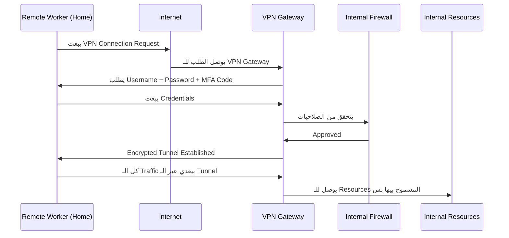

**إعدادات الـ VPN:**

| الإعداد | الخيار المفضل |
|---|---|
| **Protocol** | IPSec/IKEv2 أو WireGuard |
| **Authentication** | Username + Password + **MFA** (Multi-Factor Authentication) |
| **Split Tunneling** | Disabled — كل الـ Traffic يعدي عبر الـ VPN |
| **Access Level** | بناءً على Role الموظف — مش كل Remote Worker يوصل لكل حاجة |
| **Session Timeout** | 8 ساعات — لو الموظف سيب الجهاز، الـ Session تنتهي |

> [!IMPORTANT]
> لازم تفعّل **MFA (Multi-Factor Authentication)** على الـ VPN. لو Hacker سرق Password موظف، مش هيقدر يدخل من غير الـ Second Factor (الموبايل أو Token). ده أهم إجراء أمني للـ Remote Access.

---

## 7. Security Devices Placement Summary {#placement-summary}

| الجهاز | مكانه في الشبكة | وظيفته |
|---|---|---|
| **Edge Router** | بين الـ ISP والـ Firewall | توجيه الـ Traffic + NAT |
| **External Firewall (FW1)** | بعد الـ Router مباشرة | أول خط دفاع ضد الإنترنت |
| **IPS** | بعد FW1، قبل الـ DMZ والداخلي | كشف ومنع الهجمات |
| **DMZ Switch** | داخل الـ DMZ | توصيل الـ Public Servers |
| **Internal Firewall (FW2)** | بين الـ DMZ والشبكة الداخلية | عزل الداخلي عن الـ DMZ |
| **Core Managed Switch** | قلب الشبكة الداخلية | توزيع الـ VLANs |
| **Employee Switch** | داخل VLAN 10 | توصيل أجهزة الموظفين |
| **Server Switch** | داخل VLAN 20 | توصيل الـ Servers |
| **Employee WiFi AP** | في مناطق العمل | WiFi للموظفين (WPA3-Enterprise) |
| **Guest WiFi AP** | في الاستقبال/غرف الاجتماعات | WiFi للزوار (معزول) |
| **VPN Gateway** | خلف FW1، قبل FW2 | استقبال اتصالات الـ Remote Workers |

---

## 8. Traffic Flow Analysis {#traffic-flow}

### Scenario 1: زبون بيفتح الموقع من الإنترنت

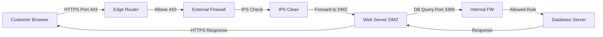

### Scenario 2: موظف بيفتح ملف من الـ File Server

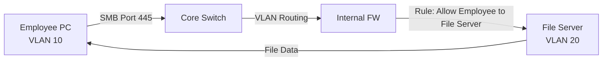

### Scenario 3: Guest بيحاول يدخل الشبكة الداخلية

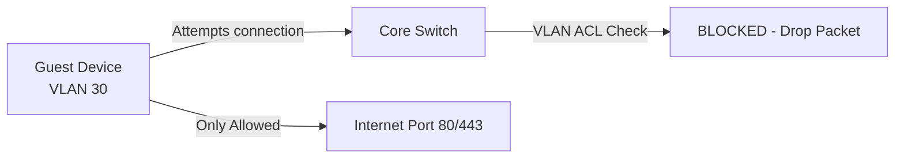

### Scenario 4: Remote Worker بيتصل بالـ VPN

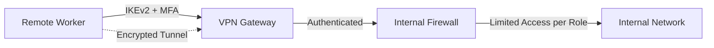

---

## 9. IP Addressing Scheme

جدول عشان نحدد الـ IP Ranges لكل Zone:

| Zone | Network | Range | Devices |
|---|---|---|---|
| **DMZ** | 10.0.1.0/24 | 10.0.1.1 – 10.0.1.50 | Public Servers |
| **Employee LAN (VLAN 10)** | 192.168.10.0/24 | 192.168.10.10 – 192.168.10.200 | 50 Workstations + WiFi |
| **Server Zone (VLAN 20)** | 192.168.20.0/24 | 192.168.20.10 – 192.168.20.50 | Servers |
| **Guest WiFi (VLAN 30)** | 192.168.30.0/24 | 192.168.30.10 – 192.168.30.100 | Guest Devices |
| **VPN Pool** | 10.8.0.0/24 | 10.8.0.10 – 10.8.0.50 | Remote Workers |

> [!NOTE]
> الـ DMZ بتاخد Range مختلف تمامًا (10.0.1.x) عشان نفرق بينها وبين الـ Internal Networks (192.168.x.x) بسهولة في الـ Firewall Rules والـ Logs.

---

## 10. Summary {#summary}

### ملخص التصميم

في التصميم ده، بنيّنا شبكة آمنة لشركة 50 موظف باستخدام المبادئ الأساسية للـ Network Security:

**المبادئ المستخدمة:**
- **Defense in Depth** — طبقات متعددة من الحماية (FW1 → IPS → FW2 → VLANs)
- **Network Segmentation** — كل Zone معزولة وليها صلاحياتها الخاصة
- **Least Privilege** — كل حاجة ممنوعة الأصل إلا المسموح بيها صراحة
- **Zero Trust** — حتى الموظفين الداخليين بيتحققوا من هويتهم دايمًا

**الـ Zones اللي عملناها:**

| Zone | الحماية | من الداخل | للخارج |
|---|---|---|---|
| **DMZ** | بين FW1 و FW2 | Web, Mail, DNS Servers | موصولة بالإنترنت |
| **Employee Network (VLAN 10)** | FW2 + VLAN ACL | 50 موظف + Laptops | وصول محدود للـ Servers |
| **Server Zone (VLAN 20)** | FW2 + Strict Rules | DBs, Files, AD | لا يوصلوا للإنترنت |
| **Guest WiFi (VLAN 30)** | Client Isolation + VLAN | Guests فقط | إنترنت بس |
| **Remote Workers** | VPN + MFA | Authenticated Users | وصول محدود حسب الـ Role |

**أهم الأجهزة ومواضعها:**
- **FW1**: بين الإنترنت والـ DMZ/VPN
- **IPS**: يحمي كل الـ Traffic الداخل
- **FW2**: يفصل الـ DMZ عن الـ Internal Network
- **Core Managed Switch**: يتحكم في الـ VLANs الداخلية
- **VPN Gateway**: يستقبل الـ Remote Workers بشكل آمن ومشفر

> [!IMPORTANT]
> التصميم ده مش نهاية المطاف — الأمن عملية مستمرة. لازم تراجع الـ Firewall Rules بانتظام، تحدّث الـ IPS Signatures، وتراقب الـ Logs يوميًا عشان تكشف أي نشاط غريب.
