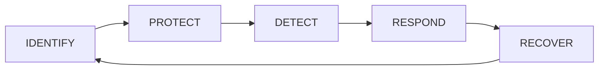
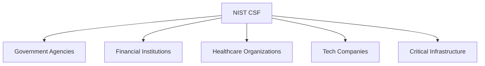
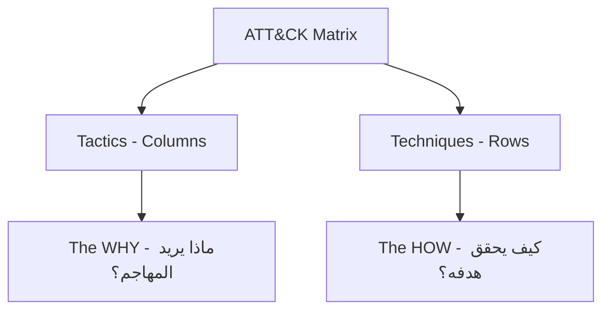
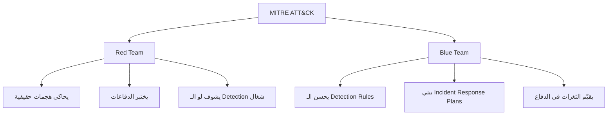

> **الهدف من الـ Section ده:**  
> هتفهم إيه هو الـ NIST Framework وإزاي بيساعد الـ Organizations تبني استراتيجية Cybersecurity محكمة، وكمان هتتعرف على الـ MITRE ATT&CK Framework اللي بيوضح أساليب الـ Attackers الحقيقيين — سواء كنت شغال Blue Team أو Red Team، الـ Frameworks دي هي مرجعك الأساسي.

---


## Table of Contents

- [ما هو الـ Security Framework؟](#ما-هو-الـ-security-framework)
- [NIST Cybersecurity Framework](#nist-cybersecurity-framework)
  - [من هو NIST؟](#من-هو-nist)
  - [ليه الـ NIST Framework مهم؟](#ليه-الـ-nist-framework-مهم)
  - [الـ Five Core Functions](#الـ-five-core-functions)
  - [الـ Framework في الواقع](#الـ-framework-في-الواقع)
- [MITRE ATT\&CK Framework](#mitre-attck-framework)
  - [من هو MITRE؟](#من-هو-mitre)
  - [إيه هو الـ ATT\&CK؟](#إيه-هو-الـ-attck)
  - [الـ ATT\&CK Matrix: Tactics vs Techniques](#الـ-attck-matrix-tactics-vs-techniques)
  - [أمثلة على Tactics وTechniques](#أمثلة-على-tactics-وtechniques)
  - [Blue Team vs Red Team: إزاي كل واحد بيستخدمه؟](#blue-team-vs-red-team-إزاي-كل-واحد-بيستخدمه)
- [NIST vs MITRE ATT\&CK: المقارنة](#nist-vs-mitre-attck-المقارنة)
- [Summary](#summary)

---

## ما هو الـ Security Framework؟

الـ **Security Framework** هو مجموعة من الـ Guidelines والـ Best Practices والـ Standards اللي بتساعد الـ Organizations إنها تبني برنامج Cybersecurity متكامل ومنظم.

تخيل إنك بتبني بيت — مش هتبدأ من غير خريطة أو معايير هندسية، صح؟ بالظبط نفس الكلام في الـ Cybersecurity؛ الـ Framework هو الخريطة دي اللي بتحدد:

- إيه الأصول اللي محتاج تحميها (**Assets**)
- إيه المخاطر اللي ممكن تواجهها (**Risks**)
- إزاي تتعامل مع الحوادث لو حصلت (**Incidents**)
- إزاي تتعافى بعديها (**Recovery**)

```
Framework = Standards + Guidelines + Best Practices
```

---

## NIST Cybersecurity Framework

### من هو NIST؟

الـ **NIST** اختصار لـ **National Institute of Standards and Technology** — ده معهد حكومي أمريكي تحت وزارة التجارة الأمريكية (U.S. Department of Commerce).

المهمة الأساسية بتاعته إنه يطور **Standards** و**Guidelines** تساعد الـ Organizations — سواء حكومية أو خاصة — إنها تشتغل بطريقة موحدة وآمنة.

> [!NOTE]
> الـ NIST مش بس شغلته Cybersecurity — ده معهد بيعمل Standards في كل حاجة من الـ Measurement Science لحد الـ Technology، لكن الـ Cybersecurity Framework بتاعه بقى من أشهر أعماله.

---

### ليه الـ NIST Framework مهم؟

كـ **Cybersecurity Analyst**، لازم تسأل نفسك السؤال ده: *"Do I know what NIST is and what is its role?"*

الإجابة ببساطة:

الـ **NIST Cybersecurity Framework (CSF)** بيوفر للـ Organizations:

1. **Structured Guidelines** — إطار منظم تشتغل على أساسه
2. **Common Language** — لغة مشتركة بين كل الأقسام (IT، Legal، Management)
3. **Risk-Based Approach** — بيساعدك تحدد الأولويات بناءً على الـ Risk الأعلى
4. **Flexibility** — مش إلزامي بشكل كامل، كل Organization بتطبقه حسب حجمها واحتياجاتها

> [!IMPORTANT]
> الـ NIST Framework مش مجرد Checklist — هو نهج تفكير متكامل. الهدف مش إنك تعمل كل حاجة فيه، لكن إنك تفهم وضعك الحالي وتشتغل على تحسينه باستمرار.

---

### الـ Five Core Functions

القلب النابض للـ NIST CSF هو الـ **Five Core Functions** — وهي دورة متكاملة مش خطوات منفصلة:



---

#### Function 1: IDENTIFY

الأول لازم تعرف عندك إيه عشان تحميه.

- **Asset Management**: حصر كل الـ Assets (Servers، Devices، Data، Software)
- **Risk Assessment**: تقييم المخاطر اللي بتهدد الـ Assets دي
- **Governance**: تحديد السياسات والمسؤوليات
- **Business Environment**: فهم طبيعة الـ Business وتأثير الـ Cyber Risk عليه

**مثال واقعي:** شركة بتحدد إن عندها Database فيها بيانات العملاء، وده Asset حساس محتاج حماية قصوى.

---

#### Function 2: PROTECT

بعد ما عرفت إيه عندك، دلوقتي تحميه.

- **Access Control**: مين يدخل على إيه؟ (Least Privilege)
- **Awareness & Training**: تدريب الموظفين على الـ Security
- **Data Security**: تشفير البيانات (Encryption)
- **Maintenance**: تحديث الأنظمة والـ Patches
- **Protective Technology**: Firewalls، Antivirus، IDS/IPS

---

#### Function 3: DETECT

مش كفاية إنك تحمي — لازم تكون عارف لو فيه حاجة غلط حصلت.

- **Anomalies & Events**: رصد أي نشاط غير طبيعي
- **Security Continuous Monitoring**: مراقبة مستمرة للشبكة والأنظمة
- **Detection Processes**: عمليات واضحة للكشف عن الحوادث

**مثال:** نظام الـ SIEM (Security Information and Event Management) بيراقب الـ Logs وبيلفت الانتباه لأي نشاط مشبوه.

---

#### Function 4: RESPOND

لما تكتشف Incident — إيه اللي بتعمله؟

- **Response Planning**: خطة جاهزة للتعامل مع الحوادث
- **Communications**: مين تتكلم معاه؟ (Management، Legal، Public)
- **Analysis**: تحليل الحادثة وفهم اللي حصل
- **Mitigation**: تقليل الضرر وإيقاف الهجوم
- **Improvements**: التعلم من الحادثة

---

#### Function 5: RECOVER

بعد ما خلصت من الهجوم، رجوع للحالة الطبيعية.

- **Recovery Planning**: خطة واضحة للاسترداد
- **Improvements**: تحسينات بناءً على اللي حصل
- **Communications**: إخبار الأطراف المعنية بالوضع

---

الـ Five Functions ممكن تتلخص في جدول:

| Function | الهدف | مثال |
|---|---|---|
| **IDENTIFY** | اعرف عندك إيه | حصر الـ Assets والـ Risks |
| **PROTECT** | احمي الـ Assets | Firewall، Encryption، Training |
| **DETECT** | اكتشف التهديدات | SIEM، IDS، Monitoring |
| **RESPOND** | تعامل مع الحوادث | Incident Response Plan |
| **RECOVER** | ارجع للوضع الطبيعي | Backup، Disaster Recovery |

---

### الـ Framework في الواقع

الـ NIST CSF مش مخصوص للحكومة الأمريكية بس — بقى معيار عالمي بتستخدمه آلاف الشركات حول العالم.



> [!TIP]
> لو شغال Analyst في أي شركة وسألوك "إزاي بتبني برنامج الـ Security؟" — الإجابة المثالية هي إنك بتبدأ بالـ NIST Framework كـ Baseline وبتطوعه حسب احتياجات الشركة.

---

## MITRE ATT&CK Framework

### من هو MITRE؟

الـ **MITRE Corporation** هي منظمة أمريكية غير ربحية بتشتغل في مجالات البحث العلمي والتكنولوجيا، وبتدعم جهات حكومية زي الـ DoD (Department of Defense) والـ DHS (Department of Homeland Security).

من أشهر مشاريعها هو الـ **ATT&CK Framework** — اللي بقى مرجع عالمي في الـ Cybersecurity.

---

### إيه هو الـ ATT&CK؟

الـ **ATT&CK** اختصار لـ:

```
Adversarial Tactics, Techniques, and Common Knowledge
```

هو **Publicly Accessible Knowledge Base** — يعني متاح للعموم مجاناً — بيوثق الـ **Tactics** والـ **Techniques** اللي بيستخدمها الـ Attackers الحقيقيين في هجماتهم الفعلية.

> [!IMPORTANT]
> الـ ATT&CK مش نظري! الـ Techniques المدونة فيه مبنية على تحليل هجمات حقيقية حصلت فعلاً في الـ Real World. ده اللي بيخليه مرجع موثوق وقيم.

---

### الـ ATT&CK Matrix: Tactics vs Techniques

الـ Framework بيتعرض في شكل **Matrix** (جدول كبير):



- الـ **Tactics** بتظهر كـ **Columns** (أعمدة) — وهي تمثل الـ **Goal** أو الهدف من كل مرحلة
- الـ **Techniques** بتظهر كـ **Rows** (صفوف) تحت كل Tactic — وهي تمثل الـ **Method** أو الطريقة

---

#### الفرق بين Tactic وTechnique

| المصطلح | المعنى | مثال |
|---|---|---|
| **Tactic** | الهدف من المرحلة (لماذا؟) | الـ Attacker عايز يعمل **Initial Access** على النظام |
| **Technique** | الأسلوب المستخدم (كيف؟) | بيستخدم **Phishing Email** عشان يوصل |
| **Sub-technique** | تفاصيل أدق للـ Technique | **Spearphishing Attachment** — إيميل موجه بملف مرفق |

---

### أمثلة على Tactics وTechniques

الـ MITRE ATT&CK Enterprise Matrix بيغطي **14 Tactic** رئيسي:


---

خلينا نشرح أهم الـ Tactics مع أمثلة على الـ Techniques:

#### Tactic 1: Reconnaissance (استطلاع)
قبل ما يهاجم، الـ Attacker بيجمع معلومات عن الـ Target.

| Technique | الشرح |
|---|---|
| Active Scanning | مسح الشبكة للبحث عن Ports مفتوحة |
| Search Open Websites | البحث في LinkedIn وGitHub وغيرها عن معلومات الموظفين |
| Phishing for Information | إرسال إيميلات لجمع بيانات |

---

#### Tactic 2: Initial Access (الوصول الأولي)
الخطوة الأولى للدخول على النظام.

| Technique | الشرح |
|---|---|
| Phishing | إيميل مزور بيخلي الضحية تعمل Click على لينك أو تفتح ملف |
| Exploit Public-Facing Application | استغلال ثغرة في تطبيق متاح للإنترنت |
| Valid Accounts | استخدام Credentials مسروقة |

---

#### Tactic 3: Persistence (الاستمرارية)
بعد ما دخل، بيضمن إنه هيفضل موجود حتى لو الجهاز اتعمله Restart.

| Technique | الشرح |
|---|---|
| Registry Run Keys | إضافة مفاتيح في الـ Windows Registry عشان البرنامج يشغل عند كل Boot |
| Scheduled Tasks | إنشاء Tasks تشتغل بشكل دوري |
| Backdoor | تثبيت باب خلفي للرجوع في أي وقت |

---

#### Tactic 4: Lateral Movement (الحركة الجانبية)
بعد ما دخل على جهاز، بيتحرك لأجهزة تانية في الشبكة.

| Technique | الشرح |
|---|---|
| Pass the Hash | استخدام الـ Password Hash مباشرة من غير معرفة الـ Password |
| Remote Services | استخدام RDP أو SSH للدخول على أجهزة تانية |
| Internal Spearphishing | إرسال إيميلات مزورة داخل الشبكة |

---

#### Tactic 5: Exfiltration (تسريب البيانات)
مرحلة سرقة البيانات وإرسالها للـ Attacker.

| Technique | الشرح |
|---|---|
| Exfiltration Over C2 Channel | إرسال البيانات عبر قناة الـ Command & Control |
| Exfiltration Over Web Service | تحميل البيانات على Dropbox أو GitHub مثلاً |
| Scheduled Transfer | إرسال البيانات في أوقات معينة عشان ميبانش |

---

### Blue Team vs Red Team: إزاي كل واحد بيستخدمه؟

الـ MITRE ATT&CK هو Framework بينفع للـ **الجانبين**:



| الجانب | الاستخدام |
|---|---|
| **Red Team (Offensive)** | بيستخدم الـ Techniques عشان يعمل **Simulation** لهجمات حقيقية ويشوف لو الدفاعات شغالة |
| **Blue Team (Defensive)** | بيستخدمه عشان يفهم أساليب المهاجمين ويبني **Detection Rules** وخطط استجابة |
| **Threat Intelligence** | بيحدد الـ Threat Actors (زي APT groups) ويشوف هما بيستخدموا إيه من Techniques |
| **SOC Analysts** | بيستخدموه كمرجع لما بيحللوا Alert عشان يفهموا هو ده إيه ومتعلق بأنهي Tactic |

> [!TIP]
> الـ ATT&CK Navigator هو أداة مجانية من MITRE بتخليك تعمل Map للـ Techniques على الـ Matrix، وتشوف إنت كـ Blue Team بتكشف كام % من الـ Techniques الموجودة. ابحث عنها على `mitre-attack.github.io/attack-navigator`.

> [!WARNING]
> كتير من الـ Analysts بيقعوا في فخ إنهم بيركزوا على Tactics معينة ويسيبوا تانية. الـ Attacker مش لازم يمشي على كل الـ Tactics بالترتيب — ممكن يقفز خطوات حسب الـ Environment اللي بيشتغل فيه.

---

## NIST vs MITRE ATT&CK: المقارنة

| المعيار | NIST CSF | MITRE ATT&CK |
|---|---|---|
| **الهدف الأساسي** | بناء برنامج Cybersecurity متكامل | فهم أساليب الـ Attackers |
| **المنظور** | Strategic (كبير وشامل) | Tactical (تفصيلي وعملي) |
| **الجمهور** | Management + Security Teams | Security Analysts + Red/Blue Teams |
| **الطبيعة** | Guidelines عامة | Knowledge Base مفصلة |
| **التطبيق** | تخطيط وحوكمة | Detection وSimulation |
| **التحديث** | كل فترة | مستمر بناءً على Threat Intelligence جديدة |

> [!NOTE]
> الـ NIST والـ MITRE ATT&CK مش منافسين — هما **مكملين لبعض**. الـ NIST بيقولك *"إيه اللي لازم تعمله"*، والـ MITRE ATT&CK بيقولك *"إيه اللي الـ Attackers بيعملوه"*. الـ Analyst المحترف بيستخدم الاتنين مع بعض.

---

## Summary

### الملخص

- **Security Framework** هو إطار عمل منظم بيساعد الـ Organizations تبني استراتيجية Cybersecurity واضحة ومتكاملة.

- **NIST CSF** بيوفر **5 Core Functions** بيشكلوا دورة متكاملة:
  - **Identify** → اعرف إيه عندك
  - **Protect** → احمي الـ Assets
  - **Detect** → اكتشف التهديدات
  - **Respond** → تعامل مع الحوادث
  - **Recover** → ارجع للوضع الطبيعي

- **MITRE ATT&CK** هو **Knowledge Base** مبني على هجمات حقيقية، بيوثق:
  - الـ **Tactics** (العمود) = الهدف من المرحلة (ليه؟)
  - الـ **Techniques** (الصف) = الأسلوب المستخدم (إزاي؟)

- الـ **ATT&CK Matrix** بيغطي 14 Tactic رئيسي من الـ Reconnaissance لحد الـ Impact.

- الـ Framework ده بينفع للـ **Red Team** (لمحاكاة الهجمات) وللـ **Blue Team** (لبناء الدفاعات والـ Detection Rules).

- الـ **NIST وMITRE ATT&CK مكملين لبعض** — الأول Strategic والتاني Tactical، واستخدامهم مع بعض بيدي صورة كاملة للـ Security Posture.

---

> [!IMPORTANT]
> كـ Cybersecurity Analyst، مش مطلوب منك تحفظ كل الـ Techniques في الـ ATT&CK — المهم إنك تعرف إزاي تستخدم الـ Framework كمرجع، وتقدر تربط أي Alert أو Incident بالـ Tactic والـ Technique المناسبين. ده اللي بيفرق الـ Analyst المحترف عن غيره.
