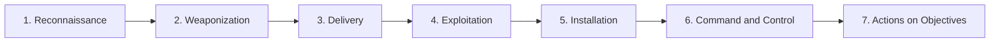
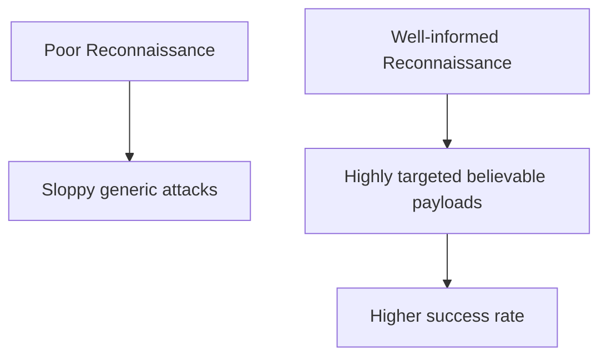
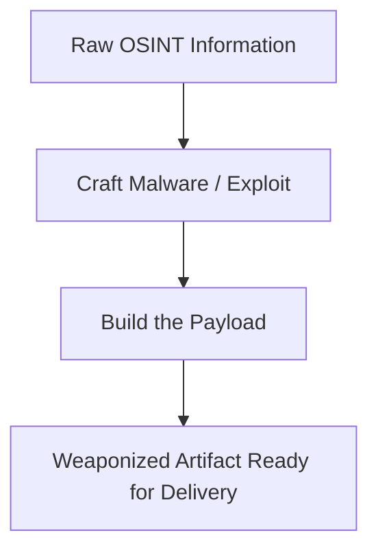
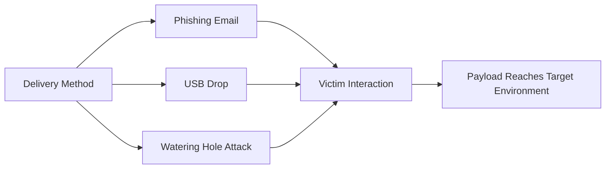
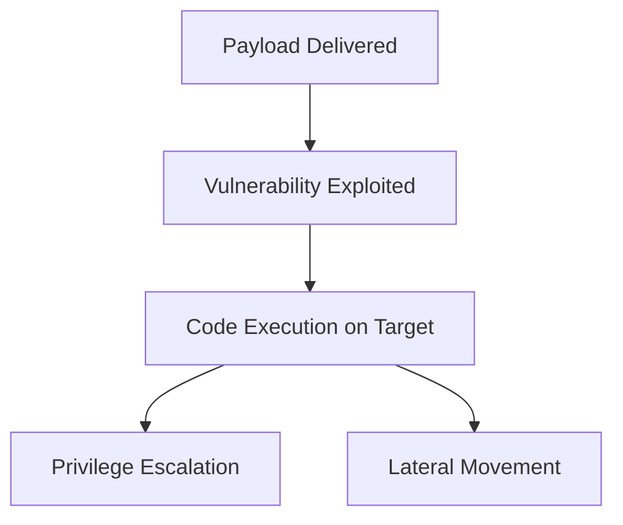
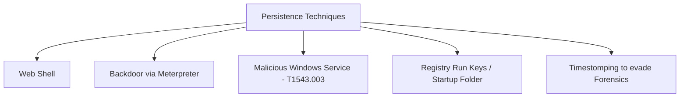
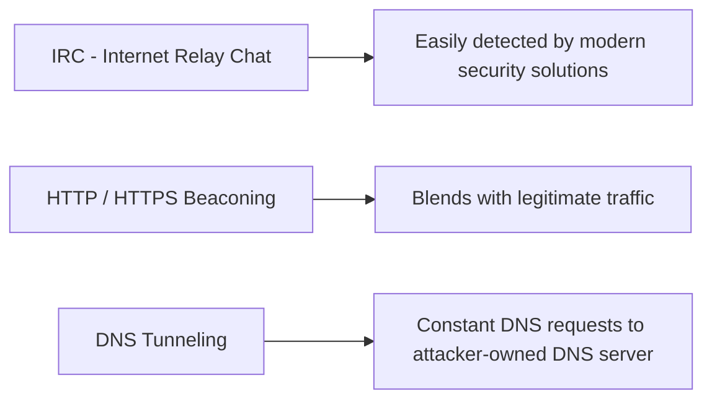
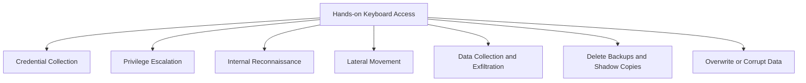
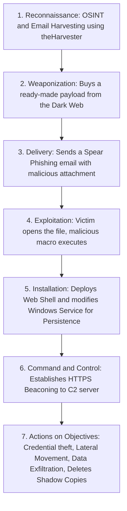

> **الهدف من الـ Section ده:**  
> هتفهم إزاي الـ Attacker بيخطط وينفذ هجوم سايبراني من أول لحظة لما يبدأ يجمع معلومات عنك، لحد ما يحقق هدفه النهائي جوه شبكتك. وهتعرف كـ SOC Analyst إزاي تـ "تكسر" الـ Chain دي في أي مرحلة عشان توقف الهجوم قبل ما يكمل.


## Table of Contents

- [Introduction: What is the Cyber Kill Chain?](#introduction-what-is-the-cyber-kill-chain)
- [Why Should a SOC Analyst Care?](#why-should-a-soc-analyst-care)
- [The 7 Phases Overview](#the-7-phases-overview)
- [Phase 1: Reconnaissance](#phase-1-reconnaissance)
- [Phase 2: Weaponization](#phase-2-weaponization)
- [Phase 3: Delivery](#phase-3-delivery)
- [Phase 4: Exploitation](#phase-4-exploitation)
- [Phase 5: Installation](#phase-5-installation)
- [Phase 6: Command & Control (C2)](#phase-6-command--control-c2)
- [Phase 7: Actions on Objectives](#phase-7-actions-on-objectives)
- [Full Attack Walkthrough — "Megatron" Scenario](#full-attack-walkthrough--megatron-scenario)
- [Summary](#summary)

---

## Introduction: What is the Cyber Kill Chain?

كلمة **Kill Chain** أصلها مصطلح عسكري، بيوصف خطوات الهجوم العسكري بالترتيب: إنك الأول تحدد الهدف (Target Identification)، بعدين تاخد قرار وتدي أمر بالهجوم (Decision & Order to Attack)، وأخيراً تدمر الهدف (Target Destruction).

شركة **Lockheed Martin** (شركة عالمية في مجال الـ Aerospace والـ Security) أخدت المفهوم العسكري ده وطبقته على عالم الـ Cybersecurity سنة 2011، وعملت منه فريم وورك اسمه **Cyber Kill Chain®**.

> [!IMPORTANT]
> الفكرة الأساسية في الـ Kill Chain: عشان الـ Attacker ينجح في هجومه، لازم يعدي على **كل** مراحل الـ Chain بالترتيب. لو إنت كـ Defender قدرت توقفه في أي مرحلة من المراحل دي، الهجوم بيفشل بالكامل — وده اللي بنسميه **"Breaking the Kill Chain"**.

ده بالظبط اللي بيدي الـ Framework قيمته الحقيقية: مش بس فهم إزاي الهجوم بيحصل، لكنه بيديك خريطة واضحة لكل نقطة ممكن تتدخل فيها وتمنع الهجوم.

---

## Why Should a SOC Analyst Care?

فهمك للـ Cyber Kill Chain مش رفاهية، ده أساسي لشغلك كـ:

- **SOC Analyst**
- **Security Researcher**
- **Threat Hunter**
- **Incident Responder**

ليه؟ لأنه بيساعدك في:

1. **الحماية من Ransomware و Data Breaches و APTs** (Advanced Persistent Threats).
2. **تقييم أمان الشبكة (Security Assessment)**: تقدر تستخدم الـ Kill Chain كـ Checklist عشان تحدد إنهي Security Controls ناقصة في الـ Infrastructure بتاعتك، وتقفل أي Gaps موجودة.
3. **التعرف على نوايا الـ Intruder**: لما تشوف Indicator معين في الـ Logs، تقدر تحدد هو في انهي مرحلة من الهجوم، وده بيوجهك تتصرف إزاي.

> [!TIP]
> لو شُفت Process غريبة بتعمل DNS requests متكررة جداً لدومين مش معروف، إنت كـ Analyst تقدر تربطها فوراً بمرحلة الـ **Command & Control**، وده بيوفر عليك وقت كبير في الـ Investigation.

---

## The 7 Phases Overview

الـ Framework بيتكون من 7 مراحل متسلسلة، كل مرحلة بتبني على اللي قبلها:



| # | Phase | الهدف منها بالعربي |
|---|-------|---------------------|
| 1 | Reconnaissance | جمع معلومات عن الضحية قبل الهجوم |
| 2 | Weaponization | تجهيز الـ Payload أو الـ Malware |
| 3 | Delivery | إيصال الـ Payload للضحية |
| 4 | Exploitation | تنفيذ الكود واستغلال الثغرة |
| 5 | Installation | تثبيت وجود دائم (Persistence) على الجهاز |
| 6 | Command & Control | فتح قناة تحكم مع السيرفر بتاع المهاجم |
| 7 | Actions on Objectives | تحقيق الهدف النهائي من الهجوم |

> [!NOTE]
> طول الشرح، هنتابع سيناريو وهمي لمهاجم اسمه **"Megatron"** بيخطط لهجوم سايبراني متطور، عشان نفهم كل مرحلة من وجهة نظر الـ Attacker، وبعدين نربطها بوجهة نظرنا كـ Defenders.

---

## Phase 1: Reconnaissance

### التعريف

الـ **Reconnaissance** هي مرحلة البحث والتخطيط (Research & Planning). فيها الـ Attacker بيجمع كل المعلومات الممكنة عن الهدف قبل ما يبدأ أي خطوة تنفيذية. المعلومات دي ممكن تشمل:

- تفاصيل الـ Infrastructure (السيرفرات، الـ IP Ranges، الـ Domains).
- بيانات عن الموظفين (Employee Data).
- إجراءات العمل (Business Processes).
- التقنيات المكشوفة (Exposed Technologies).

> [!IMPORTANT]
> الـ Reconnaissance غالباً **Passive** و **Undetected** — يعني بتحصل من غير ما الضحية تحس بأي حاجة. وده اللي بيخليها خطيرة، لأن مفيش Alert بيتولد في الغالب وقت ما الـ Attacker بيجمع المعلومات.

العلاقة بين جودة الـ Recon وجودة الهجوم بسيطة:



### OSINT — Open-Source Intelligence

أهم أداة في الـ Recon هي الـ **OSINT**. ببساطة، الـ Attacker بيجمع معلومات عن الهدف من مصادر **متاحة للعامة (Publicly Available)**، يعني معلومات مش سرية أصلاً وأي حد يقدر يوصلها — بس المهاجم بيجمعها ويربطها مع بعض عشان يبني صورة كاملة عن الضحية.

مصادر الـ OSINT بتشمل:

- محركات البحث (Search Engines)
- الإعلام المطبوع والإلكتروني (Print & Online Media)
- حسابات السوشيال ميديا (Social Media Accounts)
- المنتديات والمدونات (Online Forums & Blogs)
- قواعد بيانات السجلات العامة (Public Record Databases)
- بيانات WHOIS والبيانات التقنية

> [!TIP]
> الـ OSINT مش بس أداة للمهاجمين — إنت كـ Defender أو SOC Analyst لازم تعمل OSINT على شركتك بنفسك بشكل دوري عشان تعرف إيه المعلومات اللي ظاهرة عنكم للعالم الخارجي، وتقفل أي تسريب غير مقصود (زي إيميلات أو تقنيات مكشوفة في Job Postings مثلاً).

### Reconnaissance Types

| النوع | الوصف | أمثلة |
|-------|--------|--------|
| **Passive Recon** | مفيش تفاعل مباشر مع الهدف | WHOIS lookups، Social media scraping، مراجعة بيانات Breaches قديمة |
| **Active Recon** | فيه تواصل مباشر مع الهدف | Social Engineering، Port Scanning، Banner Grabbing، فحص الخدمات المفتوحة |

> [!WARNING]
> الـ Active Recon أسهل في الاكتشاف من الـ Passive، لأنها بتسيب أثر على الشبكة أو السيرفرات (زي Connection Logs أو Scan Attempts). كـ Defender، دي فرصتك الحقيقية تمسك المهاجم بدري.

### Email Harvesting

من أهم تقنيات الـ Recon هي **Email Harvesting** — عملية جمع عناوين إيميلات من مصادر عامة، مدفوعة، أو مجانية. الهدف الأساسي منها هو استخدامها لاحقاً في هجمات **Phishing** (نوع من Social Engineering بيستهدف سرقة بيانات حساسة زي بيانات الدخول وأرقام الكروت الائتمانية).

أدوات شهيرة بتُستخدم في الـ Reconnaissance:

| الأداة | الوظيفة |
|--------|---------|
| **theHarvester** | بتجمع إيميلات، أسماء، Subdomains، IPs، و URLs من مصادر عامة متعددة |
| **Hunter.io** | أداة متخصصة في جمع بيانات التواصل المرتبطة بدومين معين |
| **OSINT Framework** | مجموعة شاملة من أدوات الـ OSINT مقسّمة حسب الفئة |

---

## Phase 2: Weaponization

بعد ما "Megatron" خلّص مرحلة الـ Reconnaissance بنجاح، جاله الوقت إنه يحوّل المعلومات الخام اللي جمعها لـ **أداة هجوم فعلية (Actionable Attack Tool)** — وده من خلال صناعة الـ Malware والـ Exploits وتجميعهم في **Payload**.

> [!NOTE]
> مش كل المهاجمين بيكتبوا الـ Malware بنفسهم. الأغلبية بتستخدم أدوات Automated أو بتشتري Malware جاهز من الـ Dark Web. لكن الـ APT Groups (مجموعات مدعومة من دول/Nation-Sponsored) غالباً بتكتب Custom Malware خاص بيها عشان تضمن إنه **Unique** ويقدر يتفادى أدوات الكشف (Evade Detection).

### مصطلحات أساسية لازم تفهمها كويس

| المصطلح | التعريف |
|---------|---------|
| **Malware** | برنامج أو سوفت وير مصمم عشان يضر أو يعطل أو يدخل بشكل غير مصرح به لجهاز كمبيوتر |
| **Exploit** | برنامج أو كود بيستغل ثغرة (Vulnerability) أو عيب موجود في تطبيق أو نظام |
| **Payload** | الكود الخبيث (Malicious Code) اللي المهاجم بينفذه فعلياً على النظام المستهدف |

في السيناريو بتاعنا، "Megatron" قرر يشتري Payload جاهز مكتوب من حد تاني على الـ Dark Web، عشان يوفر وقته ويركز على باقي مراحل الهجوم.

### تكتيكات الـ Weaponization

في المرحلة دي، الـ Attacker يقدر يستخدم تكتيكات زي:

1. **إنشاء مستند Office مصاب**: يحتوي على Macros خبيثة أو سكريبتات VBA (Visual Basic for Applications).
2. **صناعة Payload أو Worm متطور**: وزرعه على USB Drives وتوزيعها في أماكن عامة.
3. **إعداد بنية Command & Control (C2)**: عشان ينفذ أوامر على جهاز الضحية أو يسلّم Payloads إضافية لاحقاً.
4. **زرع Backdoor**: بيدي طريقة للوصول للنظام والتحايل على آليات الحماية.
5. **تخصيص قوالب Phishing أو تطبيقات OAuth-consent**: بحيث تبان شرعية ومقنعة للضحية.



> [!WARNING]
> أي تطبيق بيطلب OAuth Consent من موظف، حتى لو شكله شرعي، لازم يتراجع وميتمنحش صلاحيات واسعة من غير تحقق. دي واحدة من أكتر تقنيات الـ Weaponization انتشاراً في السنين الأخيرة (Consent Phishing).

---

## Phase 3: Delivery

في مرحلة الـ **Delivery**، "Megatron" بيحدد **الطريقة** اللي هيوصل بيها الـ Payload أو الـ Malware للبيئة المستهدفة (Target Environment).

### طرق التوصيل الشائعة

#### 1. Phishing Email

بعد ما يخلص Recon ويحدد أهدافه، المهاجم بيصمم إيميل خبيث ممكن يستهدف:

- **شخص واحد محدد**: ده بيتسمى **Spear Phishing**.
- **مجموعة كبيرة من الموظفين** في الشركة.

الإيميل بيحتوي عادةً على رابط خبيث أو مرفق (Attachment) ملوّث، وفتحه بينتج عنه اختراق (Compromise).

#### 2. USB Drops

المهاجم بيستخدم وسيلة توصيل فيزيائية (Physical Delivery Medium) — زي ترك USB Drives في أماكن عامة (كافيهات، مواقف سيارات، الشارع). في هجوم أكتر تطوراً، المهاجم ممكن يطبع لوجو الشركة على الـ USB ويبعتها بالبريد للشركة وهو بيتظاهر إنه عميل بيبعت هدية.

#### 3. Watering Hole Attacks

هجوم مستهدف ومصمم عشان يضرب مجموعة معينة من الناس، عن طريق اختراق موقع بيزوروه دايماً، وتحويلهم (Redirect) لموقع خبيث المهاجم عامله. الضحايا بيكونوا بيحملوا Malware أو تطبيق خبيث من غير ما يقصدوا، وده بيتسمى **Drive-by Download**. مثال على كده: Pop-up مزيف بيطلب منك تحمل إضافة متصفح (Browser Extension) وهمية.



> [!IMPORTANT]
> مرحلة الـ Delivery دي من أهم النقاط اللي ممكن تكسر فيها الـ Kill Chain من منظور الـ Defense — عن طريق Email Filtering وUSB Device Control وWeb Filtering/Proxy. لو منعت الـ Payload من الوصول أصلاً، الهجوم بيقف هنا.

---

## Phase 4: Exploitation

الـ **Exploitation** هي اللحظة اللي فيها كود المهاجم بيتنفذ فعلياً على جهاز الضحية، مستغلاً ثغرة معروفة (Known Vulnerability).

### التقنيات الأساسية

| التقنية | الوصف |
|---------|--------|
| **Malicious Macro Execution** | ممكن توصل عن طريق Phishing Email، وتنفذ Ransomware لحظة ما الضحية يفتح الملف |
| **Zero-day Exploits** | بتستغل ثغرات غير معروفة وغير مرقعة (Unknown & Unpatched)، وده بيخليها صعبة الاكتشاف في البداية |
| **Known CVEs** | المهاجم بيستغل ثغرات عامة معروفة (Public Vulnerabilities) لسه متعملهاش Patch في بيئة الهدف |

بعد ما الـ Attacker ياخد Access للنظام، يقدر يستغل ثغرات في الـ Software أو النظام أو السيرفر عشان يعمل:

- **Privilege Escalation**: رفع صلاحياته.
- **Lateral Movement**: التحرك جوه الشبكة لأجهزة تانية.

### علامات الـ Exploitation اللي لازم تنتبه لها كـ SOC Analyst

> [!IMPORTANT]
> دي مؤشرات أساسية لازم تكون في الـ Detection Rules بتاعتك:
> - **Unexpected process spawns** — عمليات بتتفتح من غير سبب واضح أو من Parent process غريب.
> - **Registry changes أو إنشاء Services جديدة** — تغييرات مفاجئة في الـ Registry أو ظهور Services مش متعرفة.
> - **Suspicious command-line arguments** — أوامر غريبة أو مشفّرة (Obfuscated) ظاهرة في الـ Logs.



---

## Phase 5: Installation

زي ما اتعلمنا في الـ Weaponization، الـ **Backdoor** بيدي المهاجم طريقة للتحايل على إجراءات الحماية والاحتفاظ بالوصول للنظام — ولذلك بيتسمى كمان **Access Point**.

### ليه المهاجم محتاج Persistence؟

بعد ما الـ Attacker ياخد Access، هو محتاج يضمن إنه يقدر يرجع تاني للنظام في الحالات دي:

- لو فقد الاتصال بالجهاز.
- لو اتكشف وتم إلغاء الـ Initial Access بتاعه.
- لو النظام اتعمله Patch لاحقاً.

عشان كده، المهاجم بيحتاج يثبت **Persistent Backdoor**، يعني Backdoor بيفضل شغال حتى لو حصلت أي حاجة من اللي فوق.

### طرق تحقيق الـ Persistence

#### 1. Web Shell

سكريبت خبيث مكتوب بلغات تطوير الويب زي **ASP**, **PHP**, **JSP**، بيستخدمه المهاجم عشان يحافظ على وصوله للنظام المخترق. الـ Web Shell صعب اكتشافه أحياناً بسبب بساطته وتنسيق ملفاته (`.php`, `.asp`, `.aspx`, `.jsp`)، وممكن يتصنف غلط كـ Benign (غير ضار).

#### 2. Backdoor مباشر على جهاز الضحية

مثال: استخدام أداة **Meterpreter** (وهي Payload من إطار عمل **Metasploit Framework**) عشان يفتح Interactive Shell، يقدر من خلاله المهاجم يتفاعل مع جهاز الضحية عن بُعد وينفذ كود خبيث.

#### 3. إنشاء أو تعديل Windows Services

التقنية دي معرّفة في MITRE ATT&CK تحت كود **T1543.003**. المهاجم يقدر ينشئ أو يعدّل Windows Services عشان تنفذ السكريبتات أو الـ Payloads الخبيثة بشكل دوري كجزء من الـ Persistence.

أدوات مستخدمة في التقنية دي:

```
sc.exe   # لإنشاء، تشغيل، إيقاف، استعلام، أو حذف أي Windows Service
Reg      # لتعديل إعدادات الـ Services
```

> [!WARNING]
> المهاجم ممكن يستخدم تقنية **Masquerading**، يعني يسمّي الـ Service الخبيث باسم قريب جداً من اسم Service شرعي تابع لنظام التشغيل أو سوفت وير معروف، عشان يفوت على عين الـ Analyst العادية. دايماً قارن الـ Service Name والـ Path الفعلي بتاعه مش بس الاسم.

#### 4. Registry Run Keys / Startup Folder

المهاجم بيضيف Entry في الـ "Run Keys" بالـ Registry أو في الـ Startup Folder، عشان الـ Payload يتنفذ تلقائياً كل مرة المستخدم يعمل Login.

> [!NOTE]
> حسب MITRE ATT&CK، فيه:
> - **Startup Folder خاص بكل حساب مستخدم (Per-User)**.
> - **Startup Folder عام على مستوى النظام كله (System-wide)**، بيتفعّل أياً كان المستخدم اللي بيعمل Login.

### Timestomping

تقنية إضافية بتُستخدم في المرحلة دي، بتسمح للمهاجم يعدّل **Timestamps** بتاعة الملف (Modify, Access, Create, Change times) عشان:

1. يتفادى اكتشاف الـ Forensic Investigator.
2. يخلي الـ Malware يبان وكأنه جزء من برنامج شرعي وقديم على النظام.



> [!TIP]
> كـ SOC Analyst، لازم تراقب باستمرار: إنشاء Services جديدة، تعديلات على Run Keys، وملفات جديدة في Startup Folders. دول من أقوى الـ Detection Points لمرحلة الـ Installation.

---

## Phase 6: Command & Control (C2)

بعد ما "Megatron" حقق الـ Persistence ونفّذ الـ Malware على جهاز الضحية، بيفتح قناة **C2 (Command and Control)** من خلال الـ Malware، عشان يتحكم في الضحية ويتلاعب بيه عن بُعد.

> [!NOTE]
> المصطلح ده معروف كمان باسم **C&C** أو **C2 Beaconing**، وهو نوع من التواصل الخبيث بين سيرفر الـ C&C والـ Malware على الجهاز المصاب. الجهاز المصاب بيفضل يتواصل بشكل مستمر مع سيرفر الـ C2 — ومن هنا جه مصطلح **"Beaconing"** (زي الإشارة اللي بتتبعت بشكل دوري).

بعد ما يتأسس الاتصال، الـ Attacker بيبقى عنده **Full Control** على جهاز الضحية.

### تطور قنوات الـ C2



| القناة | التفاصيل |
|--------|----------|
| **IRC** | كانت القناة التقليدية قديماً، لكنها بقت سهلة الاكتشاف بأدوات الأمان الحديثة |
| **HTTP (Port 80) / HTTPS (Port 443)** | النوع ده من الـ Beaconing بيختلط مع الـ Traffic الشرعي، وده بيساعد المهاجم يتفادى الـ Firewalls |
| **DNS (DNS Tunneling)** | الجهاز المصاب بيبعت طلبات DNS مستمرة لسيرفر DNS تابع للمهاجم |

> [!IMPORTANT]
> مهم جداً تعرف إن مالك بنية الـ C2 (C2 Infrastructure) ممكن يكون الـ Adversary نفسه، أو ممكن يكون **Host تاني متخترق بالفعل** بيستخدمه المهاجم كوسيط (زي طبقة إضافية لإخفاء هويته الحقيقية).

> [!TIP]
> كـ SOC Analyst، ركّز على **Beaconing Patterns**: اتصالات دورية بفواصل زمنية ثابتة أو شبه ثابتة لدومين مش معروف أو IP خارجي، خصوصاً لو الـ Traffic ده شكله HTTPS عادي لكن الـ Destination مريب. أدوات الـ Network Detection (NDR) وتحليل الـ DNS Logs أساسيين هنا.

---

## Phase 7: Actions on Objectives

بعد ما "Megatron" عدّى على 6 مراحل من الهجوم بنجاح، وصل أخيراً للمرحلة الأخيرة — تحقيق **الهدف الأصلي من الهجوم**. مع وصوله لمرحلة الـ **Hands-on Keyboard Access**، المهاجم يقدر يحقق:

| الهدف | الوصف |
|-------|--------|
| **جمع بيانات اعتماد المستخدمين (Collect Credentials)** | سرقة Usernames و Passwords |
| **Privilege Escalation** | الحصول على صلاحيات أعلى — زي Domain Admin Access — بدايةً من Workstation عادي، عن طريق استغلال Misconfiguration |
| **Internal Reconnaissance** | التفاعل مع السوفت وير الداخلي عشان يكتشف ثغرات جديدة جوه الشبكة |
| **Lateral Movement** | التحرك بين أجهزة الشبكة المختلفة جوه بيئة الشركة |
| **Collect & Exfiltrate Sensitive Data** | جمع البيانات الحساسة وتسريبها لبره الشبكة |
| **حذف النسخ الاحتياطية والـ Shadow Copies** | الـ Shadow Copy هي تقنية من Microsoft بتعمل نسخ احتياطية (Snapshots) من الملفات أو الـ Volumes — حذفها بيمنع الضحية من الاسترجاع بسهولة |
| **Overwrite أو Corrupt Data** | تخريب أو الكتابة فوق البيانات الأصلية |



> [!WARNING]
> حذف الـ Shadow Copies غالباً بيكون **علامة قوية جداً** على هجوم Ransomware وشيك أو حاصل بالفعل. لو شُفت Command زي `vssadmin delete shadows` في الـ Logs، ده Red Flag كبير لازم يتصعّد فوراً (Immediate Escalation).

---

## Full Attack Walkthrough — "Megatron" Scenario

عشان نربط كل حاجة شرحناها مع بعض، خلينا نتابع رحلة "Megatron" كاملة من البداية للنهاية:



> [!IMPORTANT]
> كل سهم في الدياجرام دي هو **نقطة فشل محتملة للمهاجم** لو إنت كـ Defender حطيت Control مناسب فيها. ده جوهر فلسفة الـ Kill Chain: مش لازم توقف كل حاجة، يكفي توقف حلقة واحدة بس عشان السلسلة كلها تنهار.

---

## Summary

- **Cyber Kill Chain** فريم وورك من Lockheed Martin (2011) مبني على مفهوم عسكري، بيوصف 7 مراحل لازم المهاجم يعديهم بالترتيب عشان ينجح في هجومه.
- المراحل السبعة هي: **Reconnaissance → Weaponization → Delivery → Exploitation → Installation → Command & Control → Actions on Objectives**.
- **Reconnaissance**: جمع معلومات عن الهدف، غالباً بطريقة Passive وغير مكتشفة، باستخدام OSINT وأدوات زي theHarvester و Hunter.io.
- **Weaponization**: تحويل المعلومات لأداة هجوم فعلية — بناء أو شراء Malware/Exploit وتجميعهم في Payload.
- **Delivery**: إيصال الـ Payload للضحية عن طريق Phishing Email، USB Drops، أو Watering Hole Attacks.
- **Exploitation**: لحظة تنفيذ الكود الخبيث فعلياً واستغلال الثغرة — Zero-day أو Known CVE أو Macro خبيث.
- **Installation**: تثبيت Persistence على الجهاز عن طريق Web Shells، Backdoors (زي Meterpreter)، تعديل Windows Services (T1543.003)، أو Registry Run Keys — ومعاهم تقنية Timestomping لإخفاء الأثر.
- **Command & Control**: فتح قناة اتصال مستمرة (Beaconing) بين الجهاز المصاب وسيرفر المهاجم، غالباً عن طريق HTTP/HTTPS أو DNS Tunneling عشان تتفادى الاكتشاف.
- **Actions on Objectives**: المرحلة الأخيرة اللي فيها المهاجم بيحقق هدفه الحقيقي — سرقة بيانات، Privilege Escalation، Lateral Movement، تسريب بيانات، وتدمير النسخ الاحتياطية.
- **أهم مبدأ للـ Defender**: مفيش داعي توقف الهجوم كله مرة واحدة — يكفي تكسر **حلقة واحدة بس** من السلسلة عشان توقف المهاجم بالكامل، وده اللي بيسموه **Breaking the Kill Chain**.

> [!TIP]
> لما تيجي تحلل أي Incident فعلي كـ SOC Analyst، حاول ترتب الـ Evidence اللي عندك حسب مراحل الـ Kill Chain. ده بيساعدك تعرف المهاجم وصل لفين بالظبط، وتقدر تتوقع الخطوة الجاية بتاعته قبل ما تحصل.
