**> **الهدف من الـ Section ده:**  
> هتفهم إيه هو الـ MITRE ATT&CK Framework وليه بقى المرجع الأساسي في الـ Cybersecurity، وإزاي تستخدمه كـ SOC Analyst عشان تحول الـ Threat Intelligence لـ Detections حقيقية، وكمان هتتعرف على باقي أدوات MITRE زي CAR وD3FEND وCaldera.


---


## Table of Contents

- [What is MITRE?](#what-is-mitre)
- [MITRE ATT&CK Framework Overview](#mitre-attck-framework-overview)
- [TTPs - Tactics, Techniques, and Procedures](#ttps---tactics-techniques-and-procedures)
- [ATT&CK Matrix Structure](#attck-matrix-structure)
- [Who Uses ATT&CK and How](#who-uses-attck-and-how)
- [Threat Intelligence Mapping with ATT&CK](#threat-intelligence-mapping-with-attck)
- [CAR - Cyber Analytics Repository](#car---cyber-analytics-repository)
- [D3FEND Framework](#d3fend-framework)
- [MITRE Additional Tools and Frameworks](#mitre-additional-tools-and-frameworks)
- [Summary](#summary)

---

## What is MITRE?

MITRE هي منظمة **غير ربحية** بتشتغل في مجالات كتير زي الـ Cybersecurity والـ AI والـ Healthcare، وهدفها المعلن هو **"to solve problems for a safer world"**.

في مجال الـ Cybersecurity، MITRE بتقدم مجموعة من الـ Frameworks والـ Tools اللي بقت ركيزة أساسية لأي فريق أمني سواء كان هجومي أو دفاعي:

- **MITRE ATT&CK** — قاعدة معرفة بأساليب المهاجمين
- **CAR** — مستودع تحليلات للكشف عن الهجمات
- **D3FEND** — إطار للتقنيات الدفاعية
- **Caldera** — أداة محاكاة هجمات تلقائية

---

## MITRE ATT&CK Framework Overview

**ATT&CK** اختصار لـ **Adversarial Tactics, Techniques, and Common Knowledge**.

### التعريف الرسمي

> "A globally-accessible knowledge base of adversary tactics and techniques based on real-world observations."

بمعنى أبسط: ATT&CK هو **موسوعة مبنية على هجمات حقيقية** وثّقت فيها MITRE كل الأساليب اللي المهاجمين بيستخدموها فعلاً في العالم الحقيقي منذ عام **2013**.

### تطور الـ Framework

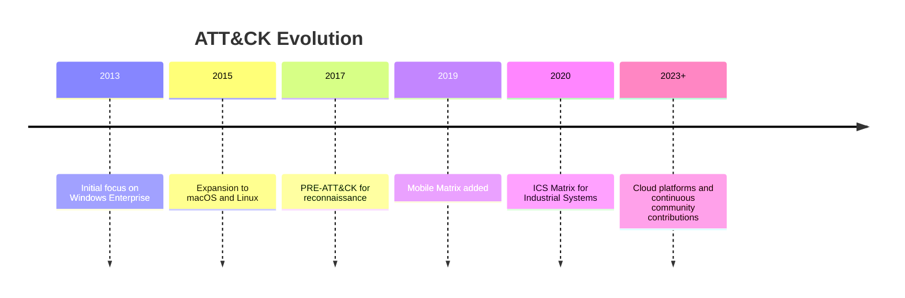

### نطاق التغطية

| Platform | Matrix |
|----------|--------|
| Windows, macOS, Linux, Cloud | Enterprise Matrix |
| Android, iOS | Mobile Matrix |
| Industrial Control Systems | ICS Matrix |

> [!IMPORTANT]
> الـ Enterprise Matrix هي الأكثر استخداماً في بيئات العمل، وبتغطي الـ Cloud بشكل كامل مع التوسع المستمر من الـ Community.

---

## TTPs - Tactics, Techniques, and Procedures

الـ TTPs هي المفهوم الأساسي اللي بيتبنى عليه كل الـ Framework. خليني أشرحها بمثال بسيط:

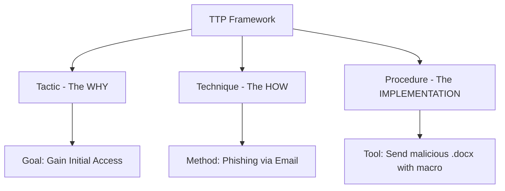

### شرح كل مستوى

**1. Tactic (التكتيك)**
- هو **الهدف** أو الغرض من الهجوم
- بيجاوب على سؤال: **"ليه بيعمل ده؟"**
- مثال: `Initial Access` — المهاجم عايز يدخل الشبكة

**2. Technique (التقنية)**
- هي **الطريقة** اللي بيحقق بيها الهدف ده
- بيجاوب على سؤال: **"إزاي بيعمل ده؟"**
- مثال: `Phishing (T1566)` — بيبعت إيميل مزيف

**3. Procedure (الإجراء)**
- هو **التنفيذ الفعلي** بكل تفاصيله
- بيجاوب على سؤال: **"ما هو الـ Tool أو الـ Script اللي استخدمه؟"**
- مثال: بعت إيميل فيه ملف `.docx` فيه Macro خبيث

> [!NOTE]
> الـ Sub-techniques هي تفريعات أدق للـ Technique الأساسية. مثلاً `T1566` (Phishing) فيها Sub-techniques زي `T1566.001` (Spearphishing Attachment) و`T1566.002` (Spearphishing Link).

---

## ATT&CK Matrix Structure

الـ ATT&CK Matrix هي التمثيل البصري لكل الـ Tactics والـ Techniques. تخيلها زي جدول:
- **الأعمدة (Columns)** = الـ Tactics (الأهداف)
- **الصفوف تحت كل عمود** = الـ Techniques والـ Sub-techniques

### الـ 14 Tactics في Enterprise ATT&CK

```mermaid
graph LR
    A[Reconnaissance] --> B[Resource Development]
    B --> C[Initial Access]
    C --> D[Execution]
    D --> E[Persistence]
    E --> F[Privilege Escalation]
    F --> G[Defense Evasion]
    G --> H[Credential Access]
    H --> I[Discovery]
    I --> J[Lateral Movement]
    J --> K[Collection]
    K --> L[Command and Control]
    L --> M[Exfiltration]
    M --> N[Impact]
```

### مثال عملي: Reconnaissance Tactic

لو المهاجم هدفه هو الـ **Reconnaissance** (جمع معلومات عن الهدف):

| المستوى | المثال | الـ ID |
|---------|--------|--------|
| Tactic | Reconnaissance | TA0043 |
| Technique | Active Scanning | T1595 |
| Sub-technique | Vulnerability Scanning | T1595.002 |

### صفحة الـ Technique بتحتوي على إيه؟

كل Technique في ATT&CK بيكون فيها:
- **Description**: شرح مفصل للتقنية
- **Technique ID**: معرّف فريد (زي `T1595`)
- **Procedure Examples**: أمثلة من هجمات حقيقية ومجموعات معروفة
- **Mitigations**: طرق التخفيف والحماية
- **Detections**: إزاي تكشفها كـ Defender
- **References**: مصادر ومراجع إضافية

> [!TIP]
> استخدم الـ **ATT&CK Navigator** عشان تعمل Annotations على الـ Matrix وتحدد الـ Techniques المغطاة في بيئتك. مفيد جداً في الـ Gap Analysis.

---

## Who Uses ATT&CK and How

ATT&CK مش بس للـ Defenders — كل فريق في الـ Security Industry بيستخدمه بطريقة مختلفة:

| الفريق | الهدف | طريقة الاستخدام |
|--------|--------|-----------------|
| **CTI Teams** | تحليل سلوك المهاجمين | ربط الـ Threat Intelligence بالـ TTPs عشان يعملوا Profiles للـ Threat Actors |
| **SOC Analysts** | التحقيق في الـ Alerts | ربط كل Alert بـ Tactic وTechnique عشان يفهموا السياق ويحددوا الأولوية |
| **Detection Engineers** | تصميم قواعد الكشف | ربط قواعد الـ SIEM والـ EDR بالـ Techniques عشان يضمنوا التغطية |
| **Incident Responders** | الاستجابة للحوادث | رسم Timeline للهجوم باستخدام الـ Tactics والـ Techniques |
| **Red & Purple Teams** | اختبار الدفاعات | بناء Emulation Plans تحاكي هجمات مجموعات معروفة |

> [!IMPORTANT]
> كـ **SOC Analyst**، فهمك للـ ATT&CK بيخليك مش بس تشوف الـ Alert — بتشوف الـ **Intent** وراءه. إيه الهدف من الـ Attack ده؟ وهل جزء من هجوم أكبر؟

### ATT&CK بيوفر لغة موحدة

قبل ATT&CK، ممكن تلاقي نفس الهجوم اتوصف بأسماء مختلفة في شركات مختلفة. دلوقتي بفضل الـ **Unique IDs** زي `T1566`، أي شخص في أي مكان في العالم يعرف بالضبط المقصود.

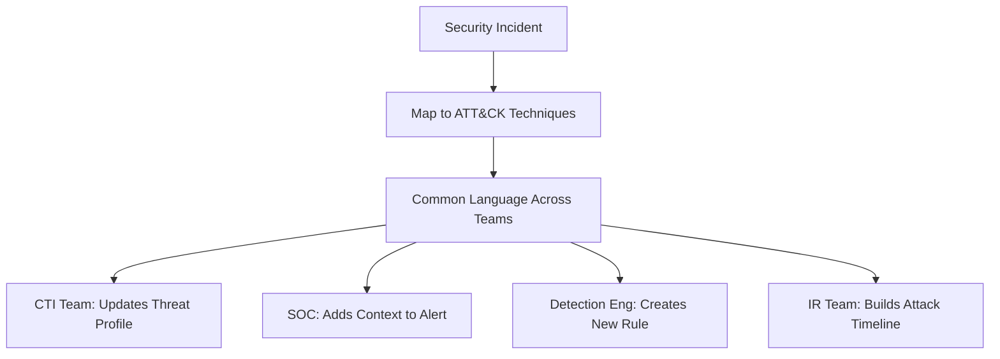

---

## Threat Intelligence Mapping with ATT&CK

### من الـ Intelligence للـ Detection

المشكلة اللي ATT&CK بيحلها هي إن الـ **Threat Reports** بتوصف إيه حصل، بس مش بتقولك إزاي تكشفه. ATT&CK هو الجسر ده.

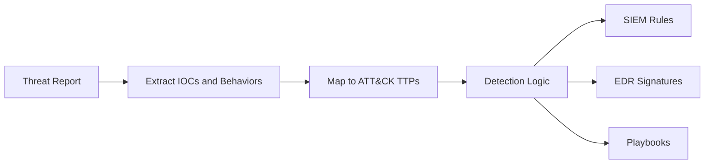

### مثال عملي: مجموعة Mustang Panda (G0129)

**Mustang Panda** هي مجموعة APT صينية معروفة بهجماتها على الحكومات والـ NGOs. لما بتبص على صفحتها في ATT&CK:

| المرحلة | الـ Technique | الـ ID |
|---------|--------------|--------|
| Initial Access | Phishing | T1566 |
| Persistence | Scheduled Task/Job | T1053 |
| Defense Evasion | Obfuscated Files | T1027 |
| Command and Control | Ingress Tool Transfer | T1105 |

> [!WARNING]
> لما بتعمل Threat Intelligence Mapping، متركزش بس على الـ IOCs (IP Addresses, Hashes) — دي بتتغير بسرعة. ركّز على الـ **TTPs** لأنها بتفضل ثابتة لفترة أطول وبتوصف **كيفية** عمل المهاجم مش بس أدواته.

### Scenario عملي: قطاع الطيران

لو شغّال كـ Security Analyst في شركة طيران وبتعمل Migration للـ Cloud:

1. **روح على قسم Groups في ATT&CK**
2. **ابحث عن APT Groups** بتستهدف الـ Aviation Sector
3. **افتح ATT&CK Navigator** وحمّل الـ Layer الخاصة بالمجموعة
4. **قارن الـ Techniques** بتاعت المجموعة بالـ Detections الحالية عندك
5. **حدد الـ Gaps** — إيه الـ Techniques اللي مش عندك Coverage عليها؟

---

## CAR - Cyber Analytics Repository

### إيه هو CAR؟

> "A knowledge base of analytics developed by MITRE based on the MITRE ATT&CK adversary model."

لو ATT&CK بيقولك "المهاجم ممكن يعمل Scheduled Task"، الـ **CAR** بيقولك **"دا كيف تكشفها في الـ SIEM بتاعك"**.

CAR هو **مكتبة تحليلات جاهزة** مبنية على الـ ATT&CK. كل Analytic:
- بيوصف الـ Behavior المراد اكتشافه
- مربوط بـ ATT&CK Tactic وTechnique
- بيجيب معاه **Pseudocode** وأمثلة لـ SIEM Queries

### مثال: CAR-2020-09-001 — Scheduled Task File Access

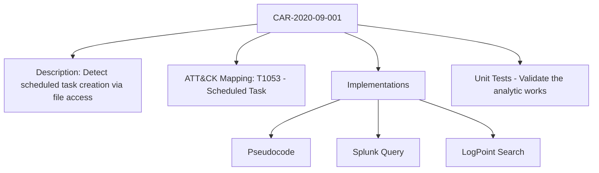

### مثال Splunk Query من CAR

```splunk
index=windows EventCode=4698
| table _time, host, user, TaskName, TaskContent
```

ده مثال لـ Query بتبحث عن إنشاء Scheduled Tasks في الـ Windows Event Logs.

> [!TIP]
> مش كل Analytic في CAR بيكون ليه نفس الـ Implementations. بعضها بس فيه Pseudocode، وبعضها فيه Splunk وEQL وغيرها. دايماً اتحقق من الـ Implementations المتاحة للـ Analytic اللي بتيجي.

### CAR vs ATT&CK

| | ATT&CK | CAR |
|--|--------|-----|
| **الهدف** | وصف ما يفعله المهاجم | كيف تكشف ما يفعله المهاجم |
| **المحتوى** | Tactics, Techniques, Procedures | Analytics, Queries, Pseudocode |
| **الاستخدام** | Threat Profiling & Planning | Detection Engineering |
| **الأدوات** | Navigator | Analytics List + Navigator Layer |

> [!IMPORTANT]
> CAR بيكمّل ATT&CK — استخدمهم مع بعض. ATT&CK بيقولك **إيه** تدور عليه، وCAR بيقولك **إزاي** تدور عليه.

---

## D3FEND Framework

### إيه هو D3FEND؟

**D3FEND** = Detection, Denial, and Disruption Framework Empowering Network Defense.

لو ATT&CK Framework للمهاجمين، فـ D3FEND هو الـ **Framework للمدافعين** — بيوثّق التقنيات الدفاعية بنفس المنهجية.

### هيكل الـ D3FEND Matrix

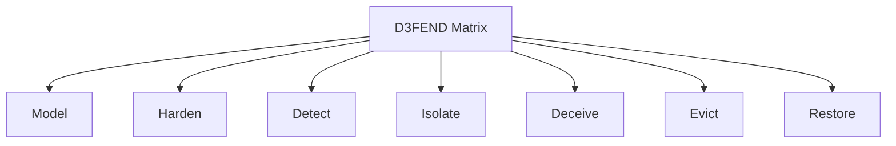

| Tactic | المعنى |
|--------|--------|
| **Model** | فهم وتوثيق البيئة والأصول |
| **Harden** | تقوية الأنظمة وتقليل سطح الهجوم |
| **Detect** | اكتشاف النشاط الخبيث |
| **Isolate** | عزل الأنظمة المخترقة |
| **Deceive** | خداع المهاجمين (Honeypots مثلاً) |
| **Evict** | إزالة المهاجمين من البيئة |
| **Restore** | استعادة الأنظمة لحالتها الطبيعية |

### مثال: Credential Rotation (D3-CRO)

ده مثال على Technique في D3FEND:

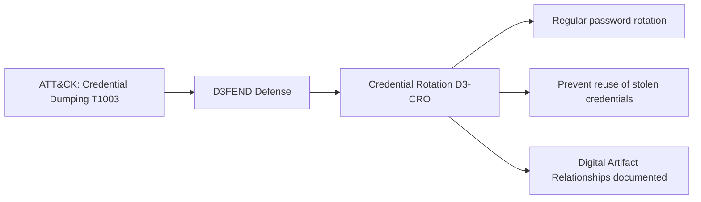

> [!NOTE]
> D3FEND مش بس بيقولك "استخدم هذا الـ Control" — بيشرحلك **كيف يشتغل** هذا الـ Control، وإيه الـ Digital Artifacts المرتبطة بيه، وعلاقته بالـ ATT&CK Techniques. ده بيخلي الـ Defender يشوف الصورة كاملة.

### ATT&CK + D3FEND = الصورة الكاملة

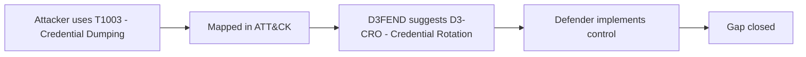

---

## MITRE Additional Tools and Frameworks

### Adversary Emulation Library

مكتبة مجانية من MITRE (بدعم من **CTID - Center for Threat Informed Defense**) فيها **Emulation Plans** جاهزة. كل Plan هي خطوات تفصيلية لمحاكاة هجوم مجموعة APT معروفة.

**الاستخدام:**
- الـ Red Team يتبع الخطوات عشان يحاكي المهاجم
- الـ Blue Team يجرب يكشف الهجمات دي
- بيتوافق مع الـ ATT&CK Techniques في كل خطوة

### Caldera

أداة **محاكاة هجمات تلقائية** مبنية على ATT&CK.

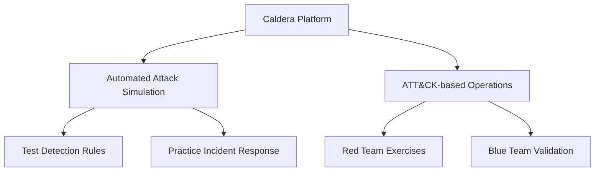

**الـ Caldera بيدعم:**
- تشغيل سيناريوهات هجوم تلقائياً
- اختبار قدرات الكشف بتاعتك
- تدريب الـ Incident Responders في بيئة آمنة

> [!TIP]
> Caldera مفيد جداً لعمل **Purple Team Exercises** — لما الـ Red والـ Blue يشتغلوا مع بعض عشان يحسّنوا الدفاعات.

### الـ Frameworks الجديدة

#### AADAPT
**Adversarial Actions in Digital Asset Payment Technologies**

- يغطي التهديدات على الـ **Blockchain Networks**، الـ **Smart Contracts**، والـ **Digital Wallets**
- يتبع نفس هيكل الـ ATT&CK Framework
- موجّه لقطاع الـ FinTech والعملات الرقمية

#### ATLAS
**Adversarial Threat Landscape for Artificial-Intelligence Systems**

- يوثّق تقنيات الهجوم على أنظمة الـ **AI والـ Machine Learning**
- فيه Matrix خاصة بيه
- بيغطي الـ Real-world Attacks على الـ AI Systems

| Framework | التخصص | الهدف |
|-----------|---------|--------|
| ATT&CK Enterprise | IT Systems | فهم هجمات المهاجمين |
| ATT&CK Mobile | Mobile Devices | هجمات على iOS/Android |
| ATT&CK ICS | Industrial Systems | هجمات على البنية التحتية |
| D3FEND | Defense | التقنيات الدفاعية |
| AADAPT | Digital Assets | هجمات على Blockchain |
| ATLAS | AI/ML Systems | هجمات على الذكاء الاصطناعي |

> [!NOTE]
> AADAPT وATLAS هم من أحدث إضافات MITRE، وجايين يعالجوا تهديدات جديدة ظهرت مع التوسع في الـ AI وعالم العملات الرقمية.

---

## Summary

### أهم ما تعرفته في الـ Section ده:

- **MITRE** منظمة غير ربحية بتنتج Frameworks مجانية للمجتمع الأمني، وأشهر منتجاتها هو **ATT&CK**.

- **ATT&CK** هو موسوعة مبنية على هجمات حقيقية، بتوثّق الـ **Tactics** (الأهداف)، الـ **Techniques** (الطرق)، والـ **Procedures** (التنفيذ) اللي المهاجمين بيستخدموها.

- **TTPs** هي اللغة المشتركة بين كل فرق الأمن — بدل ما كل شركة تسمّي نفس الهجوم بأسماء مختلفة، دلوقتي في **Unique IDs** موحدة.

- **كـ SOC Analyst**، بتستخدم ATT&CK عشان تربط الـ Alerts بالـ Tactics والـ Techniques، تفهم الـ Intent وراء الهجوم، وتحدد أولوية التحقيق.

- **CAR** هو الجسر بين الـ ATT&CK والـ Detection — بيديك **Analytics وQueries جاهزة** للـ SIEM بتاعك.

- **D3FEND** هو نظير ATT&CK للمدافعين — بيوثّق التقنيات الدفاعية وعلاقتها بالـ ATT&CK Techniques.

- **Caldera** أداة محاكاة تلقائية بتساعد الـ Red والـ Blue Teams على اختبار وتحسين الدفاعات.

- **AADAPT وATLAS** هم أحدث Frameworks من MITRE لتغطية التهديدات على الـ Blockchain والـ AI Systems.

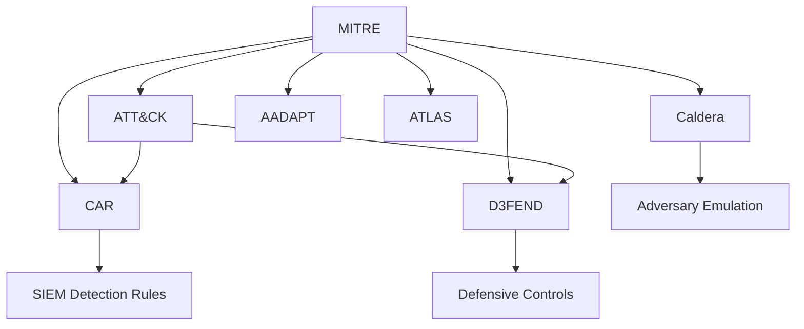
**
