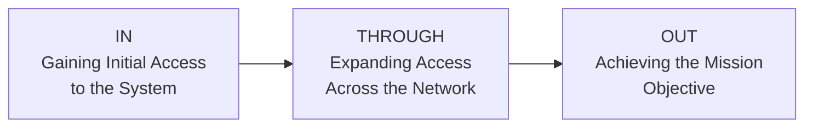
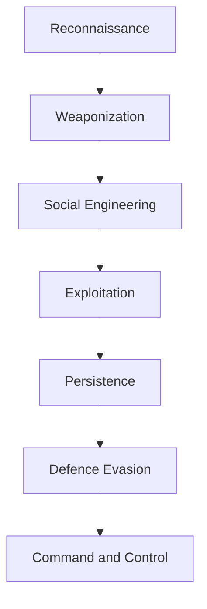
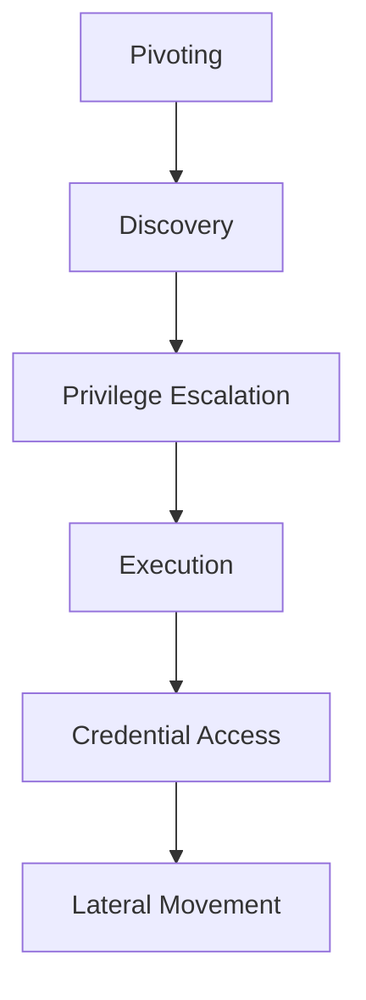
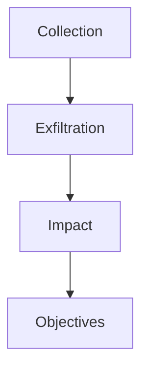
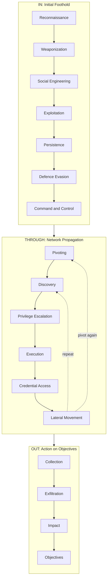

> **الهدف من الـ Section ده:**  
> هتفهم إزاي الـ Attackers بيخططوا وينفذوا الهجمات بتاعتهم من الألف للياء باستخدام الـ Unified Kill Chain (UKC) framework، وإزاي كـ SOC Analyst أو Defender تقدر تربط كل Phase بالـ Detection والـ Response المناسب ليها، عشان توقف الـ Attacker قبل ما يوصل لهدفه النهائي.

## Table of Contents

- [Introduction: Why Frameworks Matter](#introduction-why-frameworks-matter)
- [What is a Kill Chain?](#what-is-a-kill-chain)
- [Threat Modelling](#threat-modelling)
- [What is the Unified Kill Chain (UKC)?](#what-is-the-unified-kill-chain-ukc)
- [UKC vs Other Frameworks](#ukc-vs-other-frameworks)
- [The Three Strategic Goals of UKC](#the-three-strategic-goals-of-ukc)
- [Goal 1: In — Initial Foothold](#goal-1-in--initial-foothold)
  - [Reconnaissance](#1-reconnaissance)
  - [Weaponization](#2-weaponization)
  - [Social Engineering](#3-social-engineering)
  - [Exploitation](#4-exploitation)
  - [Persistence](#5-persistence)
  - [Defence Evasion](#6-defence-evasion)
  - [Command & Control](#7-command--control)
- [Goal 2: Through — Network Propagation](#goal-2-through--network-propagation)
  - [Pivoting](#1-pivoting)
  - [Discovery](#2-discovery)
  - [Privilege Escalation](#3-privilege-escalation)
  - [Execution](#4-execution)
  - [Credential Access](#5-credential-access)
  - [Lateral Movement](#6-lateral-movement)
- [Goal 3: Out — Action on Objectives](#goal-3-out--action-on-objectives)
  - [Collection](#1-collection)
  - [Exfiltration](#2-exfiltration)
  - [Impact](#3-impact)
  - [Objectives](#4-objectives)
- [Full UKC Flow Diagram](#full-ukc-flow-diagram)
- [Defensive Mapping: UKC Phase to Detection Focus](#defensive-mapping-ukc-phase-to-detection-focus)
- [Summary](#summary)

---

## Introduction: Why Frameworks Matter

عشان تقدر تدافع عن أي نظام، لازم الأول تفهم عقلية اللي هيهاجمه. الموضوع مش بس "فيه Hacker هيدخل السيستم"، لأ، فيه خطوات منطقية بيمشي عليها أي مهاجم - سواء كان Script Kiddie أو APT (Advanced Persistent Threat) محترف.

هنا بييجي دور الـ **Frameworks**: هي أدوات بتساعدك تفهم وتنظم الـ Attacker's behaviour, objectives, و methodologies بشكل منهجي. من غير framework، هتكون بتحاول تفهم الهجوم وأنت تايه، لكن الـ framework بيدّيك **structure** تقدر تبني عليه استراتيجية دفاعية حقيقية، وده اللي بيتسمى **Cybersecurity Posture**.

> [!NOTE]
> الـ Cybersecurity Posture هو المصطلح اللي بيوصف القوة الكلية للدفاعات بتاعت أي منظمة - يعني إزاي هي قادرة تمنع، تكتشف، وترد على أي هجوم.

### Learning Objectives لهذا الـ Section

- فهم ليه الـ Frameworks زي الـ UKC مهمة في بناء posture قوي.
- استخدام الـ UKC في فهم motivation, methodologies, و tactics بتاعت أي مهاجم.
- فهم الـ Phases المختلفة في الـ UKC.
- معرفة إن الـ UKC بيكمل (Complement) Frameworks تانية زي MITRE ATT&CK، مش بيتنافس معاهم.

---

## What is a Kill Chain?

مصطلح **"Kill Chain"** أصله عسكري (Military)، وكان بيوصف المراحل المختلفة اللي بيمر بيها أي هجوم عسكري - من تحديد الهدف لحد تدميره.

في عالم الـ Cybersecurity، الـ Kill Chain بقت بتوصف **الـ methodology أو الـ path** اللي بيستخدمه الـ Attackers (Hackers, APTs, إلخ) عشان يقتربوا من الهدف ويخترقوه.

**مثال بسيط:** مهاجم بيعمل Scanning على شبكة، يلاقي Web Vulnerability يستغلها، وبعدين يعمل Privilege Escalation - السلسلة دي كلها بتتسمى **Kill Chain**.

> [!IMPORTANT]
> الهدف الأساسي من فهم الـ Kill Chain مش بس "نعرف إزاي بيحصل الهجوم"، لكن إننا نقدر نحط **Defensive Measures** تقدر إما تمنع الهجوم من الأساس (Pre-emptive Protection) أو توقفه في أي مرحلة من مراحله (Disrupt the Attempt).

---

## Threat Modelling

**Threat Modelling** هي سلسلة خطوات بتتعمل عشان تحسّن أمان النظام عن طريق تحديد الـ Risk. ببساطة، هي إجابة على السؤال: "إيه اللي ممكن يحصل، وليه، وإزاي نمنعه؟"

الخطوات الأساسية للـ Threat Modelling:

1. **Identify Assets**: تحديد إيه هي الأنظمة والتطبيقات اللي محتاجة حماية، وإيه دورها في البيئة (هل هي Critical للعمل؟ هل بتخزن بيانات حساسة زي Payment Info أو Addresses؟).
2. **Assess Vulnerabilities**: تقييم نقاط الضعف اللي ممكن تكون موجودة في الأنظمة دي وإزاي ممكن تتستغل.
3. **Create an Action Plan**: عمل خطة لتأمين الأنظمة دي من الـ Vulnerabilities اللي اتكشفت.
4. **Implement Policies**: حط سياسات تمنع تكرار المشكلة دي تاني (مثلاً، تطبيق SDLC - Software Development Life Cycle - أو تدريب الموظفين على الـ Phishing Awareness).

> [!TIP]
> الـ Threat Modelling مش خطوة تتعمل مرة واحدة وخلاص - هي عملية مستمرة (Continuous Process) لازم تتعاد كل ما يتغير شيء في البيئة (نظام جديد، تحديث، إلخ).

الـ UKC بيشجّع على الـ Threat Modelling لأنه بيساعدك تحدد الـ **Attack Surfaces** المحتملة وإزاي ممكن الأنظمة دي تتستغل.

> [!NOTE]
> فيه Frameworks تانية مخصصة للـ Threat Modelling زي **STRIDE**, **DREAD**, و **CVSS**. لو حابب تتعمق فيهم، روم "Principles of Security" على TryHackMe بيتكلم عنهم بالتفصيل.

---

## What is the Unified Kill Chain (UKC)?

الـ **Unified Kill Chain** اتعمل بواسطة **Paul Pols** سنة 2017، والهدف منه إنه **يكمل** (Complement) - مش ينافس - الـ Frameworks التانية زي:

- Lockheed Martin's Cyber Kill Chain
- MITRE's ATT&CK Framework

الـ UKC بيقول إن أي هجوم بيمر بـ **18 Phase** مختلفة، من أول الـ Reconnaissance لحد الـ Data Exfiltration وفهم الـ Motivation بتاعت المهاجم. علشان الموضوع يكون أسهل في الفهم، الـ Phases دي بتتقسم لـ **3 Strategic Goals** رئيسية هنشرحها بالتفصيل تحت.

---

## UKC vs Other Frameworks

| Benefits of the UKC | How Other Frameworks Compare |
|---|---|
| **Modern** - اتعمل سنة 2017 واتحدّث 2022 | فريمووركس زي MITRE ATT&CK اتعملت سنة 2013، وقتها المشهد السيبراني كان مختلف تمامًا |
| **مفصّل جدًا** - 18 Phase | فريمووركس تانية بتكون عندها عدد قليل من الـ Phases بس |
| بيغطي الهجوم بالكامل - من Reconnaissance لحد Exploitation و Post-Exploitation، وكمان بيحدد motivation المهاجم | فريمووركس تانية بتغطي عدد محدود من الـ Phases بس |
| بيعكس سيناريو هجوم **واقعي أكتر** - المهاجم بيرجع يكرر مراحل معينة (مثلاً بعد الـ Exploitation بيرجع يعمل Reconnaissance تاني عشان يعمل Pivot لنظام تاني) | فريمووركس تانية مش بتراعي إن المهاجم بيتنقل (Back and Forth) بين المراحل أثناء الهجوم |

> [!IMPORTANT]
> الميزة الأهم في الـ UKC إنه بيعترف إن الهجوم الحقيقي **مش خطي (Linear)** - يعني مش بالضرورة المهاجم يمشي من Phase 1 لحد Phase 18 بالترتيب. ممكن يرجع ويكرر مراحل زي الـ Reconnaissance والـ Discovery أكتر من مرة في نفس الهجوم وهو بيتنقل جوه الشبكة.

---

## The Three Strategic Goals of UKC

الـ 18 Phase بتتقسم لـ 3 مجموعات رئيسية، كل مجموعة بتمثل **هدف استراتيجي** للمهاجم:

| Goal | الوصف بالعربي |
|---|---|
| **In** | المهاجم بيحاول يدخل النظام لأول مرة، يكتشف الـ Vulnerabilities، ويثبت وجوده (Foothold) جوه النظام |
| **Through** | المهاجم بيستخدم الفوتهولد ده عشان يتنقل جوه الشبكة (Pivoting)، يكتشف أنظمة تانية، ويرفع صلاحياته |
| **Out** | المهاجم وصل لهدفه النهائي - سواء سرقة بيانات، تخريب، أو ابتزاز مادي |

---

## Goal 1: In — Initial Foothold

الهدف الرئيسي من المجموعة دي هو إن المهاجم **يوصل لأي نقطة دخول** (Access) في النظام أو الشبكة المستهدفة. المهاجم بيستخدم تكتيكات كتير عشان يفحص النظام بحثًا عن نقاط ضعف ممكن يستغلها عشان يثبّت قدمه (Foothold) جواه.

### 1. Reconnaissance

> **MITRE Tactic:** TA0043

دي أول مرحلة، وبتوصف التقنيات اللي المهاجم بيستخدمها عشان **يجمع معلومات** عن الهدف، سواء بطريقة:

- **Passive Reconnaissance**: جمع معلومات من غير أي تفاعل مباشر مع الهدف (زي البحث في OSINT - Open Source Intelligence).
- **Active Reconnaissance**: تفاعل مباشر مع الهدف (زي الـ Port Scanning).

المعلومات اللي بتتجمع في المرحلة دي بتتستخدم في كل المراحل اللي بعدها، خصوصًا مرحلة الـ Initial Foothold. بتشمل:

- اكتشاف الـ Systems والـ Services الشغالة على الهدف (مفيد جدًا في الـ Weaponization والـ Exploitation).
- لقاء Contact Lists أو قوائم موظفين ممكن تتستخدم في Social Engineering أو Phishing.
- البحث عن Credentials محتملة ممكن تتستخدم لاحقًا في الـ Pivoting أو الـ Initial Access.
- فهم الـ Network Topology والأنظمة المرتبطة اللي ممكن يتم الـ Pivot ليها.

> [!TIP]
> من منظور SOC Analyst، الـ Reconnaissance غالبًا بتكون صعبة الـ Detection خصوصًا لو كانت Passive (زي البحث في LinkedIn أو WHOIS records)، لكن الـ Active Recon (زي الـ Port Scans) ممكن تتكشف عن طريق IDS/IPS أو NetFlow Analysis.

### 2. Weaponization

> **MITRE Tactic:** TA0001

في المرحلة دي، المهاجم بيجهّز **البنية التحتية** (Infrastructure) اللازمة لتنفيذ الهجوم. مثال:

- عمل **Command and Control (C2) Server**.
- تجهيز نظام قادر يستقبل **Reverse Shells**.
- تجهيز الـ Payloads اللي هتتبعت للهدف.

> [!NOTE]
> الـ Weaponization مش بتحصل على جهاز الضحية - دي مرحلة "تحضير" بتحصل على بنية المهاجم نفسها قبل ما يبدأ يتفاعل مع الهدف.

### 3. Social Engineering

> **MITRE Tactic:** TA0001

دي التقنيات اللي بيستخدمها المهاجم عشان **يتلاعب بالموظفين** (Manipulate Employees) عشان يعملوا أفعال تساعده في هجومه. أمثلة:

- خلي اليوزر يفتح **Malicious Attachment** في إيميل Phishing.
- عمل **Impersonation** لصفحة ويب حقيقية عشان يسرق الـ Credentials.
- الاتصال أو الزيارة الشخصية والتظاهر بإنه شخص تاني (زي طلب Password Reset، أو التظاهر بإنه فني صيانة عشان يدخل أماكن معينة فيزيائيًا).

> [!WARNING]
> الـ Social Engineering من أخطر التكتيكات لأنها بتستهدف **العنصر البشري** مش التكنولوجيا - يعني حتى لو عندك أقوى Firewall في الدنيا، موظف واحد يفتح مرفق غلط ممكن يكسر كل الدفاعات دي.

### 4. Exploitation

> **MITRE Tactic:** TA0002

دي المرحلة اللي المهاجم بيستغل فيها الـ **Weaknesses أو Vulnerabilities** الموجودة في النظام. الـ UKC بيعرّف الـ Exploitation بإنها استغلال الثغرات عشان **ينفّذ كود (Code Execution)**. أمثلة:

- رفع وتشغيل **Reverse Shell** على Web Application.
- التدخل في **Automated Script** على النظام عشان ينفذ كود.
- استغلال ثغرة في تطبيق ويب عشان ينفذ كود على السيرفر اللي شغال عليه.

### 5. Persistence

> **MITRE Tactic:** TA0003

المرحلة دي بسيطة ومباشرة - بتوصف التقنيات اللي المهاجم بيستخدمها عشان **يحافظ على وصوله** للنظام بعد ما يكون أخد فوتهولد فيه. أمثلة:

- عمل **Service** جديدة على النظام المستهدف تسمحله يرجع يدخل تاني.
- إضافة النظام لـ **Command & Control Server** عشان ينفّذ أوامر عن بُعد في أي وقت.
- ترك **Backdoors** بتشتغل لما يحصل حدث معيّن (زي Reverse Shell بيشتغل لما الـ Admin يعمل Login).

> [!IMPORTANT]
> الـ Persistence هي السبب الرئيسي إن المهاجمين بيقدروا يفضلوا "كامنين" جوه الشبكة لفترات طويلة (أحيانًا شهور) من غير ما حد يكتشفهم - وده اللي بيتسمى **Dwell Time**.

### 6. Defence Evasion

> **MITRE Tactic:** TA0005

دي من أهم وأقيم المراحل في الـ UKC. بتوصف التقنيات اللي المهاجم بيستخدمها عشان **يتفادى الأنظمة الدفاعية** الموجودة، زي:

- Web Application Firewalls (WAF).
- Network Firewalls.
- Anti-virus Systems.
- Intrusion Detection Systems (IDS).

> [!TIP]
> من منظور Defensive، المرحلة دي قيّمة جدًا وقت تحليل أي هجوم (Incident Response) لأنها بتديك معلومات تساعدك تحسّن الأنظمة الدفاعية بتاعتك في المستقبل - يعني لو عرفت إزاي المهاجم تخطى الـ AV، تقدر تعمل Tuning لقواعد الـ Detection بتاعتك.

### 7. Command & Control

> **MITRE Tactic:** TA0011

المرحلة دي بتجمع بين كل المجهود اللي اتعمل في مرحلة الـ Weaponization عشان يتم **تأسيس قناة اتصال** (Communication) بين المهاجم والنظام المستهدف. لما المهاجم يحصّل C2 على النظام، يقدر:

- ينفّذ أوامر (Execute Commands).
- يسرق بيانات، Credentials، ومعلومات تانية.
- يستخدم السيرفر المتحكم فيه عشان يعمل **Pivot** لأنظمة تانية على الشبكة.

> [!WARNING]
> الـ C2 Traffic هو واحد من أهم المؤشرات اللي SOC Analyst بيدور عليها - عن طريق تحليل DNS Requests الغريبة، Beaconing Patterns (اتصالات منتظمة بفترات زمنية ثابتة)، أو Traffic لـ IPs/Domains مشبوهة.

---

## Goal 2: Through — Network Propagation

بعد ما المهاجم يحصّل **Foothold ناجح** على الشبكة، لو الدفاعات منعته من تحقيق هدفه على طول، هيحاول يوسّع صلاحياته ووصوله. المهاجم بيستخدم النظام اللي دخله كـ **Pivot Point** عشان يجمع معلومات عن الشبكة الداخلية.

### 1. Pivoting

> **MITRE Tactic:** TA0008

الـ **Pivoting** هي التقنية اللي المهاجم بيستخدمها عشان يوصل لأنظمة تانية جوه الشبكة مش متاحة بشكل مباشر (مش معرّضة للإنترنت مثلاً). كتير من الأنظمة جوه أي شبكة مش متاحة مباشرة، وغالبًا بتحتوي على بيانات قيّمة أو يكون الأمان فيها أضعف.

**مثال:** المهاجم يحصّل وصول لـ Web Server متاح على الإنترنت، ويستخدمه عشان يهاجم أنظمة تانية على نفس الشبكة الداخلية (مش متاحة من برّه).

بمجرد ما المهاجم ياخد فوتهولد، بيستخدم النظام ده كـ:

- **Staging Site**: نقطة انطلاق.
- **Tunnel**: قناة بين عمليات التحكم بتاعته (C2 Operations) وشبكة الضحية.
- **Distribution Point**: نقطة توزيع لكل الـ Malware والـ Backdoors في المراحل اللي بعدها.

### 2. Discovery

> **MITRE Tactic:** TA0007

المهاجم بيبدأ يكتشف معلومات عن النظام والشبكة المتصل بيها. الـ Knowledge Base اللي بيبنيها بتشمل:

- الـ User Accounts النشطة.
- الصلاحيات (Permissions) الممنوحة.
- التطبيقات والبرامج المستخدمة.
- نشاط الـ Web Browser.
- الـ Files, Directories, و Network Shares.
- إعدادات النظام (System Configurations).

### 3. Privilege Escalation

> **MITRE Tactic:** TA0004

بعد ما يجمع المعلومات، المهاجم بيحاول يحصّل صلاحيات أعلى جوه النظام اللي عمله Pivot عليه. بيستغل معلومات عن الحسابات، الثغرات، وسوء الإعدادات (Misconfigurations) عشان يوصل لمستويات أعلى زي:

| المستوى | الوصف |
|---|---|
| **SYSTEM / ROOT** | أعلى صلاحية ممكنة على النظام |
| **Local Administrator** | صلاحية إدارية محلية |
| **User with Admin-like access** | يوزر عادي بس بصلاحيات قريبة من الأدمن |
| **User with specific access/functions** | يوزر بصلاحيات محددة لمهام معينة |

> [!IMPORTANT]
> الـ Privilege Escalation دايمًا مرتبطة بـ Misconfigurations أو Unpatched Vulnerabilities - فحص الـ Patching بانتظام و الـ Least Privilege Principle من أهم الطرق لتقليل المخاطرة هنا.

### 4. Execution

> **MITRE Tactic:** TA0002

دي المرحلة اللي المهاجم فيها بينشر الكود الخبيث (Malicious Code) مستخدمًا نظام الـ Pivot كـ Host. بيتم نشر وعمل:

- Remote Trojans.
- C2 Scripts.
- Malicious Links.
- Scheduled Tasks.

كل دي بتتعمل عشان تسهّل **وجود متكرر (Recurring Presence)** على النظام وتحافظ على الـ Persistence.

### 5. Credential Access

> **MITRE Tactic:** TA0006

شغالة بشكل متكامل مع مرحلة الـ Privilege Escalation. المهاجم بيحاول يسرق أسماء الحسابات (Account Names) والـ Passwords بطرق مختلفة، زي:

- **Keylogging**.
- **Credential Dumping**.

> [!WARNING]
> استخدام Credentials شرعية (Legitimate Credentials) بيخلي المهاجم أصعب في الاكتشاف، لأنه بيبقى "يتصرف" زي يوزر عادي - وده بيخلي الـ Behavioral Analytics و UEBA (User and Entity Behavior Analytics) مهمين جدًا في الكشف عن الأنشطة الغريبة حتى لو الـ Credentials سليمة.

### 6. Lateral Movement

> **MITRE Tactic:** TA0008

بالـ Credentials والصلاحيات اللي اتجمعت، المهاجم بيبدأ **يتنقل جوه الشبكة** ويقفز لأنظمة تانية مستهدفة عشان يحقق هدفه الأساسي. وكل ما كانت التقنية أكتر "هدوء" (Stealthier)، كل ما كان أصعب اكتشافها.

---

## Goal 3: Out — Action on Objectives

دي آخر مرحلة في رحلة المهاجم - وصل لوصول كامل على الأصول الحرجة (Critical Assets) وقادر يحقق أهداف هجومه. الأهداف دي بتكون موجّهة عادةً نحو خرق واحد أو أكتر من عناصر الـ **CIA Triad** (Confidentiality, Integrity, Availability).

### 1. Collection

> **MITRE Tactic:** TA0009

بعد كل المجهود في الوصول للأصول، المهاجم بيدور على **كل البيانات القيّمة** اللي يقدر يجمعها. ده بيخرق الـ **Confidentiality** بتاعت البيانات، وبيمهّد للمرحلة اللي بعدها - الـ Exfiltration. أهم مصادر الاستهداف:

- Drives.
- Browsers.
- Audio.
- Video.
- Email.

### 2. Exfiltration

> **MITRE Tactic:** TA0010

عشان يصعّد من حجم الاختراق، المهاجم بيسرق البيانات اللي جمعها، وبيغلّفها (Package) باستخدام **Encryption** و **Compression** عشان يتفادى الاكتشاف. القناة (C2 Channel) والـ Tunnel اللي اتعملوا في المراحل الأولى بيبقوا مفيدين جدًا هنا.

> [!TIP]
> من منظور Detection، البحث عن **Large Outbound Data Transfers** غير الطبيعية، أو نقل بيانات مضغوطة/مشفرة لجهات خارجية غريبة، من أهم الطرق لرصد الـ Exfiltration. أدوات DLP (Data Loss Prevention) بتلعب دور كبير هنا.

### 3. Impact

> **MITRE Tactic:** TA0040

لو المهاجم هدفه خرق الـ **Integrity** و **Availability**، بيبدأ يتلاعب (Manipulate)، يقاطع (Interrupt)، أو يدمّر (Destroy) الأصول دي. الهدف هو تعطيل العمليات التشغيلية والبيزنس، وممكن يشمل:

- إزالة وصول الحسابات (Removing Account Access).
- مسح الأقراص (Disk Wipes).
- تشفير بيانات زي هجمات **Ransomware**.
- **Defacement** (تشويه المواقع).
- هجمات **Denial of Service (DoS)**.

### 4. Objectives

دي آخر خطوة - المهاجم معاه كل القوة والوصول اللازم عشان يحقق **هدفه الاستراتيجي** الكلي من الهجوم. أمثلة:

- لو الهجوم **Financially Motivated**: ممكن يشفّر الملفات والأنظمة بـ Ransomware ويطلب فدية.
- لو الهدف **تخريب السمعة (Reputation Damage)**: ممكن يسرّب معلومات سرية وخاصة للعامة.

---

## Full UKC Flow Diagram

الشكل الكامل بيوضح إزاي كل المراحل بتترابط مع بعض، وإزاي ممكن المهاجم **يرجع** لمراحل سابقة (زي الـ Reconnaissance أو الـ Discovery) أثناء الانتقال جوه الشبكة:

> [!NOTE]
> الأسهم المتقطعة (Dashed Lines) في الدايجرام بتمثل إزاي المهاجم بيرجع يكرر مراحل زي الـ Discovery أو الـ Pivoting أثناء تحركه جوه الشبكة - وده بالظبط الفرق الجوهري بين الـ UKC والفريمووركس التقليدية اللي بتفترض إن الهجوم خطي وبس.

---

## Defensive Mapping: UKC Phase to Detection Focus

كـ SOC Analyst، الجدول ده بيديك نظرة سريعة على إيه اللي تركّز عليه في كل Phase:

| UKC Phase | MITRE Tactic | إيه اللي تدوّر عليه كـ Defender |
|---|---|---|
| Reconnaissance | TA0043 | غرائب في DNS lookups، Port Scans، نشاط OSINT غير طبيعي |
| Weaponization | TA0001 | مفيش Telemetry مباشرة (بتحصل خارج بيئتك) - ركّز على Threat Intel |
| Social Engineering | TA0001 | تقارير الـ Phishing من اليوزرز، Email Gateway Logs |
| Exploitation | TA0002 | EDR Alerts، Unusual Process Creation، Web Server Logs |
| Persistence | TA0003 | New Services، Scheduled Tasks، Registry Run Keys |
| Defence Evasion | TA0005 | AV/EDR Tampering Logs، Log Clearing Events |
| Command & Control | TA0011 | Beaconing Patterns، DNS Tunneling، Anomalous Outbound Traffic |
| Pivoting | TA0008 | Internal Traffic بين Segments مش متوقعة |
| Discovery | TA0007 | استخدام أدوات زي `whoami`, `net user`, `ipconfig` بشكل متكرر |
| Privilege Escalation | TA0004 | Token Manipulation، استغلال Misconfigurations معروفة |
| Execution | TA0002 | تشغيل Binaries غريبة، PowerShell Logging |
| Credential Access | TA0006 | LSASS Access، Mimikatz-like Behavior |
| Lateral Movement | TA0008 | استخدام غير طبيعي لـ RDP, WMI, PsExec |
| Collection | TA0009 | الوصول الجماعي لملفات حساسة في وقت قصير |
| Exfiltration | TA0010 | DLP Alerts، Large Outbound Transfers |
| Impact | TA0040 | File Encryption Events، Mass Deletion، Service Disruption |

> [!IMPORTANT]
> الجدول ده مش بديل عن الـ MITRE ATT&CK Navigator - هو نقطة بداية تساعدك تربط كل Phase في الـ UKC بمصادر الـ Logs والـ Detection اللي محتاج تراجعها كـ Analyst.

---

## Summary

- الـ **Kill Chain** مصطلح عسكري الأصل، بيوصف في الـ Cybersecurity سلسلة الخطوات اللي المهاجم بيمشي بيها من بداية الهجوم لحد تحقيق هدفه.
- الـ **Threat Modelling** هي عملية تحديد الأصول، تقييم الثغرات، وعمل خطة لتأمينها - والـ UKC بيشجّع عليها بشكل مباشر.
- الـ **Unified Kill Chain (UKC)** عملها Paul Pols سنة 2017، وهي framework مكوّنة من **18 Phase** بتكمل (مش تنافس) فريمووركس زي Lockheed Martin's Kill Chain و MITRE ATT&CK.
- أكبر ميزة في الـ UKC إنها بتمثل الهجوم بشكل **واقعي وغير خطي** - المهاجم بيرجع يكرر مراحل زي Reconnaissance و Discovery أثناء تحركه جوه الشبكة.
- الـ 18 Phase بتتقسم لـ **3 Strategic Goals**:
  - **In**: تأمين Foothold أولي (Reconnaissance → Weaponization → Social Engineering → Exploitation → Persistence → Defence Evasion → Command & Control).
  - **Through**: التوسع جوه الشبكة (Pivoting → Discovery → Privilege Escalation → Execution → Credential Access → Lateral Movement).
  - **Out**: تحقيق الهدف النهائي (Collection → Exfiltration → Impact → Objectives).
- كل Phase ليها **MITRE ATT&CK Tactic** مرتبطة بيها، وده اللي بيخلي الـ UKC والـ MITRE ATT&CK يكملوا بعض بدل ما يكونوا بديلين.
- كـ SOC Analyst، فهمك للـ UKC بيخليك تقدر تحدد **في أنهي مرحلة المهاجم موجود** وقت أي Incident، وده بيساعدك تتوقع خطوته الجاية وتاخد إجراء دفاعي مناسب قبل ما يوصل لمرحلة الـ Impact أو الـ Exfiltration.
