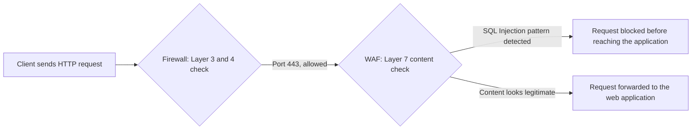
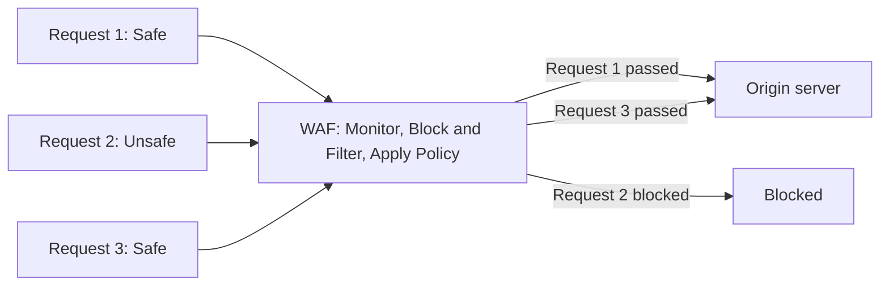
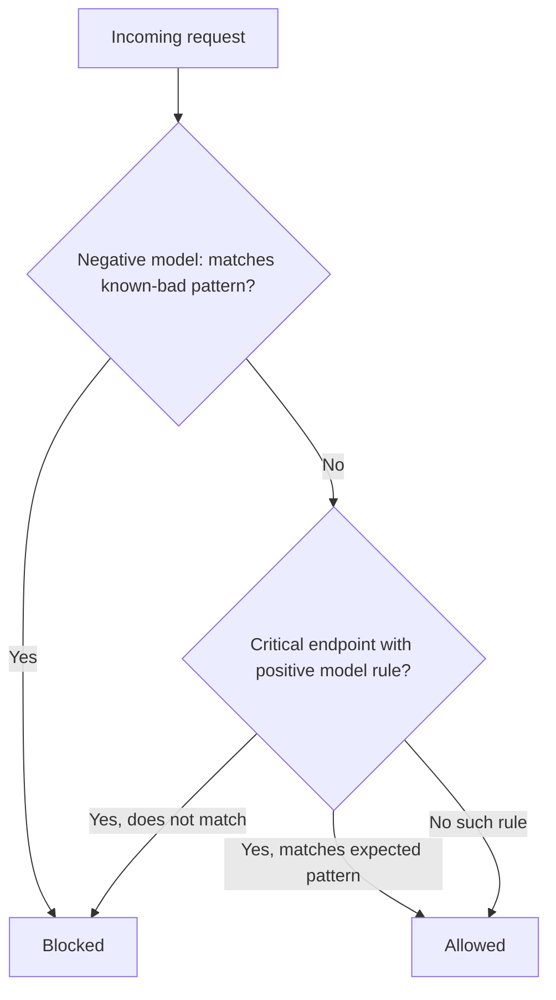

| Topic | Level | Reading Time | Prerequisites |
|---|---|---|---|
| WAF (Web Application Firewall) | Intermediate | ~15 min | Defense in Depth Model, basic idea of HTTP requests |

> **الهدف من الـ Section ده:**  
> هتفهم إيه هو الـ WAF بالظبط، إزاي بيقرر يمنع طلب معين، وإيه حدوده اللي محدش يقدر يتخطاها.


## Learning Objectives

By the end of this section, you will be able to:

- Explain why a **WAF** exists as a separate control from a traditional firewall, in terms of OSI layers.
- List the three deployment modes of a WAF and explain why cloud-based WAFs became the most common.
- Differentiate between the **negative security model** and the **positive security model** used in WAF detection.
- List concrete attack types a WAF can block, and explain the concept of **virtual patching**.
- Identify what a WAF cannot do, and why those gaps require other Defense in Depth layers.

## Table of Contents

- [Learning Objectives](#learning-objectives)
- [Why a WAF Exists](#why-a-waf-exists)
  - [The Layer Gap a Firewall Leaves Open](#the-layer-gap-a-firewall-leaves-open)
  - [A Concrete Example](#a-concrete-example)
- [What a WAF Is and How It Is Deployed](#what-a-waf-is-and-how-it-is-deployed)
  - [Definition](#definition)
  - [Deployment Modes](#deployment-modes)
  - [How a WAF Sits in the Traffic Path](#how-a-waf-sits-in-the-traffic-path)
- [How a WAF Decides What to Block](#how-a-waf-decides-what-to-block)
  - [Negative Security Model](#negative-security-model)
  - [Positive Security Model](#positive-security-model)
  - [The Hybrid Approach in Practice](#the-hybrid-approach-in-practice)
- [What a WAF Can and Cannot Do](#what-a-waf-can-and-cannot-do)
  - [What It Can Block](#what-it-can-block)
  - [What It Cannot Fix](#what-it-cannot-fix)
  - [What It Cannot See](#what-it-cannot-see)
  - [What It Cannot Stop](#what-it-cannot-stop)
- [A Basic WAF Rule Example](#a-basic-waf-rule-example)
- [Career Path Connections](#career-path-connections)
- [Key Terms Glossary](#key-terms-glossary)
- [Summary](#summary)

## Why a WAF Exists

### The Layer Gap a Firewall Leaves Open

الشبكات منظمة في طبقات (**OSI model**)، والـ firewalls التقليدية بتشتغل على **Layer 3** (عنونة الـ IP) و **Layer 4** (الـ ports وسلوك TCP/UDP). عند الطبقتين دول، الـ firewall يقدر يشوف بس حاجات زي: "حد بيحاول يتصل بـ port 443 من الـ IP ده". **مالوش أي رؤية لجوة الاتصال نفسه** بمجرد ما بيتسمح بيه.

الـ **WAF** بيشتغل على **Layer 7** (طبقة الـ application)، يعني بيقدر **يقرا المحتوى الفعلي** لطلب الـ HTTP: الـ URL، الـ parameters، الـ headers، الـ cookies، والـ request body.

### A Concrete Example

| Control | What It Sees | Verdict |
|---|---|---|
| Firewall | `TCP 443 is ALLOWED` — مجرد اتصال ويب يبدو شرعي، فبيسمح بيه | Passes |
| WAF | `GET /login.php?user=admin' OR '1'='1` — ده محاولة **SQL Injection** بتحاول تتلاعب في استعلام قاعدة البيانات لتخطي الـ login | Blocked |



> [!IMPORTANT]
> The firewall's decision and the WAF's decision happen at two completely different layers. A connection can be perfectly valid at Layer 3-4 and still be a full attack at Layer 7. This is why the WAF is a genuinely independent layer, not a duplicate of the firewall.

## What a WAF Is and How It Is Deployed

### Definition

الـ **WAF** هو control أمني بيتحط قدام الـ web applications، وبيفحص الـ HTTP و HTTPS traffic **تحديداً**، وبيبص على محتوى Layer 7 مش metadata طبقة الشبكة بس.

### Deployment Modes

الـ WAF ممكن ينشر بثلاث طرق:

| Deployment Mode | Description |
|---|---|
| Network appliance | جهاز فيزيائي أو virtual بيتحط قدام الـ data center |
| Host-based | module بيشتغل مباشرة على الـ web server نفسه |
| Cloud-based (reverse proxy) | خدمة cloud بيتوجه ليها الـ traffic قبل ما توصل للـ servers بتاعتك |

الـ **cloud-based WAFs** بقت الأكتر استخداماً في البيئات الحديثة، للأسباب دي:

- سهلة النشر من غير ما تلمس بنية الـ application التحتية أصلاً.
- بتاخد تحديثات مستمرة لـ threat signatures من المزود من غير أي مجهود من طرف العميل.

### How a WAF Sits in the Traffic Path



الرسمة بتوضح إن الـ WAF بيقف زي بوابة بين الـ clients والـ origin server: بيراقب، بيفلتر، وبيطبق policy، وبيبعت للـ server بس الطلبات اللي عدت الفحص.

## How a WAF Decides What to Block

فيه نموذجين أساسيين للـ detection في الـ WAFs، مهم تفرق بينهم بوضوح.

### Negative Security Model

الـ **negative security model (blocklisting)**: الـ WAF عنده قائمة بأنماط معروفة إنها **سيئة** (زي signatures بتاعة SQL Injection أو XSS patterns)، وبيمنع أي طلب بيتطابق معاها.

- **الميزة:** سهل النشر.
- **العيب:** ممكن يفوّت أنماط هجوم **جديدة تماماً** مش موجودة في القائمة لسه.

### Positive Security Model

الـ **positive security model (allowlisting)**: الـ WAF بيسمح بس بالطلبات اللي بتتطابق مع نمط **معروف وجيد ومحدد بدقة** لتطبيق معين (الـ parameters المتوقعة، أشكال القيم المتوقعة، الأطوال المتوقعة)، ويمنع أي حاجة تانية **افتراضياً**.

- **الميزة:** أقوى بكتير.
- **العيب:** محتاج مجهود أكبر عشان يتضبط صح لكل تطبيق على حدة.

### The Hybrid Approach in Practice

معظم الـ WAFs الحقيقية بتستخدم **مزيج من الاتنين**: blocklists للـ signatures المعروفة، بالإضافة لبعض قواعد الـ allowlist-style على الـ endpoints الحرجة والمفهومة كويس، زي صفحات الـ login.



> [!TIP]
> When designing WAF policy for a critical endpoint like a login page or a payment form, invest the extra effort in a positive security rule. The cost of configuration is worth it for the endpoints attackers target most.

## What a WAF Can and Cannot Do

### What It Can Block

الـ WAF يقدر يمنع أنواع هجوم متنوعة:

- **SQL Injection**
- **Cross-Site Scripting (XSS)**
- **Local and Remote File Inclusion**
- بعض أشكال الـ **Cross-Site Request Forgery**
- الـ **basic bot traffic**
- كمان يقدر يفرض **rate limiting** لإبطاء محاولات الـ **brute-force login**

### What It Cannot Fix

الـ WAF **مبيصلحش** ثغرة موجودة فعلياً في كود الـ application نفسه. هو **mitigating control**، مش إصلاح دائم، وبيتسمى أحياناً **virtual patching**، لأنه بيشتري وقت لحد ما الكود الفعلي يتصلح.

> [!IMPORTANT]
> A WAF blocking an SQL Injection attempt does not mean the underlying vulnerability in the application code is gone. It means the exploit path is temporarily closed at the edge, while the real fix still needs to happen in the code.

### What It Cannot See

الـ WAF **مبيشوفش** الـ traffic المشفر إلا لو اتحط في مكان يقدر فيه **يفك ويعيد تشفير** الاتصال (decrypt and re-encrypt). ده سبب إن الـ WAFs عادةً بتتحط في مكان يقدر ينهي أو يفحص الـ **TLS**.

### What It Cannot Stop

الـ WAF **مبيوقفش** الهجمات اللي مبتعديش من الـ HTTP أصلاً، زي الهجمات على الـ underlying server OS أو طبقة الشبكة. ده شغل الطبقات التانية في الـ Defense in Depth model.

| Attack Category | Does the WAF Cover It? |
|---|---|
| SQL Injection through a web form | Yes |
| Cross-Site Scripting | Yes |
| Brute-force login attempts | Yes, via rate limiting |
| Vulnerability in the application's own code | No, only mitigates the exploit path |
| Attack against the server's operating system | No, this is the Host layer's job |
| Attack against the network itself | No, this is the Perimeter or Network layer's job |

## A Basic WAF Rule Example

مثال توضيحي لقاعدة **ModSecurity** (أحد أشهر محركات WAF مفتوحة المصدر) بتمنع نمط SQL Injection بسيط في الـ query string:

```text
SecRule ARGS "@rx (?i)(\bunion\b.*\bselect\b|\bor\b\s+1=1)" \
    "id:1001,phase:2,deny,status:403,msg:'Possible SQL Injection detected'"
```

القاعدة دي بتفحص الـ arguments (`ARGS`) بحثاً عن أنماط شائعة في SQLi (زي `UNION SELECT` أو `OR 1=1`)، ولو لقت تطابق، بترفض الطلب بـ HTTP 403.

> [!WARNING]
> This is a simplified illustrative example for learning purposes, not a production-ready rule. Real WAF rule sets are far more comprehensive and are usually maintained by a dedicated rule set project, such as the OWASP Core Rule Set, rather than written from scratch.

## Career Path Connections

| Career Path | How This Topic Applies |
|---|---|
| SOC Analyst | Reviews WAF logs and alerts to confirm whether a blocked request was a genuine attack or a false positive |
| Penetration Tester | Tests whether WAF rules can be bypassed through encoding tricks or unusual request structures |
| GRC | WAF deployment is often a compliance requirement, for example under PCI DSS for organizations handling payment card data |
| Cloud Security | Configures and tunes cloud-based WAF services such as those offered by major cloud providers |

## Key Terms Glossary

| Term | Definition |
|---|---|
| WAF | Web Application Firewall, inspects Layer 7 HTTP and HTTPS content for application-layer attacks |
| Layer 7 | The application layer of the OSI model, where HTTP content lives |
| Reverse Proxy | A server that sits in front of backend servers and forwards client requests to them |
| Negative Security Model | A WAF detection approach that blocks requests matching known-bad patterns |
| Positive Security Model | A WAF detection approach that only allows requests matching a known-good pattern |
| Virtual Patching | Using a WAF rule to mitigate a known vulnerability without changing the application code |
| TLS Termination | The point where encrypted traffic is decrypted so its content can be inspected |
| Rate Limiting | Restricting how many requests a client can make in a given time period |
| SQL Injection | An attack that manipulates a database query through unvalidated input |
| Cross-Site Scripting (XSS) | An attack that injects malicious scripts into content viewed by other users |

## Summary

- **A WAF fills the gap a firewall leaves open:** الـ firewall شايف الـ IP والـ port بس، والـ WAF شايف محتوى الـ HTTP بالكامل.
- **Three deployment modes:** network appliance، host-based، أو cloud-based، والأخيرة هي الأكتر انتشاراً حالياً.
- **Two detection models:** negative (blocklisting) بيمنع المعروف السيء، وpositive (allowlisting) بيسمح بالمعروف الجيد بس، ومعظم الـ WAFs بتستخدم مزيج من الاتنين.
- **A WAF blocks real attack categories:** SQL Injection، XSS، File Inclusion، بعض أشكال CSRF، وbrute-force عبر rate limiting.
- **A WAF is a mitigation, not a fix:** الـ virtual patching بيشتري وقت، لكن الثغرة الحقيقية في الكود لازم تتصلح.
- **A WAF has real limits:** مبيشوفش traffic مشفر من غير TLS termination، ومبيوقفش هجمات مش عن طريق HTTP، ودي مسؤولية طبقات تانية في الـ Defense in Depth model.

