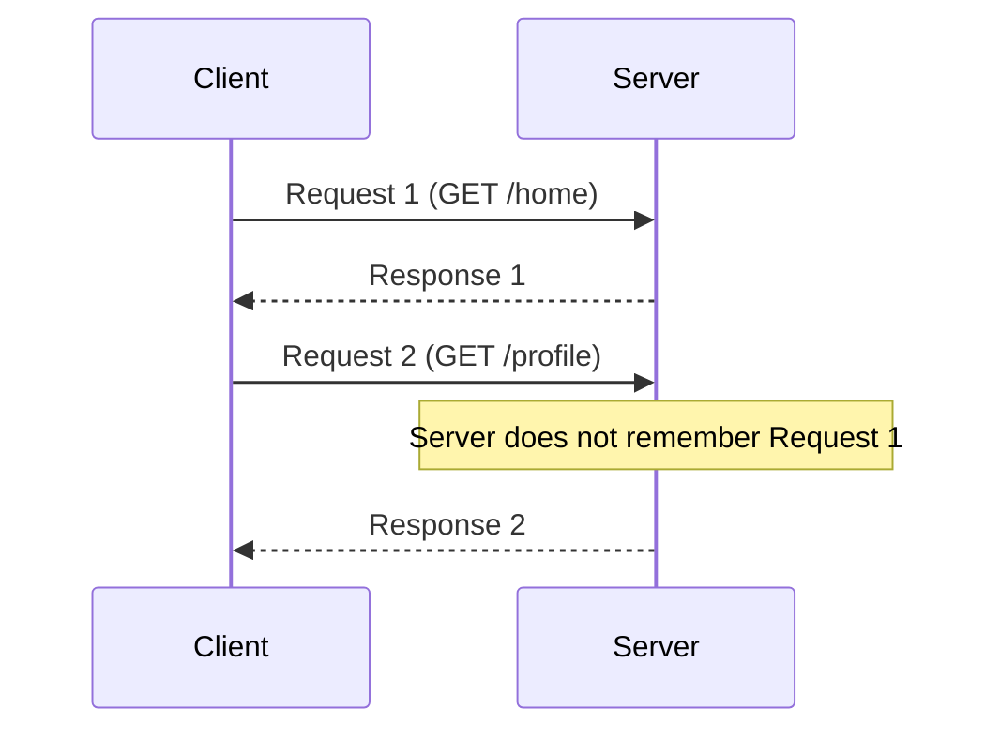
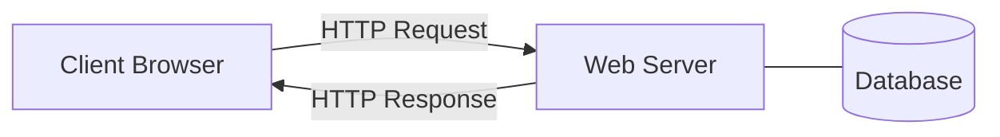
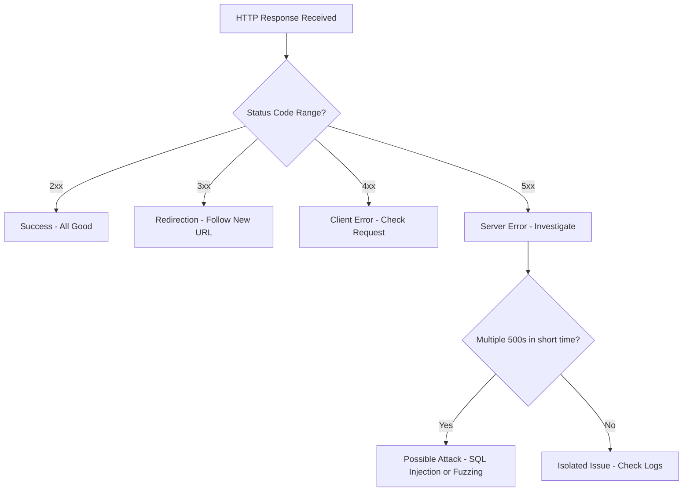
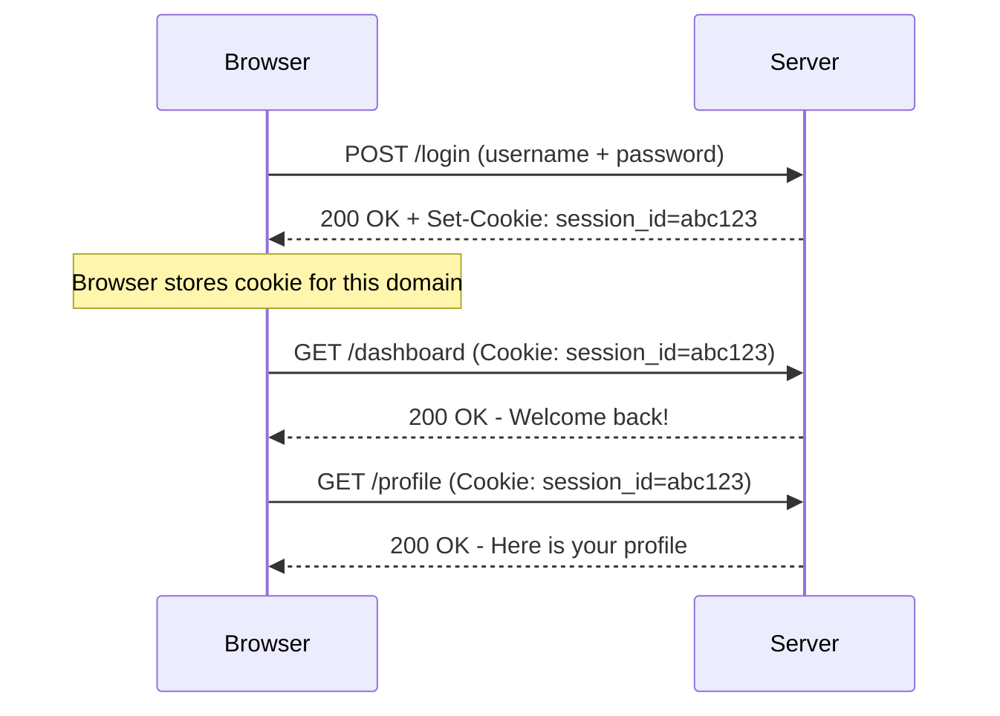
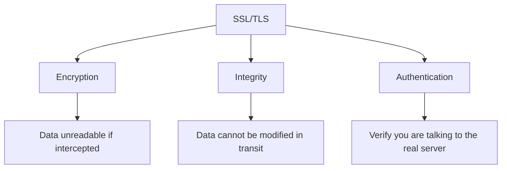
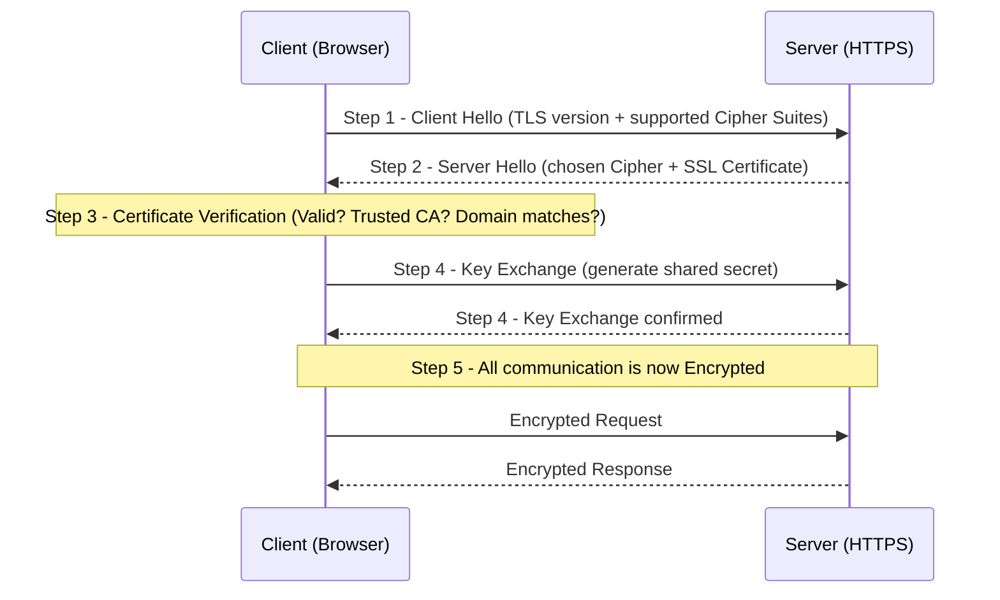

> **الهدف من الـ Section ده:**  
> هتفهم إزاي الـ Web Communication بيشتغل من الأساس، إيه هو الـ HTTP وإيه الفرق بين الـ Requests المختلفة، إزاي الـ Cookies بتشتغل وليه بتتهاجم، وإزاي الـ SSL/TLS بيحمي البيانات اللي بتتنقل على النت — وده كله أساسي جداً لأي SOC Analyst محتاج يراقب الـ Web Attacks.

---


## Table of Contents

- [Web Communication](#web-communication)
- [HTTP Requests](#http-requests)
  - [GET](#get)
  - [POST](#post)
  - [PUT](#put)
  - [PATCH](#patch)
  - [DELETE](#delete)
  - [HEAD](#head)
  - [OPTIONS](#options)
- [HTTP Responses and Status Codes](#http-responses-and-status-codes)
- [Cookies](#4-cookies)
  - [How Cookies Work](#how-cookies-work)
  - [Persistent vs Non-Persistent Cookies](#persistent-vs-non-persistent-cookies)
- [SSL/TLS](#5-ssltls)
  - [TLS Handshake](#tls-handshake)
- [Summary](#summary)

---

## Web Communication

الـ Web Communication كله قايم على بروتوكول اسمه **HTTP (HyperText Transfer Protocol)**، وده البروتوكول اللي بيتحكم في الـ Requests والـ Responses اللي بتتبادل بين الـ Client (المتصفح) والـ Web Server.

### HTTP is Stateless

من أهم الحاجات اللي لازم تفهمها: الـ HTTP بروتوكول **Stateless**، يعني إيه؟

> **Stateless** = كل Request بيوصل للـ Server مستقل تماماً عن اللي قبله. الـ Server مش بيتذكر إنت مين.

يعني لو بعتلك Request واتجاوب، وبعدين بعت Request تاني، الـ Server مش هيعرف إن الاتنين جايين منك — زي ما لو كنت تكلم حد وكل ما تكلمه بتعرّف نفسك من الأول.

### ليه ده مهم؟

لأن المواقع عادةً محتاجة "تفتكر" اليوزر — مثلاً:

- **Logged-in users**: لو سجلت دخول، المفروض الموقع يفضل عارف إنك logged in.
- **Shopping carts**: لو ضفت حاجة للـ cart، المفروض تفضل موجودة.
- **User sessions**: عشان الـ Session تفضل شغالة.

وعشان نحل مشكلة الـ Stateless دي، اتعملت حاجات زي الـ **Cookies** و**Sessions** — وهنشرحهم بالتفصيل.



> [!NOTE]
> الـ HTTP Stateless مش عيب — ده تصميم مقصود عشان يخلي البروتوكول بسيط وسريع. الـ State Management بيتعمل بطرق تانية زي الـ Cookies والـ Sessions.

---

## HTTP Requests

الـ **HTTP Request** هو الرسالة اللي بيبعتها الـ Client (المتصفح) للـ Server عشان يطلب resource معينة أو يعمل action معين.

كل Request فيه:
- **Method**: نوع الـ Request (GET, POST, PUT, إلخ).
- **URL**: الـ Resource اللي بيطلبها.
- **Headers**: معلومات إضافية عن الـ Request.
- **Body** (اختياري): البيانات اللي بتتبعت مع الـ Request.



---

### GET

الـ **GET** هو أشهر وأبسط Method — بيستخدمه المتصفح لما يطلب صفحة أو resource.

**بيستخدم في:**
- فتح صفحة ويب.
- جلب صور أو ملفات.
- استرجاع بيانات من API.

**مثال:**
```
GET /products?id=42 HTTP/1.1
Host: shop.example.com
```

> [!WARNING]
> في الـ GET، الـ Parameters بتظهر في الـ URL بشكل واضح — مثلاً `/search?q=test`. ده بيخلي الـ Attacker يقدر يعدّل فيها بسهولة ويحاول يعمل هجمات زي الـ **SQL Injection** أو **Parameter Tampering**.

---

### POST

الـ **POST** بيستخدم لإرسال بيانات للـ Server.

**بيستخدم في:**
- Login Forms.
- رفع ملفات (File Upload).
- أي عملية بتبعت فيها Data من الـ Client.

**مثال:**
```
POST /login HTTP/1.1
Host: example.com
Content-Type: application/x-www-form-urlencoded

username=amr&password=secret123
```

> [!WARNING]
> الـ POST هو الـ Method الأكتر استخداماً في هجمات زي الـ **SQL Injection** و**Command Injection**، لأن فيه Body بيتبعت للـ Server ممكن يكون فيه Malicious Input.

---

### PUT

الـ **PUT** بيستخدم لإنشاء أو **استبدال** Resource كاملة على الـ Server.

**مثال:** عايز تبدّل كل بيانات الـ User اللي ID بتاعه 10:

```
PUT /api/users/10 HTTP/1.1
Host: api.example.com
Content-Type: application/json

{
  "name": "Amr",
  "email": "amr@example.com",
  "role": "admin"
}
```

> [!IMPORTANT]
> الـ PUT بيستبدل الـ Resource **كلها** — مش جزء منها. لو بعتّ Request ناقصة fields، الـ fields دي هتاخد قيمة null أو هتتشال.

---

### PATCH

الـ **PATCH** بيستخدم لتحديث **جزء** من Resource بس — مش كلها.

| Method | الاستخدام |
|--------|-----------|
| PUT    | استبدال الـ Resource كلها |
| PATCH  | تحديث جزء من الـ Resource بس |

**مثال:**
```
PATCH /api/users/10 HTTP/1.1
Content-Type: application/json

{
  "email": "newemail@example.com"
}
```

---

### DELETE

الـ **DELETE** بيستخدم لحذف Resource من الـ Server.

**مثال:**
```
DELETE /api/users/10 HTTP/1.1
Host: api.example.com
```

> [!WARNING]
> الـ DELETE خطير جداً لو مش محمي صح — لو مفيش **Authentication** و**Authorization** صح على الـ Endpoint ده، أي حد ممكن يمسح بيانات مش بتاعته.

---

### HEAD

الـ **HEAD** زي الـ GET تماماً، بس الـ Server بيرد بـ **Headers فقط** — من غير الـ Body.

**بيستخدم في:**
- التحقق من وجود Resource من غير ما تنزّلها.
- فحص الـ Metadata (حجم الملف، نوعه، آخر تعديل).

```
HEAD /large-file.zip HTTP/1.1
Host: downloads.example.com
```

---

### OPTIONS

الـ **OPTIONS** بيستخدم لمعرفة الـ Methods اللي الـ Server بيسمح بيها على Endpoint معينة.

**مثال Response:**
```
Allow: GET, POST, PUT, DELETE
```

> [!TIP]
> **SOC Analyst Tip:** لازم تفهم الـ HTTP Methods المستخدمة في الـ Web Application بتاعت شركتك — وتبني **Detection Rules** على أي Method غير متوقعة.
>
> مثال عملي: لو موقع الشركة مش بيسمح لليوزرز يعدّلوا بياناتهم أونلاين وبيطلب منهم زيارة الفرع، فـ أي `PUT` Request جاي على الـ API ده تعدّي مريب ومحتاج تحقيق.

---

## HTTP Responses and Status Codes

بعد ما الـ Server يستقبل الـ Request، بيرد بـ **HTTP Response** تحتوي على:

```
HTTP/1.1 200 OK
Content-Type: text/html
Content-Length: 3456

<html>...</html>
```

الـ Response فيها 3 أجزاء رئيسية:
1. **Status Line**: فيها نسخة الـ HTTP والـ Status Code.
2. **Headers**: معلومات إضافية عن الـ Response.
3. **Body**: المحتوى الفعلي (الصفحة، البيانات، إلخ).

### HTTP Status Codes

| Range | المعنى | أمثلة |
|-------|--------|-------|
| **1xx** | Informational | نادراً بيتستخدم |
| **2xx** | Success | 200 OK, 201 Created, 204 No Content |
| **3xx** | Redirection | 301 Moved Permanently |
| **4xx** | Client Errors | 400, 401, 403, 404 |
| **5xx** | Server Errors | 500, 502, 503 |

### الـ 4xx Errors بالتفصيل

| Code | الاسم | المعنى |
|------|-------|--------|
| **400** | Bad Request | الـ Request غلط أو Malformed — الـ Server مش فاهمه |
| **401** | Unauthorized | محتاج تعمل Authentication الأول |
| **403** | Forbidden | إنت authenticated بس مش عندك Permission |
| **404** | Not Found | الـ Resource مش موجودة |

### الـ 5xx Errors بالتفصيل

| Code | الاسم | المعنى |
|------|-------|--------|
| **500** | Internal Server Error | حصل error في الـ Server — مش عارف إيه بالظبط |
| **502** | Bad Gateway | الـ Server كـ Proxy استقبل Response غلط من الـ Upstream Server |
| **503** | Service Unavailable | الـ Server شغال بس مش قادر يستجيب دلوقتي (Overload / Maintenance) |

> [!IMPORTANT]
> **SOC Analyst Tip:** كتير من الـ 500 Errors المتكررة ممكن تكون علامة على هجوم — الـ Attacker بيبعت **Unexpected Input** عشان يكسر الـ Application (Fuzzing)، أو محاولات **SQL Injection** و**Command Injection** بتخلي الـ Server يـ crash. لو شوفت spike في الـ 500 errors — ابدأ تحقق فوراً.



---

## Cookies

### ليه محتاجين Cookies؟

قلنا إن الـ HTTP **Stateless** — كل Request مستقل. المشكلة إن كتير من المواقع محتاجة تفتكر اليوزر:

- لو سجلت دخول، المفروض الـ Server يعرف إنك logged in في كل الصفحات.
- الـ Shopping Cart محتاج يفتكر المنتجات اللي ضفتها.

**الحل القديم (المكسور):**
في البداية، المطورين كانوا بيحطوا الـ State في الـ URL نفسه:
```
http://www.shop.example.com/cart?acctno=182727&item1=12877&item2=92762
```

ده كان مشكلته إن الـ URL بقى طويل جداً وغير آمن.

**الحل الصح: Cookies**

الـ **Cookie** هو قطعة صغيرة من البيانات بيبعتها الـ Server للمتصفح، ويخزنها المتصفح، وبيبعتها تاني مع كل Request للـ Domain نفسه.

---

### How Cookies Work



**الخطوات بالترتيب:**
1. الـ **Client** يبعت Login Request.
2. الـ **Server** يرد بـ `Set-Cookie: session_id=abc123` في الـ Response Header.
3. الـ **Browser** يحفظ الـ Cookie في الـ Cookie Storage.
4. في كل Request تاني للـ Domain نفسه، الـ Browser يبعت الـ Cookie تلقائياً: `Cookie: session_id=abc123`.
5. الـ **Server** بيعرف مين الـ User من الـ Session ID.

> [!WARNING]
> **Session Hijacking:** لو Attacker قدر يسرق الـ `session_id` بتاع الـ Victim (عن طريق XSS أو Sniffing)، يقدر يبعت Requests للـ Server بنفس الـ Cookie — والـ Server هيفتكر إن ده الـ User الأصلي! ده اسمه **Cookie Theft** والهدف منه **Impersonating the User**.

---

### Persistent vs Non-Persistent Cookies

| الخاصية | Persistent Cookies | Non-Persistent (Session) Cookies |
|---------|-------------------|----------------------------------|
| **مكان التخزين** | Hard Drive | Memory (RAM) |
| **تبقى بعد إغلاق المتصفح؟** | نعم | لا |
| **تبقى بعد إعادة التشغيل؟** | نعم | لا |
| **مدة البقاء** | طويلة (أيام / شهور / سنين) | قصيرة (طول الـ Session) |
| **الاستخدام** | تذكّر اليوزر، تتبع النشاط | بيانات مؤقتة للـ Session الحالية |
| **مخاوف الـ Privacy** | عالية | أقل |
| **Authentication** | مش محتاج تسجل كل مرة | ممكن محتاج تعيد الـ Authentication |

> [!NOTE]
> خاصية "Remember Me" في صفحات الـ Login عادةً بتستخدم **Persistent Cookie** — عشان تفضل logged in حتى لو قفلت المتصفح وفتحته تاني.

---

## SSL/TLS

### إيه هو SSL/TLS؟

- **SSL (Secure Sockets Layer)**: البروتوكول القديم — اتوقف استخدامه رسمياً.
- **TLS (Transport Layer Security)**: الإصدار الحديث والمستخدم دلوقتي.

كلاهم **Cryptographic Protocols** — بروتوكولات تشفير — الهدف منها تأمين الاتصال بين الـ Client والـ Server.

### من غير SSL/TLS

لو مفيش تشفير، أي حد يعمل **Packet Sniffing** على الشبكة هيقدر يقرأ:
- الـ Passwords.
- الـ Cookies (وبالتالي يعمل Session Hijacking).
- بيانات الـ Credit Cards.
- أي بيانات تانية بتتنقل.

---

### الـ 3 وظائف الرئيسية لـ SSL/TLS

الناس عادةً بتفكر إن SSL بيعمل حاجة واحدة بس (التشفير) — بس في الحقيقة بيعمل **3 حاجات**:



| الوظيفة | الشرح |
|---------|-------|
| **Encryption (التشفير)** | البيانات بتتشفر وبتبقى مش قابلة للقراءة لو اتاعترضت |
| **Integrity (النزاهة)** | بيتأكد إن البيانات ما اتعدلتش وهي في الطريق |
| **Authentication (المصادقة)** | بيتأكد إنك بتكلم السيرفر الحقيقي — مش حد بيعمل Impersonation |

> [!IMPORTANT]
> الـ **Authentication** في TLS بيشتغل عن طريق الـ **SSL Certificate** — الـ Domain المكتوب في الـ Certificate لازم يطابق الـ Domain في الـ Browser بالظبط. لو مطابقش، هيظهر: **"Your connection is not private"**.

---

### TLS Handshake

لما الـ Client بيتصل بـ Secure Website (HTTPS)، بيحصل عملية اسمها **TLS Handshake**:



**شرح الخطوات:**

| الخطوة | الاسم | إيه اللي بيحصل |
|--------|-------|----------------|
| **1** | Client Hello | الـ Client بيقول: "أنا بدعم TLS 1.3 ودي الـ Cipher Suites بتاعتي" |
| **2** | Server Hello | الـ Server بيرد: "اخترت الـ Cipher ده، وده الـ SSL Certificate بتاعي" |
| **3** | Certificate Verification | الـ Browser بيتحقق: هل الـ Certificate صالح؟ موقّع من CA موثوق؟ الـ Domain مطابق؟ |
| **4** | Key Exchange | الاتنين بيتفقوا على **Shared Secret Key** لاستخدامه في الـ Symmetric Encryption |
| **5** | Secure Communication | كل الاتصال من دلوقتي بيبقى **مشفّر** |

> [!NOTE]
> بعد الـ Handshake، الـ Encryption بيبقى **Symmetric** — يعني الاتنين (Client و Server) بيستخدموا نفس الـ Key. السبب: الـ Symmetric Encryption أسرع بكتير من الـ Asymmetric Encryption اللي بتستخدم في الـ Certificate نفسه.

> [!TIP]
> الفرق بين **HTTP** و**HTTPS**: الـ S في HTTPS تعني إن الاتصال بيمشي من خلال TLS. لو الـ URL بتاعك بيبدأ بـ `https://`، كل البيانات مشفرة — بما فيها الـ Cookies والـ Passwords.

---

## Summary

### أهم النقاط اللي اتعلمناها في الـ Section ده:

- **HTTP** هو البروتوكول الأساسي للـ Web Communication وهو **Stateless** — ده معناه إن الـ Server مش بيتذكر الـ Requests السابقة، وعشان كده محتاجين آليات زي الـ Cookies.

- **HTTP Methods** المختلفة ليها استخدامات محددة:
  - `GET` → جلب بيانات (الـ Parameters ظاهرة في الـ URL — خطر).
  - `POST` → إرسال بيانات (Login, Forms — مستهدف بـ Injection).
  - `PUT` → استبدال Resource كاملة.
  - `PATCH` → تعديل جزء من Resource.
  - `DELETE` → حذف Resource (خطير لو مش محمي بـ Auth).
  - `HEAD` → Headers بس من غير Body.
  - `OPTIONS` → معرفة الـ Methods المتاحة على الـ Endpoint.

- **HTTP Status Codes** بتوضح حالة الـ Response:
  - الـ **4xx** = مشكلة من الـ Client (401 مش logged in، 403 مش عندك Permission).
  - الـ **5xx** = مشكلة في الـ Server — وكتير منها ممكن تكون علامة هجوم.

- **Cookies** هو الحل لمشكلة الـ Stateless — بيتبعت من الـ Server للـ Browser ويتخزن، وبيتبعت تلقائياً مع كل Request.
  - الـ **Session Hijacking** = سرقة الـ Cookie = اختطاف هوية الـ User.
  - **Persistent Cookies** بتتخزن على الـ Disk وبتبقى بعد إغلاق المتصفح.
  - **Non-Persistent (Session) Cookies** بتتشال لما المتصفح يتقفل.

- **SSL/TLS** بيوفر 3 حاجات أساسية: **Encryption** + **Integrity** + **Authentication**.

- **TLS Handshake** هو العملية اللي بتحصل قبل أي اتصال HTTPS — فيها الـ Client والـ Server بيتفقوا على الـ Encryption وبيتحققوا من بعض — وبعديها كل الاتصال بيبقى Symmetric Encrypted.

> [!IMPORTANT]
> **كـ SOC Analyst**: لازم تفهم الـ Normal Behavior للـ Web Applications اللي بتراقبها — الـ Methods المستخدمة، الـ Status Codes الطبيعية، ونماذج الـ Cookies. أي حاجة خارج المعتاد (كتير من الـ 500 errors، PUT requests غير متوقعة، إلخ) ممكن تكون علامة هجوم محتاج تحقيق.
****
