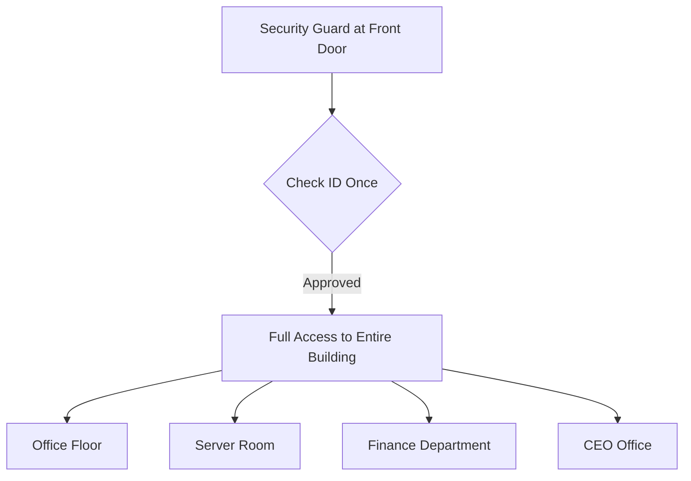
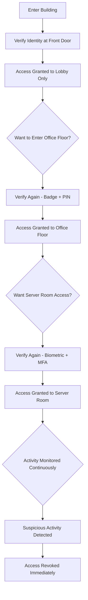
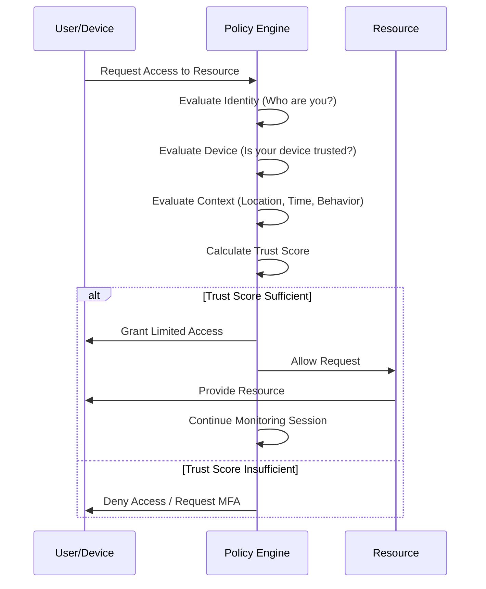
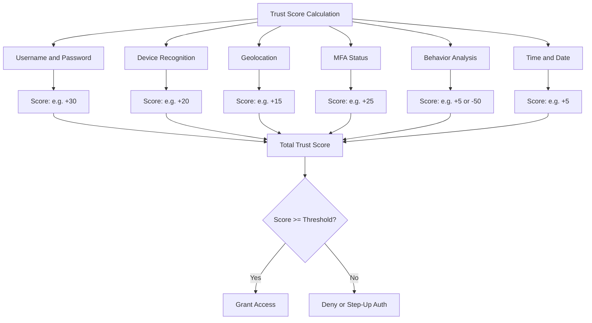
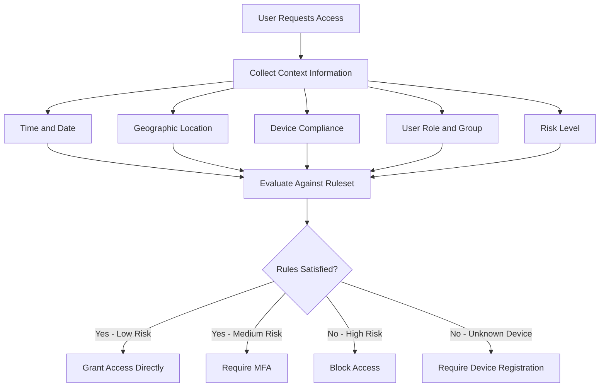
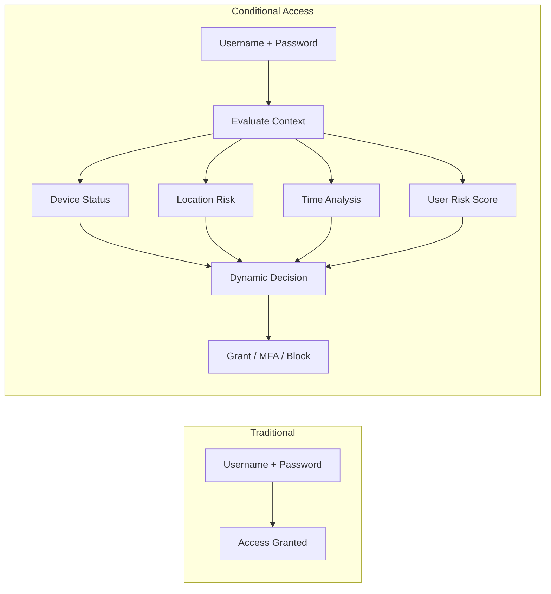
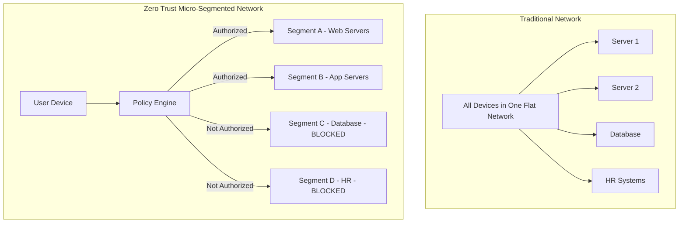
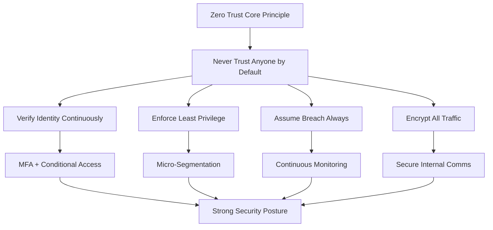

> **الهدف من الـ Section ده:**
> هتفهم ليه الـ Security القديمة كانت بتعتمد على حاجة واحدة بس (إنك تدخل الشبكة)، وإيه المشكلة في ده، وإزاي الـ Zero Trust Model جه يحل المشكلة دي بإنه يتحقق من كل حاجة في كل وقت — حتى لو الـ User جوا الشبكة الداخلية.

---

# Zero Trust Model

## Table of Contents

- [المشكلة في الـ Traditional Security](#المشكلة-في-الـ-traditional-security)
- [ما هو الـ Zero Trust Model؟](#ما-هو-الـ-zero-trust-model)
- [المثال التوضيحي — مبنى الشركة](#المثال-التوضيحي--مبنى-الشركة)
- [كيف يعمل الـ Zero Trust في التطبيق الفعلي؟](#كيف-يعمل-الـ-zero-trust-في-التطبيق-الفعلي)
- [Trust Score — حساب درجة الثقة](#trust-score--حساب-درجة-الثقة)
- [Ruleset-Based Access Control و Conditional Access](#ruleset-based-access-control-و-conditional-access)
- [Zero Trust Practices في الواقع](#zero-trust-practices-في-الواقع)
- [Summary](#summary)

---

## المشكلة في الـ Traditional Security

الـ Security القديمة (اللي كانت شائعة قبل ما الـ Zero Trust ييجي) كانت بتعتمد على فكرة بسيطة جداً:

> **"لو دخلت جوا الشبكة، إذن أنت موثوق (Trusted)."**

الفكرة دي اسمها **Perimeter-Based Security** — يعني الحماية كلها عند الحدود الخارجية للشبكة (الـ Perimeter)، وبمجرد ما حد يعدي الحد ده، بيبقى ليه صلاحيات واسعة جوا.

### الـ Perimeter Defense بتعتمد على إيه؟

- **Firewall** على الـ Edge بيتحكم فيمن يدخل ومين ميدخلش
- بمجرد دخول الـ Network، الـ User بيتعامل معاه كـ **Trusted Entity**
- مفيش إعادة تحقق مستمرة بعد الدخول

### ليه ده مشكلة؟

| السيناريو | النتيجة |
|-----------|---------|
| Attacker سرق Credentials وعمل Login | بيبقى Trusted تلقائياً |
| Insider Threat (موظف بيعمل مشاكل من جوا) | مفيش حاجة بتوقفه |
| Compromised Device جوا الشبكة | بيتعامل معاه كـ Safe |
| Lateral Movement بعد اختراق جهاز واحد | سهل جداً ينتشر |

> [!WARNING]
> الـ Perimeter Defense بتفترض إن كل اللي جوا الشبكة آمن — وده افتراض خاطئ وخطير. الـ Attackers عارفين كويس إزاي يستغلوا الفكرة دي.

---

## ما هو الـ Zero Trust Model؟

الـ **Zero Trust** هو نموذج أمني بيقوم على مبدأ واحد بسيط:

> **"Never Trust, Always Verify"**
> **"لا تثق في أي حد تلقائياً، واتحقق دايماً"**

### المبادئ الأساسية للـ Zero Trust:

**أولاً: Trust No One By Default**
- حتى الـ Internal Employees مش مضمونين
- كل User وكل System لازم يثبت هويته قبل أي وصول

**ثانياً: Continuous Authentication**
- مش بس عند الـ Login
- التحقق بيكون **مستمر** طول فترة الـ Session

**ثالثاً: Explicit Authorization**
- مش بس "مين أنت؟" — لكن "أنت مسموحلك تعمل إيه؟"
- الصلاحيات بتتحدد بدقة لكل Resource

**رابعاً: Assume Breach**
- افترض دايماً إن في Threat جوا الشبكة
- صمم الـ Security على أساس إن الاختراق ممكن يكون حصل خلاص

```
Traditional Model:    [Outside = Untrusted] ---> [Inside = Trusted]

Zero Trust Model:     [Outside = Untrusted] ---> [Inside = STILL Untrusted]
                                                     |
                                              Verify Everything
                                              Continuously
```

> [!IMPORTANT]
> الـ Zero Trust مش بيعني إنك مش هتثق في حد أبداً — ده بيعني إن الثقة لازم **تتكسب وتتتحقق منها باستمرار**، مش تتدى تلقائياً بسبب الموقع الجغرافي على الشبكة.

---

## المثال التوضيحي — مبنى الشركة

خلينا نشرح الموضوع بمثال عملي واضح:

### السيناريو القديم (Traditional):



- الـ Guard عند الباب بيشيك عليك **مرة واحدة بس**
- بعد ما دخلت، بتقدر تروح **أي أوضة في المبنى**
- المشكلة: حد ممكن يسرق الـ ID بتاعك ويدخل بدلك

### السيناريو الجديد (Zero Trust):



- **كل غرفة** ليها Verification خاصة بيها
- **حتى لو دخلت البناية**، مش معناه إنك ممكن تدخل كل الأوضات
- **السلوك بيتراقب** باستمرار

> [!NOTE]
> المثال ده بيوضح إن الـ Zero Trust بيطبق مبدأ **Least Privilege** — كل User يبقا عنده الحد الأدنى من الصلاحيات اللي يحتاجها بس، مش أكتر.

---

## كيف يعمل الـ Zero Trust في التطبيق الفعلي؟

### الـ Flow الكامل للـ Zero Trust:



### العناصر الأساسية في التحقق:

| العنصر | الأسئلة اللي بتتسأل |
|--------|---------------------|
| **Identity** | مين أنت؟ الـ Username والـ Password صح؟ |
| **Device** | الجهاز ده معروف ومسجل؟ فيه الـ Security Updates؟ |
| **Location** | بتتصل منين؟ الـ Geolocation منطقية؟ |
| **Time** | الوقت ده معقول للوصول؟ |
| **Behavior** | السلوك ده عادي ولا غريب؟ |
| **MFA** | فين الـ Second Factor؟ |

---

## Trust Score — حساب درجة الثقة

الـ **Trust Score** هو رقم بيتحسب من عوامل متعددة عشان يحدد مستوى الثقة في المستخدم أو الجهاز.

### عوامل حساب الـ Trust Score:



### مثال عملي على الـ Trust Score:

**السيناريو الأول — موظف عادي:**
- ✅ Username + Password صح → +30 نقطة
- ✅ نفس الجهاز المعتاد → +20 نقطة
- ✅ من نفس المدينة المعتادة → +15 نقطة
- ✅ MFA تم التحقق منه → +25 نقطة
- ✅ وقت الدوام الرسمي → +10 نقاط
- **Total: 100/100 → Access Granted ✅**

**السيناريو الثاني — محاولة مشبوهة:**
- ✅ Username + Password صح → +30 نقطة
- ❌ جهاز غير معروف → +0 نقطة
- ❌ Location مختلفة (دولة تانية) → -20 نقطة
- ❌ MFA مش متفعل → +0 نقطة
- ❌ وسط الليل → -10 نقاط
- **Total: 0/100 → Access Denied ❌**

> [!TIP]
> الـ Trust Score مش ثابت — بيتحدث باستمرار خلال الـ Session. لو الـ Behavior بدأ يبان غريب في نص الـ Session، الـ Score بينزل والـ Access ممكن يتوقف.

---

## Ruleset-Based Access Control و Conditional Access

### ما هو الـ Ruleset-Based Access Control؟

في بيئات زي **Microsoft Azure**، في نظام اسمه **Ruleset-Based Access Control (RBAC)** أو بشكل أدق **Conditional Access** — وده نظام بيسمح بتطبيق قواعد وصول بناءً على **Context Information** (معلومات السياق).

### الـ Conditional Access بيشتغل إزاي؟



### أمثلة على Conditional Access Rules:

| القاعدة | الشرط | النتيجة |
|--------|-------|---------|
| **Time-Based** | لو الوصول بعد 12 الليل | طلب MFA إضافي |
| **Location-Based** | لو الـ IP من دولة محظورة | Block تلقائي |
| **Device-Based** | لو الجهاز مش Compliant | طلب تسجيل الجهاز |
| **Risk-Based** | لو الـ Risk Score عالي | Block أو Step-Up Auth |
| **Role-Based** | Admin Role من خارج المكتب | MFA إلزامي |

> [!NOTE]
> الـ Conditional Access في Azure هو تطبيق عملي لمبادئ الـ Zero Trust. بيستخدم كل المعلومات المتاحة عن الـ User والـ Device والـ Context عشان يقرر يسمح، يمنع، أو يطلب تحقق إضافي.

### الفرق بين الـ Traditional Access Control والـ Conditional Access:



---

## Zero Trust Practices في الواقع

### الممارسات الأساسية للـ Zero Trust:

**1. Encrypt Everything — حتى جوا الشبكة الداخلية**

> [!IMPORTANT]
> تشفير الـ Traffic الداخلي هو **ممارسة أساسية من ممارسات الـ Zero Trust**. المفروض مش بس تشفر اللي بين الشبكة الداخلية والخارج، لكن كمان اللي بيحصل جوا الشبكة نفسها.

لو Attacker نجح يدخل الشبكة وعمل **Man-in-the-Middle Attack**، تشفير الـ Internal Traffic بيمنعه من قراءة البيانات.

**2. Micro-Segmentation — تقسيم الشبكة إلى أجزاء صغيرة**

بدل ما الشبكة كلها تبقى Zone واحدة، بتتقسم لـ **Micro-Segments** — كل Segment ليه Policies وصول خاصة بيه.



**3. Least Privilege Access**
- كل User بياخد الحد الأدنى من الصلاحيات اللي يحتاجها
- مفيش Over-Privileged Accounts
- الصلاحيات بتتراجع لما مش محتاجها

**4. Continuous Monitoring and Logging**
- كل Action بيتسجل
- الـ Behavior Analytics بتشتغل باستمرار
- أي Anomaly بيتم Alert عليه فوراً

**5. Multi-Factor Authentication (MFA)**
- MFA إلزامي لكل الـ Users
- مش بس عند الـ Login الأول
- ممكن يتطلب في Sensitive Actions

> [!TIP]
> لو بدأت بتطبق الـ Zero Trust في منظمتك، ابدأ بـ **Identity** أولاً — تأكد إن كل User بيستخدم MFA، وده وحده بيقدر يمنع غالبية الـ Attacks.

---

## Summary

### ملخص أهم النقاط:

- **الـ Traditional Perimeter Security** كانت بتفترض إن أي حد جوا الشبكة "موثوق" — وده افتراض خاطئ وخطير أثبت فشله كتير.

- **الـ Zero Trust Model** جاء بمبدأ **"Never Trust, Always Verify"** — مفيش ثقة تلقائية لأي حد، سواء جوا أو بره الشبكة.

- **المبادئ الأساسية** للـ Zero Trust هي: Verify Explicitly، Use Least Privilege Access، و Assume Breach.

- **الـ Trust Score** هو آلية بتحسب مستوى الثقة من عوامل متعددة: Identity، Device، Location، Time، Behavior، و MFA Status.

- **الـ Ruleset-Based Access Control (Conditional Access)** في بيئات زي Azure بيطبق الـ Zero Trust عملياً عن طريق تقييم الـ Context قبل أي وصول.

- **تشفير الـ Internal Traffic** هو Zero Trust Practice مهمة — حتى لو الـ Attacker دخل الشبكة، مش هيقدر يقرأ البيانات.

- **الـ Zero Trust مش Product** تشتريه — ده **Philosophy** وطريقة تفكير بتتطبقها على كل جوانب الـ Security Architecture.



---

> [!NOTE]
> **الـ Zero Trust مش معناه إنك هتعمل الشغل أصعب على الـ Users** — معناه إنك هتحمي المنظمة بدون ما تعتمد على افتراضات غلطة عن "الثقة الداخلية".
