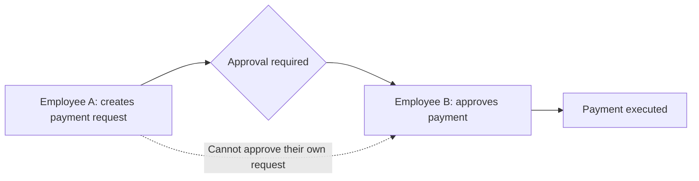
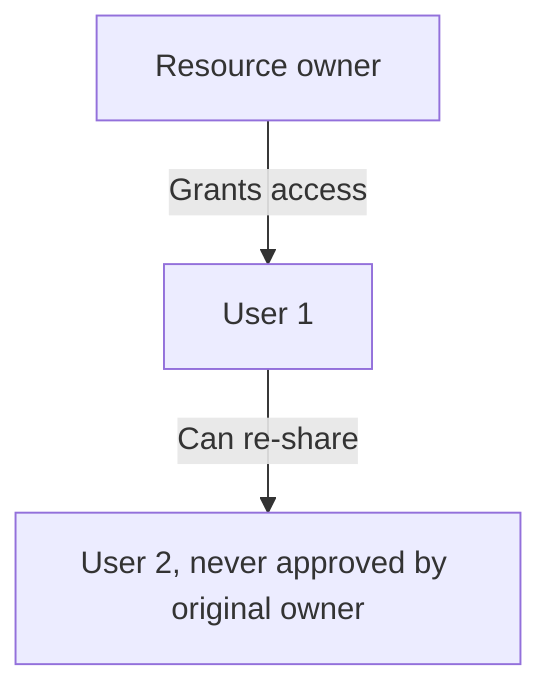
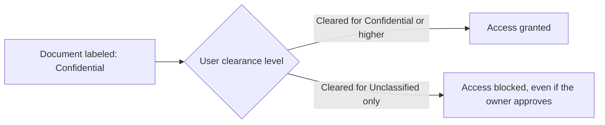
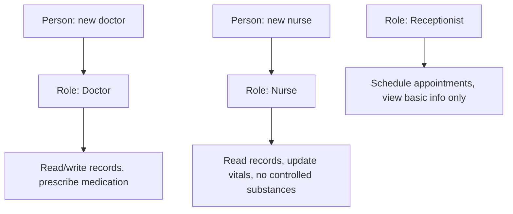
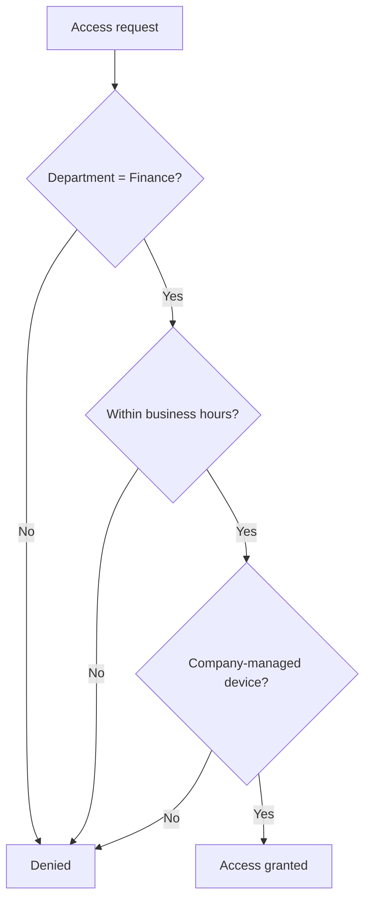
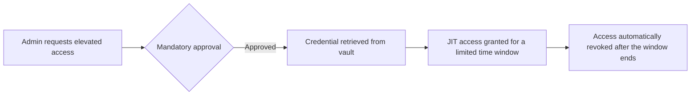

| Topic | Level | Reading Time | Prerequisites |
|---|---|---|---|
| Access Control Models | Intermediate | ~20 min | Identity and Access Management (IAM) |

> **الهدف من الـ Section ده:**  
> هتفهم إزاي المؤسسات بتقرر عملياً مين يقدر يلمس إيه بالظبط، وهتقارن بين نماذج التحكم في الوصول المختلفة (DAC, MAC, RBAC, ABAC)، وهتشوف إزاي حتى الوصول البسيط ممكن يبقى خطر لو محدش راقبه.

## Learning Objectives

By the end of this section, you will be able to:

- Explain the principle of **least privilege** and describe a real scenario where least privilege alone is not enough.
- Explain **separation of duties** and why it protects against both accidents and malicious intent.
- Differentiate between **DAC (Discretionary)** and **MAC (Mandatory)** access control, with concrete examples of each.
- Describe **RBAC (Role-Based Access Control)** and explain why it reduces administrative overhead.
- Differentiate between **ABAC (Attribute-Based)** and **Rule-Based Access Control**, and give a concrete example rule.
- Explain what **Privileged Access Management (PAM)** protects, including credential vaulting and **Just-In-Time (JIT)** access.

## Table of Contents

- [Learning Objectives](#learning-objectives)
- [Least Privilege and Separation of Duties](#least-privilege-and-separation-of-duties)
  - [The Principle of Least Privilege](#the-principle-of-least-privilege)
  - [When Least Privilege Is Not Enough](#when-least-privilege-is-not-enough)
  - [Separation of Duties](#separation-of-duties)
  - [Why This Matters for Credentials](#why-this-matters-for-credentials)
- [Discretionary and Mandatory Access Control](#discretionary-and-mandatory-access-control)
  - [DAC: Discretionary Access Control](#dac-discretionary-access-control)
  - [MAC: Mandatory Access Control](#mac-mandatory-access-control)
  - [DAC Versus MAC Compared](#dac-versus-mac-compared)
- [Role-Based Access Control (RBAC)](#role-based-access-control-rbac)
  - [The Core Idea](#the-core-idea)
  - [A Hospital Example](#a-hospital-example)
  - [The Main Benefit](#the-main-benefit)
- [ABAC and Privileged Access Management](#abac-and-privileged-access-management)
  - [Attribute-Based Access Control (ABAC)](#attribute-based-access-control-abac)
  - [Rule-Based Access Control](#rule-based-access-control)
  - [Privileged Access Management (PAM)](#privileged-access-management-pam)
- [Choosing the Right Model](#choosing-the-right-model)
- [Career Path Connections](#career-path-connections)
- [Key Terms Glossary](#key-terms-glossary)
- [Summary](#summary)

## Least Privilege and Separation of Duties

### The Principle of Least Privilege

**مبدأ الـ least privilege** بسيط: **ادّي كل شخص الحد الأدنى من الوصول اللازم لأداء شغله، ومش أكتر من كده**.

ده المبدأ الأساسي اللي بيبني عليه أي نموذج access control تاني هنشرحه في الملف ده.

### When Least Privilege Is Not Enough

في بعض الحالات، **حتى الوصول الأدنى بيفضل خطر** بما يكفي إنه يحتاج حماية إضافية. مثال: موظف واحد موثوق فيه جداً بيوافق لوحده على معاملات مالية ضخمة.

المشكلة هنا مش إن الموظف عنده وصول أكتر من اللازم، المشكلة إنه **الشخص الوحيد** القادر على تنفيذ إجراء حساس بالكامل.

### Separation of Duties

**Separation of duties** بتحل المشكلة دي: مهمة حساسة **بتتقسم بين أكتر من شخص**، بحيث محدش لوحده يقدر يكمّلها، سواء بالغلط أو بنية سيئة.

مثال ملموس: في قسم الـ Finance، الشخص اللي **بينشئ** طلب دفع لازم **مايكونش نفس الشخص** اللي **بيوافق** عليه. ده بيمنع موظف واحد من إنه ينشئ ويوافق على دفعة احتيالية لوحده.

### Why This Matters for Credentials

لو كل الواجبات الحرجة قاعدة عند شخص واحد بمهارة عالية، **account واحد اتخترق** بيتحول لـ **single point of failure كارثي**.

> [!IMPORTANT]
> Least privilege limits what one compromised account can do. Separation of duties limits what one trusted person, even acting alone with legitimate access, can do. They solve two related but different problems, and a mature access control strategy needs both.

## Discretionary and Mandatory Access Control

### DAC: Discretionary Access Control

في **DAC**، **مالك المورد نفسه** هو اللي بيقرر مين يقدر يوصله، زي صلاحيات الملفات على جهاز شخصي.

مرن وسهل الفهم، لكن الوصول ممكن **ينتشر بشكل غير منضبط**: بمجرد ما تدي حد تحكم، هو يقدر ينقله لناس إنت أصلاً معتمدتهمش.

أمثلة على DAC:

- أنظمة الملفات التقليدية (**Windows NTFS**, **Linux permissions**).
- مشاركة **Google Drive**، حيث أي حد معاه اللينك يقدر يصبح editor.

### MAC: Mandatory Access Control

في **MAC**، **النظام نفسه** هو اللي بيفرض قواعد الوصول بناءً على **تصنيفات أمنية ثابتة** المستخدمين مايقدروش يتخطوها، وده شائع في الأنظمة العسكرية والحكومية.

في التطبيق العملي: المستندات بتتوسم حسب التصنيف (**Top Secret, Secret, Confidential, Unclassified**)، والمستخدمين بيحملوا **clearance label**. النظام بيقارن التوسيمتين **أوتوماتيك** ويمنع الوصول لو الـ clearance مش كافي، **حتى لو** صاحب المستند نفسه عايز يشاركه.

### DAC Versus MAC Compared

| Aspect | DAC | MAC |
|---|---|---|
| Who decides access | The resource owner | The system, based on fixed classifications |
| Flexibility | High | Low, by design |
| Risk | Access can spread beyond original intent | Very controlled, but rigid |
| Typical environment | Personal computers, general file sharing, Google Drive | Military, government, highly classified systems |
| Can the owner override the system? | Yes | No |

> [!NOTE]
> DAC's flexibility is exactly its weakness: once you grant someone control, they can pass it along to people you never approved. MAC removes that flexibility entirely, trading convenience for guaranteed enforcement.

## Role-Based Access Control (RBAC)

### The Core Idea

بدل ما تدير صلاحيات كل شخص لوحده واحد واحد، **RBAC** بيربط الصلاحيات بـ **roles**، وبعدين بيحط الأشخاص جوه الـ roles دي.

### A Hospital Example

| Role | Permissions |
|---|---|
| Doctor | يقرا ويكتب سجلات المرضى، ويصف الأدوية |
| Nurse | يقرا السجلات ويحدّث الـ vitals، لكن **مايقدرش يصف أدوية محظورة (controlled substances)** |
| Receptionist | يحجز مواعيد ويشوف معلومات أساسية، لكن **مايقدرش يشوف التاريخ الطبي** |

### The Main Benefit

الميزة الأساسية: **الشغل الإداري بيقل بشكل كبير**. لما دكتور جديد ينضم، بيتحطله رول "Doctor" بس، بدل ما تضبط عشرات الصلاحيات الفردية له واحدة واحدة.

> [!TIP]
> RBAC scales well when roles are stable and well-defined, like in a hospital. It struggles when access decisions depend on context that changes moment to moment, which is exactly the gap ABAC fills next.

## ABAC and Privileged Access Management

### Attribute-Based Access Control (ABAC)

**ABAC** بيقرر الوصول من **عدة attributes مجتمعة لحظة الطلب**: القسم، وقت اليوم، الجهاز المستخدم، وحساسية الداتا، بدل رول واحد ثابت.

مثال قاعدة: **اسمح بالوصول بس لو القسم Finance، والطلب بيحصل في ساعات العمل، والجهاز مُدار من الشركة (company-managed)**.

### Rule-Based Access Control

بيطبق **قواعد محددة مسبقاً** على كل طلب بغض النظر عن الرول، بناءً على شروط زي الوقت، عنوان الـ IP، أو نوع الجهاز. دي بالظبط **الآلية اللي بتشتغل ورا Conditional Access policies في Azure**.

| Aspect | RBAC | ABAC | Rule-Based |
|---|---|---|---|
| Decision basis | Fixed role | Multiple attributes at request time | Predefined conditions, regardless of role |
| Flexibility | Low, roles are static | High, context-aware | Medium, condition-driven |
| Example | Doctor role sees medical records | Finance + business hours + managed device | Block access from unfamiliar IP addresses |

### Privileged Access Management (PAM)

**PAM** بيؤمّن الـ accounts اللي عندها صلاحيات مرتفعة (زي مديري الأنظمة) عن طريق:

- **Credential vault:** خزنة مركزية لبيانات الدخول الحساسة.
- **موافقة إلزامية (mandatory approval)** قبل استخدام أي صلاحية مرتفعة.
- **Just-In-Time (JIT) access:** الصلاحيات المرتفعة بتكون فعالة **بس للوقت اللازم**، وبعدين بتتلغى أوتوماتيك.

> [!IMPORTANT]
> PAM is not a replacement for RBAC or ABAC; it is an additional layer specifically for the highest-risk accounts. Even a well-designed RBAC system needs PAM if administrator accounts stay permanently elevated instead of only activating when actually needed.

## Choosing the Right Model

| Model | Best Fit When |
|---|---|
| DAC | Resource owners are trusted to manage their own sharing decisions, and flexibility matters more than strict control |
| MAC | Access must follow fixed, non-negotiable classifications, such as government or military data |
| RBAC | Job functions are stable and well-defined, and administrative simplicity is the priority |
| ABAC | Access decisions depend on dynamic context: time, device, location, or data sensitivity |
| PAM | Specifically for accounts with elevated privileges, regardless of which base model is used |

> [!TIP]
> These models are not mutually exclusive. A real organization commonly runs RBAC for general access, layers ABAC-style conditional rules on top for sensitive systems, and adds PAM specifically for administrator accounts.

## Career Path Connections

| Career Path | How This Topic Applies |
|---|---|
| SOC Analyst | Investigates access anomalies against expected role permissions and flags separation-of-duties violations |
| Penetration Tester | Tests whether DAC-based sharing has spread access beyond intended boundaries, or whether PAM controls can be bypassed |
| GRC | Verifies that access control models match regulatory requirements, especially separation of duties in financial systems |
| Cloud Security | Implements ABAC and Rule-Based Access Control through cloud-native policy engines and Conditional Access |

## Key Terms Glossary

| Term | Definition |
|---|---|
| Least Privilege | Granting only the minimum access required to perform a job |
| Separation of Duties | Dividing a sensitive task between multiple people so no one person can complete it alone |
| DAC | Discretionary Access Control, where the resource owner decides who can access it |
| MAC | Mandatory Access Control, where the system enforces fixed security classifications |
| Clearance Label | A classification assigned to a user in a MAC system, compared against a resource's classification |
| RBAC | Role-Based Access Control, where permissions are assigned to roles rather than individuals |
| ABAC | Attribute-Based Access Control, where access decisions use multiple contextual attributes |
| Rule-Based Access Control | Applying predefined conditions to every access request regardless of role |
| PAM | Privileged Access Management, securing elevated-access accounts |
| Credential Vault | A secure central store for privileged credentials |
| Just-In-Time (JIT) Access | Elevated permissions active only for the time needed, then automatically revoked |

## Summary

- **Least privilege limits routine exposure:** ادّي كل شخص الحد الأدنى بس، مش أكتر.
- **Separation of duties limits concentrated power:** مهمة حساسة بتتقسم بين أكتر من شخص عشان محدش يقدر يستغلها لوحده.
- **DAC is flexible but leaky:** المالك بيقرر، لكن التحكم ممكن ينتشر لناس مش موافق عليهم.
- **MAC is rigid but guaranteed:** النظام بيفرض القواعد، وحتى المالك مايقدرش يتجاوزها.
- **RBAC reduces administrative overhead:** الصلاحيات مرتبطة بالرول، مش بالشخص، فإدارة الوصول بتبسّط جداً.
- **ABAC handles dynamic context:** القرار بيتاخد من عدة عوامل لحظة الطلب، مش رول ثابت.
- **PAM protects the highest-risk accounts specifically:** credential vault، موافقة إلزامية، وJIT access بتقلل نافذة التعرض للخطر.
- **The models complement each other:** مؤسسة حقيقية غالباً بتستخدم مزيج من RBAC وABAC وPAM مع بعض، مش نموذج واحد بس.

