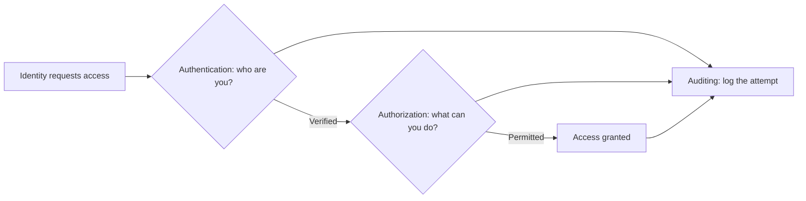
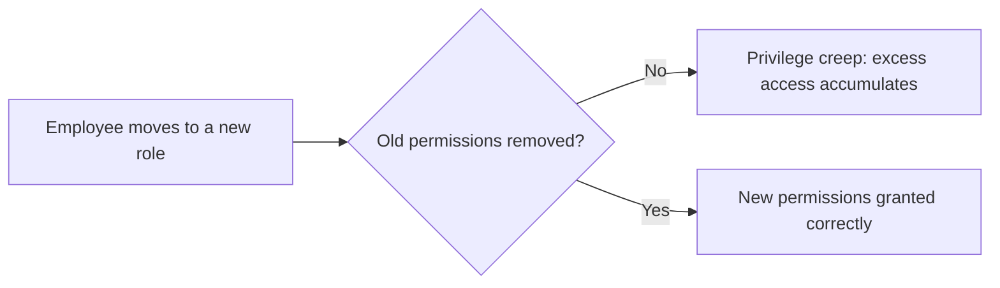
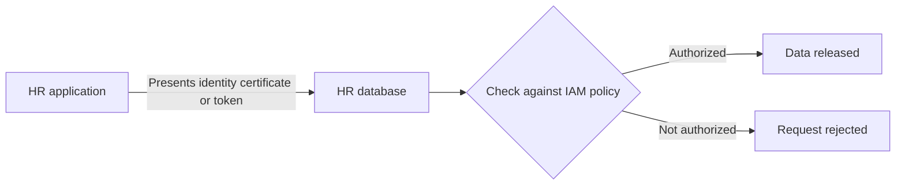
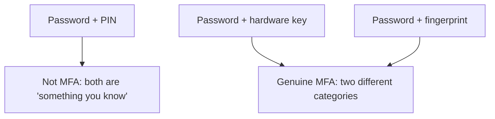
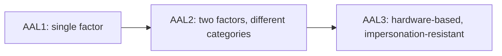
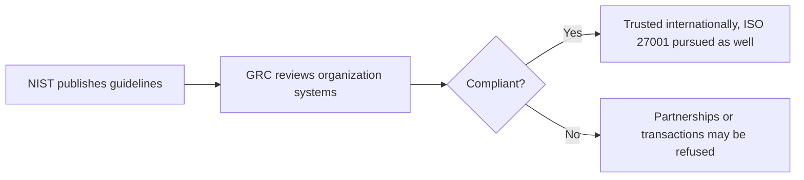
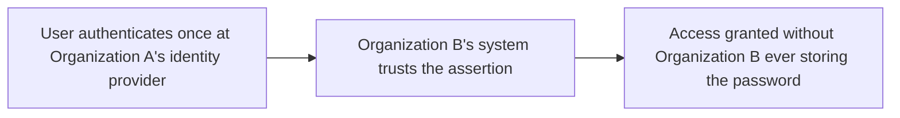
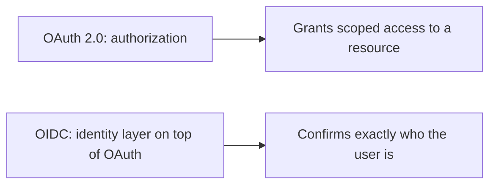

| Topic | Level | Reading Time | Prerequisites |
|---|---|---|---|
| Identity and Access Management (IAM) | Intermediate | ~20 min | Zero Trust Model, basic idea of authentication |

> **الهدف من الـ Section ده:**  
>  هتفهم إطار الـ IAM اللي بيحدد مين الشخص، وهو مسموحله يعمل إيه، وإزاي ده بيتثبت ويتتبع، وإزاي ده بيتطبق مش بس على الموظفين لكن على الـ applications والـ services كمان.

## Learning Objectives

By the end of this section, you will be able to:

- Define **IAM** and explain the three core questions it answers: authentication, authorization, and auditing.
- Describe the **Joiner, Mover, Leaver** lifecycle and explain how skipping a step causes **privilege creep** or delayed deprovisioning.
- Differentiate between how users authenticate and how applications and services authenticate to each other.
- List the three **authentication factors** and explain what makes something genuine **Multi-Factor Authentication (MFA)**.
- Explain the NIST **Authenticator Assurance Levels (AAL1, AAL2, AAL3)** and how sensitivity determines which level applies.
- Explain the role of **NIST** and **GRC** in compliance, and why standards like these matter for international business.
- Differentiate between **SSO**, **Federation**, and the protocols behind them: **SAML**, **OAuth 2.0**, and **OpenID Connect**.

## Table of Contents

- [Learning Objectives](#learning-objectives)
- [IAM: Definition and Purpose](#iam-definition-and-purpose)
  - [The Three Core Questions](#the-three-core-questions)
  - [The Business Reason It Exists](#the-business-reason-it-exists)
- [The IAM Lifecycle: Joiner, Mover, Leaver](#the-iam-lifecycle-joiner-mover-leaver)
  - [Joiner](#joiner)
  - [Mover](#mover)
  - [Leaver](#leaver)
- [Authenticating Users, Applications, and Services](#authenticating-users-applications-and-services)
  - [How Users Authenticate](#how-users-authenticate)
  - [How Applications and Services Authenticate](#how-applications-and-services-authenticate)
- [Authentication Factors](#authentication-factors)
  - [The Three Categories](#the-three-categories)
  - [What Makes MFA Genuine](#what-makes-mfa-genuine)
- [Authenticator Assurance Levels (AAL)](#authenticator-assurance-levels-aal)
- [NIST, GRC, and Compliance in Practice](#nist-grc-and-compliance-in-practice)
  - [What NIST Is](#what-nist-is)
  - [GRC's Job](#grcs-job)
  - [Real-World Consequences](#real-world-consequences)
- [Single Sign-On and Federation](#single-sign-on-and-federation)
  - [Single Sign-On (SSO)](#single-sign-on-sso)
  - [Federation](#federation)
- [The Protocols Behind SSO](#the-protocols-behind-sso)
  - [SAML](#saml)
  - [OAuth 2.0](#oauth-20)
  - [OpenID Connect (OIDC)](#openid-connect-oidc)
  - [The Key Distinction](#the-key-distinction)
- [Career Path Connections](#career-path-connections)
- [Key Terms Glossary](#key-terms-glossary)
- [Summary](#summary)

## IAM: Definition and Purpose

### The Three Core Questions

**Identity and Access Management (IAM)** هو الإطار اللي بيضمن إن الجهات الصحيحة، سواء **أشخاص أو applications أو services**، عندها الوصول المناسب للموارد الصحيحة في الوقت الصحيح.

الـ IAM بيجاوب على تلات أسئلة أساسية:

| Question | Function | What It Establishes |
|---|---|---|
| مين إنت؟ | **Authentication** | إثبات الهوية، عادةً عن طريق username وpassword أو credential تاني |
| مسموحلك تعمل إيه؟ | **Authorization** | تحديد أنهي موارد وactions الهوية دي المصرح لها بالوصول ليها |
| إزاي نثبت ونتتبع ده؟ | **Auditing** | تسجيل كل محاولة authentication وكل قرار access عشان يتراجع لاحقاً |

### The Business Reason It Exists

المؤسسات محتاجة إن كل شخص يكون عنده **بالظبط الوصول اللي شغله محتاجه**، ويقدر يثبت وقت الـ audit مين وصل لإيه، ويقدر يشيل الوصول ده **فوراً** لحظة ما حد يغير دوره أو يسيب الشركة.

> [!IMPORTANT]
> Authentication answers "who are you", authorization answers "what can you do". These are two different problems solved by two different mechanisms. A system can correctly identify someone and still let them do something they should not, if authorization is misconfigured.

## The IAM Lifecycle: Joiner, Mover, Leaver

### Joiner

لما موظف جديد ينضم، بيتعمله account بصلاحيات **متطابقة تماماً مع دوره المحدد**، مش أكتر.

### Mover

لما موظف يغيّر دوره أو قسمه، الصلاحيات القديمة لازم تتشال والجديدة تتضاف. تخطي الخطوة دي بيسبب **privilege creep**: تراكم صلاحيات الموظف بمرور الوقت من غير ما يحتاجها فعلياً.

### Leaver

لما موظف يسيب المؤسسة، الوصول بتاعه لازم يتلغى **فوراً**. التأخير في الـ deprovisioning سبب شائع جداً لحوادث أمنية بتتعلق بموظفين سابقين.

| Stage | Correct Action | Risk of Getting It Wrong |
|---|---|---|
| Joiner | Grant access matching the role, nothing more | Over-provisioning from day one |
| Mover | Remove old permissions, grant new ones | Privilege creep |
| Leaver | Revoke access immediately | Former employee retains access |

> [!WARNING]
> Delayed deprovisioning is one of the most common, and most preventable, causes of real-world security incidents. A former employee with lingering access is a risk that costs nothing to eliminate and everything to ignore.

## Authenticating Users, Applications, and Services

### How Users Authenticate

الطريقة الأكثر شيوعاً: **username وpassword**. الـ IAM بيقرر أنهي أنظمة وapplications المستخدم ده مسموحله يفتحها، مثلاً موظف الـ HR بس هو اللي يقدر يفتح تطبيق الـ HR.

### How Applications and Services Authenticate

الـ applications والـ services **مبتكتبش username أو password أصلاً**. بدل كده، application بيثبت هويته لـ application تانية باستخدام **certificate أو token**.

مثال: تطبيق الـ HR بيطلب سجلات الموظفين من قاعدة بيانات الـ HR. التطبيق بيقدم هويته، وقاعدة البيانات بتفحصها مقابل سياسة الـ IAM قبل ما تفرج عن أي داتا، وبترفض أي تطبيق تاني مش مصرح له بالطلب ده.

> [!NOTE]
> This machine-to-machine authentication is exactly what makes microsegmentation and Zero Trust work at the application layer, covered in the Zero Trust Model file. Every service call is itself a request that gets evaluated, not just user logins.

## Authentication Factors

### The Three Categories

| Category | Examples |
|---|---|
| Something you know | Password, PIN, security question answer |
| Something you have | Phone with authenticator app, hardware security key, physical access card |
| Something you are | Biometric trait: fingerprint, face, iris scan |

### What Makes MFA Genuine

**Multi-Factor Authentication (MFA)** معناها الجمع بين **فئتين مختلفتين على الأقل** من الفئات دي.

> [!IMPORTANT]
> Two passwords together is not MFA, because both belong to the same category (something you know). Genuine MFA requires crossing category boundaries, for example a password plus a hardware key, or a password plus a fingerprint.

## Authenticator Assurance Levels (AAL)

معايير **NIST** بتحدد ثلاث مستويات لقوة الـ authentication:

| Level | Requirement | Suitable For |
|---|---|---|
| AAL1 | Single factor يكفي، عادةً username وpassword بس | أنظمة منخفضة الخطورة والأهمية |
| AAL2 | فئتين مختلفتين مطلوبتين: something you know (password) + something you have (OTP, authenticator app, hardware key) | معظم الأنظمة التجارية المعتادة |
| AAL3 | أقوى مستوى، بيتطلب authenticator مبني على hardware مع **verifier impersonation resistance**، يعني مينفعش يتخدع بصفحة login مزيفة بتتظاهر إنها الخدمة الحقيقية | أنظمة بالغة الحساسية زي قواعد البيانات أو الأنظمة البنكية |

الاختيار بيتحدد حسب **حساسية النظام**: الأنظمة الحرجة جداً بتشتغل على AAL3، بينما أداة داخلية منخفضة الأهمية ممكن تكتفي بـ AAL1 بس.

## NIST, GRC, and Compliance in Practice

### What NIST Is

**NIST (National Institute of Standards and Technology)** منظمة أمريكية بتنشر guidelines، زي إزاي تبني password قوي بالظبط، أو إزاي تحدد مستوى AAL المناسب لكل نظام.

الـ guidelines دي **مش قوانين**؛ المؤسسة حرة تتبعها أو لأ. لكن البنوك والحكومات والمؤسسات الكبيرة عادةً **لازم تتبعها** عشان تكون موثوقة عالمياً.

### GRC's Job

موظف الـ **Governance, Risk, and Compliance (GRC)** بيقرا المعايير دي، بيراجع أنظمة المؤسسة الفعلية، وبيأكد هل المؤسسة متوافقة أو لأ، عن طريق تحديد مستوى AAL الصحيح لكل application وتوجيه الفرق تصلح أي فجوات.

### Real-World Consequences

البنوك الدولية عادةً **بتتعامل بس** مع بنوك تانية متوافقة مع المعايير دي؛ بنك مش متوافق بالكامل ممكن **يترفضله** معاملات أو شراكات دولية معينة.

شهادة ذات صلة ومعروفة عالمياً: **ISO 27001**، وهي شهادة إدارة أمن المعلومات اللي المؤسسات بتسعى ليها لنفس السبب: إثبات لباقي العالم إن ممارساتها الأمنية بتوافق معيار موثوق.

> [!NOTE]
> NIST guidelines are voluntary, but the practical consequences of non-compliance in regulated industries make them functionally mandatory for banks, governments, and large enterprises operating internationally.

## Single Sign-On and Federation

### Single Sign-On (SSO)

الـ **SSO** بيسمح للمستخدم يتوثق **مرة واحدة** ويوصل لعدة applications بعد كده، من غير ما يعيد إدخال الـ credentials في كل مرة.

**Active Directory** هو التطبيق الأشهر لده: directory service مركزي بيتعمل فيه account مرة واحدة ويتستخدم للتوثق عبر خدمات داخلية كتير.

الـ SSO بيحسّن **الأمان** (كلمات سر أقل تتسرق أو تنسرق) و**تجربة المستخدم** مع بعض.

### Federation

الـ **Federation** بيسمح لمستخدم من مؤسسة معينة إنه يدخل نظام تابع لمؤسسة **تانية تماماً**، باستخدام الـ credentials الأصلية بتاعته، **من غير** ما المؤسسة التانية دي تخزن الـ password أبداً.

ده بيخلي الـ SSO ممكن يشتغل **عبر حدود المؤسسات**، مش بس جوه تطبيقات شركة واحدة.

## The Protocols Behind SSO

### SAML

**SAML** بروتوكول قديم نسبياً، مبني على **XML**، بيتستخدم بشكل أساسي للدخول لتطبيقات الشركات عبر الـ browser.

### OAuth 2.0

**OAuth 2.0** **مش بروتوكول authentication** لوحده، هو بروتوكول **authorization**: بيسمح لـ application إنه يوصل لموارد محددة نيابة عن مستخدم، من غير ما يشوف password المستخدم أبداً.

### OpenID Connect (OIDC)

**OIDC** مبني فوق OAuth 2.0، وبيضيف طبقة identity، بحيث الـ application يقدر كمان يتأكد **مين بالظبط المستخدم**، مش بس إيه المسموحله يعمله.

### The Key Distinction

| Protocol | Answers | Type |
|---|---|---|
| SAML | من إنت، وأنهي تطبيقات مسموحلك تفتحها | Authentication protocol, XML-based |
| OAuth 2.0 | إيه اللي التطبيق ده مسموحله يعمله نيابة عني | Authorization protocol |
| OIDC | مين بالظبط المستخدم ده | Identity layer built on top of OAuth 2.0 |

> [!IMPORTANT]
> OAuth answers "what can this application do on my behalf", while OIDC answers "who is this user". This distinction is commonly tested in interviews, and confusing the two is one of the most frequent mistakes in IAM discussions.

## Career Path Connections

| Career Path | How This Topic Applies |
|---|---|
| SOC Analyst | Investigates authentication anomalies and audit logs to detect compromised accounts |
| Penetration Tester | Tests for privilege creep, weak MFA implementations, and misconfigured OAuth scopes |
| GRC | Directly responsible for mapping AAL levels to systems and confirming NIST or ISO 27001 compliance |
| Cloud Security | Configures SSO, federation, and conditional access policies across cloud identity providers |

## Key Terms Glossary

| Term | Definition |
|---|---|
| IAM | Identity and Access Management, the framework ensuring the right entities have appropriate access to the right resources |
| Authentication | Proving identity, typically through a credential such as a password |
| Authorization | Determining which resources and actions a verified identity is permitted to access |
| Auditing | Recording authentication attempts and access decisions for later review |
| Joiner, Mover, Leaver | The IAM lifecycle stages for onboarding, role change, and offboarding |
| Privilege Creep | The gradual accumulation of unnecessary access permissions over time |
| Deprovisioning | Removing a user's access, ideally immediately upon departure or role change |
| MFA | Multi-Factor Authentication, combining at least two different authentication factor categories |
| AAL | Authenticator Assurance Level, a NIST scale (AAL1 to AAL3) rating authentication strength |
| Verifier Impersonation Resistance | A property of AAL3 authenticators that resists being tricked by fake login pages |
| NIST | National Institute of Standards and Technology, publishes security guidelines |
| GRC | Governance, Risk, and Compliance, the function that verifies an organization follows required standards |
| ISO 27001 | An internationally recognized information security management certification |
| SSO | Single Sign-On, authenticate once, access multiple applications |
| Federation | Allowing a user to authenticate across organizational boundaries using their original credentials |
| SAML | An XML-based protocol mainly used for browser-based enterprise application login |
| OAuth 2.0 | An authorization protocol letting an application access resources on a user's behalf |
| OIDC | OpenID Connect, an identity layer built on top of OAuth 2.0 |

## Summary

- **IAM answers three questions:** مين إنت (authentication)، إيه المسموحلك تعمله (authorization)، وإزاي نثبت ونتتبع ده (auditing).
- **The lifecycle has three stages:** Joiner، Mover، Leaver، وتخطي أي خطوة بيسبب privilege creep أو تأخير في إلغاء الوصول.
- **Users and services authenticate differently:** المستخدمين بـ username وpassword، لكن الـ applications بتثبت هويتها بـ certificates أو tokens.
- **Genuine MFA crosses categories:** something you know, have, or are، والجمع بين اتنين من نفس الفئة مش MFA حقيقي.
- **AAL scales with sensitivity:** AAL1 للأنظمة منخفضة الخطورة، AAL3 للأنظمة الحرجة زي البنوك وقواعد البيانات الحساسة.
- **NIST guides, GRC verifies:** NIST بينشر معايير اختيارية، وGRC بيتأكد المؤسسة ملتزمة بيها، وعدم الالتزام له عواقب دولية حقيقية.
- **SSO simplifies access, Federation extends it across organizations:** الاتنين مبنيين على بروتوكولات زي SAML وOAuth 2.0 وOIDC.
- **OAuth and OIDC solve different problems:** OAuth بيدي صلاحية، OIDC بيثبت الهوية.

