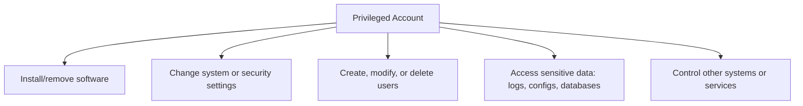
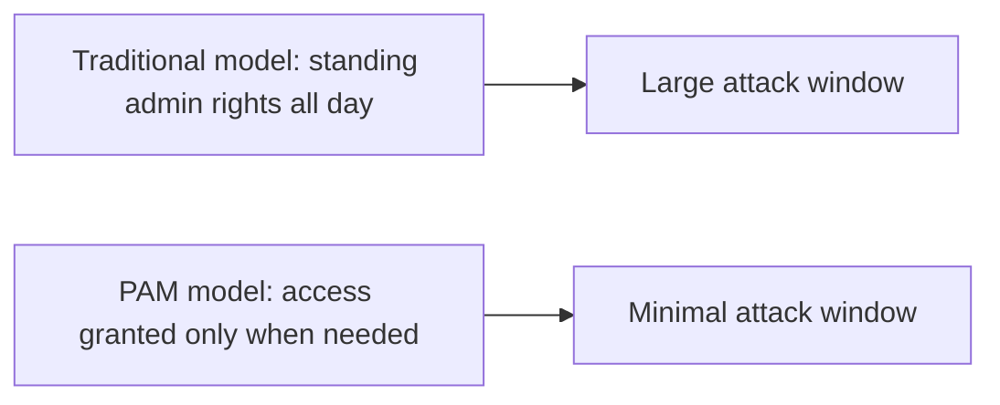
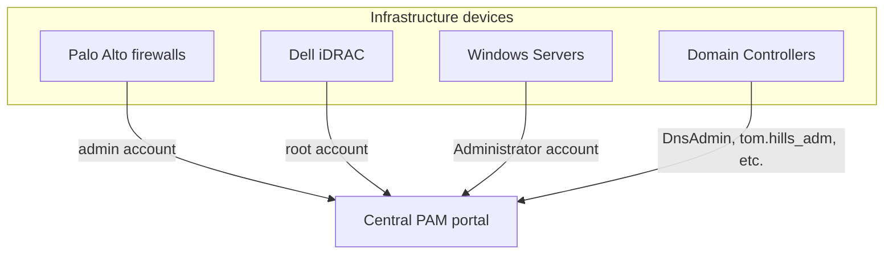
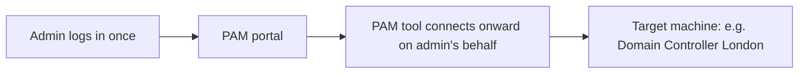
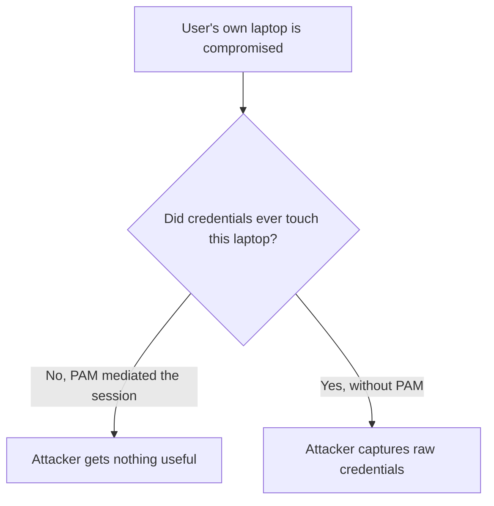
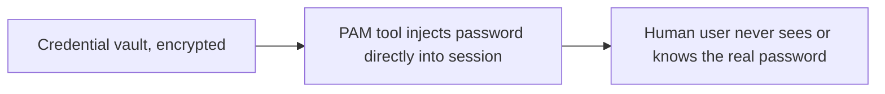
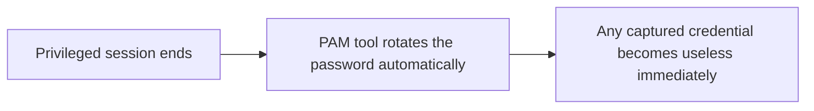
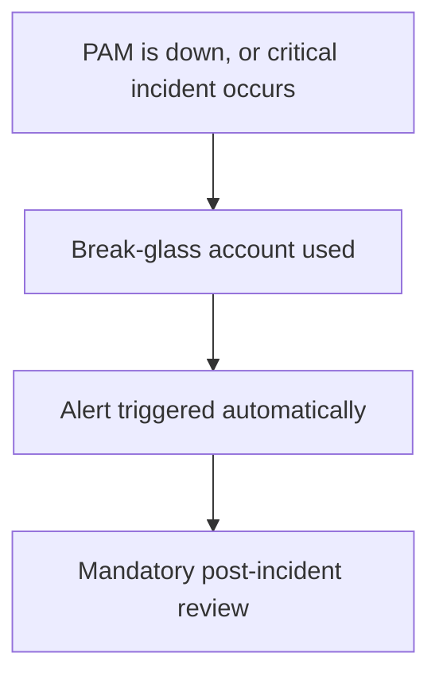
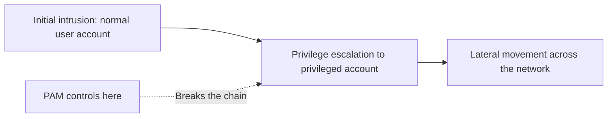

| Topic | Level | Reading Time | Prerequisites |
|---|---|---|---|
| Privileged Access Management (PAM) | Intermediate | ~20 min | Access Control Models, Active Directory Core Concepts |

> **الهدف من الـ Section ده:**  
>  هتفهم إيه هو الـ privileged account بالظبط، وإزاي أدوات الـ PAM بتحمي الحسابات دي عن طريق الـ session isolation والـ credential vaulting والـ password rotation، وليه تأمين الحسابات دي غالباً أهم من محاولة منع كل اختراق أولي.

## Learning Objectives

By the end of this section, you will be able to:

- Define a **privileged account** and list concrete examples beyond the obvious Administrator/root case.
- Explain the **Principle of Least Privilege (PoLP)** and how PAM enforces it by removing standing admin rights.
- Explain how PAM centralizes device and credential management across an entire organization.
- Explain **Session Isolation and Recording**, and why it protects credentials even if the user's own endpoint is compromised.
- Describe how **credential vaulting** and **automatic password rotation** work together to reduce the value of a stolen password.
- Explain **Just-in-Time (JIT) access** and **break-glass accounts**, and why organizations prioritize PAM over trying to stop every initial intrusion.

## Table of Contents

- [Learning Objectives](#learning-objectives)
- [What Is a Privileged Account](#what-is-a-privileged-account)
  - [The Core Definition](#the-core-definition)
  - [What a Privileged Account Can Do](#what-a-privileged-account-can-do)
  - [Types of Privileged Accounts Worth Knowing](#types-of-privileged-accounts-worth-knowing)
- [PAM: Privileged Access Management](#pam-privileged-access-management)
  - [The Core Idea](#the-core-idea)
  - [Enforcing Least Privilege](#enforcing-least-privilege)
- [Managing Devices Centrally](#managing-devices-centrally)
- [Session Control in Action](#session-control-in-action)
  - [How a PAM Session Works](#how-a-pam-session-works)
- [Why This Model Matters: Session Isolation](#why-this-model-matters-session-isolation)
  - [The Two Key Benefits](#the-two-key-benefits)
- [Password Policy, Vaulting, and Rotation](#password-policy-vaulting-and-rotation)
  - [Credential Vaulting](#credential-vaulting)
  - [Automatic Password Rotation](#automatic-password-rotation)
  - [Restricting Access by Context](#restricting-access-by-context)
- [Additional PAM Concepts Worth Knowing](#additional-pam-concepts-worth-knowing)
  - [Just-in-Time (JIT) Access](#just-in-time-jit-access)
  - [Break-Glass (Emergency Access)](#break-glass-emergency-access)
  - [Why Organizations Prioritize PAM](#why-organizations-prioritize-pam)
- [Career Path Connections](#career-path-connections)
- [Key Terms Glossary](#key-terms-glossary)
- [Summary](#summary)

## What Is a Privileged Account

### The Core Definition

**Privileged account** هو حساب **Windows Administrator**، أو **root** في Linux. الحسابات دي هي حسابات مستخدمين أو أنظمة عندها **صلاحيات مرتفعة**، بتسمح بأفعال **قوية وحساسة وممكن تكون خطيرة** على الأنظمة.

المؤسسات **دايماً بتدي أولوية** لحماية النوع ده من الحسابات **فوق** الحسابات العادية.

### What a Privileged Account Can Do

الحساب المميز قادر على:

- تثبيت وإزالة software.
- تغيير إعدادات النظام أو الأمان.
- إنشاء أو تعديل أو حذف المستخدمين.
- الوصول لداتا حساسة (logs, configs, databases).
- التحكم في أنظمة أو خدمات تانية.

### Types of Privileged Accounts Worth Knowing

مش بس الـ Administrator/root. فيه أنواع تانية مهم تعرفها:

| Type | Example |
|---|---|
| Domain Admin accounts | تحكم كامل في Active Directory (شرحناه بالتفصيل في ملف Active Directory Core Concepts) |
| Local Administrator accounts | على أجهزة فردية |
| Service accounts | بتشغّل خدمات خلفية زي SQL Server أو IIS — غالباً **over-permissioned ونادراً ما بتتراجع** |
| Database admin accounts | زي `sa` في SQL Server، أو `root` في MySQL |
| Network device accounts | routers, switches, firewalls |
| Cloud admin accounts | زي AWS root، أو Azure Global Administrator |
| Emergency (break-glass) accounts | بيتستخدم بس لما الوصول الإداري العادي يفشل |

> [!WARNING]
> Service accounts are among the most overlooked privileged accounts in real environments. They are frequently over-permissioned at creation and rarely re-reviewed afterward, which makes them an attractive long-term target for attackers.

## PAM: Privileged Access Management

### The Core Idea

**Privileged Access Management (PAM)** بيتم عن طريق **عدة أدوات** مصممة لإدارة الحسابات المميزة دي.

### Enforcing Least Privilege

**Principle of Least Privilege (PoLP)**: كل حساب المفروض يكون عنده **الحد الأدنى بس** من الصلاحيات اللازمة لشغله، مش أكتر.

أدوات الـ PAM بتفرض المبدأ ده عن طريق **إزالة الصلاحيات الدائمة (standing admin rights)**، وبدل منها بتدي وصول **بس وقت الحاجة الفعلية**.

> [!NOTE]
> This connects directly to the least privilege principle covered in the Access Control Models file, but applied specifically to the highest-risk category of accounts: privileged ones.

## Managing Devices Centrally

بدل ما تفتكر credentials منفصلة لكل device في المؤسسة، **كل الحسابات المميزة عبر المؤسسة بتتركز وتتدار من portal واحد**.

ده المركزية دي بتسمح لفرق الأمن إنهم يشوفوا، بلمحة واحدة، **كل حساب مميز موجود عبر البنية التحتية كلها**، وهو حاجة **صعبة جداً تتتبع يدوياً**.

> [!TIP]
> If your organization cannot answer "how many privileged accounts exist across our infrastructure right now?" within minutes, that is itself a sign PAM centralization is missing or incomplete.

## Session Control in Action

### How a PAM Session Works

أداة الـ PAM هي المسؤولة عن **فتح وتسجيل كل session مميزة** في المؤسسة. المستخدم بيدخل على portal الـ PAM، وبعد كده **كل النشاط بيتحكم فيه ويتوسّط بالكامل من أداة الـ PAM**، **مش عن طريق login مباشر للجهاز المستهدف**.

بدل ما الـ admin يدخل على كل server ونظام لوحده، هو **بيدخل مرة واحدة بس على PAM portal**، وأداة الـ PAM هي اللي **بتتولى الاتصال بعد كده**.

## Why This Model Matters: Session Isolation

### The Two Key Benefits

المستخدم **مابيتصلش مباشرة بالجهاز المستهدف أبداً**؛ هو بيتصل بـ **PAM server**، اللي بعد كده بيتصل بالنيابة عنه.

وبسبب ده:

- **كل ضغطة مفتاح وكل حركة على الشاشة ممكن تتسجل**، للـ audit والتحقيق الجنائي (forensic investigation) لاحقاً.
- **لو لابتوب المستخدم نفسه اتخترق**، المهاجم **لسه مايقدرش يحصل على الـ credentials الخام**، لأن الـ credentials دي **مابتلمسش جهاز المستخدم أصلاً**.

ده اسمه **Session Isolation and Recording**، وهو واحد من **أقيم الفوائد الأمنية** اللي أدوات الـ PAM بتوفرها.

> [!IMPORTANT]
> Session isolation is the structural reason PAM is more resilient than "just use a strong password." Even a fully compromised endpoint yields nothing, because the credential and the connection never pass through that endpoint at all.

## Password Policy, Vaulting, and Rotation

أدوات الـ PAM قادرة على فرض **سياسات password صارمة** (زي اشتراط رموز خاصة)، وممكن حتى **تولّد passwords قوية أوتوماتيك** للمستخدمين المميزين.

### Credential Vaulting

أدوات الـ PAM بتخزن الـ passwords بأمان في **vault مشفر**، الـ passwords **مش موجودة أبداً على جهاز المستخدم**.

في الـ **Credential Vaulting**: المستخدم البشري **مايعرفش الـ password الحقيقي أصلاً**؛ أداة الـ PAM بتحقنه (**injects**) مباشرة جوه الـ session. ده بيمنع المستخدمين من:

- كتابة الـ passwords في مكان ظاهر.
- إعادة استخدامها عبر أنظمة مختلفة.
- تسريبها عن طريق الـ phishing.

### Automatic Password Rotation

الأداة بتتبع **تاريخ تغيير الـ password**، وبتفرض **تدوير أوتوماتيكي** في فترات محددة، امتثالاً لمعايير الأمان.

**Automatic Password Rotation**: بعد **كل session مميزة تنتهي**، أداة الـ PAM **بتغيّر الـ password أوتوماتيك**. حتى لو الـ password اتسرق بشكل ما أثناء الاستخدام، **بيبقى عديم الفائدة فوراً** بعد كده.

### Restricting Access by Context

أدوات الـ PAM تقدر تفرض policies بتقيد الوصول للأنظمة الحرجة، مثلاً **السماح بالوصول لنظام معين من جهاز معتمد (approved device) بس**.

> [!NOTE]
> This context-based restriction is the same idea as the attribute-based decisions covered in Access Control Models (ABAC): device, context, and conditions shape the decision, not identity alone.

## Additional PAM Concepts Worth Knowing

### Just-in-Time (JIT) Access

بدل ما المستخدم يحمل صلاحيات admin **طول اليوم**، الـ PAM بيدي وصول مرتفع **لفترة زمنية محدودة** (مثلاً ساعة واحدة)، وبيلغيه **أوتوماتيك** بعد كده.

### Break-Glass (Emergency Access)

حساب خاص **مختوم ومحفوظ خارج** الـ workflow العادي بتاع الـ PAM، بيتستخدم **بس** لما أداة الـ PAM نفسها تقع، أو أثناء incident حرج.

استخدامه **لازم دايماً** يفعّل تنبيهات (alerts) ومراجعة إلزامية بعد الحادثة (mandatory post-incident review).

> [!WARNING]
> A break-glass account that does not trigger an alert on use is a serious gap. The entire value of this control depends on its use being rare, visible, and always reviewed, not quietly accepted as normal.

### Why Organizations Prioritize PAM

معظم الاختراقات الكبرى (زي **SolarWinds**، وكتير من حوادث الـ ransomware) بتتضمن مهاجمين **بيتصعدوا (escalate)** من حساب مستخدم عادي لحساب مميز، وبعدين **بيتحركوا أفقياً (lateral movement)** عبر الشبكة.

**التحكم في الحسابات المميزة** غالباً **أكتر فاعلية** من محاولة منع كل اختراق أولي ممكن يحصل.

> [!IMPORTANT]
> This is a strategic shift in defensive thinking: instead of trying to stop every possible initial intrusion, which is nearly impossible at scale, organizations focus heavily on making the escalation step (normal account to privileged account) as hard as possible. PAM is the primary control for that specific step.

## Career Path Connections

| Career Path | How This Topic Applies |
|---|---|
| SOC Analyst | Monitors PAM session logs and break-glass account usage as some of the highest-priority alert sources |
| Penetration Tester | Privilege escalation to a privileged account is often the explicit mid-point objective in an internal assessment |
| GRC | PAM deployment and password rotation policies are standard requirements in security compliance audits |
| Cloud Security | Cloud providers offer native PAM-equivalent features, such as Just-in-Time role activation for cloud admin accounts |

## Key Terms Glossary

| Term | Definition |
|---|---|
| Privileged Account | A Windows Administrator or Linux root-equivalent account with elevated permissions |
| Service Account | An account used to run background services, often over-permissioned and under-audited |
| PAM | Privileged Access Management, tools and practices for managing privileged accounts |
| Principle of Least Privilege (PoLP) | Granting only the minimum permissions needed to perform a job |
| Session Isolation and Recording | Mediating all privileged sessions through a PAM tool so credentials never touch the user's endpoint, with full activity logging |
| Credential Vaulting | Storing passwords in an encrypted vault and injecting them into sessions without the user ever seeing them |
| Automatic Password Rotation | Changing a privileged password automatically after each session ends |
| Just-in-Time (JIT) Access | Granting elevated access for a limited time window, then automatically revoking it |
| Break-Glass Account | A sealed emergency account used only when normal PAM access is unavailable |

## Summary

- **A privileged account is Administrator or root, and its many variants:** Domain Admin, service accounts, database admins, network devices, cloud admins, وbreak-glass accounts.
- **PAM enforces least privilege by removing standing rights:** الوصول بيتاح بس وقت الحاجة الفعلية، مش طول الوقت.
- **PAM centralizes visibility across the whole organization:** portal واحد بدل credentials متفرقة لكل جهاز.
- **Session isolation protects credentials even on a compromised endpoint:** لأن الـ credentials مابتلمسش جهاز المستخدم أصلاً.
- **Credential vaulting hides the real password from the human user entirely:** أداة الـ PAM بتحقنه مباشرة، فمحدش يقدر يسربه أو يعيد استخدامه.
- **Automatic rotation neutralizes stolen credentials quickly:** password بيتغير أوتوماتيك بعد كل session.
- **JIT access and break-glass accounts minimize exposure windows:** صلاحيات مؤقتة، وحساب طوارئ مراقب بإحكام.
- **PAM targets the escalation step, not just initial intrusion:** معظم الاختراقات الكبرى بتعتمد على التصعيد لحساب مميز، والـ PAM بيقطع الخطوة دي.

