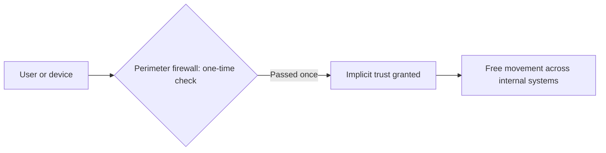
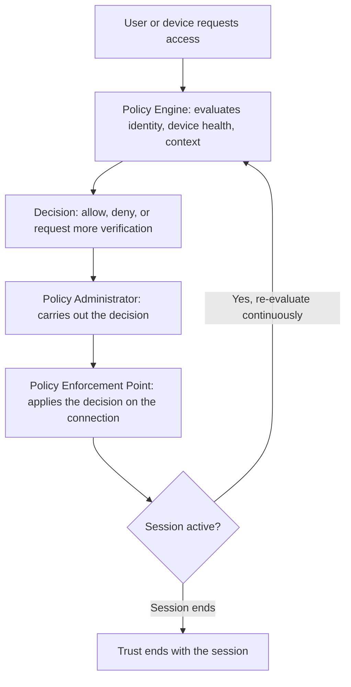
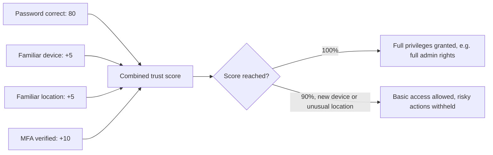
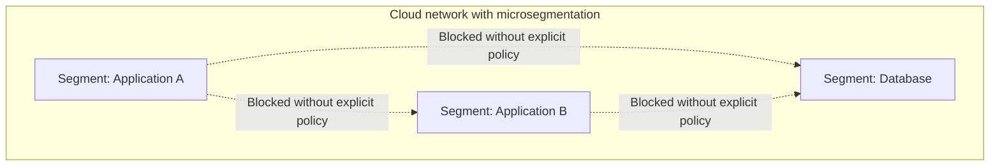

| Topic | Level | Reading Time | Prerequisites |
|---|---|---|---|
| Zero Trust Model | Intermediate | ~20 min | Basic idea of firewalls and network perimeters |

> **الهدف من الـ Section ده:**  
>   هتفهم ليه الأمان الحديث بيفترض إن مفيش حاجة موثوقة تلقائياً، حتى المستخدمين اللي أصلاً جوه الشبكة، وإزاي الـ Zero Trust بيتطبق عملياً بـ trust scoring وفي بيئة الـ cloud.

## Learning Objectives

By the end of this section, you will be able to:

- Explain the core principle of **Zero Trust** and why "no default trust" applies even to users already inside the network.
- Describe why the old **perimeter security model** failed, and how **lateral movement** exploits that weakness.
- List the **NIST Zero Trust tenets (SP 800-207)** and explain what each one changes in practice.
- Describe the three building blocks of a **Zero Trust Architecture**: Policy Engine, Policy Administrator, and Policy Enforcement Point.
- Work through a **trust scoring** example and explain how it connects to Conditional Access and RBAC.
- Explain how Zero Trust is applied in the cloud through **ZTNA**, **microsegmentation**, and **CASB**.

## Table of Contents

- [Learning Objectives](#learning-objectives)
- [The Core Principle](#the-core-principle)
  - [No Default Trust](#no-default-trust)
  - [Continuous Verification](#continuous-verification)
  - [Assume Breach](#assume-breach)
  - [Encrypted Internal Traffic](#encrypted-internal-traffic)
- [Why the Old Perimeter Model Failed](#why-the-old-perimeter-model-failed)
  - [The Old Model](#the-old-model)
  - [The Core Weakness](#the-core-weakness)
  - [Lateral Movement](#lateral-movement)
  - [Why It Changed](#why-it-changed)
- [NIST Zero Trust Tenets (SP 800-207)](#nist-zero-trust-tenets-sp-800-207)
- [Zero Trust Architecture in Practice](#zero-trust-architecture-in-practice)
  - [The Three Building Blocks](#the-three-building-blocks)
  - [The Request Flow](#the-request-flow)
- [Trust Scoring: A Concrete Example](#trust-scoring-a-concrete-example)
  - [How the Score Is Built](#how-the-score-is-built)
  - [What the Score Means in Practice](#what-the-score-means-in-practice)
- [Applying Zero Trust in the Cloud](#applying-zero-trust-in-the-cloud)
  - [Zero Trust Network Access (ZTNA)](#zero-trust-network-access-ztna)
  - [Microsegmentation](#microsegmentation)
  - [Cloud Access Security Broker (CASB)](#cloud-access-security-broker-casb)
  - [Continuous Verification in the Cloud](#continuous-verification-in-the-cloud)
- [Career Path Connections](#career-path-connections)
- [Key Terms Glossary](#key-terms-glossary)
- [Summary](#summary)

## The Core Principle

### No Default Trust

**Zero Trust** هو نموذج أمني حديث بيقوم على فكرة واحدة بسيطة لكنها جذرية: **مفيش user أو device أو system بيتوثق فيه تلقائياً**، سواء كان بيتصل من جوه الشبكة الداخلية بتاعة الشركة أو من الإنترنت.

الفرق الجوهري عن النماذج القديمة: مبقاش فيه فرضية "لو إنت جوه، يبقى إنت موثوق". الموقع الجغرافي أو الشبكي مبقاش دليل على الثقة.

### Continuous Verification

كل طلب وصول (access request) بيتم **التحقق منه والتصريح بيه في لحظة حدوثه**، مش مرة واحدة بس وقت الـ login. يعني حتى لو المستخدم دخل بنجاح الصبح، أي طلب جديد بعد كده بيتفحص من الأول.

### Assume Breach

الأمان بيتصمم على أساس إن **المهاجم ممكن يكون أصلاً موجود جوه الشبكة**، فكل action لسه بيتفحص، حتى لو صادر من داخل الشبكة.

تخيل الفكرة دي زي مستشفى بيتعامل مع كل شخص، حتى الموظفين، كأنه لازم يوريلك بادج صالح في كل باب يعديه، مش بس عند مدخل المبنى. مجرد إنك جوه المبنى مش دليل إنك مفروض توصل لكل غرفة فيه.

### Encrypted Internal Traffic

حتى الاتصال **بين الأنظمة الداخلية نفسها** (مثلاً فريق الـ IT بيكلم الـ database) بيتشفر. لو مهاجم قاعد في النص (man-in-the-middle)، مش هيقدر يقرا حاجة مفيدة.

> [!IMPORTANT]
> Zero Trust is not a single product you buy. It is a set of principles applied across identity, devices, network, applications, and data at the same time. A vendor selling "Zero Trust in a box" is usually selling one piece of a much larger architecture.

## Why the Old Perimeter Model Failed

### The Old Model

في النموذج القديم، **firewall واحد** كان قاعد عند حافة الشبكة (network edge) وبيفحص الهوية **مرة واحدة بس**. بعد الفحص ده، المستخدم أو الجهاز كان بيتم الوثوق فيه ضمنياً (implicitly trusted) وبيقدر يتحرك بحرية جوه الشبكة.

### The Core Weakness

نقطة الضعف الأساسية: **لو مهاجم سرق username و password صحيحين**، هو بيعدي **نفس الفحص الواحد** بالظبط زي أي موظف حقيقي. الـ perimeter **مالوش وسيلة يفرق** بين الاتنين.

### Lateral Movement

بمجرد ما المهاجم يبقى جوه، يقدر يتحرك من نظام داخلي لتاني بفحص إضافي قليل جداً. دي التقنية اللي بتقف ورا معظم حوادث **ransomware** و**data breaches** الكبيرة.

> [!WARNING]
> Lateral movement is exactly why "trusted once, trusted forever" is dangerous. A single compromised credential, in a perimeter-only model, can become access to the entire internal network.

### Why It Changed

المواقع والأنظمة الداخلية بقت **أعقد بكتير**: فرق متعددة، قواعد بيانات متعددة، وخدمات بتتواصل مع بعضها البعض بشكل مستمر. **checkpoint واحد** ماعادش كافي يحمي البيئة كلها.

## NIST Zero Trust Tenets (SP 800-207)

معهد المعايير الأمريكي **NIST** حدد مجموعة مبادئ أساسية للـ Zero Trust في وثيقة **SP 800-207**:

- **كل مصادر الداتا والخدمات الداخلية بتتعامل معاها كـ protected resources**، مش حافة الشبكة بس.
- **كل التواصل بيتأمن بغض النظر عن الموقع الشبكي**، الـ traffic الداخلي بيتشفر زي الخارجي بالظبط.
- **الوصول بيتم منحه لكل session على حدة**، مش بشكل دائم. انتهاء الـ session معناه انتهاء الثقة معاه.
- **قرارات الوصول بتاخد في الاعتبار الـ identity، وحالة (health) الجهاز الطالب، والسياق السلوكي** مع بعض، مش عامل واحد بس.
- **المؤسسة بتراقب باستمرار** سلامة الأجهزة، والـ network traffic، وطلبات الوصول، عشان تحسّن الـ policy باستمرار.

| Tenet | Old Model Equivalent | Zero Trust Change |
|---|---|---|
| Protect all resources, not just the edge | Only the perimeter was checked | Every internal service is a protected resource |
| Secure all communication | Only external traffic was encrypted | Internal traffic is encrypted too |
| Per-session access | Access persisted after one login | Trust expires with the session |
| Multi-factor access decisions | Identity alone was enough | Identity, device health, and behavior together |
| Continuous monitoring | Static, rarely reviewed | Ongoing monitoring feeds policy improvement |

> [!NOTE]
> SP 800-207 is a guideline, not a law. Organizations choose to adopt it, but many regulated sectors (banking, government, critical infrastructure) are expected to align with it to be considered trustworthy by partners and regulators.

## Zero Trust Architecture in Practice

### The Three Building Blocks

بنية الـ Zero Trust بتتكون من ثلاث مكونات أساسية:

| Component | Role |
|---|---|
| Policy Engine (PE) | بيفحص كل طلب وبيقرر: يسمح، يمنع، أو يلغي الوصول |
| Policy Administrator (PA) | بينفذ القرار ده، عن طريق فتح أو إغلاق الاتصال |
| Policy Enforcement Point (PEP) | الـ gateway أو الـ agent اللي فعلياً بيطبق القرار على الاتصال نفسه |

### The Request Flow

خطوات تدفق الطلب:

- مستخدم أو جهاز بيطلب وصول لمورد معين.
- الـ **Policy Engine** بيفحص الـ identity، وصحة الجهاز (device health)، والسياق، وبعدين بيطلع قرار.
- الـ **Policy Administrator** والـ **Policy Enforcement Point** بيطبقوا القرار ده: يسمح، يمنع، أو يطلب تحقق إضافي.
- القرار ده **بيتم إعادة تقييمه باستمرار**، مش مرة واحدة بس وقت الـ login.

> [!TIP]
> Compare this flow to the old perimeter model diagram above. The key structural difference is the loop back to the Policy Engine: trust is never a one-time gate, it is a continuously re-checked decision.

## Trust Scoring: A Concrete Example

### How the Score Is Built

بدل ما نعتمد على فحص password واحد بس، أنظمة الـ Zero Trust بتحسب **trust score مجمّع** من عدة إشارات قبل ما تقرر تدي وصول قد إيه.

| Signal | Points |
|---|---|
| Correct username and password | 80 |
| Same device the user normally logs in from | +5 |
| Login location matches the user's usual country | +5 |
| Multi-factor authentication code entered correctly | +10 |
| **Total possible** | **100** |

### What the Score Means in Practice

- **مستخدم وصل لـ 100%** بيتوثق فيه بصلاحيات كاملة (زي full admin rights).
- **مستخدم دخل صح لكن من device جديد أو location غير معتاد** ممكن يوصل لـ 90% فقط. ده كافي للدخول، لكن **actions خطيرة** زي حذف الداتا أو استخدام صلاحيات admin بتتحجب لحد ما الخطورة الإضافية دي تتحل.

الأسلوب ده بيتسمى غالباً **Risk-Based Access** أو **Conditional Access**. في بيئات Microsoft، بيتطبق عن طريق **Conditional Access policies** مدمجة مع **Role-Based Access Control (RBAC)**.

> [!NOTE]
> RBAC decides what the role is allowed to do at all. Conditional Access decides whether the current session has earned enough trust to actually use that permission right now. The two work together, not as alternatives.

## Applying Zero Trust in the Cloud

### Zero Trust Network Access (ZTNA)

الـ **ZTNA** بيحل محل الـ VPN التقليدي. بدل ما تدي وصول للشبكة الداخلية كلها، بيدي وصول **للتطبيق المحدد المطلوب بس**، بعد التحقق من الـ identity وصحة الجهاز.

| Aspect | Traditional VPN | ZTNA |
|---|---|---|
| Access scope | Entire internal network | One specific application |
| Trust model | Trusted once connected | Verified per request |
| Lateral movement risk | High, once inside the VPN | Low, access is scoped narrowly |

### Microsegmentation

شبكة الـ cloud بتتقسم لـ **segments صغيرة ومعزولة**، فاختراق segment واحد **مبيديش وصول أوتوماتيكي** للباقي.

### Cloud Access Security Broker (CASB)

الـ **CASB** بيقعد بين المستخدمين وتطبيقات الـ cloud، وبيفرض الـ policy ويراقب السلوك الخطير عبر عدة خدمات cloud في نفس الوقت.

### Continuous Verification in the Cloud

مزودي الـ identity في الـ cloud (زي **Microsoft Entra ID**) بيعملوا **re-check لصلاحية الـ session** طول مدتها، مش وقت الـ login بس.

> [!IMPORTANT]
> ZTNA, microsegmentation, and CASB are not three separate products solving three separate problems. They are the same Zero Trust principles (no default trust, continuous verification, least-privilege scope) applied to three different layers of a cloud environment: connectivity, network topology, and application access.

## Career Path Connections

| Career Path | How This Topic Applies |
|---|---|
| SOC Analyst | Monitors Policy Engine decisions and trust score anomalies as signals of compromised credentials |
| Penetration Tester | Tests whether lateral movement is actually blocked once a foothold is gained, a core Zero Trust promise to verify |
| GRC | NIST SP 800-207 alignment is often part of compliance assessments for regulated industries |
| Cloud Security | Configures ZTNA, microsegmentation, and CASB policies directly in cloud identity and network platforms |

## Key Terms Glossary

| Term | Definition |
|---|---|
| Zero Trust | A security model where no user, device, or system is trusted by default, regardless of location |
| Perimeter Security Model | An older approach where identity is checked once at the network edge, then trusted implicitly |
| Lateral Movement | An attacker's movement from one compromised system to others inside the network |
| NIST SP 800-207 | The NIST publication defining Zero Trust Architecture tenets |
| Policy Engine (PE) | The component that evaluates a request and decides whether to grant, deny, or revoke access |
| Policy Administrator (PA) | The component that carries out the Policy Engine's decision |
| Policy Enforcement Point (PEP) | The gateway or agent that applies the access decision on the connection itself |
| Trust Score | A combined score built from multiple signals used to decide how much access to grant |
| Conditional Access | Risk-based access decisions applied dynamically based on signals such as device and location |
| ZTNA | Zero Trust Network Access, grants access to a specific application rather than the whole network |
| Microsegmentation | Dividing a cloud network into small, isolated segments |
| CASB | Cloud Access Security Broker, enforces policy and monitors behavior across cloud applications |

## Summary

- **No default trust, ever:** مفيش user أو device موثوق تلقائياً، سواء جوه الشبكة أو بره.
- **Verification is continuous:** كل طلب بيتفحص لحظة حدوثه، مش مرة واحدة عند الـ login.
- **The old perimeter model trusted too much, too easily:** فحص واحد وبعده ثقة ضمنية، وده اللي فتح الباب لـ lateral movement.
- **NIST SP 800-207 formalizes the principles:** حماية كل الموارد، تشفير كل الاتصال، وصول لكل session، قرارات متعددة العوامل، ومراقبة مستمرة.
- **Three components run the architecture:** Policy Engine بيقرر، Policy Administrator بينفذ، وPolicy Enforcement Point بيطبق فعلياً.
- **Trust scoring replaces the single password check:** إشارات متعددة (device, location, MFA) بتتجمع في نتيجة واحدة تحدد مستوى الصلاحيات.
- **Zero Trust extends fully into the cloud:** ZTNA بدل VPN، microsegmentation بدل الشبكة المسطحة، وCASB لمراقبة تطبيقات الـ cloud.

